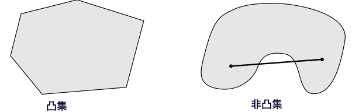

## 一、直线和线段

### 1、直线

在 $ \mathbb{R}^n $ 空间中，一条直线可以通过两个点的线性组合表示。给定两点 $\mathbf{x}_1, \mathbf{x}_2 \in \mathbb{R}^n$，直线可以表示为：
$$
\mathbf{y} = \theta \mathbf{x}_1 + (1 - \theta) \mathbf{x}_2, \quad \theta \in \mathbb{R}
$$
我们也可以将这个公式重写为：
$$
\mathbf{y} = \mathbf{x}_2 + \theta (\mathbf{x}_1 - \mathbf{x}_2), \quad \theta \in \mathbb{R}
$$
在这两个表示中，$\theta$ 是一个实数参数，控制了点 $\mathbf{y}$ 在直线上的位置。

可以理解为 $\mathbf{y}$ 是从 $\mathbf{x}_2$ 出发，沿着向量 $\mathbf{x}_1 - \mathbf{x}_2$ 移动 $\theta$ 倍距离后，停留在该位置产生的点。如果 $\theta$ 不同，形成的点不同，当 $\theta \in \mathbb{R}$ 时，$\mathbf{y}$ 就表示通过 $\mathbf{x}_1$ 和 $\mathbf{x}_2$ 两点的直线。

**具体情形**

- 当 $\theta = 0$ 时，$\mathbf{y} = \mathbf{x}_2$。
- 当 $\theta = 1$ 时，$\mathbf{y} = \mathbf{x}_1$。
- 当 $\theta \in [0, 1]$ 时，$\mathbf{y}$ 在 $\mathbf{x}_1$ 和 $\mathbf{x}_2$ 之间的线段上。
- 当 $\theta < 0$ 或 $\theta > 1$ 时，$\mathbf{y}$ 在 $\mathbf{x}_1$ 和 $\mathbf{x}_2$ 形成的直线的延长线上。

### 2、线段
线段是连接两点的有限部分，可以看作是直线的一部分。给定两点 $\mathbf{x}_1, \mathbf{x}_2 \in \mathbb{R}^n$，线段可以表示为：
$$
\mathbf{y} = \theta \mathbf{x}_1 + (1 - \theta) \mathbf{x}_2, \quad \theta \in [0, 1]
$$
或者：
$$
\mathbf{y} = \mathbf{x}_2 + \theta (\mathbf{x}_1 - \mathbf{x}_2), \quad \theta \in [0, 1]
$$
在这个表示中，$\theta$ 取值在0到1之间，使得 $\mathbf{y}$ 仅表示连接 $\mathbf{x}_1$ 和 $\mathbf{x}_2$ 的线段上的点。

## 二、仿射集

### 1、仿射集的定义

在 $ \mathbb{R}^n $ 空间中，一个集合 $ A \subseteq \mathbb{R}^n $ 被称为仿射集（affine set），如果对于任意的 $\mathbf{x}_1, \mathbf{x}_2 \in A$ 和任意的实数 $\theta \in \mathbb{R}$，都有：
$$
 \theta \mathbf{x}_1 + (1 - \theta) \mathbf{x}_2 \in A
$$
这意味着，对于集合 $ A $ 中的任意两点，它们之间的所有仿射组合也都在 $ A $ 中。

### 2、仿射集的几何意义

**直线**：在几何上，仿射集的一个重要例子是直线。给定两点 $\mathbf{x}_1$ 和 $\mathbf{x}_2$，通过这两点的所有仿射组合形成一条直线：
$$
\mathbf{y} = \theta \mathbf{x}_1 + (1 - \theta) \mathbf{x}_2, \quad \theta \in \mathbb{R}
$$
**平面**：如果给定三个不共线的点 $\mathbf{x}_1$, $\mathbf{x}_2$ 和 $\mathbf{x}_3$，它们之间的仿射组合形成一个平面：
$$
\mathbf{y} = \theta_1 \mathbf{x}_1 + \theta_2 \mathbf{x}_2 + \theta_3 \mathbf{x}_3
$$
其中，$\theta_1 + \theta_2 + \theta_3 = 1$，$\theta_1, \theta_2, \theta_3 \in \mathbb{R}$。

### 3、仿射集的性质

- **包含任意点的直线**：如果 $ A $ 是仿射集，并且包含两点 $\mathbf{x}_1$ 和 $\mathbf{x}_2$，那么 $ A $ 必定包含通过 $\mathbf{x}_1$ 和 $\mathbf{x}_2$ 的整条直线。

- **平移不变性**：如果 $ A $ 是仿射集，对于任何 $\mathbf{a} \in \mathbb{R}^n$，集合 $ A + \mathbf{a} = \{\mathbf{x} + \mathbf{a} \mid \mathbf{x} \in A\} $ 也是仿射集。

- **线性变换的不变性**：如果 $ A $ 是仿射集，并且 $ T $ 是线性变换，那么 $ T(A) = \{T(\mathbf{x}) \mid \mathbf{x} \in A\} $ 也是仿射集。

### 4、仿射集的表示

仿射集可以通过如下几种方式表示：

1. **显式表示**：直接给出仿射组合的形式，例如：

$$
\mathbf{y} = \mathbf{x}_0 + \sum_{i=1}^k \theta_i (\mathbf{x}_i - \mathbf{x}_0), \quad \theta_i \in \mathbb{R}, \quad \sum_{i=1}^k \theta_i = 1
$$

这里，$\mathbf{x}_0$ 是基点，$\mathbf{x}_i$ 是仿射集中的点。

2. **隐式表示**：通过仿射方程组来表示仿射集，例如：
$$
A = \{\mathbf{x} \in \mathbb{R}^n \mid \mathbf{A} \mathbf{x} = \mathbf{b}\}
$$
其中，$\mathbf{A}$ 是一个矩阵，$\mathbf{b}$ 是一个向量。

### 5、仿射集的示例

- **直线**：

$$
 \mathbf{y} = \theta \mathbf{x}_1 + (1 - \theta) \mathbf{x}_2, \quad \theta \in \mathbb{R}
$$

通过两个点 $\mathbf{x}_1$ 和 $\mathbf{x}_2$ 定义的直线。

- **平面**：

$$
\mathbf{y} = \theta_1 \mathbf{x}_1 + \theta_2 \mathbf{x}_2 + \theta_3 \mathbf{x}_3, \quad \theta_1 + \theta_2 + \theta_3 = 1, \quad \theta_1, \theta_2, \theta_3 \in \mathbb{R}
$$

通过三个点 $\mathbf{x}_1, \mathbf{x}_2, \mathbf{x}_3$ 定义的平面。

- **平移**：

给定仿射集 $ A $ 和向量 $\mathbf{a}$，平移后的仿射集：
$$
A' = \{\mathbf{x} + \mathbf{a} \mid \mathbf{x} \in A\}
$$

##  三、仿射组合

仿射组合是仿射集概念的推广，它涉及多个点的线性组合。

### 1、仿射组合的定义

给定 $ \mathbb{R}^n $ 空间中的 $ k $ 个点 $ \mathbf{x}_1, \mathbf{x}_2, \ldots, \mathbf{x}_k $，它们的仿射组合定义为：
$$
\mathbf{y} = \theta_1 \mathbf{x}_1 + \theta_2 \mathbf{x}_2 + \cdots + \theta_k \mathbf{x}_k
$$
其中，权重 $\theta_1, \theta_2, \ldots, \theta_k$ 满足：
$$
\theta_1 + \theta_2 + \cdots + \theta_k = 1
$$

### 2、仿射组合的几何意义

仿射组合可以看作是对多个点的线性插值，它不仅包含了连接这些点的线段，还包括了超出这些点形成的整个仿射空间。例如：
- 两个点 $\mathbf{x}_1$ 和 $\mathbf{x}_2$ 的仿射组合形成一条直线。
- 三个点 $\mathbf{x}_1, \mathbf{x}_2, \mathbf{x}_3$ 的仿射组合形成一个平面（假设这三点不共线）。

### 3、仿射组合的性质

- **仿射集的闭包性**：

如果 $ C \subseteq \mathbb{R}^n $ 是一个仿射集，并且 $\mathbf{x}_1, \mathbf{x}_2, \ldots, \mathbf{x}_k \in C$，那么对于任意满足 $\theta_1 + \theta_2 + \cdots + \theta_k = 1$ 的权重 $\theta_1, \theta_2, \ldots, \theta_k$，仿射组合 $\mathbf{y} = \theta_1 \mathbf{x}_1 + \theta_2 \mathbf{x}_2 + \cdots + \theta_k \mathbf{x}_k $ 也在 $ C $ 中。

- **线性组合的推广**：

仿射组合是线性组合的推广，要求权重的和等于1。仿射组合在定义上比一般的线性组合多了一个约束，即所有权重的和必须为1，这保证了仿射组合的点位于所选点形成的仿射空间中。

### 4、仿射组合的证明

为了证明一个仿射集 $ C $ 包含任意点的仿射组合，我们以下面含三个点的情况为例进行证明：

假设 $ C $ 是一个仿射集，且 $\mathbf{x}_1, \mathbf{x}_2, \mathbf{x}_3 \in C$，我们要证明对任意满足 $\theta_1 + \theta_2 + \theta_3 = 1$ 的权重 $\theta_1, \theta_2, \theta_3$，点 $\mathbf{y} = \theta_1 \mathbf{x}_1 + \theta_2 \mathbf{x}_2 + \theta_3 \mathbf{x}_3 $ 也在 $ C $ 中。

根据仿射集的定义，对于任意的 $\mathbf{x}_1, \mathbf{x}_2 \in C$ 和 $\alpha, \beta \in \mathbb{R}$ 且 $\alpha + \beta = 1$，有：
$$
\alpha \mathbf{x}_1 + \beta \mathbf{x}_2 \in C 
$$

设 $\alpha = \theta_1 + \theta_2$ 和 $\beta = \theta_3$，则 $\alpha + \beta = (\theta_1 + \theta_2) + \theta_3 = 1$。

因为 $ \mathbf{x}_1, \mathbf{x}_2, \mathbf{x}_3 \in C $，且 $ C $ 是仿射集，故：
$$
(\theta_1 + \theta_2) \mathbf{x}_1 + \theta_3 \mathbf{x}_3 \in C
$$

设 $\gamma_1 = \frac{\theta_1}{\theta_1 + \theta_2}$ 和 $\gamma_2 = \frac{\theta_2}{\theta_1 + \theta_2}$，则 $\gamma_1 + \gamma_2 = 1$。

因为 $ \mathbf{x}_1, \mathbf{x}_2 \in C $，且 $ C $ 是仿射集，故：
$$
\gamma_1 \mathbf{x}_1 + \gamma_2 \mathbf{x}_2 \in C
$$

将 $\gamma_1 \mathbf{x}_1 + \gamma_2 \mathbf{x}_2$ 代入到 $(\theta_1 + \theta_2) \mathbf{x}_1 + \theta_3 \mathbf{x}_3$ 中，有：
$$
(\theta_1 + \theta_2) (\gamma_1 \mathbf{x}_1 + \gamma_2 \mathbf{x}_2) + \theta_3 \mathbf{x}_3 = \theta_1 \mathbf{x}_1 + \theta_2 \mathbf{x}_2 + \theta_3 \mathbf{x}_3 \in C
$$
因此，仿射组合 $\mathbf{y} = \theta_1 \mathbf{x}_1 + \theta_2 \mathbf{x}_2 + \theta_3 \mathbf{x}_3$ 也在 $ C $ 中。

## 四、凸集和非凸集

### 1、定义

设 $ C $ 是实数空间 $ \mathbb{R}^n $ 中的一个集合， $ C \subseteq \mathbb{R}^n $ 。如果对于集合 $ C $ 中任意两个点 $ x_1 $ 和 $ x_2 $，以及任意 $ \theta $ 满足 $ 0 \leq \theta \leq 1 $，点 $ \theta x_1 + (1 - \theta) x_2 $ 也在集合 $ C $ 中，那么集合 $ C $ 被称为凸集。
$$
\forall x_1, x_2 \in C, 0 \leq \theta \leq 1 \text{ such that } 0 \leq \theta \leq 1: \theta x_1 + (1 - \theta) x_2 \in C
$$
相对地，如果存在集合 $ C \subseteq \mathbb{R}^n $ 中的两个点 $ x_1 $ 和 $ x_2 $，以及某个 $ \theta $ 满足 $ 0 < \theta < 1 $，使得 $ \theta x_1 + (1 - \theta) x_2 $ 不在集合 $ C $ 中，那么集合 $ C $ 被称为非凸集。

$$
\exists x_1, x_2 \in C, \exists \theta \text{ with } 0 < \theta < 1: \theta x_1 + (1 - \theta) x_2 \notin C
$$

### 2、几何解释

在几何上，这意味着如果你取集合中的任意两点，那么连接这两点的线段上的所有点也都在这个集合中。

## 五、凸函数和凹函数

在优化问题中，凸函数和凹函数具有特别的重要性，因为它们的特性使得优化问题更加容易求解。

### 1、函数的定义

#### （1）凸函数

在一个凸集 $ C \subseteq \mathbb{R}^n $ 上的函数 $ f : C \rightarrow \mathbb{R} $ 被称为凸函数，如果对于所有 $ x, y \in C $ 以及 $ \theta \in [0, 1] $，满足以下不等式：

$$
f(\theta x + (1 - \theta)y) \leq \theta f(x) + (1 - \theta) f(y)
$$

这意味着在凸集内，函数的任意两点之间的连线上的函数值不会超过连线上两点的函数值的加权平均。

#### （2）凹函数

在一个凸集 $ C \subseteq \mathbb{R}^n $ 上的函数 $ f : C \rightarrow \mathbb{R} $ 被称为凹函数，如果对于所有 $ x, y \in C $ 以及 $ \theta \in [0, 1] $，满足以下不等式：

$$
f(\theta x + (1 - \theta)y) \geq \theta f(x) + (1 - \theta) f(y)
$$

这意味着在凸集内，函数的任意两点之间的连线上的函数值不会低于连线上两点的函数值的加权平均。

### 2、在优化中的应用

#### （1）凸优化问题

对于一个凸优化问题：

$$
\min_{x \in C} f(x)
$$

如果 $ f $ 是凸函数并且 $ C $ 是凸集，那么任何局部最小值也是全局最小值。这使得凸优化问题相对容易求解。

#### （2）凹优化问题

对于一个凹优化问题：

$$
\max_{x \in C} f(x)
$$

如果 $ f $ 是凹函数并且 $ C $ 是凸集，那么任何局部最大值也是全局最大值。这使得凹优化问题相对容易求解。

