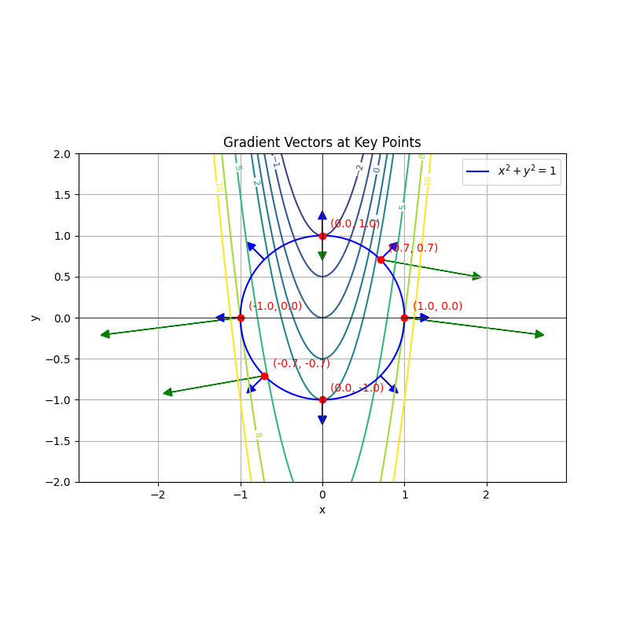

## 一、“无约束“最优化问题

无约束优化问题是指在没有任何约束条件下，直接对目标函数进行优化（最大化或最小化）的过程。这种问题的求解方法主要是通过求解目标函数的导数来确定极值点。

### 1、问题描述

假设我们有一个目标函数 $ F(x_1, x_2, \ldots, x_m) $，需要找到它的极值（最大值或最小值）。无约束优化问题的关键在于找到使目标函数取得极值的点。

### 2、求解方法

#### （1）求偏导数

对目标函数 $ F $ 的每一个变量 $ x_i $ 求偏导数，并令这些偏导数等于零。即，我们需要求解以下方程组：

$$
\frac{\partial F}{\partial x_i} = 0 \quad i=1,2,\ldots,m
$$

#### （2）联立方程组

将所有的偏导数方程联立起来，形成一个方程组。解这个方程组可以得到目标函数的极值点。

#### （3）验证极值点

虽然求解上述方程组可以得到极值点，但这些点不一定是全局极值，它们可能是局部极值或鞍点。因此，还需要进一步验证这些点是否为极值点。

### 3、极值点的判定

#### （1）必要条件

偏导数等于零是极值点的必要条件。即，如果某点是极值点，那么在该点处，目标函数的所有偏导数必定为零。

#### （2）充分条件

要进一步确定一个点是否为极值点，我们可以使用二阶导数测试，即通过目标函数的二阶偏导数构造的海森矩阵（Hessian Matrix）来判断。

- **海森矩阵**: 海森矩阵是目标函数的二阶偏导数组成的矩阵。设 $ H $ 为海森矩阵：

  $$
  H = \begin{bmatrix}
  \frac{\partial^2 F}{\partial x_1^2} & \frac{\partial^2 F}{\partial x_1 \partial x_2} & \cdots & \frac{\partial^2 F}{\partial x_1 \partial x_m} \\
  \frac{\partial^2 F}{\partial x_2 \partial x_1} & \frac{\partial^2 F}{\partial x_2^2} & \cdots & \frac{\partial^2 F}{\partial x_2 \partial x_m} \\
  \vdots & \vdots & \ddots & \vdots \\
  \frac{\partial^2 F}{\partial x_m \partial x_1} & \frac{\partial^2 F}{\partial x_m \partial x_2} & \cdots & \frac{\partial^2 F}{\partial x_m^2}
  \end{bmatrix}
  $$

- **正定性**: 通过判断海森矩阵的正定性，可以确定极值点的性质：
  - 如果海森矩阵在某点是正定的，则该点是局部极小值点。
  - 如果海森矩阵在某点是负定的，则该点是局部极大值点。
  - 如果海森矩阵在某点既不是正定也不是负定的，则该点是鞍点。

- 在多元函数的极值点分析中，海森矩阵 $ H $ 的 $ H_{11} $ 元素（即海森矩阵的左上角元素）代表了函数对第一个变量 $ x $ 的曲率情况。具体来说，$ H_{11} $ 是目标函数对 $ x $ 的二阶偏导数，也就是关于 $ x $ 的凹凸性指标。

  - **凹凸性**：$ H_{11} $ 的符号可以告诉我们函数在 $ x $ 方向上是凹的还是凸的。如果 $ H_{11} > 0 $，函数在 $ x $ 方向上是凸的，这意味着在该方向上函数是局部最小值。如果 $ H_{11} < 0 $，函数是凹的，可能表示局部最大值或鞍点。

  - **稳定性**：在多元函数的极值点，$ H_{11} $ 的正负可以作为判断极值点稳定性的初步指标。正定的 $ H_{11} $ 通常与局部最小值相关联。

  - **海森矩阵的正定性**：在二元函数的情况下，如果 $ H_{11} $ 和 $ H_{22} $ 都是正的，并且 $ \det(H) > 0 $，那么海森矩阵是正定的，表明函数在该点有局部最小值。

  - **简化分析**：在某些情况下，如果 $ H_{11} $ 和 $ H_{22} $ 的乘积大于 $ H_{12}H_{21} $（即海森矩阵的对角线元素的乘积大于副对角线元素的乘积），那么根据 Sylvester 判据，海森矩阵是正定的。

### 4、示例

求解目标函数 $ F(x, y) = 3x^2 + 2xy + y^2 - 6x + 4y + 5 $ 的极值点。

#### （1）求偏导数

对 $ x $ 和 $ y $ 求偏导数，并令其等于零：

$$
\frac{\partial F}{\partial x} = 6x + 2y - 6 = 0
$$

$$
\frac{\partial F}{\partial y} = 2x + 2y + 4 = 0
$$

#### （2）联立方程组

联立上述方程：

$$
6x + 2y - 6 = 0
$$

$$
2x + 2y + 4 = 0
$$

解这个方程组：

$$
6x + 2y = 6
$$

$$
2x + 2y = -4
$$

解得 $ x = 2.5 $，$ y = -4.5 $。

#### （3）验证极值点

构造海森矩阵：

$$
H = \begin{bmatrix}
6 & 2 \\
2 & 2
\end{bmatrix}
$$

计算海森矩阵的行列式：

$$
\det(H) = 6 \cdot 2 - 2 \cdot 2 = 12 - 4 = 8
$$

由于行列式大于零，且$ H_{11} = 6 > 0 $，所以海森矩阵是正定的。因此，点$ (2.5, -4.5) $ 是局部极小值点。

#### （4）计算极值

将点$ (2.5, -4.5) $ 代入目标函数：

$$
F(2.5, -4.5) = -11.5
$$

所以，函数在点$ (2.5, -4.5) $ 处取得局部最小值$ -11.5 $。

#### （5）补充注解

- **必要条件**: 满足必要条件不能说明一定是极值点；但不满足则一定不是极值点。
- **充分条件**: 满足充分条件则一定是极值点；不满足则不能得出结论。

通过无约束优化问题的求解方法，可以有效地找到目标函数的极值点，并通过二阶导数测试进一步验证这些极值点的性质。

## 二、等式约束的优化问题

等式约束的优化问题是指在目标函数的优化过程中，附带一个或多个等式约束条件。这类问题通常通过拉格朗日乘数法来求解。

### 1、问题描述

考虑一个目标函数 $ f(x) $，其中 $ x \in \mathbb{R}^n $，并且带有 $ k $ 个等式约束 $ h_i(x) = 0 $（其中 $ i = 1, 2, \ldots, k $）。目标是找到使 $ f(x) $ 最小化的 $ x $，满足所有约束条件。

### 2、拉格朗日乘数法

拉格朗日乘数法是一种有效的解决带有等式约束的优化问题的方法。其核心思想是将约束条件通过拉格朗日乘数引入目标函数，构造一个新的拉格朗日函数。

#### （1）构造拉格朗日函数

引入 $ k $ 个拉格朗日乘数 $ \lambda_1, \lambda_2, \ldots, \lambda_k $，构造拉格朗日函数：

$$
\mathcal{L}(x, \lambda) = f(x) + \sum_{i=1}^{k} \lambda_i h_i(x)
$$

其中，$ \lambda = (\lambda_1, \lambda_2, \ldots, \lambda_k) $ 是拉格朗日乘数向量。

#### （2）求偏导数并建立方程组

对拉格朗日函数 $ \mathcal{L} $ 分别对 $ x $ 和 $ \lambda $ 求偏导数，并令它们等于零：

$$
\frac{\partial \mathcal{L}}{\partial x_j} = 0 \quad \text{对于所有 } j = 1, 2, \ldots, n
$$

$$
\frac{\partial \mathcal{L}}{\partial \lambda_i} = 0 \quad \text{对于所有 } i = 1, 2, \ldots, k
$$

这会形成一个 $ n + k $ 个方程的方程组。

### 3、应用步骤

#### （1）构造拉格朗日函数

将目标函数和所有约束条件组合成一个拉格朗日函数：

$$
\mathcal{L}(x, \lambda) = f(x) + \sum_{i=1}^{k} \lambda_i h_i(x)
$$

#### （2）求偏导数并建立方程组

对 $ \mathcal{L} $ 分别对 $ x_j $ 和 $ \lambda_i $ 求偏导数，并设这些偏导数为零：

$$
\frac{\partial \mathcal{L}}{\partial x_j} = \frac{\partial f}{\partial x_j} + \sum_{i=1}^{k} \lambda_i \frac{\partial h_i}{\partial x_j} = 0 \quad \text{对于所有 } j = 1, 2, \ldots, n
$$

$$
\frac{\partial \mathcal{L}}{\partial \lambda_i} = h_i(x) = 0 \quad \text{对于所有 } i = 1, 2, \ldots, k
$$

#### （3）解方程组

联立所有偏导数方程，解这个方程组以找到 $ x $ 和 $ \lambda $ 的值。

#### （4）验证解的有效性

将解代入原始目标函数和约束条件中，检查其有效性。

### 4、示例

要求函数 $f(x, y) = 8x^2 - 2y $ 在约束条件 $g(x, y) = x^2 + y^2 - 1 = 0 $ 下的极值，我们可以使用拉格朗日乘数法。

#### （1）建立拉格朗日函数

首先，我们引入拉格朗日乘数 $\lambda $，并建立拉格朗日函数 $L $ 如下：

$$
L(x, y, \lambda) = 8x^2 - 2y + \lambda (x^2 + y^2 - 1)
$$

#### （2）求偏导数

接下来，我们对 $L $ 分别对 $x $，$y $，和 $\lambda $ 求偏导数，并令它们等于零：

$$
\frac{\partial L}{\partial x} = 16x + 2\lambda x = 0
$$

$$
\frac{\partial L}{\partial y} = -2 + 2\lambda y = 0
$$

$$
\frac{\partial L}{\partial \lambda} = x^2 + y^2 - 1 = 0
$$

#### （3）解方程组

现在我们有了三个方程：

- $16x + 2\lambda x = 0 $ 简化为 $(8 + \lambda)x = 0 $
- $-2 + 2\lambda y = 0 $ 简化为 $(1 - \lambda)y = 0 $
- $x^2 + y^2 - 1 = 0 $

由于 $x $ 和 $y $ 不同时为零（因为 $x^2 + y^2 = 1 $），我们可以从第一个方程得出 $x = 0 $ 或 $\lambda = -8 $。从第一个方程可以得出 $y = 0 $ 或 $\lambda = 1 $。

#### （4）情况分析

**情况1:** 若 $ x = 0 $，代入约束条件 $ x^2 + y^2 = 1 $，得到 $ y = \pm 1 $。将这两个结果代入第二个方程：

- 当 $ y = 1 $ 时，$(1 - \lambda)1 = 0 \Rightarrow \lambda = 1 $
- 当 $ y = -1 $ 时，$(1 - \lambda)(-1) = 0 \Rightarrow \lambda = 1 $

所以，$ x = 0 $ 时，我们得到两个解：(0, 1) 和 (0, -1)，且 $\lambda = 1 $。

**情况2:** 若 $ y = 0 $，代入约束条件 $ x^2 + y^2 = 1 $，得到 $ x = \pm 1 $。将这两个结果代入第一个方程：

- 当 $ x = 1 $ 时，$(8 + \lambda)1 = 0 \Rightarrow \lambda = -8 $
- 当 $ x = -1 $ 时，$(8 + \lambda)(-1) = 0 \Rightarrow \lambda = -8 $

所以，$ y = 0 $ 时，我们得到两个解：(1, 0) 和 (-1, 0)，且 $\lambda = -8 $。

#### （5）组合所有情况

我们得到了四个可能的解：

- $(x, y) = (0, 1)$，$\lambda = 1$
- $(x, y) = (0, -1)$，$\lambda = 1$
- $(x, y) = (1, 0)$，$\lambda = -8$
- $(x, y) = (-1, 0)$，$\lambda = -8$

#### （6）检查这些点在目标函数中的值

目标函数是 $ f(x, y) = 8x^2 - 2y $。计算这四个点的函数值：

1. $ f(0, 1) = 8(0)^2 - 2(1) = -2 $
2. $ f(0, -1) = 8(0)^2 - 2(-1) = 2 $
3. $ f(1, 0) = 8(1)^2 - 0 = 8 $
4. $ f(-1, 0) = 8(-1)^2 - 0 = 8 $

因此，最小值是 $-2$，对应的点是 $(0, 1)$，最大值是 $8$，对应的点是 $(1, 0)$ 和 $(-1, 0)$。

#### （7）python图像分析

[实现](../code/拉格朗日/拉格朗日1.py ':include :type=code ')

上面的图展示了函数 $ f(x, y) = 8x^2 - 2y $ 的等值线以及约束条件 $ x^2 + y^2 = 1 $ 的圆。

- **等值线**: 图中的等值线表示 $ f(x, y) $ 在不同值时的轮廓。例如，图中的等值线包括 $ f(x, y) = -5, -2, -1, 0, 1, 2, 5, 8, 10 $ 等。
- **约束条件**: 蓝色圆 $ x^2 + y^2 = 1 $ 限定了 $ (x, y) $ 只能在这个圆上。
- **极值点**: 红色点标记了我们之前计算出的四个可能的极值点 $(-1, 0)$、$ (0, -1)$、$ (0, 1)$、$ (1, 0) $。

这个图形直观地展示了函数的极值如何受约束条件影响，可以帮助理解拉格朗日乘数法的实际应用。

- 当等值线 $ f(x, y) = a $ 向下平移时，值 $ a $ 逐渐增大。
- 当等值线与圆 $ x^2 + y^2 = 1 $ 有交点时，找到的交点是极值点。
- 最小值 $ -2 $ 对应的点是 $ (0, 1) $，当等值线 $ f(x, y) = -2 $ 恰好与圆相切。
- 最大值 $ 8 $ 对应的点是 $ (1, 0) $ 和 $ (-1, 0) $，当等值线 $ f(x, y) = 8 $ 恰好与圆相切。

### 5、几何理解

#### （1）关于梯度的性质

- **梯度的方向**：函数 $ f(x, y) $ 在点 $ (x_0, y_0) $ 的梯度 $ \nabla f(x_0, y_0) $ 的方向是函数值增加最快的方向。这意味着梯度向量与函数的等值线垂直。

- **梯度在约束曲面上的性质**：对于约束条件 $ g(x, y) = 0 $，在约束曲面上的任意一点 $ (x_c, y_c) $，其梯度 $ \nabla g(x_c, y_c) $ 垂直于约束曲面。

#### （2）梯度条件

要在每一步移动时都让目标函数更优，移动的方向必须和目标函数负梯度方向的夹角小于 90 度。即移动方向和目标函数负梯度方向垂直时，约束面切向方向和目标函数负梯度方向垂直；约束面梯度方向和目标函数负梯度方向平行。设此位置为 $x^*$，可以表示为：

$$
\nabla f(x^*) = \mu \nabla h(x^*)
$$

#### （3）约束面的几何意义

从几何角度看，约束面的梯度方向 $ \nabla h(x^*) $ 表示在 $ x^* $ 点上约束面的法线方向。如果目标函数的负梯度方向与约束面的法线方向一致，那么在此点的移动将无法使目标函数值变得更优，这意味着我们已经找到一个临界点。

#### （4）极值点的必要条件

这个临界点 $x^*$ 是优化问题最优解的充要条件为：

- **梯度方向一致：**

    $$-\nabla f(x^*) = \mu \nabla h(x^*), \quad \mu > 0$$

- **满足约束条件：**

    $$h(x^*) = 0$$

- **Hessian矩阵半正定：**

    在此位置附近沿可行方向移动，目标函数值不会变得更好，即 Hessian 矩阵与可行移动方向构成的二次型是半正定的。

#### （5）多个等式约束的情况

对于有多个等式约束的优化问题：

$$
\min_{x \in \mathbb{R}^n} f(x) \quad \text{s.t.} \quad h_i(x) = 0, \quad i = 1, 2, \ldots, k
$$

首先写出拉格朗日函数：

$$
\mathcal{L}(x, \mu) = f(x) + \sum_{i=1}^k \mu_i h_i(x)
$$

目标函数在 $ x^*, \mu^* $ 处取得极小值的充要条件为：

- **梯度条件：**

    $$\nabla_x \mathcal{L} (x^*, \mu^*) = 0$$

- **可行性条件：**

    $$\nabla_{\mu} \mathcal{L} (x^*, \mu^*) = 0$$

- **Hessian矩阵半正定：**

    对于所有满足 $ \nabla h(x^*)^T y = 0 $ 的向量 $ y $，要求二阶偏导数形成的二次型是半正定的：

    $$y^T \nabla_{xx}^2 \mathcal{L} (x^*, \mu^*) y \geq 0$$

## 三、不等式约束的优化问题

不等式约束的优化问题是指在目标函数的优化过程中，附带一个或多个不等式约束条件。这类问题通常通过KKT（Karush-Kuhn-Tucker）条件来求解。

### 1、问题描述

考虑一个目标函数 $ f(x) $，其中 $ x \in \mathbb{R}^n $，并且带有 $ l $ 个不等式约束 $ g_j(x) \leq 0 $（其中 $ j = 1, 2, \ldots, l $）。目标是找到使 $ f(x) $ 最小化的 $ x $，同时满足所有约束条件。

针对这种情况，最优点的位置只有两种可能：要么存在于约束边界的区域内；要么存在于约束边界上。接下来，我们详细分析这两种情况。

#### （1）情况1：最优点在约束边界区域内

在这种情况下，约束条件不起作用。我们可以直接通过无约束优化的方法来求得最优点。

- **等价于无约束优化问题**：由于约束不起作用，可以忽略不等式约束，直接对目标函数 $ f(x) $ 进行优化。
- **求解方法**：对目标函数 $ f(x) $ 求导数并令导数等于零，找到极值点：

$$
\nabla f(x) = 0
$$

#### （2）情况2：最优点在约束边界上

这种情况类似于等式约束的优化问题。我们需要引入拉格朗日乘子法来求解。

##### 1）构造拉格朗日函数

设约束函数 $ g_j(x) \leq 0 $，引入拉格朗日乘子 $ \mu_j $，构造拉格朗日函数：

$$
\mathcal{L}(x, \mu) = f(x) + \sum_{j=1}^l \mu_j g_j(x)
$$

##### 2）求解方法

通过KKT条件求解。KKT条件包括以下几个部分：

- 梯度条件：
    $$
    \nabla_x \mathcal{L}(x, \mu) = \nabla f(x) + \sum_{j=1}^l \mu_j \nabla g_j(x) = 0
    $$

- 可行性条件：
    $$
    g_j(x) \leq 0, \quad j = 1, 2, \ldots, l
    $$

- 拉格朗日乘子非负性：
    $$
    \mu_j \geq 0, \quad j = 1, 2, \ldots, l
    $$

- 互补松弛性条件：
    $$
    \mu_j g_j(x) = 0, \quad j = 1, 2, \ldots, l
    $$

无论最优解在约束边界区域内还是在约束边界上，最优解都必须满足KKT条件。因此，带不等式约束的优化问题可以通过求解KKT条件来得到解。

### 2、KKT条件

KKT条件是拉格朗日乘数法的扩展，适用于带有不等式约束的优化问题。KKT条件包括以下几部分：

#### （1）拉格朗日函数

构造拉格朗日函数：

$$
\mathcal{L}(x, \lambda) = f(x) + \sum_{j=1}^{l} \lambda_j g_j(x)
$$

其中，$ \lambda_j $ 是非负的拉格朗日乘数，称为KKT乘数。

#### （2）KKT条件

- **一阶必要条件（Stationarity）**：对 $ x $ 求偏导数，并设偏导数为零：
   $$
   \nabla f(x) + \sum_{j=1}^{l} \lambda_j \nabla g_j(x) = 0
   $$

- **可行性条件（Primal Feasibility）**：不等式约束必须满足：
   $$
   g_j(x) \leq 0, \quad \forall j
   $$

- **对偶可行性（Dual Feasibility）**：KKT乘数必须为非负：
   $$
   \lambda_j \geq 0, \quad \forall j
   $$

- **互补松弛条件（Complementary Slackness）**：每个KKT乘数与其对应的约束函数的乘积必须为零：

   $$
   \lambda_j g_j(x) = 0, \quad \forall j
   $$

### 3、应用步骤

#### （1）构造拉格朗日函数

将目标函数和不等式约束组合成一个拉格朗日函数：

$$
\mathcal{L}(x, \lambda) = f(x) + \sum_{j=1}^{l} \lambda_j g_j(x)
$$

#### （2）求偏导数并建立KKT条件

对 $ \mathcal{L} $ 对 $ x $ 求偏导数，并设偏导数为零：

$$
\nabla f(x) + \sum_{j=1}^{l} \lambda_j \nabla g_j(x) = 0
$$

同时满足以下条件：

$$
g_j(x) \leq 0, \quad \forall j
$$

$$
\lambda_j \geq 0, \quad \forall j
$$

$$
\lambda_j g_j(x) = 0, \quad \forall j
$$

#### （3）解方程组

联立所有KKT条件，解这个方程组以找到 $ x $ 和 $ \lambda $ 的值。

#### （4）验证解的有效性

将解代入原始目标函数和约束条件中，检查其有效性。

## 四、等式约束+不等式约束优化问题

在实际应用中，许多优化问题不仅包含等式约束，还包含不等式约束。这类问题是最复杂但也最常见的。为了求解这类优化问题，我们通常使用拉格朗日乘数法和KKT条件（Karush-Kuhn-Tucker条件）。

### 1、问题建模

我们考虑一个优化问题，其目标是最小化目标函数 $f(x)$，并满足等式和不等式约束。该问题可以表示为：

$$
\min_{x \in \mathbb{R}^n} f(x) \quad \text{s.t.} \quad h_k(x) = 0, \quad g_j(x) \leq 0 \quad j=1,2,\ldots,n; \quad k=1,2,\ldots,l
$$

其中：
- $ f(x) $ 是目标函数
- $ h_k(x) $ 是等式约束
- $ g_j(x) $ 是不等式约束

### 2、拉格朗日函数

为了将等式和不等式约束转化为无约束优化问题，我们引入**拉格朗日乘子**。拉格朗日函数 $\mathcal{L}(x, \lambda, \mu)$ 表示为：

$$
\mathcal{L}(x, \lambda, \mu) = f(x) + \sum_{k=1}^l \lambda_k h_k(x) + \sum_{j=1}^n \mu_j g_j(x)
$$

其中：

- $\lambda_k$ 是为等式约束引入的拉格朗日乘子
- $\mu_j$ 是为不等式约束引入的松弛变量

### 3、原问题

原问题通常被称为“主问题”或“原始问题”。

通过拉格朗日对偶理论，可以将原问题转化为一个 min-max 问题：

$$
\min_{x \in \mathbb{R}^n} \max_{\lambda \in \mathbb{R}^l, \mu \in \mathbb{R}^m, \mu \geq 0} \mathcal{L}(x, \lambda, \mu)
$$
这里的目标是对于给定的 $ x $，找到使拉格朗日函数 $ \mathcal{L} $ 最大的 $ \lambda $ 和 $ \mu $，然后再在 $ x $ 上最小化这个最大值。

#### （1）分析$x$ 在可行域内的情况

**可行解的定义**：设$x^*$ 是原问题的一个可行解，即$h_k(x^*) = 0$ 且$g_j(x^*) \leq 0$。

**拉格朗日函数的性质**：

- 当$x = x^*$ 时，$h_k(x^*) = 0$，因此$\lambda_k h_k(x^*) = 0$ 对所有$k$ 成立。
- 同理，对于每一个$g_j(x^*) \leq 0$ 和$\mu_j \geq 0$，有$\mu_j g_j(x^*) \leq 0$。
- 所以，$\mathcal{L}(x^*, \lambda, \mu) = f(x^*) + \sum_{j=1}^m \mu_j g_j(x^*)$。
- 由于$g_j(x^*) \leq 0$，且$\mu_j \geq 0$，故$\sum_{j=1}^m \mu_j g_j(x^*) \leq 0$。

**最优性条件**：

- 因此，对于所有$\lambda$ 和$\mu \geq 0$，$\mathcal{L}(x^*, \lambda, \mu) \leq f(x^*)$。
- 于是，对$x^*$ 的内层$\max$ 操作不会改变函数值，因为所有$\mu_j g_j(x^*)$ 项都是负或零，且$\lambda_k h_k(x^*) = 0$。

**等价性结论**：

- 因此，当$x^*$ 是可行解时，原问题的最小化问题等价于$\min_{x \in \mathbb{R}^n} \max_{\lambda, \mu \geq 0} \mathcal{L}(x, \lambda, \mu)$。

#### （2）分析$x$ 不在可行域内的情况

**不可行解的定义**：设$x$ 是一个不可行解，即存在至少一个$k$ 使$h_k(x) \neq 0$ 或者至少一个$j$ 使$g_j(x) > 0$。

**拉格朗日函数的作用**：

- 对于不可行解$x$，由于存在$h_k(x) \neq 0$ 或$g_j(x) > 0$，因此可以通过选择适当大的$\lambda_k$ 或$\mu_j$ 使得$\mathcal{L}(x, \lambda, \mu)$ 变大。
- 如果$h_k(x) \neq 0$，则$\lambda_k h_k(x)$ 可以通过选择适当的$\lambda_k$ 变得非常大。
- 如果$g_j(x) > 0$，则$\mu_j g_j(x)$ 可以通过选择适当的$\mu_j$ 变得非常大。

**内层$\max$ 的结果**：

- 当$x$ 不可行时，通过最大化$\mathcal{L}(x, \lambda, \mu)$ 可以使得$\mathcal{L}(x, \lambda, \mu)$ 值非常大。
- 因此，内层$\max$ 操作将会使得$\mathcal{L}(x, \lambda, \mu)$ 无上界，除非$x$ 满足所有约束。

**等价性结论**：

- 由于在$x$ 不可行时，$\mathcal{L}(x, \lambda, \mu)$ 可以被无限制地增大，故最外层的$\min$ 操作会排除所有不可行解，只会考虑可行解。
- 因此，原问题的最小化问题等价于$\min_{x \in \mathbb{R}^n} \max_{\lambda, \mu \geq 0} \mathcal{L}(x, \lambda, \mu)$，因为最小化操作会确保$x$ 满足所有约束。

#### （3）结论

通过上述分析和推导，无论$x$ 是否在可行域内，原问题的最小化问题和 min-max 问题：

$$
\min_{x \in \mathbb{R}^n} f(x) \quad \text{s.t.} \quad h_k(x) = 0, \quad g_j(x) \leq 0
$$
与

$$
\min_{x \in \mathbb{R}^n} \max_{\lambda \in \mathbb{R}^l, \mu \in \mathbb{R}^m, \mu \geq 0} \mathcal{L}(x, \lambda, \mu)
$$
是等价的。

### 4、对偶问题

对偶函数 $ g(\lambda, \nu) $ 定义为拉格朗日函数对 $ x $ 的极小化：

$$
g(\lambda, \nu) = \inf_x \mathcal{L}(x, \lambda, \nu)
$$

对偶问题则是对 $ g(\lambda, \nu) $ 的极大化：

$$
\begin{align}
\max_{\lambda \geq 0, \nu} & \quad g(\lambda, \nu)
\end{align}
$$

#### （1）结论1

对偶函数构成了原始问题的最优值的下界。
$$
g(\lambda, \mu) \leq f(x^*)
$$

**证明**：首先，在拉格朗日函数中，对于任意可行点 $ x $ ，由于 $ \mu_j \geq 0 $ 并且 $ g_j(x) \leq 0 $，因此有：
$$
\mathcal{L}(x, \lambda, \mu) = f(x) + \sum_{k=1}^m \lambda_k h_k(x) + \sum_{j=1}^n \mu_j g_j(x) \leq f(x)
$$

因此，对任意可行点 $ x $ ，有：

$$
g(\lambda, \mu) = \inf_{x} \mathcal{L}(x, \lambda, \mu) \leq f(x)
$$

即，对偶函数是原始问题最优值的下界。

#### （2）结论2

若对偶问题和原始问题均有最优解，设对偶问题的最优解对应的最优值为 $ g(\lambda^*, \mu^*) $，即：
$$
g(\lambda^*, \mu^*) = f(x^*)
$$

**证明**：从结论1中可知，对偶函数构成了原始问题的最优值的下界，即:
$$
g(\lambda, \mu) \leq f(x^*)
$$
所以，对偶函数的最优值也一定小于原始问题的最优解。在目前研究的问题当中，对偶函数具有极大值，因此可以推出：

$$
g(\lambda^*, \mu^*) = f(x^*)
$$

