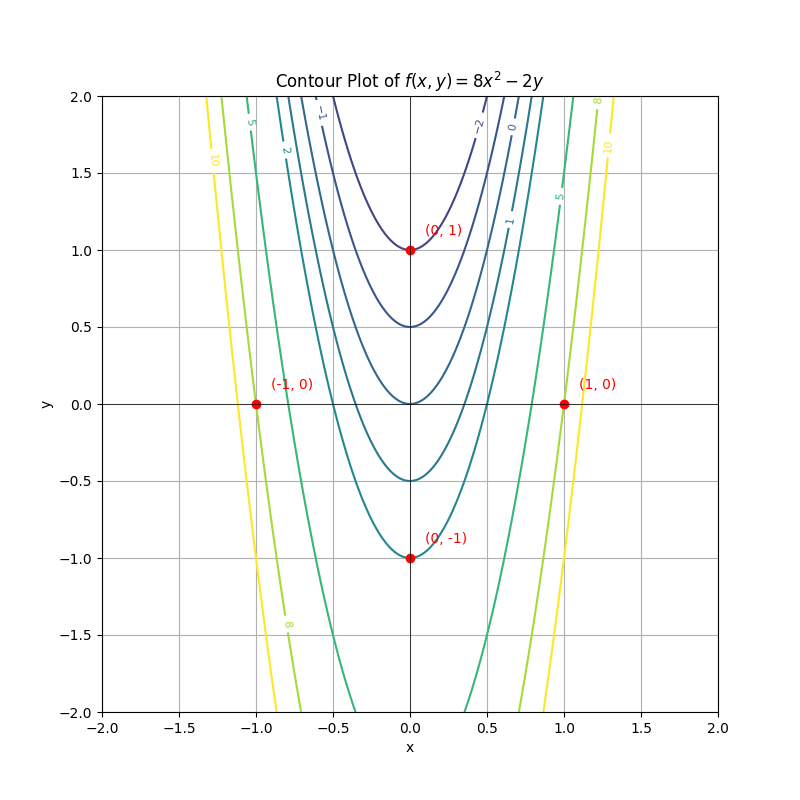

等值线图（contour plot）用于表示一个二维平面上一个函数的等值线，即函数在某些特定值（等值点）上的轮廓线。等值线连接了所有在这个值上函数值相等的点。等值点（contour point）则是等值线上的任意一点，在这些点上函数值相同。

绘制等值线图可以帮助我们直观地理解函数在二维空间中的变化情况，比如函数的高低起伏、极值点的位置等。这在优化问题、地形图、气象图等领域有广泛的应用。

### 使用Python绘制等值线图

我们将绘制函数 $ f(x, y) = 8x^2 - 2y $ 的等值线图，并标记出一些等值点。

```python
import numpy as np
import matplotlib.pyplot as plt

# 定义目标函数
def f(x, y):
    return 8 * x**2 - 2 * y

# 生成网格数据
x_vals = np.linspace(-2, 2, 400)
y_vals = np.linspace(-2, 2, 400)
X, Y = np.meshgrid(x_vals, y_vals)
Z = f(X, Y)

# 定义等值线的值
contour_levels = [-5, -2, -1, 0, 1, 2, 5, 8, 10]

# 绘制等值线图
plt.figure(figsize=(8, 8))
contour = plt.contour(X, Y, Z, levels=contour_levels, cmap="viridis")
plt.clabel(contour, inline=True, fontsize=8)

# 标记一些等值点
contour_points = [(0, 1), (1, 0), (-1, 0), (0, -1)]
for point in contour_points:
    plt.plot(point[0], point[1], "ro")
    plt.text(point[0] + 0.1, point[1] + 0.1, f"({point[0]}, {point[1]})", color="red")

# 图像设置
plt.title("Contour Plot of $f(x, y) = 8x^2 - 2y$")
plt.xlabel("x")
plt.ylabel("y")
plt.grid(True)
plt.axhline(0, color="black", linewidth=0.5)
plt.axvline(0, color="black", linewidth=0.5)
plt.gca().set_aspect("equal", adjustable="box")

# 显示图像
plt.show()
```

图像展示如下：


