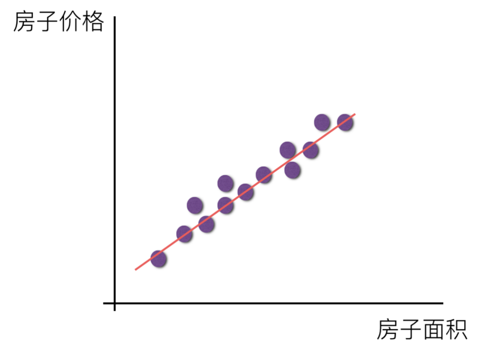

## 1、介绍

简单线性回归是一种预测分析方法，其目标是确定两个变量之间的线性关系。在这种情况下，我们关注的是自变量  $x$  （解释变量或输入变量）和因变量  $y$ （响应变量或输出变量。）之间的关系。

以房屋价格预测为例，我们可以将房屋面积作为自变量  $x$ ，将房屋价格作为因变量  $y$。线性回归模型旨在找到一个线性方程，该方程能够最好地拟合数据点，即最小化预测值和实际值之间的差异。



最佳拟合的直线方程可以表示为：
$$
y = ax + b
$$
其中：
-  $a$  是斜率，表示自变量每变化一个单位，因变量预期的变化量。
-  $b$  是截距，表示当自变量为零时，因变量的预期值。

对于数据集中的每个样本点$x^{(i)}$，根据线性回归模型，其预测值 $ \hat{y}^{(i)} $ 可以计算为：
$$
\hat{y}^{(i)} = ax^{(i)} + b
$$
 $ \hat{y}^{(i)} $ 是给定房屋面积$x^{(i)}$时，根据模型预测的房屋价格，而 $ {y}^{(i)} $则为房屋的真值 。

## 2、损失函数

接下来，我们希望 $ \hat{y}^{(i)} $ 和$ {y}^{(i)} $的差距尽量小，因此定义以下损失函数，表达 $ \hat{y}^{(i)} $ 和$ {y}^{(i)} $的差距。
$$
（\hat{y}^{(i)} - {y}^{(i)})^2
$$
我们可以将每个样本点的损失函数相加，得到总的损失函数


$$
\sum_{i=1}^{m} (\hat{y}^{(i)} - y^{(i)})^2
$$
将$\hat{y}^{(i)} = ax^{(i)} + b$代入上述公式得
$$
J(a,b) = \sum_{i=1}^{m} (ax^{(i)} + b - y^{(i)})^2
$$
在训练模型时，我们希望寻找一组参数（$\mathbf{a}^*, b^*$），这组参数能最小化在所有训练样本上的总损失。如下式：

$$
\mathbf{a}^*, b^* = \operatorname*{argmin}_{\mathbf{a}, b}\  J(\mathbf{a}, b).
$$

## 3、求解

最小二乘法（Least Squares Method）是用于拟合数据的一种标准方法。目标是找到参数 \(a\) 和 \(b\)，使得损失函数（误差平方和）最小。下面是详细的推导过程：

### （1）定义目标函数

给定数据点 $((x^{(i)}, y^{(i)})) (i = 1, 2, ..., m)$，我们的目标是找到线性函数 $\hat{y} = ax + b$，使得预测值 $\hat{y}$ 和实际值$y$之间的差距最小，即最小化以下损失函数（误差平方和）：

$$
J(a,b) = \sum_{i=1}^{m} (ax^{(i)} + b - y^{(i)})^2
$$

### （2）求导数并设为零

要找到使损失函数最小的$a$和$b$，我们需要对 $a$和 $b$分别求偏导数，并设这些偏导数为零。

#### 1）对$b$求偏导数

$$
\frac{\partial J(a,b)}{\partial b} = \frac{\partial}{\partial b} \sum_{i=1}^{m} (ax^{(i)} + b - y^{(i)})^2
$$

同样使用链式法则：

$$
= \sum_{i=1}^{m} 2(ax^{(i)} + b - y^{(i)})*1
$$

将其设为零：

$$
\sum_{i=1}^{m} 2(ax^{(i)} + b - y^{(i)}) = 0
$$

可以简化为：

$$
\sum_{i=1}^{m} (ax^{(i)} + b - y^{(i)}) = 0 \quad
$$

拆分： 

$$
a \sum_{i=1}^{m} x^{(i)} + b \sum_{i=1}^{m} 1 - \sum_{i=1}^{m} y^{(i)} = 0
$$

将$bm$项移到右边得：

$$
a \sum_{i=1}^{m} x^{(i)}  - \sum_{i=1}^{m} y^{(i)} = -bm
$$

$\frac{\sum_{i=1}^{m} x^{(i)}}{m}$为$x$的均值$\bar{x}$，$\frac{\sum_{i=1}^{m} y^{(i)}}{m}$为$y$的均值$\bar{y}$，因此： 

$$
b=\bar{y} - a\bar{x}
$$

#### 2）对$a$求偏导数

$$
\frac{\partial J(a,b)}{\partial a} = \frac{\partial}{\partial a} \sum_{i=1}^{m} (ax^{(i)} + b - y^{(i)})^2
$$

使用链式法则：

$$
= \sum_{i=1}^{m} 2(ax^{(i)} + b - y^{(i)}) \cdot x^{(i)}
$$

将其设为零：

$$
\sum_{i=1}^{m} 2(ax^{(i)} + b - y^{(i)}) \cdot x^{(i)} = 0
$$

可以简化为：

$$
\sum_{i=1}^{m} (ax^{(i)} + b - y^{(i)}) \cdot x^{(i)} = 0 \quad
$$

#### 3）将$b$代入对$a$的偏导数方程

我们已经得到了$b = \bar{y} - a\bar{x}$，现在将其代入：

$$
\sum_{i=1}^{m} (ax^{(i)} + (\bar{y} - a\bar{x}) - y^{(i)}) \cdot x^{(i)} = 0
$$

展开括号：

$$
\sum_{i=1}^{m} (ax^{(i)} + \bar{y} - a\bar{x} - y^{(i)}) \cdot x^{(i)} = 0
$$

拆分求和：

$$
a \sum_{i=1}^{m} (x^{(i)} \cdot x^{(i)}) + \bar{y} \sum_{i=1}^{m} x^{(i)} - a\bar{x} \sum_{i=1}^{m} x^{(i)} - \sum_{i=1}^{m} (y^{(i)} \cdot x^{(i)}) = 0
$$

将$\sum_{i=1}^{m} x^{(i)}$表示为$m \bar{x}$：

$$
a \sum_{i=1}^{m} (x^{(i)})^2 + \bar{y} m \bar{x} - a\bar{x} m \bar{x} - \sum_{i=1}^{m} (y^{(i)} x^{(i)}) = 0
$$

合并 \(a\) 项：

$$
a (\sum_{i=1}^{m} (x^{(i)})^2 - m \bar{x}^2) + m \bar{y} \bar{x} - \sum_{i=1}^{m} (y^{(i)} x^{(i)}) = 0
$$

得出

$$

$$

我们从以下方程开始：

$$
a \left(\sum_{i=1}^{m} (x^{(i)})^2 - m \bar{x}^2\right) + m \bar{y} \bar{x} - \sum_{i=1}^{m} (y^{(i)} x^{(i)}) = 0
$$

将$m \bar{y} \bar{x}$和$\sum_{i=1}^{m} (y^{(i)} x^{(i)})$移到右边：

$$
a \left(\sum_{i=1}^{m} (x^{(i)})^2 - m \bar{x}^2\right) = \sum_{i=1}^{m} (y^{(i)} x^{(i)}) - m \bar{y} \bar{x}
$$

因此，参数 \(a\) 为：

$$
a = \frac{\sum_{i=1}^{m} (x^{(i)} - \bar{x})(y^{(i)} - \bar{y})}{\sum_{i=1}^{m} (x^{(i)} - \bar{x})^2}
$$

## 4、向量化运算

向量化运算是指利用向量和矩阵操作来替代显式的循环，以提高计算效率的技术。在Python中，NumPy库是进行向量化运算的强大工具。

### （1）向量化运算的优势

- **性能提升**：向量化运算在底层使用高效的C语言实现，能够显著提高计算速度。
- **代码简洁**：向量化运算使代码更加简洁和易读，减少了显式循环的使用。
- **减少错误**：由于减少了显式循环，向量化运算减少了出现循环相关错误的可能性。

### （2）示例：向量化运算 vs. 显式循环

使用显式循环计算两个数组的点积

```python
import numpy as np

# 定义两个数组
a = np.array([1, 2, 3, 4, 5])
b = np.array([5, 4, 3, 2, 1])

# 显式循环计算点积
dot_product = 0
for i in range(len(a)):
    dot_product += a[i] * b[i]

print(f"显式循环计算的点积: {dot_product}")
```

使用向量化运算计算两个数组的点积

```python
import numpy as np

# 定义两个数组
a = np.array([1, 2, 3, 4, 5])
b = np.array([5, 4, 3, 2, 1])

# 使用向量化运算计算点积
dot_product = np.dot(a, b)

print(f"向量化运算计算的点积: {dot_product}")
```

## 5、简单线性回归的实现

简单实现

```python
import numpy as np
import matplotlib.pyplot as plt

class SimpleLinearRegression:
    def __init__(self):
        self.a_ = 0
        self.b_ = 0

    def fit(self, X, y):
        # 断言检查
        assert X.shape[0] == y.shape[0], "X and y should have the same length"
        assert X.size > 0 and y.size > 0, "X and y should not be empty"

        # 计算均值
        x_mean = np.mean(X)
        y_mean = np.mean(y)

        # 计算向量化后的 a 和 b
        self.a_ = np.sum((X - x_mean) * (y - y_mean)) / np.sum((X - x_mean) ** 2)
        self.b_ = y_mean - self.a_ * x_mean

    def predict(self, X):
        return self.a_ * X + self.b_

    def get_params(self):
        return self.a_, self.b_

# 定义数据点
X = np.array([1., 2., 3., 4., 5.])
y = np.array([1., 3., 2., 3., 5.])

# 创建线性回归模型实例
model = SimpleLinearRegression()

# 拟合模型
model.fit(X, y)

# 打印参数 a 和 b
a, b = model.get_params()
print(f"斜率 a: {a}")
print(f"截距 b: {b}")

# 预测 y 值
y_pred = model.predict(X)

# 绘制数据点和回归线
plt.scatter(X, y, color='blue', label='数据点')
plt.plot(X, y_pred, color='red', label='回归线')
plt.title('简单线性回归')
plt.xlabel('x')
plt.ylabel('y')
plt.legend()
plt.axis([0, 6, 0, 6])

# 显示图形
plt.show()
```

模拟sklearn实现

```python
import numpy as np
import matplotlib.pyplot as plt

class SimpleLinearRegression:
    def __init__(self):
        self.a_ = 0
        self.b_ = 0

    def fit(self, X, y):
        # 断言检查
        assert X.shape[0] == y.shape[0], "X and y should have the same length"
        assert X.size > 0 and y.size > 0, "X and y should not be empty"

        # 计算均值
        x_mean = np.mean(X)
        y_mean = np.mean(y)

        # 计算向量化后的 a 和 b
        self.a_ = np.sum((X - x_mean) * (y - y_mean)) / np.sum((X - x_mean) ** 2)
        self.b_ = y_mean - self.a_ * x_mean

    def predict(self, X):
        return self.a_ * X + self.b_

    def get_params(self):
        return self.a_, self.b_

# 定义数据点
X = np.array([1., 2., 3., 4., 5.])
y = np.array([1., 3., 2., 3., 5.])

# 创建线性回归模型实例
model = SimpleLinearRegression()

# 拟合模型
model.fit(X, y)

# 打印参数 a 和 b
a, b = model.get_params()
print(f"斜率 a: {a}")
print(f"截距 b: {b}")

# 预测 y 值
y_pred = model.predict(X)

# 绘制数据点和回归线
plt.scatter(X, y, color='blue', label='数据点')
plt.plot(X, y_pred, color='red', label='回归线')
plt.title('简单线性回归')
plt.xlabel('x')
plt.ylabel('y')
plt.legend()
plt.axis([0, 6, 0, 6])

# 显示图形
plt.show()
```

**计算斜率 \( a \) 和截距 \( b \) 的向量化运算**

```python
self.a_ = np.sum((X - x_mean) * (y - y_mean)) / np.sum((X - x_mean) ** 2)
self.b_ = y_mean - self.a_ * x_mean
```

- `np.sum((X - x_mean) * (y - y_mean))`：计算分子部分，即$\sum_{i=1}^{m} (x^{(i)} - \bar{x})(y^{(i)} - \bar{y})$。
- `np.sum((X - x_mean) ** 2)`：计算分母部分，即 $\sum_{i=1}^{m} (x^{(i)} - \bar{x})^2$。
- `self.b_ = y_mean - self.a_ * x_mean`：根据公式计算截距。

## 6、线性回归算法的评测

在使用线性回归算法进行建模时，评估模型的性能是至关重要的。常用的评估指标包括均方误差（Mean Squared Error，MSE）、均方根误差（Root Mean Squared Error，RMSE）和平均绝对误差（Mean Absolute Error，MAE）。这些指标可以帮助我们了解模型预测的准确程度，以及对异常值的敏感程度。

### （1）均方误差（MSE）

MSE是预测值与真实值之间差异的平方和的平均值，公式如下：
$$
MSE = \frac{1}{n} \sum_{i=1}^{n} (y^{(i)} - \hat{y}^{(i)})^2
$$

其中，$n$ 是样本数量，$y^{(i)}$是第 $i$个样本的真实值，$\hat{y}^{(i)}$ 是模型预测的值。

MSE越小，说明模型的拟合效果越好。

### （2）均方根误差（RMSE）

RMSE是MSE的平方根，公式如下：
$$
RMSE = \sqrt{MSE}
$$

RMSE在某种程度上弥补了MSE对量纲的依赖性，通常用于更直观地衡量模型的预测能力。

### （3）平均绝对误差（MAE）

MAE是预测值与真实值之间差异的绝对值的平均值，公式如下：
$$
MAE = \frac{1}{n} \sum_{i=1}^{n} |y^{(i)} - \hat{y}^{(i)}|
$$

MAE越小，说明模型对异常值的敏感性越低。

### （4）R Squared

R-squared$R^2$也称为决定系数（Coefficient of Determination），是用于衡量回归模型拟合优度的统计量。它表示模型解释目标变量总变异的比例。R-squared 的值介于 0 和 1 之间，值越接近 1，表示模型对数据的解释能力越强。R-squared 的定义公式如下：

$$
R^2 = 1 - \frac{SS_{\text{res}}}{SS_{\text{tot}}}
$$

$$
R^2 = 1 - \frac{\sum_{i=1}^{n} (y^{(i)} - \hat{y}^{(i)})^2}{\sum_{i=1}^{n} (y^{(i)} - \bar{y})^2}
$$

其中：

$SS_{\text{res}}$是残差平方和（Sum of Squares of Residuals），即模型预测值与实际值之间的差异平方和。它表示模型未能解释的数据变异量。可以理解为模型预测得不好的地方有多大。
$$
SS_{\text{res}} = \sum_{i=1}^{n} (y^{(i)} - \hat{y}^{(i)})^2
$$

其中，$\hat{y}^{(i)}$ 是第 \(i\) 个预测值。

- $SS_{\text{tot}}$是总平方和（Total Sum of Squares），即实际值与实际均值之间的差异平方和。它表示数据的总变异量。可以理解为，如果我们只用一个平均值来预测所有数据，误差会有多大。

$$
SS_{\text{tot}} = \sum_{i=1}^{n} (y^{(i)} - \bar{y})^2
$$

其中，$y^{(i)}$是第 \(i\) 个实际值，$\bar{y}$是目标变量的均值。

即R-squared 的定义公式也可为：
$$
R^2 = 1 - \frac{\sum_{i=1}^{n} (y^{(i)} - \hat{y}^{(i)})^2}{\sum_{i=1}^{n} (y^{(i)} - \bar{y})^2}
$$

R-squared 是 1 减去模型预测误差与总误差的比值。这个比值越小，R-squared 越接近 1，说明模型预测得越好。简单讲就是：

- 如果模型预测得很好，模型的预测误差$SS_{\text{res}}$就会很小，这样 R-squared 就会接近 1。
- 如果模型预测得不好，模型的预测误差$SS_{\text{res}}$会比较大，这样 R-squared 就会接近 0。
- **R² = 1**：表示模型能够完美预测数据，所有预测值都与实际值完全相同。
- **R² = 0**：表示模型无法解释数据的变异，预测值与实际值无关。

用一句话总结：**R-squared 告诉我们模型比用平均值预测要好多少**。

R-squared ($R^2$) 也可以通过均方误差 (MSE) 和总方差来表示。这种形式进一步简化了公式，并帮助我们理解 R-squared 的本质。我们可以将上面的公式转换成另一种表现形式：

总方差是总平方和除以样本数$n$：

$$
\text{Variance} = \frac{SS_{\text{tot}}}{n}
$$

均方误差 (MSE)是残差平方和除以样本数$n$：

$$
\text{MSE} = \frac{SS_{\text{res}}}{n}
$$

将这些代入 R-squared 的定义公式，可以得到 R-squared 的另一种形式：

$$
R^2 = 1 - \frac{\text{MSE}}{\text{Variance}}
$$

