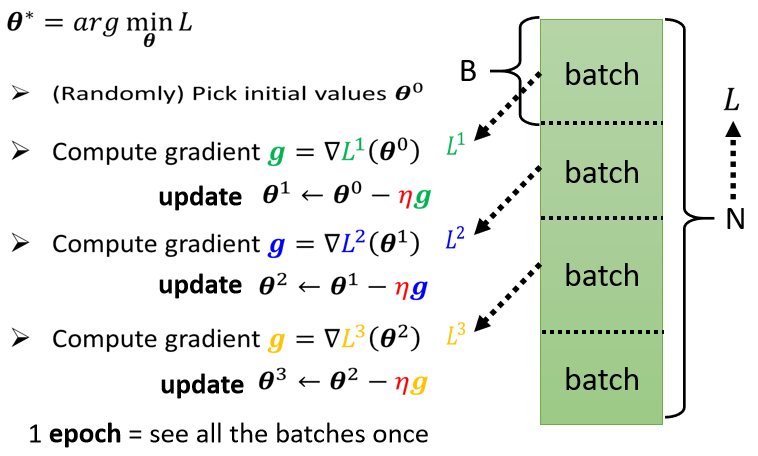

## 1、介绍

梯度下降法是一种利用梯度信息来最小化函数的方法，广泛应用于机器学习中的无约束优化问题。其核心思想是通过计算损失函数的梯度向量，并沿着负梯度方向迭代地更新参数，以最小化损失函数。这个过程可以类比为下山的过程，在每一步迭代中：

**Step1：计算梯度**：在当前位置计算损失函数的梯度向量。

**Step2：更新参数**：沿着负梯度方向移动一步，更新模型参数。

**Step3：重复迭代**：直到收敛到局部最小值。

梯度下降法的数学表达为：

$$
\mathbf{\theta}_{t+1} = \mathbf{\theta}_t - \eta \nabla f(\mathbf{\theta}_t)
$$

其中：

- $ \mathbf{\theta}_t $ 表示第 $ t $ 次迭代的参数
- $\eta$ 是学习率，学习率决定了每次参数更新的步伐大小。学习率过大会导致跳过最优值，学习率过小会导致收敛速度过慢，甚至陷入局部最优。选择合适的学习率是梯度下降法成功的关键。

## 2、参数更新过程

小批量梯度下降（Mini-batch Gradient Descent, MBGD）结合了批量梯度下降（BGD）和随机梯度下降（SGD）的优点。我们以线性回归为例讲解公式的由来及计算过程。假设线性回归模型的形式为：
$$
 \hat{y} = \mathbf{w}^\top \mathbf{x} + b 
$$
其中，$\mathbf{w}$是权重向量，$\mathbf{x}$是输入特征向量，$b$是偏置项，$\hat{y}$是预测值。

我们使用均方误差（MSE）作为损失函数，定义如下：
$$
 L(\mathbf{w}, b) = \frac{1}{N} \sum_{i=1}^{N} \left( \hat{y}^{(i)} - y^{(i)} \right)^2 = \frac{1}{N} \sum_{i=1}^{N} \left( \mathbf{w}^\top \mathbf{x}^{(i)} + b - y^{(i)} \right)^2 
$$
其中，$N$是样本总数，$y^{(i)}$是第 $i$个样本的真实值。

为了进行梯度下降，我们需要计算损失函数关于模型参数 $\mathbf{w}$和 $b$的梯度。

**关于 $\mathbf{w}$ 的梯度**：
$$
 \frac{\partial L(\mathbf{w}, b)}{\partial \mathbf{w}} = \frac{1}{N} \sum_{i=1}^{N} 2\left( \mathbf{w}^\top \mathbf{x}^{(i)} + b - y^{(i)} \right) \mathbf{x}^{(i)} 
$$

**关于 $b$ 的梯度**：
$$
 \frac{\partial L(\mathbf{w}, b)}{\partial b} = \frac{1}{N} \sum_{i=1}^{N} 2\left( \mathbf{w}^\top \mathbf{x}^{(i)} + b - y^{(i)} \right)
$$
为了简化计算，我们通常省略常数因子 2，因为它可以被学习率吸收。在小批量梯度下降中，我们使用一个小批量（mini-batch）样本 $\mathcal{B}$来近似整个数据集的梯度。

**关于 $\mathbf{w}$ 的梯度**：
$$
 \frac{\partial L_{\mathcal{B}}(\mathbf{w}, b)}{\partial \mathbf{w}} = \frac{1}{|\mathcal{B}|} \sum_{i \in \mathcal{B}} \left( \mathbf{w}^\top \mathbf{x}^{(i)} + b - y^{(i)} \right) \mathbf{x}^{(i)} 
$$

**关于 $b$ 的梯度**：
$$
\frac{\partial L_{\mathcal{B}}(\mathbf{w}, b)}{\partial b} = \frac{1}{|\mathcal{B}|} \sum_{i \in \mathcal{B}} \left( \mathbf{w}^\top \mathbf{x}^{(i)} + b - y^{(i)} \right)
$$
在每次迭代中，我们根据小批量样本计算梯度，并使用这些梯度更新模型参数。更新公式为：

$$
(\mathbf{w},b) \leftarrow (\mathbf{w},b) - \eta \frac{1}{|\mathcal{B}|} \sum_{i \in \mathcal{B}} \partial_{(\mathbf{w},b)} l^{(i)}(\mathbf{w},b)
$$

对于线性回归模型，具体更新公式为：

**权重 $\mathbf{w}$ 的更新**：
$$
\mathbf{w} \leftarrow \mathbf{w} - \frac{\eta}{|\mathcal{B}|} \sum_{i \in \mathcal{B}} \mathbf{x}^{(i)} \left(\mathbf{w}^\top \mathbf{x}^{(i)} + b - y^{(i)}\right)
$$

**偏置 $b$ 的更新**：
$$
b \leftarrow b - \frac{\eta}{|\mathcal{B}|} \sum_{i \in \mathcal{B}} \left(\mathbf{w}^\top \mathbf{x}^{(i)} + b - y^{(i)}\right)
$$

其中：
- $\eta$是学习率，控制每次更新的步长。
- $|\mathcal{B}|$是小批量的样本数量，称为批量大小（batch size）。
- $\mathbf{x}^{(i)}$是第 $i$个样本的输入特征向量。
- $y^{(i)}$是第 $i$个样本的真实值。

通过上述步骤，我们完成了一次参数更新。不断迭代这一过程，直到达到预定的停止条件，如固定的迭代次数或损失函数收敛。

## 3、梯度下降法的三种变体

在机器学习中，梯度下降算法是一种常用的优化方法，用于最小化损失函数以训练模型。梯度下降法有三种主要变体：批量梯度下降（Batch Gradient Descent, BGD）、随机梯度下降（Stochastic Gradient Descent, SGD）和小批量梯度下降（Mini-batch Gradient Descent, MBGD）。

### （1）批量梯度下降（BGD）

批量梯度下降是最经典的梯度下降方法。在每次迭代中，BGD使用所有训练样本来计算梯度并更新模型参数。其更新公式为：

$$
\mathbf{\theta}_{t+1} = \mathbf{\theta}_t - \eta \nabla J(\mathbf{\theta}_t)
$$

其中，$ J(\mathbf{\theta}_t) $ 表示在所有训练样本上的损失函数，$\eta$ 是学习率。由于每次更新都需要遍历整个数据集，BGD的计算开销较大，尤其在数据量很大的情况下。

### （2）随机梯度下降（SGD）

随机梯度下降是梯度下降算法的一种变体，通过每次迭代使用随机抽取的单个样本来估计梯度，从而减少计算成本。其更新规则为：

$$
\mathbf{\theta}_{t+1} = \mathbf{\theta}_t - \eta \nabla J_i(\mathbf{\theta}_t)
$$

其中，$i$ 是从训练集中随机抽取的样本索引，$\nabla J_i(\mathbf{\theta}_t)$ 是损失函数对第 $i$ 个样本的梯度。

学习率 $\eta$ 的选择对训练的效果至关重要。如果学习率过大，可能会导致算法不稳定；如果学习率过小，则收敛速度会很慢。为了提高算法的稳定性和收敛速度，通常会使用学习率衰减（learning rate decay），即随着训练的进行逐渐减小学习率。

在实践中，为了避免除数为零的情况，更新规则通常会稍作修改，引入一个常数项 $\epsilon$，即：

$$
\mathbf{\theta}_{t+1} = \mathbf{\theta}_t - \frac{\eta}{\sqrt{G_t + \epsilon}} \nabla J_i(\mathbf{\theta}_t)
$$

其中，$G_t$ 是过去梯度的平方和的衰减平均值。

### （3）小批量梯度下降（MBGD）

在实际操作中，我们在计算梯度时并不会一次性使用所有的数据。相反，我们会将大量数据分成若干个批次（Batch），然后逐步计算和更新参数。具体来说：

1. 假设我们有大量的数据，记作 $N$ 笔数据。
2. 我们会将这些数据随机分成多个批次，每个批次包含 $B$ 笔数据。
3. 每个批次称为一个 Batch。

本来我们是使用所有数据计算一个总损失（Loss），现在我们只使用一个 Batch 的数据计算损失，这个损失记作 $L1$，以区别于使用所有数据计算的总损失 $L$。虽然 $L$ 和 $L1$ 不同，但当 $B$ 够大时，$L$ 和 $L1$ 可能会很接近。

在实际操作中，具体步骤如下：



**Step1：**随机选择一个 Batch，计算该 Batch 的损失 $L1$。

**Step2：**根据 $L1$ 计算梯度，并更新参数。

**Step3：**选择下一个 Batch，计算其损失 $L2$，根据 $L2$ 计算梯度并更新参数。

**Step4：**重复上述步骤，直到遍历完所有 Batch，这称为一个 Epoch。

**Step5：**每次更新参数称为一次 Update。

**举例说明**：假设有 10000 笔数据（N = 10000），Batch 大小为 10（B = 10）。在一个 Epoch 中，总共会有 1000 个 Batch，因此参数总共会更新 1000 次。再假设有 1000 笔数据，Batch 大小为 100，那么一个 Epoch 中总共会更新 10 次参数。由此可见，Batch 大小的设定直接影响参数更新的次数。

小批量梯度下降结合了BGD和SGD的优点，每次更新时使用一个小批量（mini-batch）的样本。其更新公式为：
$$
\mathbf{\theta}_{t+1} = \mathbf{\theta}_t - \eta \nabla J(\mathbf{\theta}_t; \mathbf{x}_{mini-batch})
$$

其中，$ \mathbf{x}_{mini-batch} $ 是一个小批量样本集。MBGD在计算效率和参数更新稳定性之间取得了平衡。通过选择适当的批量大小，MBGD能够既利用向量化加速计算，又减少参数更新的波动性。

### （4）比较与选择

- **批量梯度下降（BGD）**：
  - 优点：每次更新利用所有样本，方向稳定，适用于小数据集。
  - 缺点：计算开销大，迭代速度慢，不适合大规模数据。

- **随机梯度下降（SGD）**：
  - 优点：每次更新使用一个样本，计算速度快，适用于大规模数据，可以跳出局部最优解。
  - 缺点：参数更新路径不稳定，波动大，可能无法达到全局最优解。

- **小批量梯度下降（MBGD）**：
  - 优点：兼具BGD和SGD的优点，计算效率高，参数更新相对稳定，适用于大规模数据。
  - 缺点：需要选择合适的批量大小，计算仍然需要一定的资源。

在实际应用中，MBGD是最常用的梯度下降方法，因为它在计算效率和参数更新稳定性之间取得了较好的平衡。选择合适的批量大小和学习率，可以提高模型训练的效果和速度。

## 4、数值梯度检查

数值梯度检查是一种用于验证解析梯度计算的方法。在机器学习中，我们经常需要计算损失函数对模型参数的梯度，以便使用梯度下降等优化算法来更新参数。然而，手动计算梯度可能会出错，特别是当模型变得更加复杂时。数值梯度检查可以帮助我们验证梯度计算的正确性。

### （1）梯度的定义
梯度是一个向量，表示函数在某一点上的变化率或者斜率方向。对于多元函数$f(\theta)$，梯度$\nabla f(\theta)$是一个向量，其中每个元素表示$f$对应于$\theta$中某个参数的偏导数。即：
$$
\nabla f(\theta) = \left( \frac{\partial f}{\partial \theta_1}, \frac{\partial f}{\partial \theta_2}, \ldots, \frac{\partial f}{\partial \theta_n} \right)
$$

### （2）数值梯度检查的原理
数值梯度检查使用数值近似来计算梯度，通过比较数值梯度和解析梯度的差异来验证解析梯度计算的准确性。其基本原理是利用函数在某一点附近的局部线性近似来近似梯度。

### （3）数值梯度检查的步骤
假设我们有一个待优化的函数$f(\theta)$，其中$\theta$是一个向量。数值梯度检查的步骤如下：
1. 选择一个很小的数$\epsilon$，通常取$10^{-4}$或$10^{-6}$。
2. 对于每个参数$\theta_i$，分别计算在$\theta_i + \epsilon$和$\theta_i - \epsilon$处的函数值，即$f(\theta_1, \ldots, \theta_i + \epsilon, \ldots, \theta_n)$和$f(\theta_1, \ldots, \theta_i - \epsilon, \ldots, \theta_n)$。
3. 计算数值梯度的近似值：
   $$
   \frac{\partial f}{\partial \theta_i} \approx \frac{f(\theta_1, \ldots, \theta_i + \epsilon, \ldots, \theta_n) - f(\theta_1, \ldots, \theta_i - \epsilon, \ldots, \theta_n)}{2 \epsilon}
   $$
4. 将所有参数的数值梯度近似值组合成一个向量，与解析梯度进行比较。

### （4）代码实现
**步骤一：定义损失函数和梯度计算函数**。假设我们有一个简单的线性回归模型：
$$
h_\theta(x) = \theta_0 + \theta_1 x
$$
损失函数为均方误差：
$$
J(\theta) = \frac{1}{2m} \sum_{i=1}^{m} (h_\theta(x^{(i)}) - y^{(i)})^2
$$
其中，$m$是样本数量，$(x^{(i)}, y^{(i)})$是第$i$个样本的特征和标签。

定义损失函数和梯度计算函数：
```python
def loss_function(theta0, theta1, x, y):
    m = len(x)
    loss = 0
    for i in range(m):
        loss += (theta0 + theta1 * x[i] - y[i]) ** 2
    return loss / (2 * m)

def compute_gradients(theta0, theta1, x, y):
    m = len(x)
    grad0 = 0
    grad1 = 0
    for i in range(m):
        grad0 += theta0 + theta1 * x[i] - y[i]
        grad1 += (theta0 + theta1 * x[i] - y[i]) * x[i]
    return grad0 / m, grad1 / m
```

**步骤二：实现数值梯度检查**。对于每个参数$\theta_i$，我们将其值分别增加和减少一个极小值$\epsilon$，然后计算损失函数在这两个点的差值，最后除以$2\epsilon$得到数值梯度的近似值。

```python
def numerical_gradient_check(theta0, theta1, x, y, epsilon=1e-4):
    gradients = []
    for i in range(2):
        theta_plus = theta0 + (i * 2 - 1) * epsilon
        theta_minus = theta0 - (i * 2 - 1) * epsilon
        loss_plus = loss_function(theta_plus, theta1, x, y)
        loss_minus = loss_function(theta_minus, theta1, x, y)
        gradient = (loss_plus - loss_minus) / (2 * epsilon)
        gradients.append(gradient)
    return gradients
```

**步骤三：比较数值梯度和解析梯度**。可以使用数值梯度检查函数来验证我们计算的解析梯度是否正确。

```python
import numpy as np

# 生成一些样本数据
np.random.seed(0)
x = np.random.rand(100)
y = 2 * x + 1 + np.random.randn(100) * 0.1

# 随机初始化参数
theta0 = np.random.randn()
theta1 = np.random.randn()

# 计算解析梯度
analytical_grad0, analytical_grad1 = compute_gradients(theta0, theta1, x, y)

# 计算数值梯度
numerical_grad0, numerical_grad1 = numerical_gradient_check(theta0, theta1, x, y)

# 比较数值梯度和解析梯度
print("Analytical gradients:", analytical_grad0, analytical_grad1)
print("Numerical gradients:", numerical_grad0, numerical_grad1)
```

如果一切正常，数值梯度和解析梯度应该非常接近。如果存在较大差异，则可能是梯度计算出现了错误。

## 5、数据归一化

在使用梯度下降法时，数据归一化（Normalization）是一个重要的预处理步骤，其作用包括：

- **加快收敛速度：** 归一化可以使各个特征的尺度相近，避免了某些特征范围较大而导致的收敛缓慢问题。在梯度下降过程中，各个参数的更新速度会更加一致，有利于快速找到损失函数的最小值。

- **避免数值不稳定性：** 如果特征之间的尺度差异很大，可能会导致数值计算时的不稳定性，甚至出现溢出或下溢的问题。归一化可以有效地解决这个问题。

- **更好的条件数：** 归一化可以改善损失函数的条件数（Condition Number），使其更加接近1，有利于优化算法的稳定性和效率。

通常情况下，常用的数据归一化方法包括最小-最大归一化（Min-Max Normalization）和标准化（Standardization）两种方法。
