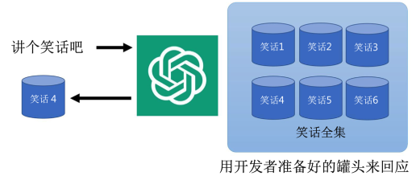
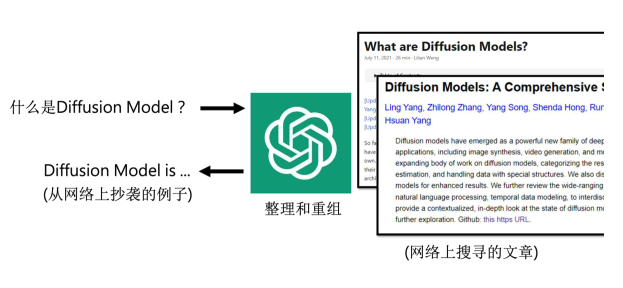
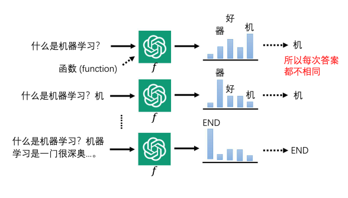
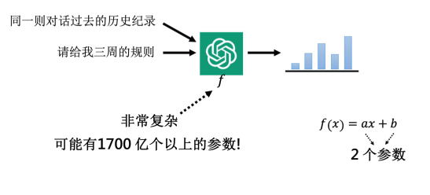
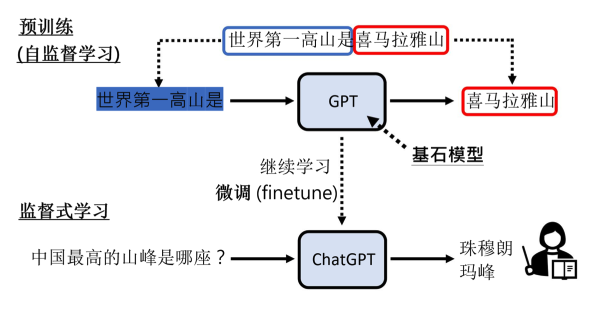
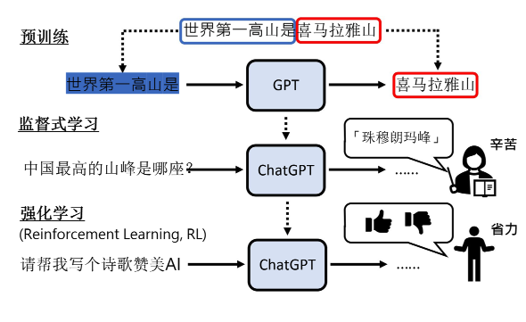

本章将介绍当前最热门的深度学习应用之一——ChatGPT。与之前的章节不同，本章将以科普的方式介绍 ChatGPT 的原理和关键技术——预训练，帮助大家了解这一技术的基础和应用。

## 一、ChatGPT 简介和功能

ChatGPT 是一个可以与人类对话的模型，公开于 2022 年 11 月 30 日。它的表现超出了预期，给人一种专业人员在背后回答问题的感觉。以下是对 ChatGPT 的简单介绍和其功能说明：

### 1、ChatGPT 的使用界面

通过访问 ChatGPT 的网址，用户可以在对话框中输入各种问题或任务。例如，你可以输入“帮我写一个机器学习课程规划的大纲”。ChatGPT 将根据你的输入生成一个相应的大纲，例如：

- 第一周：机器学习简介，定义与应用
- 第二周：监督学习，线性回归等
- 第三周：无监督学习与强化学习等

需要注意的是，ChatGPT 每次的回答可能不同，因此即使提出相同的问题，也可能得到不同的答案。

### 2、ChatGPT 的多轮对话功能

ChatGPT 的另一个特点是支持多轮对话。用户可以在同一个对话中继续追问，以便对之前的问题进行调整或深入。例如，如果对课程规划的时间安排不满意，可以继续问：“课程太长了，请给我三周的规划。” ChatGPT 会基于之前的对话内容进行修改，输出一个新的三周课程规划：

- 第一周：机器学习简介
- 第二周：监督学习
- 第三周：非监督学习

这表明 ChatGPT 能记住对话中的上下文信息，即使在未明确提到的情况下，也能理解用户的意图并提供相应的回答。

以下是第 19 章第 2 节内容的整理和概括：

---

## 二、对于 ChatGPT 的误解

在使用 ChatGPT 时，人们常常会有一些误解：

### 1、误解 1：ChatGPT 的回答是罐头讯息

**误解描述：** 有人认为 ChatGPT 的回答类似于从一个预先准备好的笑话全集中随机挑选一个笑话，认为它的回答是固定的、事先编好的内容。

**事实：** ChatGPT 并不是从预先准备好的答案中随机挑选回应问题。实际上，每次回答相同的问题时，ChatGPT 的答案会有所不同。这是因为 ChatGPT 是通过深度学习算法生成回答，而不是简单地从事先编好的信息中选择答案。因此，ChatGPT 的回答是动态生成的，而不是固定的“罐头”答案。

### 2、误解 2：ChatGPT 的答案是网络搜索的结果

**误解描述：** 有人认为 ChatGPT 的回答是通过网络搜索获得的，认为它在后台进行实时搜索并从中汇总信息来回答问题。

**事实：** ChatGPT 的回答不是从网络上直接搜索得来的。它的回答是基于预训练的数据模型生成的，而不是从网络上即时检索和整理信息的结果。如果将 ChatGPT 的回答放到网络上进行搜索，通常找不到完全相同的原文。这是因为 ChatGPT 生成的内容是通过对大量数据的学习而来的，而不是从网络上抄袭或复制的。

### 3、为什么 ChatGPT 会给出错误答案？

尽管 ChatGPT 能生成流畅的回答，但它并不保证所有回答都是准确的。其官方说明包括以下几点：

- **ChatGPT 没有联网**：ChatGPT 的答案不是从网络上获取的，而是基于其训练数据中的知识生成的。
- **知识截止时间**：ChatGPT 对于 2021 年之后的事件和信息了解有限。
- **答案的可信性**：由于 ChatGPT 并不总是提供正确的答案，因此建议用户在依赖 ChatGPT 的回答时要进行核实和查证。

OpenAI 官方已澄清这些误解，强调 ChatGPT 的回答并不直接来源于网络搜索，也不保证回答的准确性。用户应当对 ChatGPT 的回答保持一定的怀疑态度，并在必要时进行进一步验证。

## 三、ChatGPT 真正在做的事情

ChatGPT 的核心任务可以用“一句话接龙”来概括。简单来说，它是一个生成语言的模型，主要通过以下几个步骤来完成任务：

### 1、文字“接龙”

ChatGPT 实际上是一个语言生成模型，其工作方式可以类比为文字接龙。具体来说，ChatGPT 可以被视为一个函数，它的输入是用户的文本，输出是下一个最可能出现的词汇。这个过程可以分解为以下几个步骤：

**Step1：输入和概率计算**：ChatGPT 接受一个句子作为输入，比如“什么是机器学习”，然后预测接下来的词汇。它会为每一个可能的词汇分配一个概率值。例如，对于输入“什么是机器学习”，可能的下一个词汇及其概率如下：

- **“机”**（高概率）
- **“器”**（中概率）
- **“好”**（低概率）

ChatGPT 根据这些概率生成下一个词汇，并把生成的词汇加入到当前句子中，形成新的输入。

**Step2：生成和采样**：ChatGPT 从生成的概率分布中采样一个词汇作为下一个词。这个采样过程具有一定的随机性，所以每次回答同样的问题时，ChatGPT 的答案可能会有所不同。

**示例：** 输入“什么是机器学习？”可能产生的词汇包括“机”，“器”，“好”等，ChatGPT 会根据概率分布选择一个词汇，并生成新的输入文本。

**Step3：重复过程**：生成一个词汇后，ChatGPT 将这个新词汇加入到输入文本中，继续预测下一个词汇。这个过程会反复进行，直到生成一个表示结束的符号。

**示例：** 如果当前文本是“什么是机器学习？机”，下一个词汇可能是“器”，继续生成直到生成结束符号。

### 2、如何考虑对话历史记录

在多轮对话中，ChatGPT 会将整个对话历史记录作为输入的一部分来生成回答。这个对话历史包含了用户的所有输入和 ChatGPT 的所有回应，以确保生成的回答具有上下文一致性。

**示例：** 

- 用户提问：“什么是机器学习？”
- ChatGPT 回答：“机器学习是一种让计算机从数据中学习并进行预测的技术。”
- 用户继续提问：“那它有哪些应用？”
  
  在这个过程中，ChatGPT 会考虑之前的对话历史来生成与上下文相关的回答。

### 3、ChatGPT 的复杂性

ChatGPT 是一个非常复杂的模型，包含了大量的可学习参数。以 GPT-3 为例，该模型拥有 1700 亿个参数，用于训练和生成语言。

**参数解释：** 类似于数学函数 $ f(x) = ax + b $ 中的 $ a $ 和 $ b $ 是参数，ChatGPT 中的参数是通过训练数据来调整的，以优化语言生成的效果。

### 4、训练与测试的区别

ChatGPT 的训练和测试过程有明确的区分：

- **训练**：在训练阶段，ChatGPT 使用大量的网络数据来学习语言生成的规则。这就像是备考期间通过阅读教材和上网查找资料来准备考试。

- **测试**：在测试阶段，ChatGPT 使用训练得到的模型来生成回答，不再进行网络数据的检索。这类似于考试时依靠之前的学习成果来回答问题。

可以将训练过程类比为“备考”，而测试过程则是“考试”。在训练阶段，模型通过阅读和学习来建立知识库；在测试阶段，模型根据这些知识生成回答，而不再进行新的数据获取。

## 四、ChatGPT 背后的关键技术——预训练

### 1、预训练的概念

预训练是 ChatGPT 背后的核心技术之一。它是一个学习方法，通过从大量数据中学习语言规律来构建一个基础模型。这种技术也被称为**自监督学习**，并且预训练得到的模型有时被称为**基石模型**。这部分技术是 ChatGPT 的基础，让它能够处理各种语言任务。

**ChatGPT**：名称来源于两个部分：

- **Chat**：代表聊天。
- **GPT**：
  - **G** (Generative)：生成文本。
  - **P** (Pre-training)：预训练。
  - **T** (Transformer)：一种用于语言处理的深度学习架构，我们将在后续章节介绍。

### 2、机器学习的基本概念

为了更好地理解预训练，我们先回顾一下传统的机器学习方法：

- **监督式学习**：通常，机器学习需要大量的“成对数据”来进行训练。例如，英文到中文的翻译任务中，系统需要大量的中英文对照例句来学习翻译规则。
  - **示例**：
    - 输入：“I eat an apple.”
    - 输出：“我吃苹果。”
  
  这种方法依赖人工提供的标签数据来训练模型，使模型学习输入和输出之间的映射关系。

### 3、预训练 vs. 监督式学习

ChatGPT 的训练过程分为两部分：**预训练**和**微调**。

**Part1：预训练**：在这个阶段，ChatGPT 从海量的网络数据中学习语言的基本规律。这一过程不依赖人工标注的数据，而是通过自动生成的训练数据来完成。

- **数据来源**：包括网络上的文本数据，如网页内容、文章、论坛帖子等。
- **任务**：训练一个可以进行文字接龙的模型，即输入一段文本，预测下一个词汇。这里的“正确答案”是基于上下文自然产生的内容，而非明确的人工标签。

**Part2：微调**：在预训练之后，使用人工标注的数据进行细化训练，调整模型的参数以提升特定任务的性能。

- **任务**：根据特定的任务或领域调整模型，如问答系统、对话生成等。

### 4、GPT 的发展历程

从 GPT-1 到 GPT-3，模型的规模和能力都在不断提升：

- **GPT-1** (2018)：
  - **参数量**：1.17 亿
  - **训练数据**：1GB 数据
  - **特点**：模型较小，主要用于生成文本。

- **GPT-2** (2019)：
  - **参数量**：15 亿
  - **训练数据**：40 倍于 GPT-1 的数据量
  - **特点**：展示了更强的文本生成能力，能够进行开放式的对话和文本创作。

- **GPT-3** (2020)：
  - **参数量**：175 亿
  - **训练数据**：570GB 数据（相当于哈利·波特全集阅读 30 万遍）
  - **特点**：具备了更强的语言理解和生成能力，可以进行编程、写作、回答问题等任务。

- **GPT-3.5**：
  - **定义**：GPT-3 的进一步微调版本，没有明确的新模型架构，而是对 GPT-3 的功能进行增强和优化。

### 5、多语言能力

ChatGPT 的多语言能力是其最引人注目的特性之一，允许它在不同语言之间进行有效的交流和任务处理。这一能力的实现依赖于复杂的预训练技术和多语言模型的设计。下面我们将详细介绍这一过程及其应用场景。

#### （1）多语言模型的设计与原理

ChatGPT 的多语言能力源于其预训练阶段所采用的广泛数据集。预训练的过程不仅包括英语文本，还涵盖了来自不同语言的丰富数据。这种数据多样性使得模型能够学习到语言之间的共性，并在此基础上进行语言间的迁移学习。

预训练阶段，ChatGPT 使用了大规模的网络数据集，其中包括了英语、中文、西班牙语、法语等多种语言的文本。模型在这些文本中学习语言的基本结构、语法规则和上下文关系。这一过程不仅是对单一语言的训练，而是通过学习不同语言中的共同点，形成一种跨语言的知识体系。具体来说，模型在处理每一段文本时，都能够从中提取出通用的语言规律，如词语的搭配、句子的结构、上下文的推理等。这些规律不仅适用于某一种语言，也能够在多种语言之间进行迁移。

在多语言模型的预训练过程中，ChatGPT 不仅仅是学习语言的表层知识，更重要的是学习到不同语言之间的深层次联系。例如，在学习英语的同时，模型也能够从中文和西班牙语等其他语言中学习到语言的普遍特性。这种跨语言学习的能力使得 ChatGPT 在面对新语言时，能够利用之前在其他语言中学到的知识，进行有效的语言处理。

#### （2）多语言能力的实际应用

ChatGPT 的多语言能力在实际应用中展现出了广泛的用途。从日常的语言翻译到跨国企业的客户服务，ChatGPT 的多语言能力大大扩展了其应用范围。以下是几个具体的应用场景：

- **自动翻译**： ChatGPT 可以将一种语言的文本翻译成另一种语言。例如，用户可以输入中文问题，ChatGPT 可以自动将其翻译成英文，并生成相应的回答。它可以处理从简单的日常对话到复杂的技术文档翻译等任务。虽然翻译效果不一定能完全替代专业的翻译人员，但对于一般的翻译需求，ChatGPT 依然能够提供有价值的支持。
- **跨国企业客服**： 对于跨国公司来说，提供多语言客服是必不可少的。ChatGPT 可以作为企业客服系统的一部分，帮助处理来自不同国家客户的咨询。通过多语言模型，ChatGPT 可以理解和回应来自不同语言背景客户的需求，从而提高企业的服务效率和客户满意度。
- **语言学习辅助**： 语言学习者可以利用 ChatGPT 进行语言练习。用户可以用目标语言与 ChatGPT 进行对话，进行语法纠错、词汇学习和语言练习。ChatGPT 能够根据用户的语言能力提供适当的练习题，并给予即时反馈。
- **多语言内容生成**： ChatGPT 能够生成各种语言的文本内容，包括文章、博客、社交媒体帖子等。用户可以指定生成的语言，ChatGPT 会根据指定语言生成相关内容。这种功能对于需要在多个语言平台上发布内容的企业和个人尤为重要。

#### （3）多语言能力的优势与挑战

虽然 ChatGPT 在多语言能力上取得了显著的成果，但在实际应用中仍面临一些挑战。首先，多语言模型在处理低资源语言时的表现可能不如高资源语言。虽然 ChatGPT 对英语等语言的处理能力较强，但对于一些数据较少的语言，其性能可能会受到限制。

其次，多语言模型的训练过程需要大量的数据和计算资源，这对于资源有限的组织来说是一个挑战。尽管如此，随着技术的进步和计算能力的提升，未来的多语言模型有望在这些方面取得进一步的改进。

### 6、强化学习的应用

强化学习是 ChatGPT 中用于进一步优化模型性能的重要技术。与预训练和监督学习不同，强化学习通过不断试错和反馈来改进模型的决策过程。

#### （1）强化学习的基本原理

强化学习是一种让模型通过与环境互动来学习最优策略的技术。在强化学习中，模型（或称为“智能体”）在环境中采取行动，并根据环境的反馈（奖励或惩罚）来调整自己的策略。这个过程可以描述为以下几个步骤：

- **状态**：模型在环境中的当前状态。
- **行动**：模型在当前状态下可以选择的行动。
- **奖励**：模型根据其行动所获得的反馈，用于评价行动的好坏。
- **策略**：模型根据当前状态选择行动的规则。

智能体的目标是通过学习最优策略来最大化累积的奖励。强化学习的算法会根据从环境中获得的奖励信息来更新模型的策略，从而逐步提高性能。

#### （2）强化学习在 ChatGPT 中的应用

在 ChatGPT 的开发过程中，强化学习主要用于以下几个方面：

- **优化对话质量**： 强化学习可以用于优化 ChatGPT 的对话生成质量。传统的监督学习主要依赖人工标注的数据，而强化学习则通过让模型与用户进行对话，获取实际的反馈来调整生成策略。这种方法允许模型在实际对话中学习如何生成更自然、更有帮助的回答。

  例如，通过使用 Proximal Policy Optimization (PPO) 算法，ChatGPT 能够在对话中试探不同的回答策略，根据用户的反馈（如用户的满意度评分、对话的自然性等）来优化其对话生成策略。PPO 算法是一种强化学习算法，它通过优化策略来提高模型的表现，同时保证更新过程的稳定性。

- **生成创意内容**： 强化学习也用于生成创意内容，如诗歌创作、故事生成等。在这些任务中，传统的监督学习可能无法提供有效的指导，因为创意内容的评价标准较为主观。通过强化学习，ChatGPT 可以根据用户的反馈来优化其生成内容的质量，从而在创意任务中表现得更为出色。

  例如，用户可以要求 ChatGPT 生成一首赞美 AI 的诗歌。通过强化学习，ChatGPT 可以生成不同版本的诗歌，并根据用户的反馈（如诗歌的情感表达、语言的优美程度等）来调整生成策略，从而创作出更具创意和感染力的内容。

- **提高任务的适应性**： 强化学习使得 ChatGPT 能够在面对新的任务时进行自我调整。无论是新领域的问题回答，还是新的对话场景，ChatGPT 都可以通过与环境互动来适应新的任务要求。这种能力使得 ChatGPT 能够在不断变化的应用场景中保持有效性。

  例如，在面临新的行业领域问题时，ChatGPT 可以通过与用户的互动逐步理解行业术语、问题背景和回答策略，从而提升对该领域问题的处理能力。

#### （3）强化学习的挑战与未来方向

尽管强化学习为 ChatGPT 提供了许多优化的手段，但在实际应用中也面临一些挑战。首先，强化学习过程中的奖励设计是一个复杂的任务。如何设计合理的奖励机制，以确保模型学习到的策略符合预期目标，是强化学习中的一个重要问题。

此外，强化学习的训练过程通常需要大量的计算资源和时间，这可能对模型的开发和维护带来挑战。未来的研究可以集中在改进奖励设计、提高训练效率以及探索更高效的强化学习算法上，以进一步提升 ChatGPT 的性能。

## 五、ChatGPT 带来的研究问题

随着 GPT 系列模型的发布，自然语言处理（NLP）领域面临了诸多挑战，同时也开辟了新的研究领域。以下是几个因 ChatGPT 而引发的关键研究问题及未来的研究方向。

### 1、如何精准提出需求

ChatGPT 的强大能力不仅仅在于其技术本身，还在于用户如何有效地利用这一工具。许多人误认为 ChatGPT 自身能够自动完成所有任务，而忽视了用户需要提供精准需求来引导模型的能力。要让 ChatGPT 成为一个有效的聊天机器人，用户必须掌握“提示工程”（Prompt Engineering）的技巧。提示工程涉及到如何通过精确的指令调整 ChatGPT 的行为，使其能够完成特定的任务。例如，如果用户希望 ChatGPT 变成一个聊天伙伴而不是一个冷漠的回答者，可以通过设定如下提示：“请想象你是我的朋友，和我聊聊天。”通过这样的提示，用户可以让 ChatGPT 更自然地进行对话。

未来的研究方向可能包括系统化的方法来自动生成和优化这些提示指令，以便提高 ChatGPT 对不同任务的适应性和效果。研究者可能会探索如何设计有效的提示策略，以及如何通过系统化的方式改进提示的质量，从而使 ChatGPT 更好地满足用户需求。

### 2、如何纠正模型的错误

ChatGPT 的知识截至点是 2021 年，这意味着它对 2021 年之后的事件缺乏了解。遇到这种情况，ChatGPT 可能会给出错误的答案，例如它会将 2018 年的世界杯冠军法国队错误地标记为最近一次世界杯的冠军。即使对模型的错误进行纠正，也面临着不引入新错误的挑战。这是因为 ChatGPT 是一个复杂的黑箱模型，修改一个答案的过程可能会导致其他回答的错误。

未来的研究可以聚焦于 **“神经编辑”**（Neural Editing），即在不引入新错误的情况下修正模型的知识。研究者需要开发新方法来确保对 ChatGPT 进行有效的微调，以达到纠正错误而不影响其他答案的效果。这包括探索如何在修改模型时控制更新的范围，以及如何验证修改是否引入了新的错误。

### 3、判别 AI 生成内容的真实性

随着 AI 技术的进步，区分人工生成内容和 AI 生成内容变得越来越重要。当前的研究通常涉及建立一个分类模型，通过对比 AI 生成的文本和人类文本来判别其来源。这一概念不仅适用于文本，也可以扩展到语音和图像等其他形式的内容生成。

未来的研究方向包括发展更精确的检测技术和算法，来识别和区分 AI 生成的内容。这个领域的研究不仅要建立标注数据集，还需要设计新的算法来提高检测的准确性和效率。例如，可以探索更复杂的特征提取方法和机器学习模型来改进内容真实性检测技术。

### 4、AI 工具在学术写作中的应用与挑战

ChatGPT 及类似 AI 工具在学术写作中的应用引发了广泛的讨论。虽然 AI 工具可以辅助完成报告和论文，但如何合理使用这些工具，以及如何避免抄袭问题，都是重要的研究课题。未来的研究可能会聚焦于如何合理地将 AI 工具纳入学术写作过程，如何标明 AI 的贡献，以及如何避免因过度依赖 AI 而导致的学术不端行为。

此外，研究还将探索如何提高学生的写作能力，而不仅仅依赖 AI 工具来完成任务。研究者可能会研究如何在教育过程中利用 AI 工具来促进学生的学习，而不是取代学生的思考和创作过程。

### 5、避免 AI 泄露机密信息

ChatGPT 可能会在不经意间泄露其在训练过程中学到的敏感信息。这种泄露可能包括个人隐私信息或商业机密。即使目前 ChatGPT 对于直接请求个人信息会进行拒绝，仍有可能通过绕过机制获取这些信息。未来的研究将集中于 **“机器遗忘”**（Machine Unlearning），即研究如何从模型中删除特定的信息或记忆，以防止敏感信息的泄露。

研究者将探索如何设计有效的算法来实现机器的遗忘功能，从而保护个人隐私和商业机密。这包括开发新方法来控制和管理模型的记忆，确保其不会泄露不应公开的信息。
