到目前为止，模型的输入通常是一个向量，如下图所示。如果是回归问题，输出是一个标量；如果是分类问题，输出是一个类别。

## 一、输入是向量序列的情况

在图像识别中，我们假设输入图像的大小是固定的。但在复杂问题中，如下图所示，输入可能是一组向量，且每次输入的序列长度都不一样。这种情况下如何处理呢？我们通过具体例子来讲解处理方法。

### 1、不同的输入例子

#### （1）文字处理

假设网络的输入是一个句子，每个句子的长度不一样（词汇数量不同）。将每个词汇描述成一个向量，这样模型的输入就是一个向量序列，且该序列的大小每次都不同。

最简单的词汇向量表示方法是独热编码，将每个词汇表示为一个长向量，该向量长度与词汇总数相等。例如，英文有十万个词汇，可以创建一个十万维的向量，每个维度对应一个词汇，如式（6.1）所示。但是这种方法有个严重问题，它假设所有词汇彼此间没有关系。比如，cat和dog都是动物，它们应该较为相似；而cat是动物，apple是植物，它们应较为不相似。但独热向量中无法体现这种关系，因为没有语义信息。
$$
\begin{align*}
\text{apple} & = [1, 0, 0, 0, 0, \ldots] \\
\text{bag} & = [0, 1, 0, 0, 0, \ldots] \\
\text{cat} & = [0, 0, 1, 0, 0, \ldots] \\
\text{dog} & = [0, 0, 0, 1, 0, \ldots] \\
\text{elephant} & = [0, 0, 0, 0, 1, \ldots] \\
\end{align*}
$$
除了独热编码，词嵌入（word embedding）也可以将词汇表示成向量。词嵌入通过一个向量来表示一个词汇，并包含语义信息。如下图所示，词嵌入后的向量可以在向量空间中显示出语义关系，例如动物词汇聚集在一起，植物词汇聚集在一起等。

#### （2）声音信号处理

如下图所示，一段声音信号可以表示为一组向量。我们取一个范围（窗口）描述这段声音信号，窗口长度通常为25毫秒。每个窗口内的信息描述为一个向量，这个向量称为一帧（frame）。为了描述整段声音信号，我们将窗口向右移动，通常每次移动10毫秒。

> [!NOTE]
>
> **Q: 为什么窗口长度是25毫秒，移动大小是10毫秒？A: 前人通过大量实验调试，发现这些参数值效果最理想。**

一段声音信号就是用一串向量来表示,而因为每一个窗口,他们往右移都是移动10 毫秒,所以一秒钟的声音信号有 100 个向量,所以一分钟的声音信号就有这个 100 乘以60,就有 6000 个向量。因此，语音信号非常复杂。

#### （3）图结构数据

一个图（graph）也可以表示为一组向量。社交网络是一个图，每个节点表示一个人，每个节点的信息（性别、年龄、工作等）可以用向量表示。因此，社交网络可以看作是一组向量组成的图。

在药物发现中，如下图所示，一个分子可以看作是一个图。每个分子是模型的输入，每个分子中的原子可以表示为独热向量，例如氢、碳、氧的独热向量如下公式所示。
$$
H = [1, 0, 0, 0, 0, \dots]\\

C = [0, 1, 0, 0, 0, \dots]\\

O = [0, 0, 1, 0, 0, \dots]\\
$$
这样，一个分子可以看作是由一组向量组成的图。

### 2、不同的输出例子

#### （1）输入与输出数量相同

模型的输入是一组向量，可能是文字、语音或图。输出有三种可能性，第一种是每个向量都有对应的标签。如下图所示，当模型输入是4个向量时，输出也是4个标签。如果是回归问题，每个标签是一个数值；如果是分类问题，每个标签是一个类别。在这种类型的问题中，输入和输出的长度相同，模型不需要担心输出多少标签。

**输入和输出数量相同的示例：**

- **词性标注**（Part-Of-Speech tagging, POS tagging）：如下图所示，机器自动判定每个词汇的词性。例如句子"I saw a saw"中，第一个saw是动词，第二个saw是名词。这个任务的输入和输出长度相同，属于第一种类型的输出。

- **语音处理**：一段声音信号输入为一串向量，每个向量需要确定其对应的音标。这是语音识别的简化版。

- **社交网络分析**：给定一个社交网络，模型要决定每个节点的特性，例如某人是否会购买某商品，从而决定是否推荐商品。

#### （2）输入是一个序列，输出是一个标签

第二种可能的输出，如下图所示，整个序列只需要输出一个标签。

**输出是标签的示例：**

- **文字处理**：情感分析是一种典型的应用。情感分析是给机器一段话，模型判断这段话是积极（positive）还是消极（negative）。这一技术在实际中非常有用。例如，公司上线新产品后想了解网友的评价，但不可能逐条分析留言。使用情感分析，机器可以自动判断提到某产品的贴文是积极还是消极，从而了解产品在网友心中的评价。

- **语音处理**：给机器听一段声音，模型决定这段声音是谁讲的。这种任务的输入是一个序列（声音信号），输出是一个标签（讲话者的身份）。

- **图处理**：例如，给定一个分子，预测该分子的亲水性。输入是表示分子结构的一组向量，输出是一个标签（亲水性强或弱）。

#### （3）序列到序列

第三种可能的输出是：我们不知道应该输出多少个标签，机器要自己决定输出多少个标签。如下图所示，输入是$N$个向量，输出可能是$N′$个标签，$N′$由机器决定。这种任务被称为序列到序列的任务。

**序列是序列的示例：**

- **翻译**：翻译是典型的序列到序列任务。输入和输出是不同语言，词汇数量不一定相同。例如，将一个句子从英文翻译成中文，输入和输出的词汇数量可能不同。

- **语音识别**：真正的语音识别任务也是序列到序列任务。输入是一句话的声音信号，输出是对应的文字。这类任务需要机器根据输入序列自行决定输出序列的长度。

## 二、自注意力的运行原理

我们先讲第一个类型：输入与输出数量一样多的情况，以序列标注（sequence labeling）为例。序列标注需要给序列中每个向量分配一个标签。

### 1、全连接网络的局限性

直观的解决方法是使用全连接网络，如下图所示。虽然输入是一个序列，但可以忽略其序列性质，对每个向量分别进行处理。然而，这种方法存在显著缺陷。例如，在词性标注任务中，句子 "I saw a saw" 中的两个 "saw" 对全连接网络而言是相同的输入，无法区分第一个 "saw" 应该输出动词，第二个 "saw" 应该输出名词。

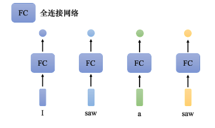

为了解决这个问题，可以考虑上下文信息，如下图所示，将每个向量的前后几个向量“串”起来一起输入到全连接网络。

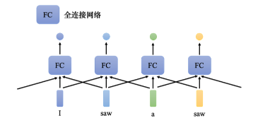

在语音识别中，不仅仅根据一个帧来判断其音标，而是结合该帧及其前后5个帧（共11个帧）来决定其音标，如图所示。然而，这种方法仍然有限，如果某个任务需要考虑整个序列的信息，那么需要一个更大的窗口，甚至覆盖整个序列。这不仅会导致参数量激增，还容易过拟合。

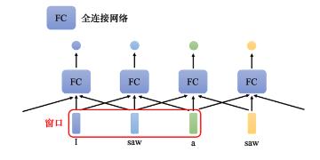

### 2、自注意力模型的优势

为更好地考虑整个输入序列的信息，可以使用自注意力模型。自注意力模型如图所示，它会处理整个序列的数据。输入几个向量，就输出相同数量的向量，这些向量考虑了整个序列的信息。

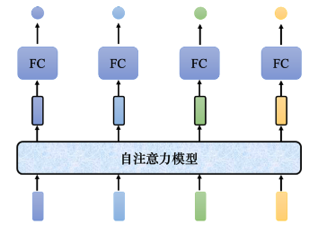

下图展示了自注意力模型可以多次叠加。自注意力模型的输出经过全连接网络后，再次应用自注意力模型，重新考虑整个输入序列的数据，得到最终结果。全连接网络和自注意力模型可以交替使用，前者专注于处理特定位置的信息，后者处理整个序列的信息。

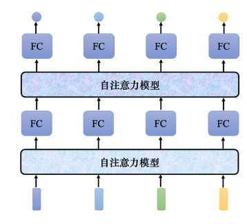

### 3、自注意力模型的工作原理

自注意力模型的输入是一组向量，记为 $\mathbf{a}$。这些向量可能是网络的输入，也可能是某个隐藏层的输出，因此用 $\mathbf{a}$ 而非 $\mathbf{x}$ 来表示。输入向量 $\mathbf{a}$ 经自注意力模型处理后输出一组向量 $\mathbf{b}$，每个输出向量 $\mathbf{b}_i$ 都是考虑了整个输入向量序列 $\mathbf{a}$ 生成的。具体来说，输出向量 $\mathbf{b}_1, \mathbf{b}_2, \mathbf{b}_3, \mathbf{b}_4$ 都是考虑了输入序列 $\mathbf{a}_1, \mathbf{a}_2, \mathbf{a}_3, \mathbf{a}_4$ 生成的。

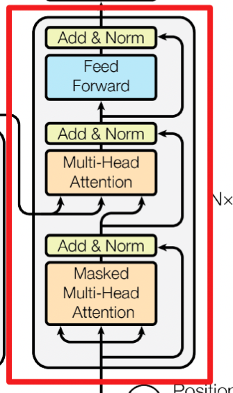

### 4、向量 $ b_1 $ 产生的过程

接下来介绍下向量 $ b_1 $ 产生的过程，了解产生向量 $ b_1 $ 的过程后，剩下向量 $ b_2 $、$ b_3 $、$ b_4 $ 产生的过程以此类推。怎么产生向量 $ b_1 $ 呢？

#### （1）第一步：计算关联性 α

自注意力模型的第一个步骤是根据 $\mathbf{a}_1$ 找出输入序列中与 $\mathbf{a}_1$ 相关的其他向量。为了实现这一目标，需要计算每个输入向量与 $\mathbf{a}_1$ 的关联程度，用数值 $\alpha$ 来表示。

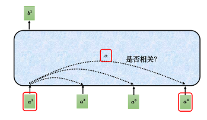

#### （2）第二步：计算注意力分数 $\alpha$

计算注意力分数 $\alpha$ 的方法之一是使用点积（dot product）。如图 (a) 所示：

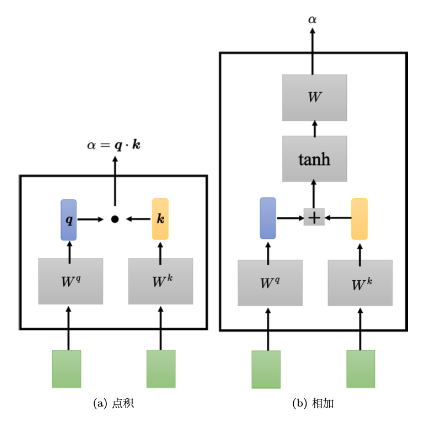

**Step1：计算查询和键**：

- 输入向量 $\mathbf{a}_1$ 乘以矩阵 $\mathbf{W}_q$ 得到查询向量 $\mathbf{q}_1$。

- 输入向量 $\mathbf{a}_2, \mathbf{a}_3, \mathbf{a}_4$ 分别乘以矩阵 $\mathbf{W}_k$ 得到键向量 $\mathbf{k}_2, \mathbf{k}_3, \mathbf{k}_4$。

**Step2：计算点积**：

- $\mathbf{q}_1$ 与 $\mathbf{k}_2$ 做点积，得到注意力分数 $\alpha_{1,2}$。
- $\mathbf{q}_1$ 与 $\mathbf{k}_3$ 做点积，得到注意力分数 $\alpha_{1,3}$。
- $\mathbf{q}_1$ 与 $\mathbf{k}_4$ 做点积，得到注意力分数 $\alpha_{1,4}$。

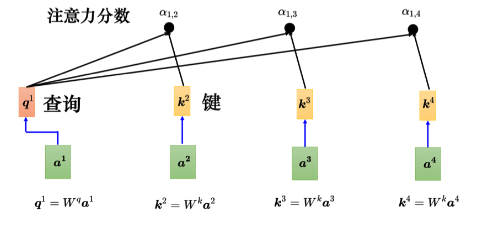

这些点积操作用公式表示为：
$$
\alpha_{1,2} = \mathbf{q}_1 \cdot \mathbf{k}_2
$$
$$
\alpha_{1,3} = \mathbf{q}_1 \cdot \mathbf{k}_3
$$
$$
\alpha_{1,4} = \mathbf{q}_1 \cdot \mathbf{k}_4
$$

在实践中，$\mathbf{a}_1$ 也会与自己计算关联性：
$$
\alpha_{1,1} = \mathbf{q}_1 \cdot \mathbf{k}_1
$$

#### （3）第三步：归一化 $\alpha$

计算完所有的 $\alpha$ 后，对它们进行归一化操作，一般使用softmax函数，如下式：
$$
\alpha'_{1,i} = \frac{\exp(\alpha_{1,i})}{\sum_j \exp(\alpha_{1,j})}
$$

softmax 操作将原始的 $\alpha$ 转换为 $\alpha'$，使得 $\alpha'$ 的值在0到1之间，且所有 $\alpha'$ 的和为1。

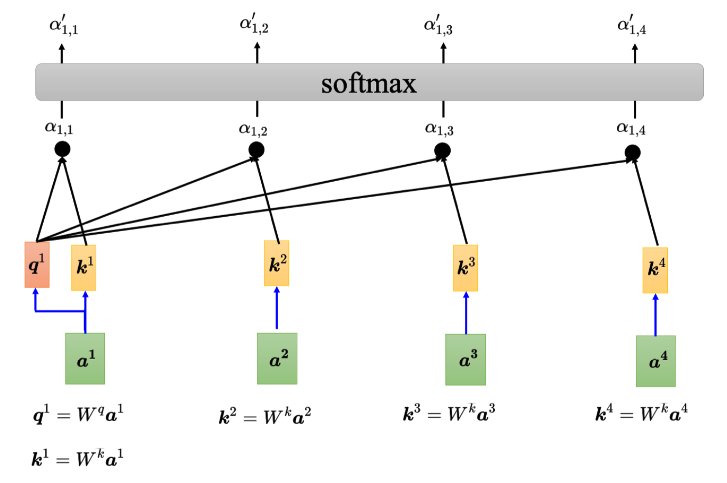

#### （4）第四步：加权求和

根据归一化后的 $\alpha'$，计算输出向量 $\mathbf{b}_1$。具体步骤如下：

**Step1：计算值向量**：

输入向量 $\mathbf{a}_1, \mathbf{a}_2, \mathbf{a}_3, \mathbf{a}_4$ 分别乘以矩阵 $\mathbf{W}_v$，得到值向量 $\mathbf{v}_1, \mathbf{v}_2, \mathbf{v}_3, \mathbf{v}_4$。

**Step2：加权求和**：

将每个值向量 $\mathbf{v}$ 乘以对应的注意力分数 $\alpha'$，再将它们加权求和得到输出向量 $\mathbf{b}_1$，如下式：
$$
\mathbf{b}_1 = \sum_i \alpha'_{1,i} \mathbf{v}_i
$$

假设 $\alpha'$ 的具体值如下：
$$
\alpha'_{1,1} = 0.1, \alpha'_{1,2} = 0.5, \alpha'_{1,3} = 0.2, \alpha'_{1,4} = 0.2
$$

则 $\mathbf{b}_1$ 的计算过程为：
$$
\mathbf{b}_1 = 0.1 \cdot \mathbf{v}_1 + 0.5 \cdot \mathbf{v}_2 + 0.2 \cdot \mathbf{v}_3 + 0.2 \cdot \mathbf{v}_4
$$

如果 $ a_1 $ 跟 $ a_2 $ 的关联性很强，即 $ \alpha'_{1,2} $ 的值很大。在做加权和（weighted sum）以后，得到的 $ b_1 $ 的值就可能会比较接近 $ v_2 $。所以谁的注意力分数最大，谁的 $ v $ 就会主导（dominant）抽出来的结果。

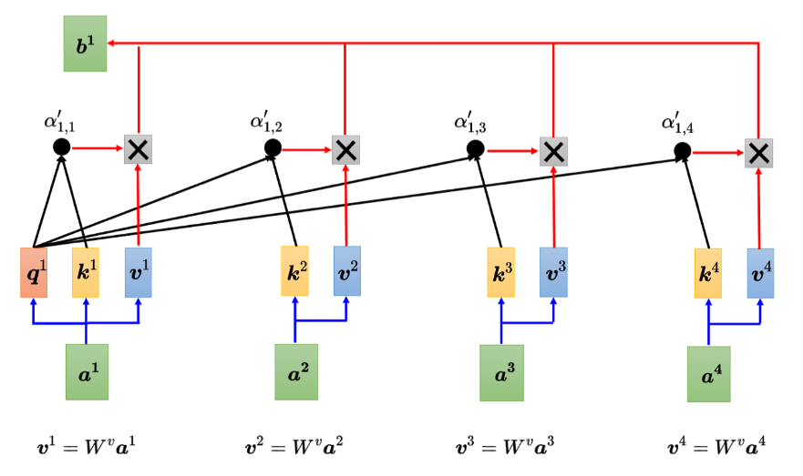

#### （5）生成向量 $\mathbf{b}_2, \mathbf{b}_3, \mathbf{b}_4$

生成向量 $\mathbf{b}_2, \mathbf{b}_3, \mathbf{b}_4$ 的过程与生成 $\mathbf{b}_1$ 的过程类似，只需将查询向量换为 $\mathbf{q}_2, \mathbf{q}_3, \mathbf{q}_4$，并重复上述步骤。

### 5、自注意力的矩阵乘法视角

自注意力模型的输入是一组向量，记为 $\mathbf{a}$。这些向量可能是网络的输入，也可能是某个隐藏层的输出。输入向量 $\mathbf{a}$ 经自注意力模型处理后输出一组向量 $\mathbf{b}$，每个输出向量 $\mathbf{b}_i$ 都是考虑了整个输入向量序列 $\mathbf{a}$ 生成的。现在已经知道 $\mathbf{a}_1$ 到 $\mathbf{a}_4$，每一个 $\mathbf{a}$ 都要分别产生查询向量 $\mathbf{q}$、键向量 $\mathbf{k}$ 和值向量 $\mathbf{v}$。例如，$\mathbf{a}_1$ 要产生 $\mathbf{q}_1$、$\mathbf{k}_1$、$\mathbf{v}_1$，$\mathbf{a}_2$ 要产生 $\mathbf{q}_2$、$\mathbf{k}_2$ 和 $\mathbf{v}_2$，以此类推。如果要用矩阵运算表示这个操作，每一个 $\mathbf{a}_i$ 都乘上一个矩阵 $\mathbf{W}_q$ 得到 $\mathbf{q}_i$。这些不同的 $\mathbf{a}$ 可以合起来当作一个矩阵。

#### （1）生成查询、键和值向量的矩阵运算

假设 $\mathbf{a}_1$ 到 $\mathbf{a}_4$ 拼起来形成一个矩阵 $\mathbf{I}$，矩阵 $\mathbf{I}$ 有四列，它的列就是自注意力的输入：$\mathbf{a}_1$ 到 $\mathbf{a}_4$。将矩阵 $\mathbf{I}$ 乘上矩阵 $\mathbf{W}_q$ 得到查询矩阵 $\mathbf{Q}$。$\mathbf{W}_q$ 是网络的参数，$\mathbf{Q}$ 的四个列就是 $\mathbf{q}_1$ 到 $\mathbf{q}_4$。

产生键和值向量的操作与查询向量的操作相同，$\mathbf{a}$ 乘上 $\mathbf{W}_k$ 就会得到键向量 $\mathbf{k}$。把 $\mathbf{I}$ 乘上矩阵 $\mathbf{W}_k$ 就得到矩阵 $\mathbf{K}$，$\mathbf{K}$ 的四个列就是四个键向量：$\mathbf{k}_1$ 到 $\mathbf{k}_4$。同理，$\mathbf{I}$ 乘上矩阵 $\mathbf{W}_v$ 会得到矩阵 $\mathbf{V}$，$\mathbf{V}$ 的四个列就是四个值向量：$\mathbf{v}_1$ 到 $\mathbf{v}_4$。因此，把输入的向量序列分别乘上三个不同的矩阵可以得到查询、键和值向量。

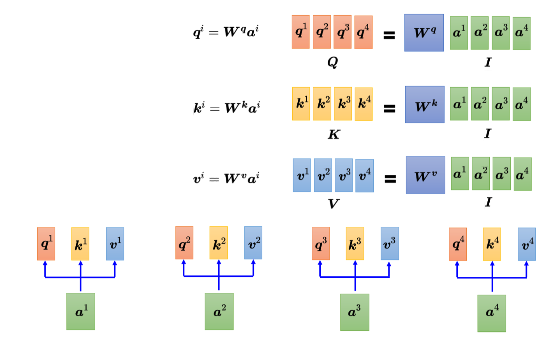

#### （2）计算注意力分数

下一步是每一个查询向量 $\mathbf{q}$ 都会与每一个键向量 $\mathbf{k}$ 计算内积，得到注意力分数，先计算 $\mathbf{q}_1$ 的注意力分数。如下图所示，如果从矩阵操作的角度来看注意力计算操作，把 $\mathbf{q}_1$ 与 $\mathbf{k}_1$ 做内积，得到 $\alpha_{1,1}$。$\mathbf{q}_1$ 乘上 $\mathbf{k}_1^T$ 也就是 $\mathbf{q}_1$ 与 $\mathbf{k}_1$ 做内积。同理，$\alpha_{1,2}$ 是 $\mathbf{q}_1$ 与 $\mathbf{k}_2$ 做内积，$\alpha_{1,3}$ 是 $\mathbf{q}_1$ 与 $\mathbf{k}_3$ 做内积，$\alpha_{1,4}$ 是 $\mathbf{q}_1$ 与 $\mathbf{k}_4$ 做内积。

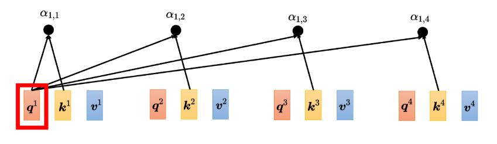

从矩阵操作的角度来看，这四个步骤的操作可以看作是矩阵与向量相乘。将 $\mathbf{k}_1^T$ 到 $\mathbf{k}_4^T$ 拼起来当作一个矩阵的四行，把这个矩阵乘上 $\mathbf{q}_1$ 可以得到注意力分数的矩阵，矩阵的每一行都是注意力的分数，即 $\alpha_{1,1}$ 到 $\alpha_{1,4}$。

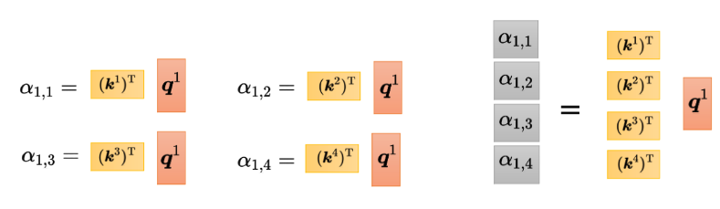

#### （3）计算所有查询向量的注意力分数

如下图所示，不只是 $\mathbf{q}_1$ 要对 $\mathbf{k}_1$ 到 $\mathbf{k}_4$ 计算注意力分数，$\mathbf{q}_2$ 也要对 $\mathbf{k}_1$ 到 $\mathbf{k}_4$ 计算注意力分数。我们把 $\mathbf{q}_2$ 也乘上 $\mathbf{k}_1$ 到 $\mathbf{k}_4$，得到 $\alpha_{2,1}$ 到 $\alpha_{2,4}$。现在的操作是一模一样的，把 $\mathbf{q}_3$ 乘 $\mathbf{k}_1$ 到 $\mathbf{k}_4$，把 $\mathbf{q}_4$ 乘上 $\mathbf{k}_1$ 到 $\mathbf{k}_4$ 可以得到注意力分数。

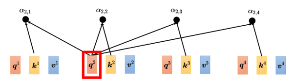

#### （4）矩阵乘法计算所有注意力分数

如下图所示，通过两个矩阵的相乘就可以得到注意力分数。一个矩阵的行是键向量 $\mathbf{k}$，即 $\mathbf{k}_1$ 到 $\mathbf{k}_4$。另一个矩阵的列是查询向量 $\mathbf{q}$，即 $\mathbf{q}_1$ 到 $\mathbf{q}_4$。将键向量矩阵 $\mathbf{K}^T$ 乘上查询向量矩阵 $\mathbf{Q}$ 就得到注意力分数矩阵 $\mathbf{A}$。假设 $\mathbf{K}$ 的列是 $\mathbf{k}_1$ 到 $\mathbf{k}_4$，在这里相乘的时候，需要对矩阵 $\mathbf{K}$ 做一下转置得到 $\mathbf{K}^T$。$\mathbf{K}^T$ 乘上 $\mathbf{Q}$ 就得到矩阵 $\mathbf{A}$，$\mathbf{A}$ 里面存的就是 $\mathbf{Q}$ 和 $\mathbf{K}$ 之间的注意力分数。

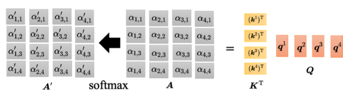

#### （5）对注意力分数做归一化

对注意力分数矩阵 $\mathbf{A}$ 进行归一化，例如使用softmax，对 $\mathbf{A}$ 的每一列做 softmax，使得每一列的值相加为1。softmax 不是唯一的选项，也可以选择其他操作，例如 ReLU，得到的结果也不会差。由于对 $\alpha$ 做 softmax 操作以后，得到的值不同于原始值，因此用 $\mathbf{A}'$ 表示通过 softmax 以后的结果。

#### （6）计算加权和

计算出 $\mathbf{A}'$ 以后，需要把 $\mathbf{v}_1$ 到 $\mathbf{v}_4$ 乘上对应的 $\alpha$ 再相加得到 $\mathbf{b}$。如果把 $\mathbf{v}_1$ 到 $\mathbf{v}_4$ 当成矩阵 $\mathbf{V}$ 的四个列拼起来，则把 $\mathbf{A}'$ 的第一个列乘上 $\mathbf{V}$ 就得到 $\mathbf{b}_1$，把 $\mathbf{A}'$ 的第二个列乘上 $\mathbf{V}$ 得到 $\mathbf{b}_2$，以此类推。也就是说，把矩阵 $\mathbf{A}'$ 乘上矩阵 $\mathbf{V}$ 得到矩阵 $\mathbf{O}$，$\mathbf{O}$ 里面的每一个列就是自注意力的输出 $\mathbf{b}_1$ 到 $\mathbf{b}_4$。

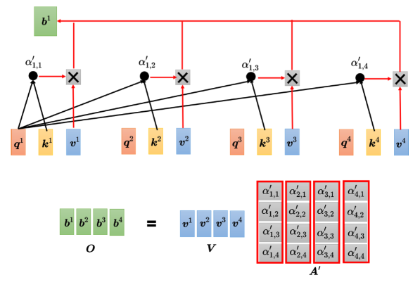

#### （7）整个自注意力的运作过程总结

如下图所示，自注意力的输入是一组向量，将这些向量拼接起来可以得到矩阵 $ I $。输入 $ I $ 分别乘上三个矩阵 $ W_q $、$ W_k $ 和 $ W_v $，得到三个矩阵 $ Q $、$ K $ 和 $ V $。
$$
I \times W_q = Q, \quad I \times W_k = K, \quad I \times W_v = V
$$
接下来，矩阵 $ Q $ 乘上 $ K^T $ 得到矩阵 $ A $。对矩阵 $ A $ 进行一些处理，可以得到 $ A' $，$ A' $ 称为注意力矩阵（attention matrix）。

$$
Q \times K^T = A
$$
把 $ A' $ 再乘上 $ V $ 就得到自注意力层的输出 $ O $。

$$
A' \times V = O
$$
自注意力的操作过程虽然较为复杂，但自注意力层里面唯一需要学习的参数就只有 $ W_q $、$ W_k $ 和 $ W_v $。只有 $ W_q $、$ W_k $、$ W_v $ 是未知的，需要通过训练数据来学习。其他的操作都没有未知的参数，都是人为设定好的，都不需要通过训练数据学习。

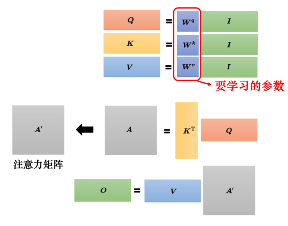

## 三、多头注意力

### 1、工作流程

自注意力有一个进阶的版本——**多头自注意力** (multi-head self-attention) 。多头自注意力的使用是非常广泛的，有一些任务，比如翻译、语音识别，用比较多的头可以得到比较好的结果。至于需要用多少的头，这又是另外一个超参数，也是需要调的。为什么会需要比较多的头呢？在使用自注意力计算相关性的时候，就是用 $$q$$ 去找相关的 $$k$$。但是相关有很多种不同的形式，所以也许可以有多个 $$q$$，不同的 $$q$$ 负责不同种类的相关性，这就是多头注意力。

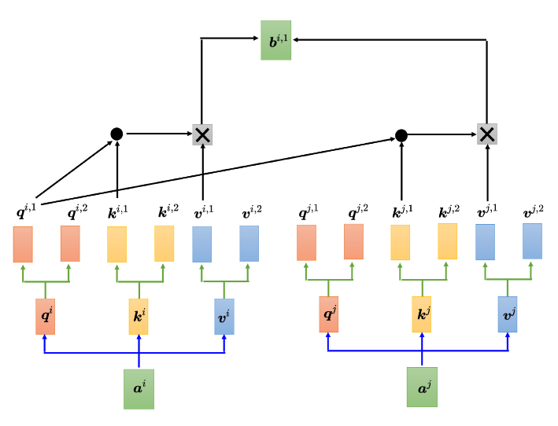

如上图所示，先把 $$\mathbf{a}$$ 乘上一个矩阵得到 $$q$$，接下来再把 $$q$$ 乘上另外两个矩阵，分别得到 $$q_{i,1}$$ 和 $$q_{i,2}$$。用两个上标，$$q_{i,1}$$ 和 $$q_{i,2}$$ 代表有两个头，$$i$$ 代表的是位置，$$1$$ 和 $$2$$ 代表是这个位置的第几个 $$q$$。这个问题里面有两种不同的相关性，所以需要产生两种不同的头来找两种不同的相关性。既然 $$q$$ 有两个，$$k$$ 也就要有两个，$$v$$ 也就要有两个。怎么从 $$q$$ 得到 $$q_{i,1}$$ 和 $$q_{i,2}$$，怎么从 $$k$$ 得到 $$k_{i,1}$$ 和 $$k_{i,2}$$，怎么从 $$v$$ 得到 $$v_{i,1}$$ 和 $$v_{i,2}$$？其实就是把 $$q$$、$$k$$、$$v$$ 分别乘上两个矩阵，得到不同的头。对另外一个位置也做一样的事情，另外一个位置在输入 $$\mathbf{a}$$ 以后，它也会得到两个 $$q$$、两个 $$k$$ 和两个 $$v$$。接下来怎么做自注意力呢，跟之前讲的操作是一模一样的，只是现在 $$1$$ 那一类的一起做，$$2$$ 那一类的一起做。也就是 $$q_{i,1}$$ 在算这个注意力的分数的时候，就不要管 $$k_{i,2}$$ 了，它就只管 $$k_{i,1}$$ 就好。$$q_{i,1}$$ 分别与 $$k_{i,1}$$、$$k_{j,1}$$ 算注意力，在做加权和的时候也不要管 $$v_{i,2}$$ 了，看 $$v_{i,1}$$ 和 $$v_{j,1}$$ 就好，把注意力的分数乘 $$v_{i,1}$$ 和 $$v_{j,1}$$，再相加得到 $$b_{i,1}$$，这边只用了其中一个头。

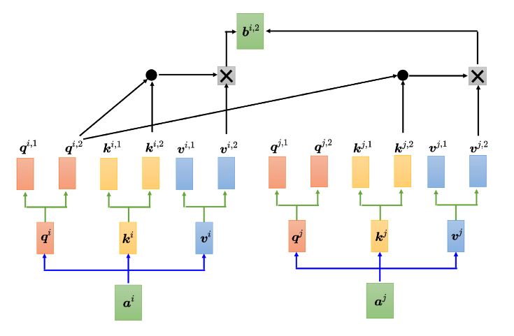

如上图 所示，我们可以使用另外一个头做相同的事情。$$q_{i,2}$$ 只对 $$k_{i,2}$$ 做注意力，在做加权和的时候，只对 $$v_{i,2}$$ 做加权和得到 $$b_{i,2}$$。如果有多个头，如 8 个头、16 个头，操作也是一样的。

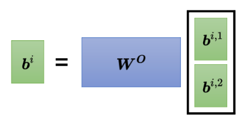

如上图所示，得到 $$b_{i,1}$$ 和 $$b_{i,2}$$，可能会把 $$b_{i,1}$$ 和 $$b_{i,2}$$ 接起来，再通过一个变换，即再乘上一个矩阵然后得到 $$b_i$$，再送到下一层去，这就是自注意力的变形——**多头自注意力**。

### 2、矩阵表示

#### （1）生成多个头的查询、键和值

**Step1：生成多个查询、键和值**：对于每一个输入向量 $ \mathbf{a} $，我们首先将其通过一个权重矩阵得到查询、键和值。然后将这些查询、键和值进一步分成多个“头”：
$$
\mathbf{Q} = \mathbf{a} \mathbf{W}_q \\

\mathbf{K} = \mathbf{a} \mathbf{W}_k \\ 

\mathbf{V} = \mathbf{a} \mathbf{W}_v \\
$$
其中，$\mathbf{W}_q$、$\mathbf{W}_k$、$\mathbf{W}_v$ 是用于生成查询、键和值的权重矩阵。

**Step2：将 $q$、$k$、$v$ 分成多个头**：假设我们使用 $h$ 个头，则我们将 $\mathbf{Q}$、$\mathbf{K}$、$\mathbf{V}$ 分成 $h$ 组，每组有对应的查询、键和值：

 
$$
 \mathbf{Q} = [\mathbf{q}_1, \mathbf{q}_2, \ldots, \mathbf{q}_h] \\
  
   \mathbf{K} = [\mathbf{k}_1, \mathbf{k}_2, \ldots, \mathbf{k}_h] \\
  
   \mathbf{V} = [\mathbf{v}_1, \mathbf{v}_2, \ldots, \mathbf{v}_h] \\
$$
   对于每个头 $i$：
$$
   \mathbf{q}_{i} = \mathbf{Q} \mathbf{W}_{q,i} \\
 
   \mathbf{k}_{i} = \mathbf{K} \mathbf{W}_{k,i} \\
 
   \mathbf{v}_{i} = \mathbf{V} \mathbf{W}_{v,i} \\
$$
   其中 $\mathbf{W}_{q,i}$、$\mathbf{W}_{k,i}$、$\mathbf{W}_{v,i}$ 是对应第 $i$ 个头的权重矩阵。

#### （2）计算每个头的自注意力

对每个头 $i$，计算注意力分数并进行加权平均，步骤如下：

**Step1：计算注意力分数**：对每个头 $i$，计算 $\mathbf{q}_{i}$ 和 $\mathbf{k}_{i}^T$ 的内积，得到注意力分数矩阵 $\mathbf{A}_{i}$：
$$
\mathbf{A}_{i} = \mathbf{q}_{i} \mathbf{k}_{i}^T
$$

**Step2：对注意力分数进行归一化**：对 $\mathbf{A}_{i}$ 的每一列应用 softmax 函数，得到归一化的注意力矩阵 $\mathbf{A}'_{i}$：
$$
\mathbf{A}'_{i} = \text{softmax}(\mathbf{A}_{i})
$$
**Step3：加权求和**：将归一化后的注意力矩阵 $\mathbf{A}'_{i}$ 乘以对应的值矩阵 $\mathbf{v}_{i}$，得到每个头的输出 $\mathbf{b}_{i}$：
$$
\mathbf{b}_{i} = \mathbf{A}'_{i} \mathbf{v}_{i}
$$
对于每个头 $i$，这一步骤可以表示为：
$$
\mathbf{b}_{i} = \text{Attention}(\mathbf{q}_{i}, \mathbf{k}_{i}, \mathbf{v}_{i})
$$

#### （3）将多个头的输出合并

将所有头的输出 $\mathbf{b}_{i}$ 进行拼接，然后通过一个线性变换矩阵得到最终的输出：

**Step1：拼接所有头的输出**：将 $\mathbf{b}_{1}$、$\mathbf{b}_{2}$、$\ldots$、$\mathbf{b}_{h}$ 拼接成一个大的矩阵 $\mathbf{B}$：
$$
\mathbf{B} = [\mathbf{b}_1, \mathbf{b}_2, \ldots, \mathbf{b}_h]
$$
**Step2：通过线性变换得到最终输出**：将 $\mathbf{B}$ 乘上一个线性变换矩阵 $\mathbf{W}_O$，得到最终的输出 $\mathbf{b}$：
$$
\mathbf{b} = \mathbf{B} \mathbf{W}_O
$$
其中，$\mathbf{W}_O$ 是一个用于整合所有头输出的线性变换矩阵。

## 四、位置编码

讲到位置编码之前，我们已经知道自注意力层缺少了一个可能很重要的信息——位置的信息。对一个自注意力层而言，每一个输入是出现在序列的最前面还是最后面，是完全没有这个信息的。有人可能会问：“输入不是有位置 1、2、3、4 吗？”但 1、2、3、4 是作图时为了帮助大家理解所标上的一个编号。对自注意力而言，位置 1、位置 2、位置 3 跟位置 4 没有任何差别，这四个位置的操作是一模一样的。对它来说，$$q_1$$ 跟 $$q_4$$ 的距离并没有特别远，1 跟 4 的距离并没有特别远，2 跟 3 的距离也没有特别近，对它来说就是“天涯若比邻”，所有的位置之间的距离都是一样的，没有谁在整个序列的最前面，也没有谁在整个序列的最后面。这可能会有一个问题：位置的信息被忽略了，而有时候位置的信息是很重要的。例如，在做词性标注时，我们知道动词比较不容易出现在句首，如果某一个词汇放在句首的，它是动词的可能性就比较低。位置的信息往往也是有用的。但到目前为止，自注意力的操作里面没有位置的信息。因此，在自注意力中，如果我们觉得位置的信息很重要，需要考虑位置信息时，就要用到**位置编码**（positional encoding）。

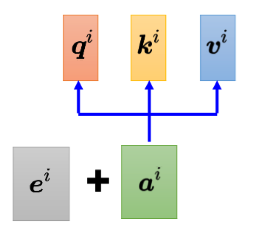

如上图所示，位置编码为每一个位置设定一个向量，即**位置向量**（positional vector）。位置向量用 $$\mathbf{e}_i$$ 来表示，上标 $$i$$ 代表位置，不同的位置就有不同的向量，每个位置都有一个专属的 $$\mathbf{e}_i$$。把 $$\mathbf{e}_i$$ 加到 $$\mathbf{a}_i$$ 上面就完成了。这相当于告诉自注意力位置的信息，如果看到 $$\mathbf{a}_i$$ 被加上 $$\mathbf{e}_i$$，它就知道现在出现的位置应该是在 $$i$$ 这个位置。

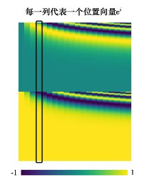

最早的 Transformer 论文《**Attention Is All You Need**》中使用的 $$\mathbf{e}_i$$ 如上图所示。图上每一列代表一个 $$\mathbf{e}_i$$，第一个位置就是 $$\mathbf{e}_1$$，第二个位置就是 $$\mathbf{e}_2$$，第三个位置就是 $$\mathbf{e}_3$$，以此类推。每一个位置的 $$\mathbf{a}_i$$ 都有一个专属的 $$\mathbf{e}_i$$。模型在处理输入时，可以知道现在的输入位置的信息。这个位置向量是人为设定的。人为设定的向量有很多问题，假设在定义这个向量时只定义到 128 维，但序列的长度是 129，该怎么办呢？在最早的《Attention Is All You Need》论文中，其位置向量是通过正弦函数和余弦函数产生的，从而避免了人为设定向量固定长度的尴尬，计算公式如下：
$$
 \mathbf{e}_i = [\sin(i/10000^{2j/d}), \cos(i/10000^{2j/d})] 
$$
其中，$$i$$ 是位置，$$j$$ 是维度，$$d$$ 是向量的维度。

> [!TIP]
>
> **Q**: 为什么要通过正弦函数和余弦函数产生向量？有其他选择吗？为什么一定要这样产生手工的位置向量呢？  
> **A**: 不一定要通过正弦函数和余弦函数来产生向量，我们可以提出新的方法。此外，不一定要这样产生手工的向量，位置编码仍然是一个尚待研究的问题，甚至位置编码是可以根据数据学习出来的。有关位置编码的更多信息，可以参考论文《**Learning to Encode Position for Transformer with Continuous Dynamical Model**》，该论文比较了不同的位置编码方法并提出了新的位置编码。

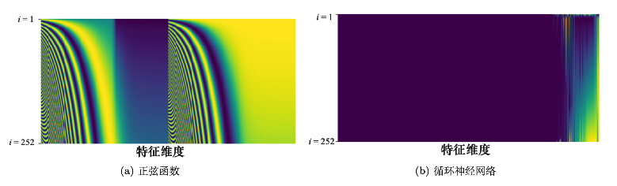

如上图（a）所示，最早的位置编码是通过正弦函数产生的，图中的每一行代表一个位置向量。图（b）所示，位置编码还可以使用循环神经网络生成。总之，位置编码可以通过各种不同的方法产生。目前还不知道哪一种方法最好，这是一个尚待研究的问题。因此，不必纠结于为什么正弦函数最好，我们永远可以提出新的做法。

## 五、截断自注意力

自注意力的应用非常广泛，在自然语言处理（Natural Language Processing, NLP）领域，除了 Transformer，BERT 也使用了自注意力。因此，自注意力在自然语言处理中的应用是大家较为熟悉的。然而，自注意力不仅限于自然语言处理，它也可以应用于许多其他领域。例如，在语音处理任务中，也可以使用自注意力。但在将自注意力用于语音处理时，可以对其进行一些改动。

举个例子，如果要把一段声音信号表示成一组向量，这些向量可能会非常长。在进行语音识别时，把声音信号表示成一组向量，每一个向量只代表 10 毫秒的音频长度。所以，如果是 1 秒钟的声音信号，就有 100 个向量；5 秒钟的声音信号就有 500 个向量。随便说一句话，就可能产生上千个向量。因此，描述一段声音信号的向量序列长度通常是非常大的。

**非常大的长度会造成什么问题呢？**

在计算注意力矩阵时，其复杂度是向量序列长度的平方。假设该矩阵的长度为 $$L$$，计算注意力矩阵 $$A'$$ 需要进行 $$L \times L$$ 次内积运算。如果 $$L$$ 的值很大，计算量就非常庞大，并且需要很大的内存（memory）来存储该矩阵。比如，在语音识别中，处理一句话可能产生的注意力矩阵可能会太大，以至于不易处理和训练。

**截断自注意力（Truncated Self-Attention）** 可以处理向量序列长度过大的问题。具体而言，截断自注意力在计算时不考虑整个句子，而是只关注一个小的范围，这个范围是人工设定的。在进行语音识别时，如果要辨识某个位置的音标或内容，实际上并不需要考虑整句话的所有信息，只需要关注该位置及其前后一定范围内的信息即可。

通过这种方式，截断自注意力能够加快运算速度，使得处理长序列时变得更加高效。这就是截断自注意力的主要思想和应用。

## 六、自注意力与卷积神经网络对比

自注意力不仅可以用于自然语言处理（NLP）任务，也可以应用于图像处理任务。下面我们将对自注意力和卷积神经网络（CNN）进行比较，重点介绍它们在图像处理中的应用以及各自的优缺点。

### 1、自注意力在图像上的应用

自注意力不仅适用于 NLP 领域，也可以用在图像上。如下图（a）所示，一张分辨率为 $$5 \times 10$$ 的图像（下图（b））可以表示为一个大小为 $$5 \times 10 \times 3$$ 的张量（下图（b）），其中 3 代表 RGB 三个通道（channel）。每一个位置的像素可以看作是一个三维向量，因此整张图像可以看作是 $$5 \times 10$$ 个向量的序列。因此，图像也可以被视为一个向量序列，完全可以使用自注意力机制来处理图像。

自注意力在图像处理中的应用可以参考以下论文：
- **“Self-Attention Generative Adversarial Networks”**
- **“End-to-End Object Detection with Transformers”**

### 2、自注意力与卷积神经网络的对比

自注意力与卷积神经网络之间有一些关键的差异和联系。

上图（a）展示了使用自注意力处理图像时的场景，假设红色框内的“1”是当前要处理的像素，这个像素会产生查询（query），其他像素产生键（key）。在进行内积运算时，考虑的是整张图像的信息。

上图（b）展示了卷积神经网络（CNN）处理图像的方式。在 CNN 中，每一个滤波器（filter）或神经元只考虑其感受野（receptive field）范围内的信息。

通过比较，我们可以看到：
- **卷积神经网络（CNN）**：可以看作是自注意力的一个简化版本，因为它只考虑感受野内的信息。感受野的大小是人为设定的。
- **自注意力**：考虑整个图像的信息，感受野的形状由网络自动决定。因此，自注意力具有更高的灵活性和表达能力。

在自注意力中，感受野的范围不是固定的，而是由网络学习得出的。这使得自注意力能够自动选择要关注的像素，而不是依赖于人工设定的感受野大小。

**关于自注意力与卷积神经网络的关系**，可以参考以下论文：
- **“On the Relationship between Self-attention and Convolutional Layers”**：这篇论文使用数学方法严谨地说明了卷积神经网络是自注意力的特例。

自注意力可以通过设计和限制变成卷积神经网络，因此自注意力可以被看作是比卷积神经网络更灵活的模型，而卷积神经网络则是受限制的自注意力。

### 3、自注意力与卷积神经网络的实际应用

**谷歌的论文 “An Image is Worth 16x16 Words: Transformers for Image Recognition at Scale”** 中，将自注意力应用于图像处理，将一张图像划分为 $$16 \times 16$$ 个图像块（patch），每个图像块被看作是一个“字”（word）。下图展示了训练数据量对自注意力和卷积神经网络效果的影响。

- **数据量少**时：卷积神经网络可能表现更好。
- **数据量多**时：自注意力的效果会逐渐超越卷积神经网络。

上图中展示了不同训练数据量下自注意力与卷积神经网络的表现：
- **浅蓝色线**：自注意力的效果
- **深灰色线**：卷积神经网络的效果

随着数据量的增加，自注意力的效果逐渐优于卷积神经网络，但在数据量少的情况下，卷积神经网络可能会有更好的效果。自注意力由于其更大的弹性，需要更多的训练数据来避免过拟合。

### 4、自注意力与卷积神经网络的选择

**Q: 自注意力与卷积神经网络应该选哪一个？**

**A:** 实际上可以同时使用自注意力和卷积神经网络。例如，在 **Conformer** 结构中，结合了自注意力和卷积神经网络的优点来完成任务。

## 七、自注意力与循环神经网络对比

我们来比较一下自注意力机制与循环神经网络（RNN）。当前，循环神经网络的很多应用都可以用自注意力机制来取代。自注意力机制和循环神经网络都用于处理输入是一个序列的状况。

### 1、循环神经网络（RNN）

在循环神经网络中，输入序列经过一个隐状态的向量进行处理，然后通过一个RNN块来生成新的隐状态向量，最终这些隐状态向量被输入到全连接网络中进行预测。在RNN中，隐状态存储了历史信息，可以看作一种记忆。每当新的向量作为输入时，前一个时间点的输出也会作为输入参与到当前的计算中。具体来说，输入第二个向量时，前一个时间点的输出会与当前的输入一起被送入RNN进行处理；输入第三个向量时，当前的输入和前一个时间点的输出再次一起被处理，依此类推，直到处理完所有的输入向量。这样，RNN逐步处理整个序列，从而产生最终的输出。

### 2、自注意力机制

自注意力机制则不同于RNN。在自注意力机制中，输入的每一个向量都会考虑整个输入序列中的所有其他向量的信息。具体来说，自注意力机制计算查询（Query）、键（Key）和值（Value）之间的关系来生成每一个位置的新表示。每个位置的表示都包含了对整个序列的关注信息，然后这些信息被送入全连接网络进行处理。自注意力机制的显著特点是它能够同时处理整个序列的信息，从而高效地捕捉到序列中各个位置之间的关系。

### 3、自注意力与RNN的主要区别

自注意力机制和RNN在处理序列数据时有着显著的不同。首先，自注意力机制在生成每一个向量时考虑了整个输入序列的信息，而RNN中的每一个隐状态向量只考虑了之前输入的向量信息，没有直接考虑未来的信息。然而，RNN可以通过双向RNN（Bi-RNN）来考虑整个输入序列的信息，但即使是双向RNN，其信息传递仍然是逐步进行的，因此在处理长序列时可能会遇到信息遗忘的问题。

自注意力机制则没有这种问题。它通过计算全局的注意力分数，能够从整个输入序列中提取信息，理论上可以从很远的位置获取信息，这使得它在处理长距离依赖问题时表现得更为高效。

### 4、计算复杂度与并行处理

计算复杂度是自注意力机制与RNN之间的另一个重要区别。RNN的计算是逐步进行的，这意味着它在处理序列数据时无法进行并行计算，因此在长序列上计算速度较慢。自注意力机制则可以对整个序列进行并行处理，这使得它在运算速度上通常比RNN更为高效。

具体来说，RNN的计算复杂度为 $O(T)$，其中 $T$ 是序列的长度。而自注意力机制的计算复杂度为 $O(T²)$，因为它需要计算序列中所有位置对之间的关系。在空间复杂度方面，自注意力机制需要存储整个注意力矩阵，因此在处理大规模数据时可能会面临较高的内存需求。

### 5、自注意力在图中的应用

自注意力机制不仅可以应用于序列数据，也可以扩展到图数据中。在图中，每一个节点可以表示成一个向量，边则表示节点之间的关系。当把自注意力机制应用于图数据时，我们可以利用图的边来直接定义节点之间的关系，而不需要依靠网络自行学习这些关系。在计算注意力矩阵时，只需要考虑有边相连的节点之间的关系，而将没有边的节点之间的注意力分数设为0。这样的自注意力应用于图数据时，实际上就是一种图神经网络（GNN）。

例如，在一个图中，节点1只与节点5、6、8相连，因此只需要计算节点1与节点5、节点6、节点8之间的注意力分数；节点2只与节点3相连，因此只需要计算节点2与节点3之间的注意力分数，以此类推。这种方法可以利用领域知识来简化自注意力计算过程，从而提高计算效率。

### 6、自注意力机制的变种与未来方向

自注意力机制有很多变种，旨在优化其计算效率和扩展能力。论文 **“Long Range Arena: A Benchmark for Efficient Transformers”** 比较了各种自注意力的变种，例如 **Linformer**、**Performer** 和 **Reformer**。这些变种通常在减少计算复杂度方面有所改进，但可能在性能上稍逊于原始的自注意力机制。

**Linformer** 通过低秩矩阵来逼近注意力矩阵，从而提高计算效率。**Performer** 采用近似计算方法来降低计算复杂度。**Reformer** 通过稀疏注意力和可逆层来减少计算资源需求。除此之外，还有各种新的 **xxformer** 变种，这些新型变种通常具有较高的计算速度，但可能在性能上有所妥协。了解这些变种的最新进展可以参考 **“Efficient Transformers: A Survey”** 这篇综述文章。