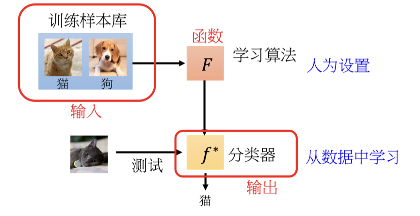
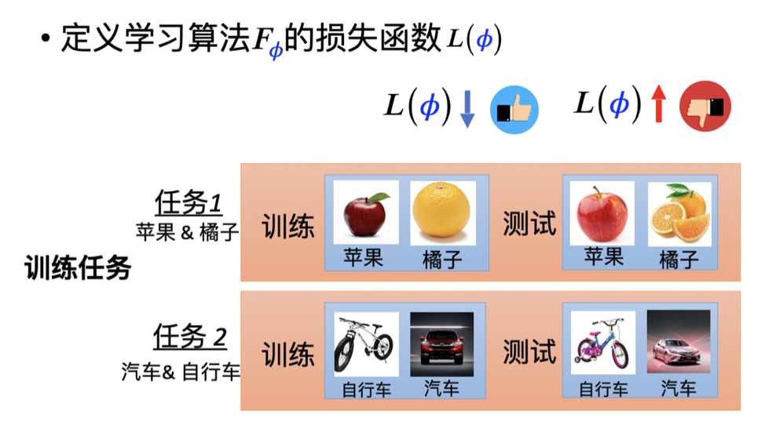

## 一、元学习的概念

元学习（meta learning）指的是“学习如何学习”。传统的深度学习需要不断调整超参数和网络架构，而没有有效的方法来调整这些超参数。工业界通常通过购买大量GPU来同时训练多个模型，选择效果最好的模型。但在学术界，由于资源有限，需要依靠经验和直觉调整超参数，这种方法费时费力。因此，元学习应运而生，让机器自己调整超参数，学习最优模型和网络架构。

元学习的本质是找到一个函数 $F$，输入一个数据集，输出一个训练好的模型。如果训练的是分类器，这个函数 $F$ 的输入是训练数据集，输出是分类器函数 $f$。$f$ 的输入是一张图片，输出是分类结果。元学习的目标是找到一个函数 $F$，使得 $f$ 的损失最小。整个元学习框架如下图所示。

## 二、元学习的三个步骤

### 1、第一步：学习算法中的要素

在元学习中，学习算法需要一些可以被学习的要素，比如网络架构、初始化参数和学习率等，这些要素统称为 $\phi$。与传统机器学习中的参数 $\theta$ 类似，元学习算法表示为 $F_\phi$，表示算法中有一些未知参数。

不同的元学习方法会学习模型的不同成分，因此形成了不同的元学习方法。

### 2、第二步：设定损失函数

损失函数 $L(\phi)$ 决定学习算法的好坏。$L(\phi)$ 的值越小，算法性能越好。元学习的损失函数来自训练任务。假设有两个任务：任务一是分辨苹果和橘子，任务二是分辨自行车和汽车。每个任务都有训练数据和测试数据。

在元学习中，损失函数 $L$ 的定义是基于任务的。假设 $f_{\theta_1^*}$ 是任务一（分类苹果和橘子）的分类器，通过训练数据学习得到。测试数据的分类效果决定了 $L(\phi)$ 的值。同理，任务二也有相应的分类器 $f_{\theta_2^*}$。

元学习中的损失函数 $L(\phi)$ 是多个任务损失的总和。例如，有 $N$ 个任务时，总损失为：
$$
L(\phi) = L_1(\phi) + L_2(\phi) + \cdots + L_N(\phi)
$$

### 3、第三步：优化损失函数

目标是找到一个 $\phi$ 使得 $L(\phi)$ 最小，定义为 $\phi^*$。可以通过梯度下降、强化学习或进化算法等方法来优化 $\phi$。最终得到的学习算法 $F_{\phi^*}$ 就是我们的元学习算法。

### 总结

元学习的三个步骤如图15.5所示：

1. 收集由多个任务组成的训练数据，每个任务有训练数据和测试数据。
2. 根据训练数据通过三个步骤得到学习算法 $F_{\phi^*}$。
3. 用学习算法 $F_{\phi^*}$ 在测试任务中进行测试，测试任务中的训练数据用于学习分类器，测试数据用于验证分类效果。

### 元学习与小样本学习

小样本学习希望机器只需少量样本就能学会分类，而元学习提供了实现小样本学习的算法。这两者关系密切，元学习的算法常用于小样本学习。