## 一、前馈神经网络

对于前馈神经网络，我们可以将简化后的网络结构如下图表示：

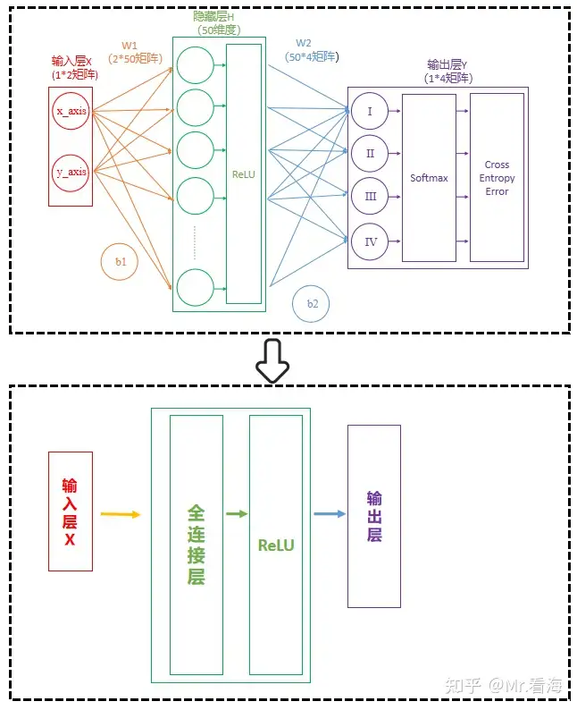

当然，【全连接层-ReLU】可以有多个，此时网络结构可以表示为：

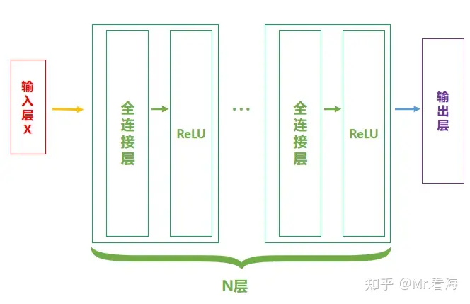

## 二、CNN网络结构

卷积神经网络（Convolutional Neural Networks, CNNs）是一种深度学习模型，广泛应用于图像和视频识别、图像分类、医疗图像分析等领域。CNNs 的独特结构使它们能够高效地处理具有网格结构的数据（例如图像）。

简单地说，CNN就是在前馈神经网络的基础上，将全连接层换成卷积层，并在ReLU层之后加入池化层（非必须），那么一个基本的CNN结构就可以表示成这样：

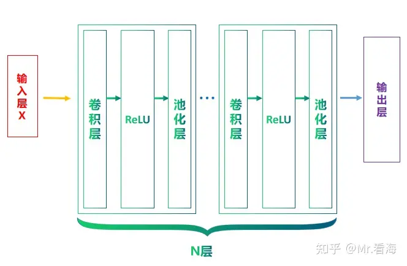

## 三、卷积层（Convolutional Layer）

### 1、为什么用卷积

在探讨卷积神经网络（CNN）为什么在处理图像信息时比传统的前馈神经网络（Feedforward Neural Network, FNN）更有效时，我们需要考虑几个关键因素：参数数量、空间结构表达、平移不变性，以及抽象层级表征。这些因素都与卷积操作的特性密切相关。

#### （1）参数太多

**问题：**假设我们有一个100x100像素的单通道灰度图像。在传统的前馈神经网络中，如果第一层是一个全连接层（Fully Connected Layer），每个神经元将与所有10000个输入像素连接。因此，如果第一层有1000个神经元，光这一层就有1000万个参数（权重）。

**解决方法：**卷积神经网络通过卷积操作显著减少了参数数量。卷积层使用的卷积核（例如3x3或5x5的过滤器）在整个图像上滑动，每个卷积核仅有少量参数。权重共享机制使得一个卷积核在整个图像区域内应用相同的权重，从而大幅减少了参数数量。例如，使用10个3x3的卷积核，其参数总数为90，比全连接层少得多。

#### （2）空间结构表达

**问题：**图像具有重要的空间结构信息。相邻像素在语义上通常更相关。传统的前馈神经网络在处理图像数据时，会将二维的图像展开成一个一维向量，这种展开方式破坏了图像的空间结构，使得网络难以捕捉局部的空间关系。

**解决方法：**卷积操作能够自然地处理二维图像。卷积核在图像上滑动时，可以提取局部的空间特征，保留了相邻像素之间的空间关系。因此，CNN能够更好地捕捉图像中的局部模式，例如边缘、角点等。

#### （3）平移不变性

**问题：**在图像识别任务中，对象出现在图像中的具体位置并不重要，关键在于能否识别出对象的特征。传统的前馈神经网络对输入的具体位置非常敏感，难以实现平移不变性。

**解决方法：**卷积神经网络通过权重共享和池化操作实现了平移不变性。权重共享意味着同一个卷积核在图像的不同位置检测相同的特征，这使得网络能够在图像的任何位置检测到相同的特征。而池化操作（例如最大池化）则进一步减少了特征图的尺寸，保留了最显著的特征，增强了网络的平移不变性。

#### （4）抽象层级表征

**问题：**图像数据通常需要多层次的特征提取，从低级的边缘特征到高级的语义特征。传统的前馈神经网络难以有效地捕捉和表征这种多层次的特征。

**解决方法：**卷积神经网络通过多个卷积层和池化层的叠加，可以逐层提取特征。最初的卷积层可能提取简单的边缘和纹理特征，而后续的卷积层则可以逐渐提取更加复杂的模式和语义信息。这种逐层抽象的特性使得CNN特别适合处理图像数据。

#### （5）总结

卷积神经网络之所以在处理图像时比传统的前馈神经网络更有效，主要是因为卷积操作能更好地处理图像的空间结构、减少参数数量、实现平移不变性以及逐层提取抽象特征。这些特性使得CNN能够高效地学习和表征图像中的复杂模式，是其在图像识别和处理任务中广泛应用的关键原因。

### 2、卷积

卷积层是 CNN 的核心构建块，其主要目的是通过局部感受野来提取输入数据的局部特征。卷积层包含多个过滤器（也称为卷积核），每个过滤器都在输入数据上滑动，并执行点积运算以生成特征映射（feature map）。

#### （1）基本概念

**卷积核（Filter or Kernel）**：一个小尺寸的矩阵，通常为 3x3 或 5x5。卷积核的参数是需要学习的权重。中间的矩阵就是所谓的**卷积核**。

**步幅（Stride）**：卷积核在输入数据上滑动的步长。较大的步幅会减少特征映射的尺寸。

**填充（Padding）**：在输入数据的边缘添加额外的像素，以保持输出特征映射的尺寸。常见的填充方式有零填充（zero padding）。

#### （2）卷积运算过程

**Step1：定义一个卷积核**：卷积核是一个小的矩阵（例如3x3或5x5），包含一些数字。这个卷积核的作用是在图像中识别特定类型的特征，例如边缘、线条等，也可能是难以描述的抽象特征。

**Step2：卷积核滑过图像**：卷积操作开始时，卷积核会被放置在图像的左上角。然后，它会按照一定的步长（stride）在图像上滑动，可以是从左到右，也可以是从上到下。步长定义了卷积核每次移动的距离。

**Step3：计算点积**：在卷积核每个位置，都会计算卷积核和图像对应部分的点积。这就是将卷积核中的每个元素与图像中对应位置的像素值相乘，然后将所有乘积相加。

**Step4：生成新的特征图**：每次计算的点积结果被用来构建一个新的图像，也称为特征图或卷积图。

**Step5：重复以上过程**：通常在一个 CNN 中，我们会有多个不同的卷积核同时进行卷积操作。这意味着我们会得到多个特征图，每个特征图捕捉了原始图像中的不同特征。

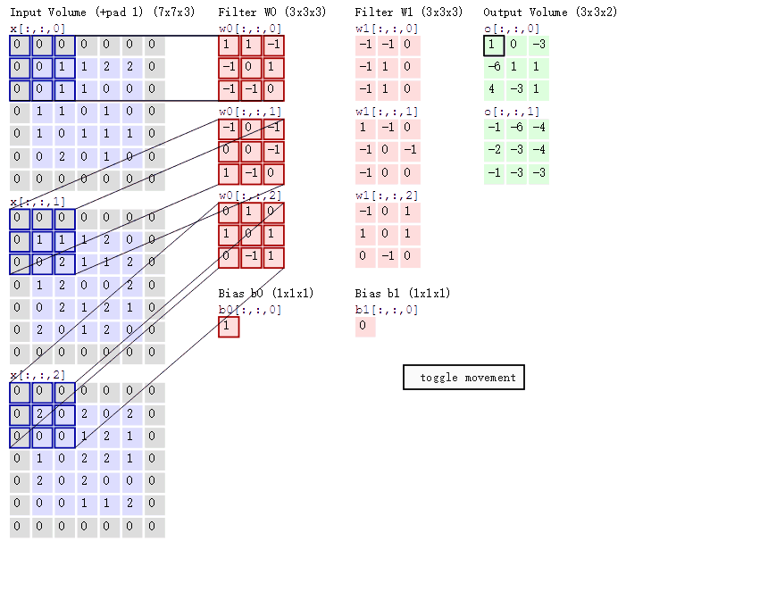

#### （3）卷积核的取值如何影响特征输出

现在我们使用MNIST数据集作为案例。MNIST是一个很有名的手写数字识别数据集。对于每张照片，都是以一个28*28的矩阵存储的。

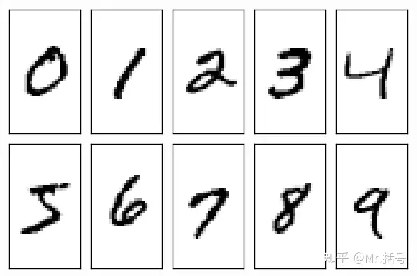

现在我们从数据集中随便选一个数字8，并进行卷积运算。这个卷积计算过程如下图（其中灰度深浅代表了数值大小）：

这里我们选三种不同的卷积核看一下：

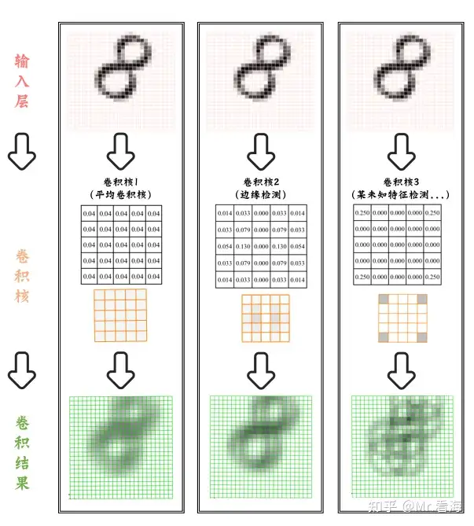

上述使用了三种不同的卷积核，**第一种卷积核**所有元素值相同，所以它可以计算输入图像在卷积核覆盖区域内的平均灰度值。这种卷积核可以平滑图像，消除噪声，但会使图像变得模糊。**第二种卷积核**可以检测图像中的边缘，可以看到输入的8的边缘部分颜色更深一些，在更大的图片中这种边缘检测的效果会更明显。**第三种卷积核**的四个角的权重为0.25，这是我随意赋的值，得到的结果像是几个窄窄的8重叠起来了。

需要注意的是，虽然上边说道不同的卷积核有着不同的作用，但是在卷积神经网络中，**卷积核并不是手动设计出来的，而是通过数据驱动的方式学习得到的**。这就是说，我们并不需要人工设计出特定的卷积核来检测边缘、纹理等特定的特征，而是让模型自己从训练数据中学习这些特征，即模型可以自动从复杂数据中学习到抽象和复杂的特征，这些特征可能人工设计难以达到。

### 3、步长（Stride）

在卷积神经网络（CNN）中，"步长"（stride）是一个重要的概念。步长描述的是在进行卷积操作时，卷积核在输入数据上移动的距离。在两维图像中，步长通常是一个二元组，分别代表卷积核在垂直方向（高度）和水平方向（宽度）移动的单元格数。

例如，步长为1意味着卷积核在每次移动时，都只移动一个单元格，这就意味着卷积核会遍历输入数据的每一个位置；同理，如果步长为2，那么卷积核每次会移动两个单元格。

下图是步长为3时的卷积运算过程。

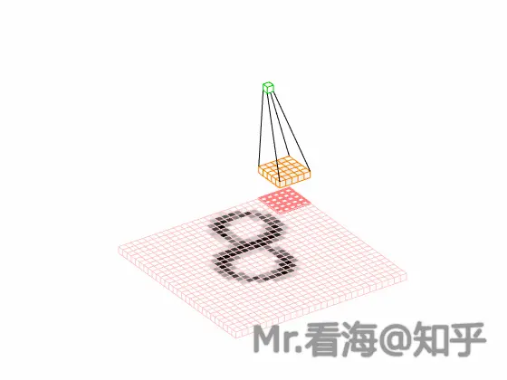

步长的选择会影响卷积操作的输出尺寸。更大的步长会产生更小的输出尺寸，反之同理。

之所以设置步长，主要考虑以下几点：

- **降低计算复杂性**：当步长大于1时，卷积核在滑动过程中会"跳过"一些位置，这将减少输出的尺寸并降低后续层的计算负担。
- **模型的可扩展性**：增大步长可以有效地降低网络层次的尺寸，使得模型能处理更大尺寸的输入图片。
- **控制过拟合**：过拟合是指模型过于复杂，以至于开始"记住"训练数据，而不是"理解"数据中的模式。通过减少模型的复杂性，我们可以降低过拟合的风险。
- **减少存储需求**：更大的步长将产生更小的特征映射，因此需要更少的存储空间。

### 4、零填充（zero-padding）

不知道大家注意到没有，在下图中，输入的$28*28$维矩阵在进行卷积计算之后，维度降为了$24*24$，是因为啥呢？

从下图可以比较清楚地看出，卷积核从左上角开始扫描时，每条边只能滑动三次。如果定义输入层的边长是$M$，卷积核的边长是$K$，那么卷积后输出的边长是$M-K+1$。

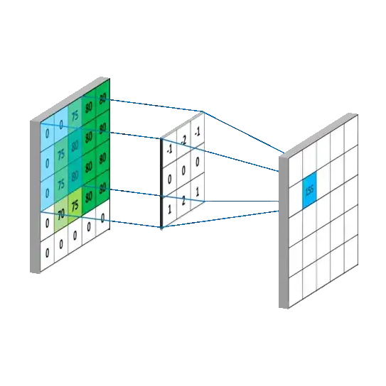

所以从上边公式看出来，数据在进行卷积运算之后尺寸会缩小。众所周知，CNN是一种深度学习网络，包含很多个卷积层，那么这样一直算到后边，尺寸岂不是要变成1了？

即使没有变成1，过小的数据尺寸也会导致信息的丢失。

对此，解决办法就是在输入数据进行卷积运算前，在四周补充一圈（或多圈）数字，通常补充的是0，所以就叫“零填充”。下图中补充后的数据再进行卷积，计算结果就能保持5*5的维度啦。

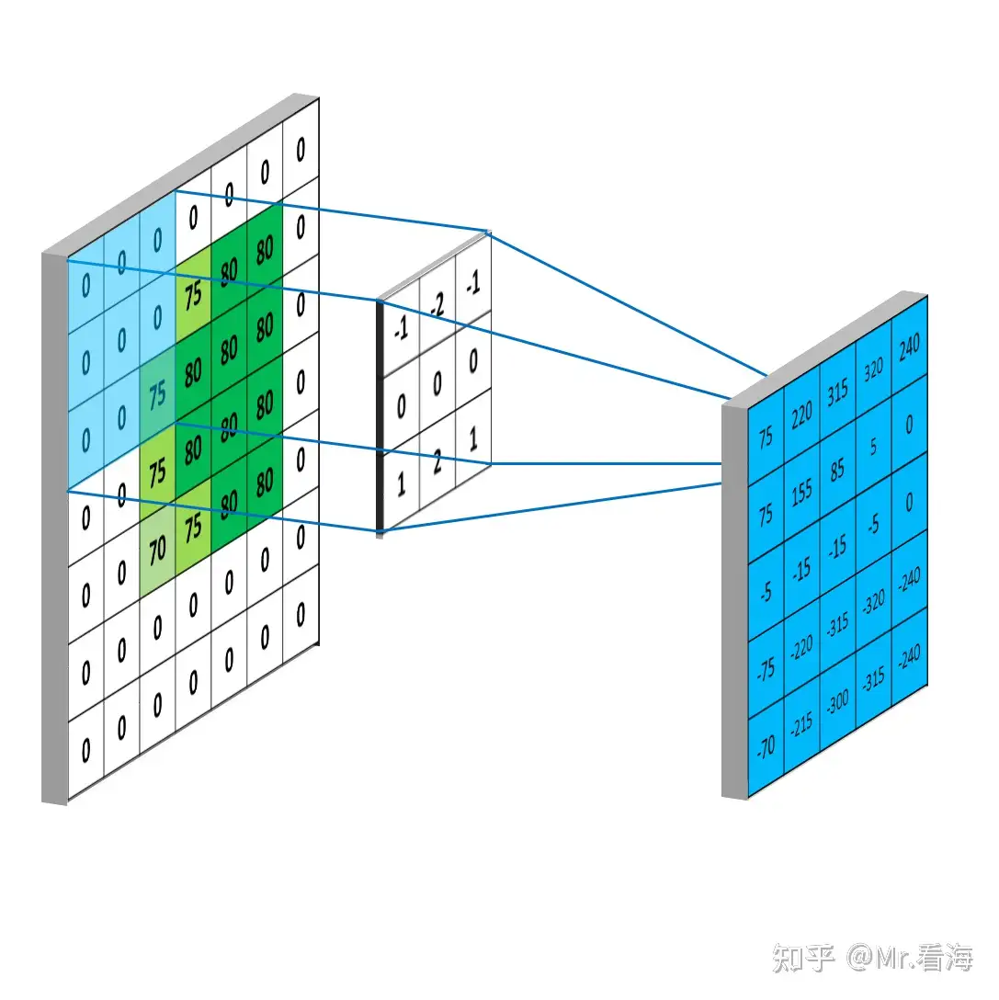

这里我们将上述计算卷积输出的矩阵大小的公式进一步扩展，引入填充的圈数P，以及步长的长度S，此时卷积输出的矩阵边长为：
$$
L = \frac{M - K + 2p}{S} + 1
$$

- $ L $：输出特征图的边长（宽度或高度）。
- $ M $：输入特征图的边长（宽度或高度）。
- $ K $：卷积核的边长（宽度或高度）。
- $ p $：填充（padding）的数量，通常是一个非负整数，表示在输入特征图的每条边上添加的填充像素数量。
- $ S $：步长（stride），表示卷积核在输入特征图上滑动的间隔。

需要注意，上述公式中的除法需向下取整。

除了上边说到的控制空间维度，防止信息丢失以外，零填充还有一个重要的意义是：**更充分利用输入数据的边缘信息。**

当未进行填充时，上下边缘用到的次数较少，就像下图：

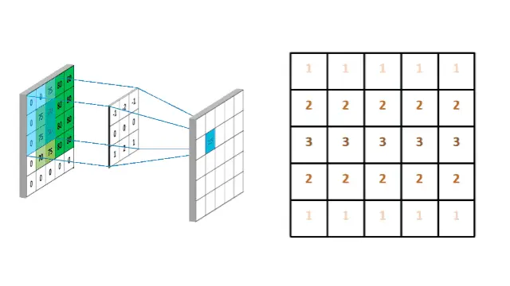

当进行填充后，边缘数据进行了更为充分的利用，就像下图：

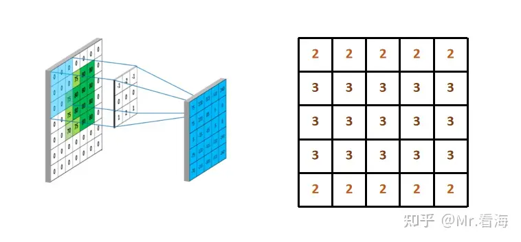

这种能够更均匀地处理所有信息，包括边缘信息的性质，是零填充在卷积神经网络中被广泛使用的重要原因之一。

### 5、感受野

#### （1）感受野的定义

在卷积神经网络（CNN）中，感受野（Receptive Field）是指输出特征图中的一个元素（神经元）在输入图像中所“看到”的区域。简言之，感受野表示输入图像中的哪个区域影响了某个特征图上的神经元。

感受野的大小和形状会随着网络层数的增加而变化，通常由卷积核大小、步幅（stride）和池化层的设置决定。

#### （2）感受野的计算

计算感受野的大小需要逐层累积每层的卷积核大小和步幅。例如，对于一个简单的两层卷积网络：

- 输入图像大小：32x32
- 第一层卷积：卷积核大小为 3x3，步幅为 1，填充为 1
- 第二层卷积：卷积核大小为 3x3，步幅为 1，填充为 1

第一层卷积后的感受野为 3x3，因为每个输出神经元都受到 3x3 区域的输入像素影响。第二层卷积后的感受野为 5x5，因为每个第二层的神经元受到第一层的 3x3 区域影响，而第一层的每个神经元又受到输入图像的 3x3 区域影响，累积起来为 5x5。

更正式地，感受野的计算可以通过递归公式完成：

$$
R_{l} = R_{l-1} + (k_{l} - 1) \times S_{l-1}
$$
其中：

- $ R_{l} $ 是第 $ l $ 层的感受野大小
- $ R_{l-1} $ 是第 $ l-1 $ 层的感受野大小
- $ k_{l} $ 是第 $ l $ 层的卷积核大小
- $ S_{l-1} $ 是第 $ l-1 $ 层的步幅

#### （3）感受野的重要性

感受野的大小直接影响网络的性能和能力：

- **小感受野**：能够捕捉细节，但可能无法捕捉全局信息，适合于低层次特征提取。
- **大感受野**：能够捕捉更大范围的上下文信息，适合于高层次特征提取和全局模式识别。

#### （4）感受野的重叠

在卷积神经网络中，感受野通常会重叠。重叠的感受野是由于卷积核的滑动窗口机制决定的。以下是感受野重叠的几个原因：

- **卷积核大小**：卷积核在输入图像上滑动时，每次滑动的步幅通常小于卷积核大小，这导致相邻的输出神经元的感受野会有重叠。
- **步幅（stride）**：步幅决定了卷积核每次滑动的距离。步幅越小，感受野重叠越多；步幅为 1 时，每次滑动一像素，感受野的重叠最多。
- **填充（padding）**：通过在输入图像边缘添加填充，可以在保持输入图像大小的同时增加感受野的覆盖范围，但这也增加了感受野的重叠。

因为假设感受野完全没有重叠,如果有一个模式正好出现在两个感受野的交界上面, 就没有任何神经元去检测它,这个模式可能会丢失,所以希望感受野彼此之间有高度的重叠。如令步幅 = 2,感受野就会重叠。

## 四、激活层

卷积层和全连接一样，也是一种线性变换，无论进行多少次这样的操作，都只能获得输入数据的线性组合。如果没有非线性的激活函数，那么即使是多层的神经网络，在理论上也可以被一个单层的神经网络所表达，这极大地限制了网络的表达能力。

ReLU函数是一个非线性函数，**只保留正数元素，将负数元素设置为0**。这种简单的修正线性单元具有许多优点，例如，它能够缓解梯度消失问题，计算速度快，同时ReLU的输出是稀疏的，这有助于模型的正则化。ReLU的响应函数图像如下：

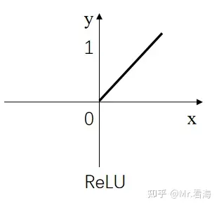

ReLU的理念其实很简单。当输入小于等于0时，输出0；当输入大于0时，输出1。

下图展示的是含负值的输出层经过ReLU计算的过程，图中红色代表负数，灰色代表正数，颜色越深数值的绝对值越大：

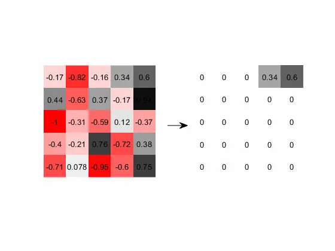

在我们上边手写字体的例子里，由于输入层数据和卷积核都不小于0，所以卷积计算结果全都不小于0，ReLU层前后数据不会发生变化，下边我设置一个含负数的卷积核，这样卷积运算的结果就会包含负数，此时**卷积运算+ReLU非线性激活**的过程就如下图：

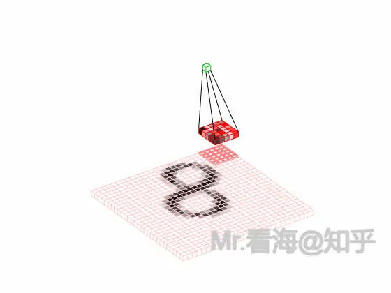

## 五、池化层

池化层的主要作用是对非线性激活后的结果进行降采样，以**减少参数的数量**，**避免过拟合**，并**提高模型的处理速度**。

池化层主要采用最大池化（Max Pooling）、平均池化（Average Pooling）等方式，对特征图进行操作。以最常见的最大池化为例，我们选择一个窗口（比如 2x2）在特征图上滑动，每次选取窗口中的最大值作为输出，这就是最大池化的工作方式：

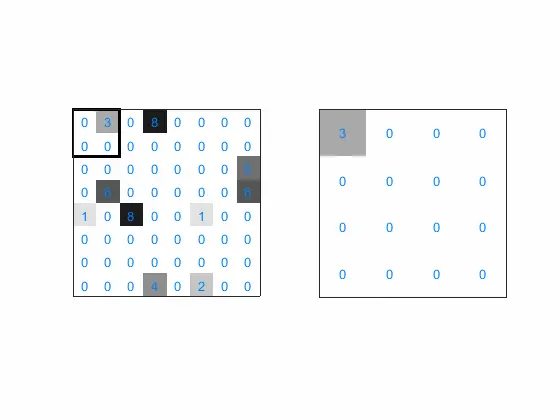

大致可以看出，经过池化计算后的图像，基本就是左侧特征图的“低像素版”结果。也就是说池化运算能够保留最强烈的特征，并大大降低数据体量。

对于**平均池化**，顾名思义，就是对窗口内的数据取平均值。

加入池化层-完整的“卷积单元”如下：

卷积层、ReLU和池化层的组合是一种常见模式，但不是唯一的方式。比如池化层作为降低网络复杂程度的计算环节，在算力硬件条件越来越好的当下，有些时候是可以减少采用次数的，也就是池化层可以在部分层设置、部分层不设置。

完整的“**卷积层→ReLU→池化层**”这样一个运算单元，使用上述手写字体的动图可以表示如下：

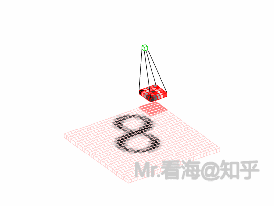

## 六、输出层

在卷积神经网络中，最后一层（或者说最后一部分）通常被称为输出层。这个层的作用是将之前所有层的信息集合起来，产生最终的预测结果。

对于CNN进行分类任务时，输出部分的网络结构通常是一个或多个全连接层，然后连接Softmax。

当然，如果想要从卷积层过渡到全连接层，你需要对卷积层的输出进行“展平”处理，简而言之就是将二维数据逐行串起来，变成一维数据。

由于此时数据经过多层卷积和池化操作，数据量已大大减少，所以全连接层设计的参数就不会有那么多了。

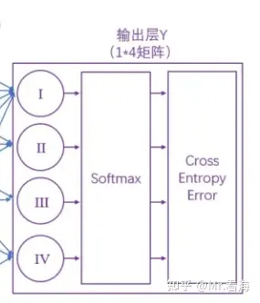

## 七、问题

卷积神经网络（CNN）以其在图像识别任务中的高效性能而闻名，但它们确实存在一些局限性，尤其是在处理图像的尺度（放大或缩小）和旋转变化方面。CNN通常在训练时学习到的是图像中局部特征的模式，当输入图像的尺度或方向发生变化时，这些局部特征的相对位置和尺寸也会改变，导致CNN难以识别。

例如，如果CNN在固定尺寸的图像上训练以识别狗，当输入图像的尺寸变化时，CNN可能就无法识别出图像中的狗。这是因为图像放大或旋转后，尽管形状相似，像素值的分布发生了变化，CNN之前学习到的特征模式不再匹配。

为了解决这个问题，数据增强技术被广泛应用于CNN训练过程中。数据增强包括对图像进行缩放、旋转、裁剪等操作，以模拟不同的视角和尺寸，从而让CNN学习到更加鲁棒的特征表示。这样，即使在面对不同尺寸或方向的图像时，CNN也能够更好地泛化。

然而，尽管数据增强可以提高CNN对尺度和旋转变化的适应性，但它们仍然不如某些新型网络架构，如Transformer Layer，后者通过自注意力机制能够更好地处理图像的尺度和旋转不变性。Transformer架构通过全局信息的整合，能够捕捉到图像中不同位置之间的关系，从而在一定程度上克服了CNN的这些局限性。

## Reference

[CNN卷积神经网络30分钟入门](https://zhuanlan.zhihu.com/p/673132300)
