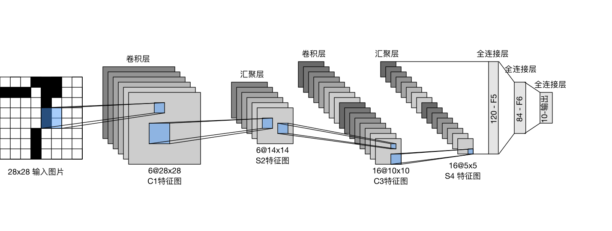

## 一、LeNet介绍

LeNet，它是最早发布的卷积神经网络之一，因其在计算机视觉任务中的高效性能而受到广泛关注。 这个模型是由AT&T贝尔实验室的研究员Yann LeCun在1989年提出的（并以其命名），目的是识别图像中的手写数字。 当时，Yann LeCun发表了第一篇通过反向传播成功训练卷积神经网络的研究，这项工作代表了十多年来神经网络研究开发的成果。

总体来看，LeNet（LeNet-5）由两个部分组成：

- 卷积编码器：由两个卷积层组成;
- 全连接层密集块：由三个全连接层组成。

## 二、代码实现

### 1、加载数据

代码首先使用 `torchvision.datasets.FashionMNIST` 下载并加载 FashionMNIST 数据集，然后通过 `torch.utils.data.DataLoader` 函数创建训练和测试数据迭代器。`batch_size` 控制每次迭代的样本数量，`num_workers` 决定数据加载的并行线程数量。

### 2、LeNet 模型

LeNet-5 模型结构如下：

- 输入：28x28的单通道图像。
- 第一层卷积层：卷积核大小为5x5，输入通道数为1，输出通道数为6，ReLU激活函数。
- 第二层池化层：池化核大小为2x2，步幅为2，平均池化。
- 第三层卷积层：卷积核大小为5x5，输入通道数为6，输出通道数为16，ReLU激活函数。
- 第四层池化层：池化核大小为2x2，步幅为2，平均池化。
- 第五层全连接层：输入大小为16 * 4 * 4（16个通道，每个通道的特征图大小为4x4），输出大小为120，ReLU激活函数。
- 第六层全连接层：输入大小为120，输出大小为84，ReLU激活函数。
- 第七层全连接层：输入大小为84，输出大小为10（10个类别）。

### 3、训练与评估

训练函数 `train` 负责模型的训练过程，包括前向传播、损失计算、反向传播和参数更新。评估函数 `evaluate_accuracy` 在测试集上评估模型的准确性。

### 4、测试与可视化

在训练完成后，我们可以使用测试集评估模型，并可视化一些测试图像及其预测结果，以直观展示模型的性能。

### 5、代码

[LeNet](code/lenet.py ':include :type=code ')