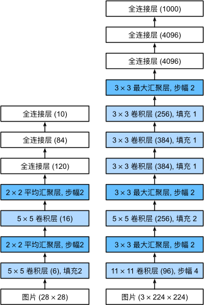

## 一、AlexNet 介绍

AlexNet 是 2012 年由 Alex Krizhevsky 等人提出的一种深度卷积神经网络，成功在 ImageNet 图像分类挑战中取得了显著的成绩。

AlexNet 的结构相对于 LeNet 更加复杂，包括更多的卷积层、更大的模型和更强的计算能力支持。AlexNet 的主要特点和创新点包括：

- **使用 ReLU 激活函数**：相比传统的 sigmoid 或 tanh 激活函数，ReLU 加快了模型的训练速度。
- **使用 Dropout 正则化**：在全连接层中使用 Dropout 以防止过拟合。
- **数据增强**：通过数据增强技术（如随机裁剪、水平翻转）提高模型的泛化能力。
- **重叠池化**：使用步幅为 2 的 3x3 池化层代替 2x2 池化层以提高模型的表现。

## 二、AlexNet 结构

AlexNet 由五个卷积层、三个全连接层和一些辅助层（如池化层、LRN 层）组成。具体结构如下：

- **输入层**：224x224x3 的图像。
- **第一层卷积层**：96 个 11x11 的卷积核，步幅为 4，输出尺寸为 55x55x96，激活函数为 ReLU。
- **第一层池化层**：3x3 的最大池化层，步幅为 2，输出尺寸为 27x27x96。
- **第二层卷积层**：256 个 5x5 的卷积核，步幅为 1，输出尺寸为 27x27x256，激活函数为 ReLU。
- **第二层池化层**：3x3 的最大池化层，步幅为 2，输出尺寸为 13x13x256。
- **第三层卷积层**：384 个 3x3 的卷积核，步幅为 1，输出尺寸为 13x13x384，激活函数为 ReLU。
- **第四层卷积层**：384 个 3x3 的卷积核，步幅为 1，输出尺寸为 13x13x384，激活函数为 ReLU。
- **第五层卷积层**：256 个 3x3 的卷积核，步幅为 1，输出尺寸为 13x13x256，激活函数为 ReLU。
- **第三层池化层**：3x3 的最大池化层，步幅为 2，输出尺寸为 6x6x256。
- **第一个全连接层**：输入大小为 6x6x256，输出大小为 4096，激活函数为 ReLU，Dropout。
- **第二个全连接层**：输入大小为 4096，输出大小为 4096，激活函数为 ReLU，Dropout。
- **第三个全连接层**：输入大小为 4096，输出大小为 1000，Softmax 输出。