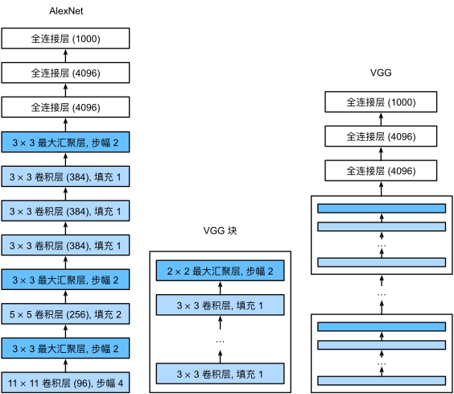

VGG（Visual Geometry Group）是由牛津大学计算机视觉组（Visual Geometry Group）提出的深度卷积神经网络架构，于2014年在ImageNet大规模视觉识别挑战赛（ILSVRC）上取得了优异的成绩。VGG网络结构简单、层次清晰，通过堆叠多个卷积层和池化层来逐渐减小特征图的尺寸，最后通过全连接层进行分类。

## 一、结构示意图

VGG网络通常分为卷积层部分和全连接层部分：

- **卷积层部分：** 由一系列堆叠的卷积层（每层包含若干个卷积核）、ReLU激活函数和池化层组成。这些层逐步减小特征图的空间尺寸，增加深度。
- **全连接层部分：** 将卷积层输出的高级特征映射展平为向量，并通过多层全连接层进行最终的分类。

