我们已经介绍了众多机器学习模型及其应用场景。然而，当机器学习算法在工业界落地时，会面临一个重要问题：机器学习模型往往是一个黑盒子，我们无法解释其内部是如何通过输入得到输出的。模型的安全性在行业应用中十分重要，因此我们需要研究人工智能算法和模型的可解释性。

## 一、可解释性人工智能的重要性

### 1、什么是可解释性人工智能（XAI）

可解释性人工智能（eXplainable Artificial Intelligence, XAI）指的是能够解释和理解机器学习模型决策过程的人工智能技术。目前，我们已经训练了许多模型，例如图像识别模型，它们可以给出图片的类别。然而，我们希望模型不仅能给出答案，还能解释为什么得出这个答案。

### 2、为什么可解释性人工智能重要

即使机器可以得出正确答案，也不代表它真正“聪明”。举个例子，过去有一匹号称能解数学问题的神马，但它其实只是根据人类的反应来决定什么时候停下敲马蹄。类似地，人工智能应用是否也是同样的情况呢？

在许多实际应用中，模型的可解释性是必须的。例如，银行使用机器学习模型来判断是否给客户贷款，法律规定银行必须给出一个理由。医疗诊断中，模型必须解释其诊断理由，否则我们无法信任其判断。自动驾驶汽车也是如此，如果它急刹车导致乘客受伤，我们需要知道其急刹的原因。如果是因为有人过马路，那是合理的，但如果没有理由，那就存在问题。

### 3、可解释性有助于改进模型

我们希望通过了解模型犯错的原因，从而更有效地改进模型。虽然离实现这一目标还有一段距离，但已经有一些方法可以让模型变得更易解释。未来，这些方法可能会应用于深度学习模型，让它们也变得更易解释。

### 4、可解释性与模型复杂度的关系

有人可能会认为深度学习模型是黑盒子，所以我们应该使用其他更易解释的模型，如线性模型。然而，线性模型虽然易解释，但表达能力较弱，无法解决复杂问题。深度模型虽然强大，但不容易解释。因此，我们的目标是让深度模型也具备解释能力，而不是放弃使用它们。

## 二、决策树模型的可解释性

### 1、决策树简介

决策树是一个设计初期就具备良好可解释性的机器学习模型。它通过节点提出问题，根据答案决定向左或向右，最终在叶子节点做出决定。通过观察每个节点的问题和答案，我们可以理解模型是如何做出决策的。

### 2、决策树的局限性

虽然决策树强大且易解释，但当特征过多时，决策树会变得非常复杂，难以解释。复杂的决策树也可能成为黑盒子。因此，单纯依赖决策树并不能解决所有问题。

### 3、随机森林的可解释性

在实际应用中，我们通常使用随机森林而不是单棵决策树。随机森林由多棵决策树组成，其决策过程更加复杂，不易解释。因此，决策树并不是可解释性机器学习的最终答案。

## 三、可解释性机器学习的目标

### 1、什么是好的可解释性

很多人误以为好的可解释性是了解模型的一切，但这不一定必要。人脑也是一个黑盒子，但我们仍然相信其他人的决策。那么，为什么我们不能信任深度网络的决策呢？

### 2、心理学实验的启示

在1970年，一位哈佛大学的教授进行了一项有趣的心理学实验，该实验与机器学习无关，却揭示了人类行为的一个有趣现象。实验的场景设在哈佛大学图书馆的打印机前，一个常见的情况是许多学生在此排队打印资料。教授让一位参与者请求插队，仅仅简单地说“拜托请让我先印5页”，结果发现大约60%的人会同意这一请求。然而，当参与者在请求中加入一个理由——即使这个理由并不充分，如“因为我赶时间”，即使真实性无人知晓——同意的比例却戏剧性地上升到了94%。更令人惊讶的是，即使理由被简化为“因为我需要先印”，接受程度依然高达93%。这个实验表明，人们在做出决策时，往往需要一个理由，哪怕这个理由并不充分。

实验显示了人们更容易接受有理由的请求。即使理由不充分，人们也更倾向于接受。同理，在可解释性机器学习中，好的解释就是让人接受的解释。人们希望得到理由，无论理由多么简单。因此，好的解释就是让人满意的解释。

通过上述理论和实践，我们可以更好地理解可解释性人工智能的重要性及其目标，从而推动其在实际应用中的发展。

## 四、可解释性机器学习中的局部解释

可解释性机器学习可以分为两大类：局部解释和全局解释。局部解释是针对单一输入的解释，例如给图像分类器一张猫的图片，解释为什么模型认为这是一只猫。而全局解释则是分析模型整体特性，不针对具体输入。

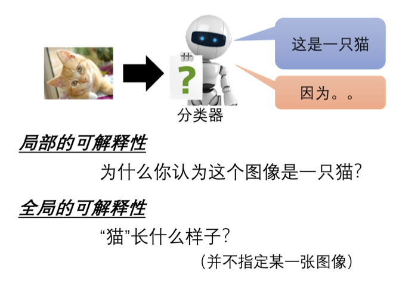

局部解释的目标是回答模型为什么会对特定输入产生某种输出。假设模型的输入为$x$，可能是一张图片、一段文字、一段音频、一段视频或时间序列数据。输入$x$可以拆分为多个部分$x_1, x_2, \ldots, x_n$，这些部分可能是像素、文字、音频的频谱、视频的每一帧或时间序列的每一个时间点。通过分析这些部分对模型输出的影响，我们可以确定每个部分的重要性。

一种基本方法是将输入的部分逐一修改或删除，观察模型输出的变化。如果某一部分的修改或删除导致输出有显著变化，则该部分是重要的。例如，在图像分类中，我们可以在图片不同位置放上灰色方块，观察模型输出的变化。如果灰色方块放在关键位置（如动物的面部），导致分类结果显著改变，则该位置的重要性较高。

### 1、梯度方法

一种进阶的方法是计算梯度。假设有一张图片，其像素表示为$x_1, x_2, \ldots, x_N$，我们计算模型的损失$e$，损失$e$表示模型输出与正确答案的差距。为了确定每个像素的重要性，我们可以对每个像素做微小变化$\Delta x$，并观察损失的变化$\Delta e$。如果$\Delta e$较大，则该像素重要。数学上，可以通过计算$\frac{\partial e}{\partial x}$来确定重要性。将每个像素的重要性计算出来后，可以得到一张显著图(saliency map)，如下图所示，越亮的区域表示像素越重要。

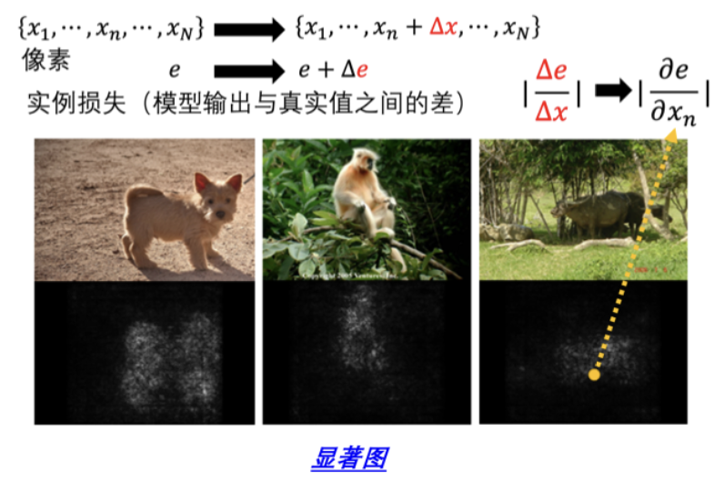

**案例：**在PASCAL VOC 2007基准语料库中，有时模型会基于错误的特征做出分类。例如，某模型通过图片左下角的一串文字判断图片中是马，因为这些文字在许多包含马的图片中出现。这说明了可解释性AI的重要性，能够帮助我们理解模型的判断依据，避免模型“作弊”。

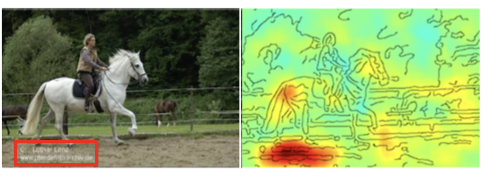

### 2、SmoothGrad方法

显著图有时会出现噪声，影响解释效果。SmoothGrad通过在图片上加入不同的噪声，生成多张图片并计算其显著图，然后取平均值，减少噪声，使显著图更加平滑，如下图所示。

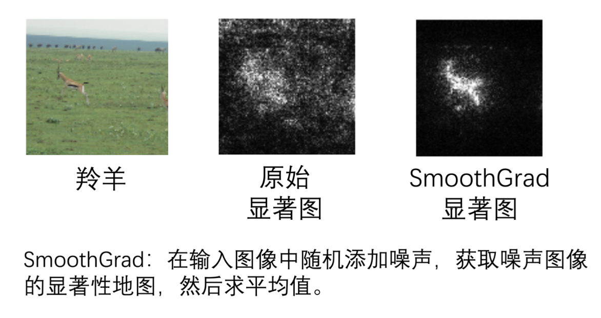

### 3、局限性和改进方法

梯度方法有局限性，不能完全反映特征的重要性。例如，长鼻子是大象的特征，但当鼻子达到一定长度后，再增长对识别大象的影响很小，导致梯度趋近于0。这时，仅看梯度可能得不到正确结论。因此，还可以使用其他方法，如积分梯度（integrated gradients）。

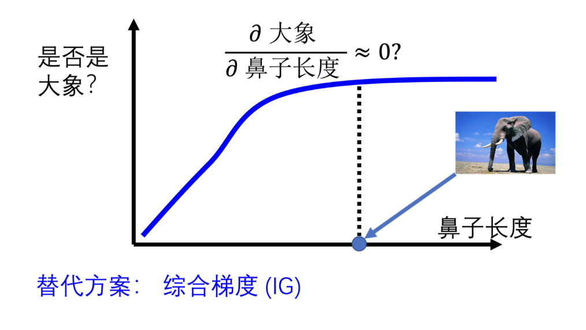

### 4、模型内部处理分析

接下来我们将探讨网络是如何处理输入并生成最终输出的。我们会通过一些具体的例子和技术方法来揭示这一过程。

#### （1）可视化方法

**例子 1：语音识别：**考虑一个语音识别网络，如下图所示。该网络的功能是输入一小段声音，输出该声音对应的韵母或音标。假设该网络有两层，每层包含 100 个神经元。每一层的输出都可以视为一个 100 维的向量。为了分析这些高维向量，可以使用降维技术，如主成分分析 (PCA) 或 t-SNE，将 100 维降至二维，从而可视化这些向量。通过这样的可视化，我们可以直观地观察网络是如何处理输入并生成输出的。

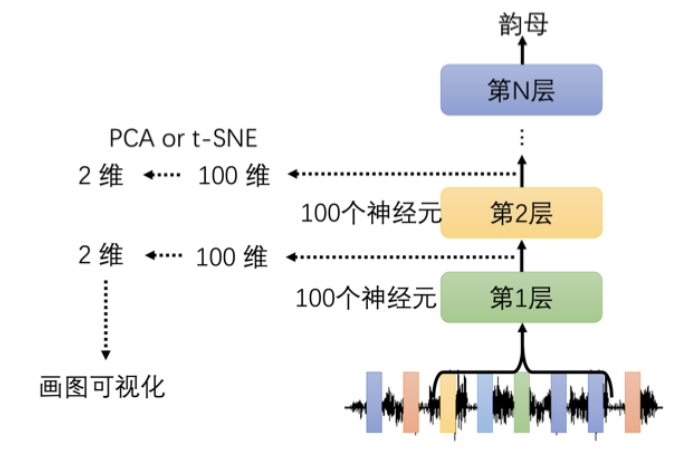

**例子 2：语音特征的可视化：**在另一篇 Hinton 的文章中，我们将语音特征（MFCC）降维并可视化，如下图所示。图中每个点代表一小段声音信号，不同颜色代表不同讲话者。尽管不同的人说同样的话在声音特征上难以区分，但经过网络的处理（例如第 8 层隐藏层的输出），我们可以看到相同内容的句子被有效地分类。这表明网络能够通过多层处理，实现更高层次的特征抽象，从而更准确地分类语音内容。

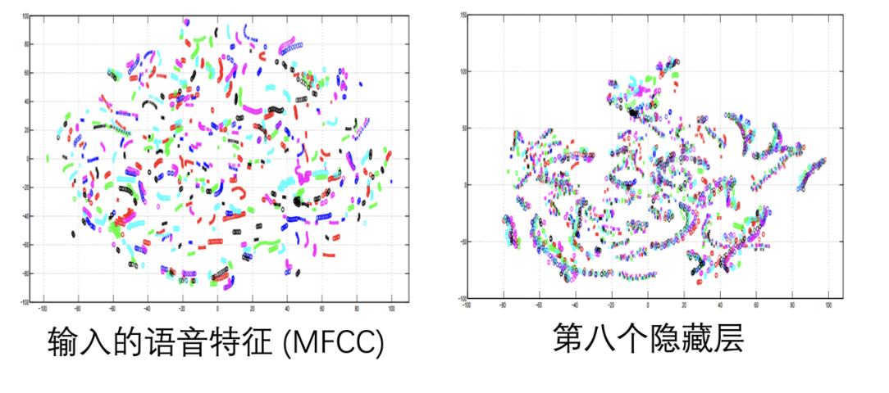

#### （2）探针方法

除了可视化方法，我们还可以使用探针(`probing`)技术来深入了解网络内部的工作机制。

探针方法的基本思想是训练一个分类器（探针），其输入是网络的中间层输出，输出是目标任务的标签。例如，训练一个词性标注 (POS) 分类器，将 BERT 的词嵌入作为输入。如果分类器的正确率高，说明该层嵌入包含丰富的词性信息；如果正确率低，可能是该层没有学到足够的词性信息，或者分类器本身训练不好。

**例子 1：POS 分类器：**我们可以将 BERT 的某一层输出输入到一个 POS 分类器中，训练该分类器以判断词汇的词性。如果分类器表现良好，说明该层嵌入包含词性信息。

**例子 2：命名实体识别 (NER) 分类器：**类似地，我们可以训练一个 NER 分类器，将 BERT 的嵌入作为输入，输出是词汇是否为命名实体（如人名、地名）。通过分类器的表现，我们可以评估嵌入中是否包含命名实体的信息。

在使用探针方法时，需要注意分类器的性能。如果分类器表现不佳，并不一定意味着嵌入没有相关信息，可能是分类器本身训练不足。此外，过强的分类器也可能影响评估结果，因此需要平衡分类器的复杂度。

探针技术不仅限于文本处理，还可以应用于语音处理。例如，训练一个语音合成 (TTS) 模型，将网络的中间层输出作为输入，生成对应的声音信号。

**例子：语音合成模型：**如下图所示，我们可以将某一层的输出输入到 TTS 模型中，训练 TTS 模型生成原始声音信号。如果某层的输出没有讲述者的信息，TTS 模型生成的声音将失去讲述者的特征，表明该层成功抽取了内容信息而去除了讲述者特征。

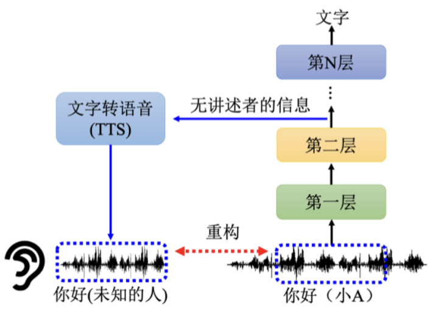

**例子 1：BiLSTM 语音识别**

如下图所示，我们训练了一个 5 层 BiLSTM 模型处理语音输入。输入是女生的声音信号，同时另一个男生的不同内容声音信号。通过网络的多层处理后，我们发现原始声音信息逐渐失去个人特征，最终两者的声音变得难以区分。

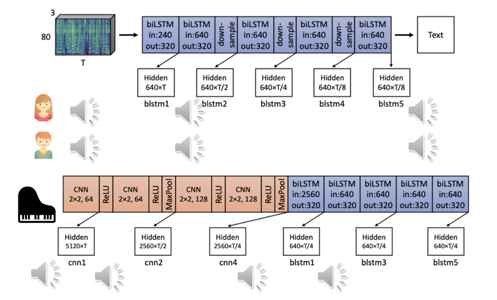

**例子 2：去噪处理**

另一例子是包含钢琴噪声的语音信号处理。网络前几层使用 CNN，后几层使用 BiLSTM。信号通过第一层 CNN 后仍然带有钢琴噪声，但经过第一层 BiLSTM 处理后，噪声明显减小，表明 BiLSTM 有效地过滤了噪声，而前面的 CNN 层没有达到同样效果。

## 五、可解释性机器学习中的全局解释

### 1、局部解释与全局解释的区别

局部解释关注的是单个样本的预测结果。例如，给机器一张照片，让它解释为什么认为照片中有一只猫。而全局解释则是分析整个模型的行为，而不是针对某一特定样本。全局解释旨在揭示模型在整体上是如何识别某个类别的特征。

### 2、卷积神经网络的全局解释

假设我们有一个卷积神经网络模型，如下图所示。对于一张输入图片$$X$$，我们可以通过卷积层的滤波器获得特征图。我们可以分析滤波器特征图的输出，寻找那些激活值较大的区域，从而理解模型的特征检测模式。

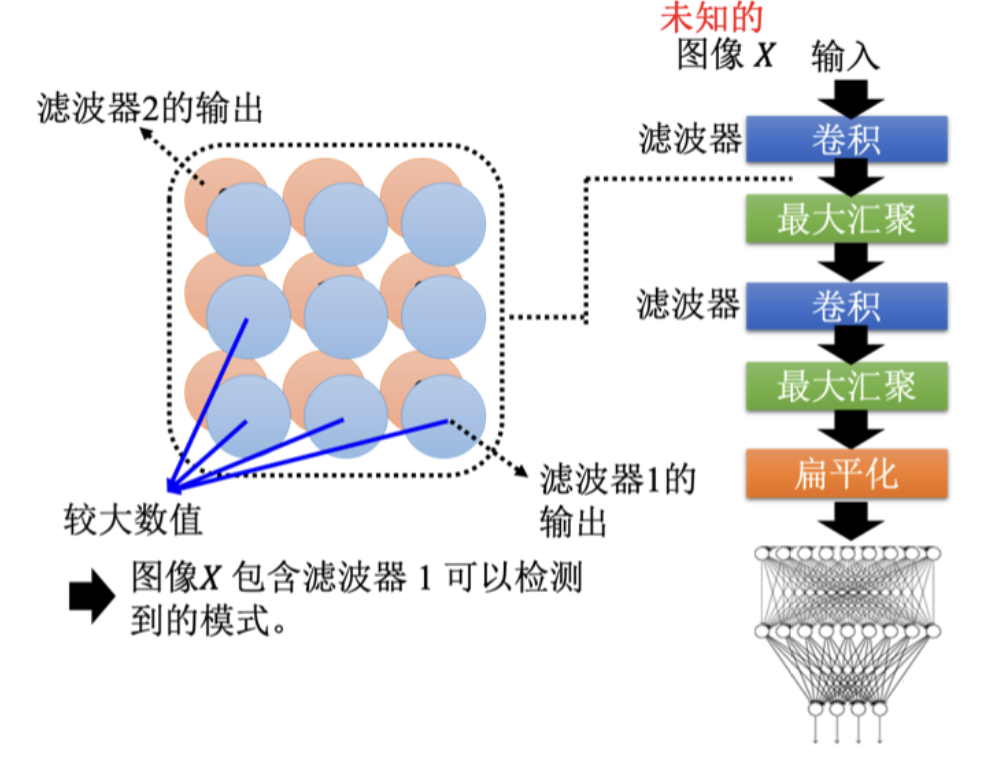

我们希望找到一种方法来生成图片，使得某个滤波器的激活值最大。为此，我们可以使用梯度上升法来优化输入图片$$X^*$$，使其在滤波器的特征图中的激活值$$a_{ij}$$总和最大。

$$
X^* = \arg \max_X \sum_{i,j} a_{ij}
$$
通过这种方法，我们可以生成图片$$X^*$$，从中观察滤波器所关注的模式特征。

### 3、实例：MNIST 手写数字识别

我们训练了一个卷积神经网络来识别 MNIST 手写数字，如下图所示。然后，我们通过分析第二个卷积层的滤波器，找到每个滤波器对应的图片$$X^*$$，即滤波器最关注的模式特征。图左侧展示了12个滤波器的模式，它们主要提取基本的笔画特征，如横线、直线、斜线等。

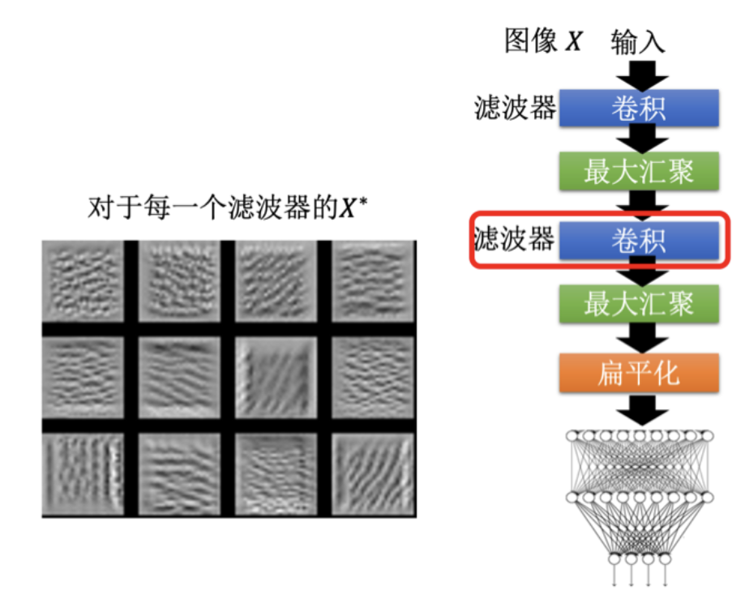

这些滤波器的特征提取对于手写数字识别非常合理，因为手写数字由这些基本笔画组成。

有时候，直接通过最大化类别输出来生成图片并不容易。这是因为生成的图片可能包含大量噪声信息。为了生成更像我们预期的数字图片，可以在优化过程中添加正则项$$R(X)$$，约束生成图片的特征，使其更符合我们对手写数字的理解。

$$
X^* = \arg \max_X (y_i + R(X))
$$
例如，正则项可以是图片像素值的平方和，或像素值梯度的平方和。

### 4、使用生成模型进行全局解释

为了生成更加清晰的图片，可以使用生成模型，如生成对抗网络(GAN)或变分自编码器(VAE)。

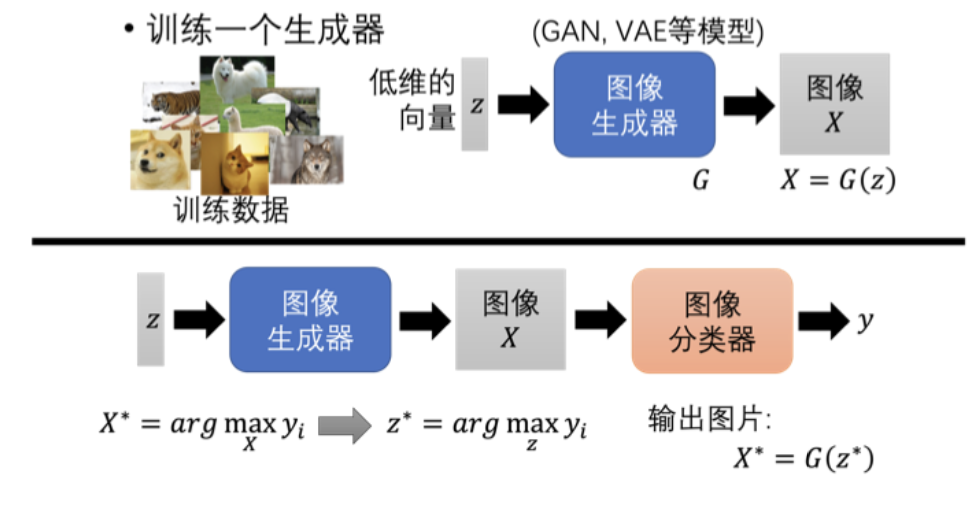

如上图所示，生成模型的输入是从高斯分布中采样的低维向量$$z$$，输出是一张图片$$X = G(z)$$。我们可以优化$$z$$，使得生成的图片$$X$$在分类器中对应的类别得分最大。
$$
z^* = \arg \max_z y_i
$$
然后，通过生成器生成的图片$$X^* = G(z^*)$$，我们可以观察分类器对某个类别的理解。

### 5、可解释性机器学习的主观性

可解释性机器学习的结果可能带有主观性。如果解释结果与人的预期不符，可能会觉得解释方法不好。因此，我们倾向于使用一些技巧，使解释结果更符合人类的认知。

### 6、扩展与小结

可解释性机器学习还有许多技术，例如用简单的可解释性模型替代复杂的黑盒模型。下图展示了用线性模型模仿复杂神经网络的方法。如果线性模型能成功模仿黑盒行为，我们可以通过分析线性模型来理解复杂模型的行为。

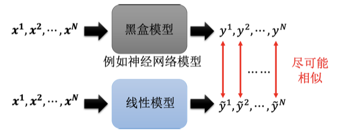

LIME 是一种知名的局部解释方法，使用线性模型在局部区域内模仿黑盒模型的行为。尽管线性模型无法完全模仿黑盒模型，但在小区域内的模仿能够提供有价值的解释。
