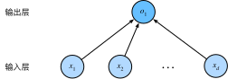

*回归*（regression）是能为一个或多个自变量与因变量之间关系建模的一类方法。 在自然科学和社会科学领域，回归经常用来表示输入和输出之间的关系。

在机器学习领域中的大多数任务通常都与*预测*（prediction）有关。 当我们想预测一个数值时，就会涉及到回归问题。 常见的例子包括：预测价格（房屋、股票等）、预测住院时间（针对住院病人等）、 预测需求（零售销量等）。 但不是所有的*预测*都是回归问题。

## 一、线性回归的基本元素

线性回归基于几个简单的假设：

首先，**假设**自变量$\mathbf{x}$和因变量$y$之间的关系是线性的，即$y$可以表示为$\mathbf{x}$中元素的加权和，这里通常允许包含观测值的一些噪声；其次，我们假设任何噪声都比较正常，如噪声遵循正态分布。

我们举一个实际的例子：我们希望根据房屋的面积（平方英尺）和房龄（年）来估算房屋价格（美元）。为了开发一个能预测房价的模型，我们需要收集一个真实的数据集。这个数据集包括了房屋的销售价格、面积和房龄。

在机器学习的术语中，该数据集称为*训练数据集*（training data set）或*训练集*（training set）。每行数据（比如一次房屋交易相对应的数据）称为*样本*（sample），也可以称为*数据点*（data point）或*数据样本*（data instance）。我们把试图预测的目标（比如预测房屋价格）称为*标签*（label）或*目标*（target）。预测所依据的自变量（面积和房龄）称为*特征*（feature）或*协变量*（covariate）。

通常，我们使用$n$来表示数据集中的样本数。对索引为$i$的样本，其输入表示为$\mathbf{x}^{(i)} = [x_1^{(i)}, x_2^{(i)}]^\top$，其对应的标签是$y^{(i)}$。

### 1、线性模型

线性假设是指目标（房屋价格）可以表示为特征（面积和房龄）的加权和，如下面的式子：

$$
\mathrm{price} = w_{\mathrm{area}} \cdot \mathrm{area} + w_{\mathrm{age}} \cdot \mathrm{age} + b.
$$
其中的$w_{\mathrm{area}}$和$w_{\mathrm{age}}$称为*权重*（weight），权重决定了每个特征对我们预测值的影响。$b$称为*偏置*（bias）、*偏移量*（offset）或*截距*（intercept）。偏置是指当所有特征都取值为0时，预测值应该为多少。即使现实中不会有任何房子的面积是0或房龄正好是0年，我们仍然需要偏置项。如果没有偏置项，我们模型的表达能力将受到限制。

严格来说，公式（1）是输入特征的一个*仿射变换*（affine transformation）。仿射变换的特点是通过加权和对特征进行*线性变换*（linear transformation），并通过偏置项来进行*平移*（translation）。

给定一个数据集，我们的目标是寻找模型的权重$\mathbf{w}$和偏置$b$，使得根据模型做出的预测大体符合数据里的真实价格。输出的预测值由输入特征通过*线性模型*的仿射变换决定，仿射变换由所选权重和偏置确定。

而在机器学习领域，我们通常使用的是高维数据集，建模时采用线性代数表示法会比较方便。当我们的输入包含$p$个特征时，我们将预测结果 $\hat{y}^{(i)}$（通常使用“尖角”符号表示$y$的估计值）表示为：

$$
\hat{y}^{(i)} = w_1 x_1^{(i)} + w_2 x_2^{(i)} + \cdots + w_p x_p^{(i)} + b
$$
其中：

- $\hat{y}^{(i)}$ 是预测值。
- $b$ 是截距。
- $w_1, w_2, \ldots, w_p$ 是回归系数，表示每个自变量对目标变量的影响。
- $x_1^{(i)}, x_2^{(i)}, \ldots, x_p^{(i)}$是多个自变量。

将所有特征放到向量$\mathbf{x}^{(i)} \in \mathbb{R}^p$中，并将所有权重放到向量$\mathbf{w} \in \mathbb{R}^p$中，我们可以用点积形式来简洁地表达模型：
$$
\hat{y} = \mathbf{w}^\top \mathbf{x}^{(i)} + b
$$
在公式（3）中，向量$\mathbf{x}^{(i)}$对应于单个数据样本的特征。用符号表示的矩阵$\mathbf{X} \in \mathbb{R}^{n \times p}$可以很方便地引用我们整个数据集的$n$个样本。其中，$\mathbf{X}$的每一行是一个样本，每一列是一种特征。

可以通过矩阵-向量乘法表示为：
$$
\hat{\mathbf{y}} = \mathbf{X} \mathbf{w} + b
$$

其中：

- $\mathbf{X}$ 是$n \times p$ 的设计矩阵：
  $$
  \mathbf{X} = \begin{pmatrix}
  x_1^{(1)} & x_2^{(1)} & \cdots & x_p^{(1)} \\
  x_1^{(2)} & x_2^{(2)} & \cdots & x_p^{(2)} \\
  \vdots & \vdots & \ddots & \vdots \\
  x_1^{(n)} & x_2^{(n)} & \cdots & x_p^{(n)}
  \end{pmatrix}
  $$

- $\mathbf{w}$ 是 $p \times 1$的回归系数向量：
  $$
  \mathbf{w} = \begin{pmatrix}
  w_1 \\
  w_2 \\
  \vdots \\
  w_p
  \end{pmatrix}
  $$

- $\hat{\mathbf{y}}$ 是$n \times 1$ 的预测值向量：

  $$
  \hat{\mathbf{y}} = \begin{pmatrix}
  \hat{y}^{(1)} \\
  \hat{y}^{(2)} \\
  \vdots \\
  \hat{y}^{(n)}
  \end{pmatrix}
  $$

这个过程中的求和将使用广播机制。给定训练数据特征$\mathbf{X}$和对应的已知标签$\mathbf{y}$，线性回归的目标是找到一组权重向量$\mathbf{w}$和偏置$b$：当给定从$\mathbf{X}$的同分布中取样的新样本特征时，这组权重向量和偏置能够使得新样本预测标签的误差尽可能小。

虽然我们相信给定$\mathbf{x}$预测$y$的最佳模型会是线性的，但我们很难找到一个有$n$个样本的真实数据集，其中对于所有的$1 \leq i \leq n$，$y^{(i)}$完全等于$\mathbf{w}^\top \mathbf{x}^{(i)}+b$。无论我们使用什么手段来观察特征$\mathbf{X}$和标签$\mathbf{y}$，都可能会出现少量的观测误差。因此，即使确信特征与标签的潜在关系是线性的，我们也会加入一个噪声项来考虑观测误差带来的影响。

### 2、损失函数

在线性回归模型中，我们的目标是找到最优的权重向量$\mathbf{w}$和偏置$b$，使得模型的预测值$\hat{y}$尽可能接近真实值$y$。为了度量模型预测值与真实值之间的差异，我们使用常用的损失函数**均方误差**（Mean Squared Error, MSE），它定义如下：

$$
\text{MSE} = \frac{1}{n} \sum_{i=1}^{n} (y^{(i)} - \hat{y}^{(i)})^2
$$

将$\hat{y}^{(i)}$替换为线性回归模型的预测公式$\hat{y}^{(i)} = \mathbf{w}^\top \mathbf{x}^{(i)} + b$，可以得到：

$$
\text{MSE} = \frac{1}{n} \sum_{i=1}^{n} \left(y^{(i)} - (\mathbf{w}^\top \mathbf{x}^{(i)} + b)\right)^2
$$

在训练模型时，我们希望寻找一组参数（$\mathbf{w}^*, b^*$），这组参数能最小化在所有训练样本上的总损失。如下式：
$$
\mathbf{w}^*, b^* = \operatorname*{argmin}_{\mathbf{w}, b}\  L(\mathbf{w}, b)
$$

### 3、解析解

线性回归刚好是一个很简单的优化问题。与其他大部分模型不同，线性回归的解可以用一个公式简单地表达出来，这类解叫作解析解（analytical solution）。解析解可以进行很好的数学分析，但解析解对问题的限制很严格，导致它无法广泛应用在深度学习里。

我们将偏置$b$合并到参数$\mathbf{w}$中。合并的方法是在包含所有参数的矩阵$\mathbf{X}$中附加一列全为1的列，这样可以统一表示。设：

- $\mathbf{X}$为$n \times p$的特征矩阵。
- $\mathbf{y}$为$n \times 1$的目标值向量。
- $\mathbf{w}$为$(p+1) \times 1$的权重向量，其中包含偏置项$b$。

我们将特征矩阵$\mathbf{X}$扩展为$n \times (p+1)$的矩阵$\mathbf{X}'$，具体表示为：

$$
\mathbf{X}' = \begin{pmatrix}
1 & x_1^{(1)} & x_2^{(1)} & \cdots & x_p^{(1)} \\
1 & x_1^{(2)} & x_2^{(2)} & \cdots & x_p^{(2)} \\
\vdots & \vdots & \vdots & \ddots & \vdots \\
1 & x_1^{(n)} & x_2^{(n)} & \cdots & x_p^{(n)}
\end{pmatrix}
$$

$$
\mathbf{w} = \begin{pmatrix}
b \\
w_1 \\
w_2 \\
\vdots \\
w_p
\end{pmatrix}
$$

于是，线性回归模型可以写成：

$$
\hat{\mathbf{y}} = \mathbf{X}' \mathbf{w}
$$

我们的目标是最小化均方误差（MSE）损失函数：

$$
\text{MSE} = \frac{1}{n} (\mathbf{y} - \mathbf{X}'\mathbf{w})^\top (\mathbf{y} - \mathbf{X}'\mathbf{w})
$$

为了最小化损失函数，我们需要找到$\mathbf{w}$，使得MSE最小。我们对$\mathbf{w}$求导，并设导数为0。首先，对$\mathbf{w}$求导：

$$
\nabla_{\mathbf{w}} \text{MSE} = \frac{\partial}{\partial \mathbf{w}} \left(\frac{1}{n} (\mathbf{y} - \mathbf{X}'\mathbf{w})^\top (\mathbf{y} - \mathbf{X}'\mathbf{w})\right)
$$

展开并求导：

$$
\nabla_{\mathbf{w}} \text{MSE} = -\frac{2}{n} \mathbf{X}'^\top (\mathbf{y} - \mathbf{X}'\mathbf{w})
$$

设导数为0，得到：

$$
\mathbf{X}'^\top (\mathbf{y} - \mathbf{X}'\mathbf{w}) = 0
$$

进一步整理得到：

$$
\mathbf{X}'^\top \mathbf{y} = \mathbf{X}'^\top \mathbf{X}' \mathbf{w}
$$

解出$\mathbf{w}$：

$$
\mathbf{w} = (\mathbf{X}'^\top \mathbf{X}')^{-1} \mathbf{X}'^\top \mathbf{y}
$$

其中：

- $\mathbf{X}'$是$n \times (p+1)$的设计矩阵。
- $\mathbf{w}$是$(p+1) \times 1$的回归系数向量。
- $\mathbf{X}'^\top$是设计矩阵$\mathbf{X}'$的转置矩阵。
- $\mathbf{X}'^\top \mathbf{X}'$是$(p+1) \times (p+1)$的矩阵，且必须是可逆的。
- $(\mathbf{X}'^\top \mathbf{X}')^{-1}$是逆矩阵。
- $\mathbf{y}$是$n \times 1$的实际值向量。

!>需要注意的是，在上述的闭式解计算中，涉及到矩阵求逆操作，时间复杂度比较高。矩阵求逆的时间复杂度通常是 $O(p^3)$，其中 $p$ 是特征的数量。当数据量非常大时，这种计算可能会变得不可行。

为了应对这种计算复杂度高的问题，可以使用迭代优化算法，如梯度下降（Gradient Descent）或随机梯度下降（Stochastic Gradient Descent, SGD），这些方法不需要直接求解矩阵逆，时间复杂度相对较低，更适合处理大规模数据集。

### 4、模型预测

给定“已学习”的线性回归模型$\hat{\mathbf{w}}^\top \mathbf{x} + \hat{b}$，现在我们可以通过房屋面积$x_1$和房龄$x_2$来估计一个（未包含在训练数据中的）新房屋价格。给定特征估计目标的过程通常称为*预测*（prediction）或*推断*（inference）。

## 二、神经网络图

在深度学习中，我们可以使用神经网络图直观地表现模型结构。下图展示了线性回归模型的神经网络结构，忽略了模型参数权重和偏差。



在上图所示的神经网络中，输入为 $x_1$ 和 $x_2$，输入层的输入个数为2，即特征数。网络的输出为 $o$，输出层的输出个数为1。图中神经网络的输出 $o$ 就是线性回归的输出 $\hat{y} = o$。由于输入层不涉及计算，上图的神经网络层数为1，所以线性回归是一个单层神经网络。输出层中的计算单元称为神经元。在线性回归中，$o$ 的计算依赖于 $x_1$ 和 $x_2$，输出层中的神经元与输入层的所有输入完全连接，因此称为全连接层或稠密层。

## 三、正态分布与平方损失

在这一节中，我们将通过对噪声分布的假设，解释为什么在线性回归中使用平方损失函数是合理的。

### 1、正态分布概述

正态分布（normal distribution），又称高斯分布（Gaussian distribution），在统计学和机器学习中有着广泛的应用。如果一个随机变量 $x$ 具有均值 $\mu$ 和方差 $\sigma^2$，其正态分布的概率密度函数为：

$$
p(x) = \frac{1}{\sqrt{2 \pi \sigma^2}} \exp\left(-\frac{1}{2 \sigma^2} (x - \mu)^2\right).
$$

我们可以通过下面的 Python 函数计算正态分布：

```python
import math
import numpy as np

def normal(x, mu, sigma):
    p = 1 / math.sqrt(2 * math.pi * sigma**2)
    return p * np.exp(-0.5 / sigma**2 * (x - mu)**2)
```

接下来，我们将可视化几种正态分布：

```python
import matplotlib.pyplot as plt

# 定义x轴数据
x = np.arange(-7, 7, 0.01)

# 均值和标准差组合
params = [(0, 1), (0, 2), (3, 1)]

# 绘制正态分布图
for mu, sigma in params:
    plt.plot(x, normal(x, mu, sigma), label=f'mean {mu}, std {sigma}')
plt.xlabel('x')
plt.ylabel('p(x)')
plt.legend()
plt.show()
```

从图中我们可以看到，改变均值会导致分布沿 $x$ 轴偏移，而增大方差则会使分布变得更宽，峰值降低。

### 2、正态分布与线性回归

在线性回归中，我们假设观测值中包含服从正态分布的噪声。假设模型为：

$$
y = \mathbf{w}^\top \mathbf{x} + b + \epsilon,
$$

其中，$\epsilon \sim \mathcal{N}(0, \sigma^2)$ 表示均值为0、方差为 $\sigma^2$ 的正态分布噪声。

### 3、似然函数与极大似然估计

根据上述假设，给定输入 $\mathbf{x}$，观测到输出 $y$ 的概率密度为：

$$
P(y \mid \mathbf{x}) = \frac{1}{\sqrt{2 \pi \sigma^2}} \exp\left(-\frac{1}{2 \sigma^2} (y - \mathbf{w}^\top \mathbf{x} - b)^2\right).
$$

为了找到最优的参数 $\mathbf{w}$ 和 $b$，我们可以使用极大似然估计法，即最大化整个数据集的似然函数：


为了简化计算，我们通常最大化对数似然函数：

$$
\log P(\mathbf{y} \mid \mathbf{X}) = \sum_{i=1}^n \log P(y^{(i)} \mid \mathbf{x}^{(i)}).
$$

### 4、最小化负对数似然

由于最大化对数似然等价于最小化负对数似然，我们可以将目标变为最小化负对数似然：

$$
-\log P(\mathbf{y} \mid \mathbf{X}) = \sum_{i=1}^n \left( \frac{1}{2} \log(2 \pi \sigma^2) + \frac{1}{2 \sigma^2} (y^{(i)} - \mathbf{w}^\top \mathbf{x}^{(i)} - b)^2 \right).
$$

由于第一项 $\frac{1}{2} \log(2 \pi \sigma^2)$ 是常数，我们可以忽略它。剩下的部分为：
$$
\sum_{i=1}^n \frac{1}{2 \sigma^2} (y^{(i)} - \mathbf{w}^\top \mathbf{x}^{(i)} - b)^2.
$$

这个公式表明，在高斯噪声的假设下，最小化均方误差等价于最小化负对数似然。因此，线性回归中的平方损失函数与正态分布噪声假设是密切相关的。

## 四、实现

### 1、矢量计算表达式

在模型训练或预测时，我们常常会同时处理多个数据样本并用到矢量计算。在介绍线性回归的矢量计算表达式之前，让我们先考虑对两个向量相加的两种方法。下面先定义两个1000维的向量。

``` python
import torch
from time import time

a = torch.ones(1000)
b = torch.ones(1000)
```

向量相加的一种方法是，将这两个向量按元素逐一做标量加法。

``` python
start = time()
c = torch.zeros(1000)
for i in range(1000):
    c[i] = a[i] + b[i]
print(time() - start)
```

输出：

```
0.0169522762298584
```

向量相加的另一种方法是，将这两个向量直接做矢量加法。

``` python
start = time()
d = a + b
print(time() - start)
```

输出：

```
7.3909759521484375e-06
```

结果很明显，后者比前者更省时。因此，我们应该尽可能采用矢量计算，以提升计算效率。

让我们再次回到本节的房价预测问题。如果我们对训练数据集里的3个房屋样本逐一预测价格，将得到
$$
\begin{aligned}
\hat{y}^{(1)} &= x_1^{(1)} w_1 + x_2^{(1)} w_2 + b,\\
\hat{y}^{(2)} &= x_1^{(2)} w_1 + x_2^{(2)} w_2 + b,\\
\hat{y}^{(3)} &= x_1^{(3)} w_1 + x_2^{(3)} w_2 + b.
\end{aligned}
$$

现在，我们将上面3个等式转化成矢量计算。设

$$
\boldsymbol{\hat{y}} =
\begin{bmatrix}
    \hat{y}^{(1)} \\
    \hat{y}^{(2)} \\
    \hat{y}^{(3)}
\end{bmatrix},\quad
\boldsymbol{X} =
\begin{bmatrix}
    x_1^{(1)} & x_2^{(1)} \\
    x_1^{(2)} & x_2^{(2)} \\
    x_1^{(3)} & x_2^{(3)}
\end{bmatrix},\quad
\boldsymbol{w} =
\begin{bmatrix}
    w_1 \\
    w_2
\end{bmatrix}
$$

对3个房屋样本预测价格的矢量计算表达式为$\boldsymbol{\hat{y}} = \boldsymbol{X} \boldsymbol{w} + b,$ 其中的加法运算使用了广播机制。例如：

``` python
a = torch.ones(3)
b = 10
print(a + b)
```

输出：

```
tensor([11., 11., 11.])
```

### 2、实现

#### （1）生成数据集

我们构造了一个简单的人工训练数据集，用来直观地比较学到的参数和真实模型参数的区别。设训练数据集的样本数为1000，输入个数（特征数）为2。给定随机生成的批量样本特征 $\boldsymbol{X} \in \mathbb{R}^{1000 \times 2}$，我们使用线性回归模型的真实权重 $\boldsymbol{w} = [2, -3.4]^\top$ 和偏差 $b = 4.2$，以及一个随机噪声项 $\epsilon$ 来生成标签
$$
\boldsymbol{y} = \boldsymbol{X}\boldsymbol{w} + b + \epsilon
$$

其中，噪声项 $\epsilon$ 服从均值为0、标准差为0.01的正态分布。噪声代表了数据集中无意义的干扰。

```python
num_inputs = 2
num_examples = 1000
true_w = [2, -3.4]
true_b = 4.2
features = torch.randn(num_examples, num_inputs, dtype=torch.float32)
labels = true_w[0] * features[:, 0] + true_w[1] * features[:, 1] + true_b
labels += torch.tensor(
    np.random.normal(0, 0.01, size=labels.size()), dtype=torch.float32
)

# 打印第一个样本的特征和标签
print(features[0], labels[0])

# 直接使用 plt 画特征 features[:, 1] 和标签 labels 的散点图
plt.scatter(features[:, 1].numpy(), labels.numpy(), s=1)
plt.xlabel("Feature 1")
plt.ylabel("Label")
plt.title("Feature 1 vs Label")
plt.show()
```

#### （2）读取数据集

为了有效地训练模型，我们定义了一个函数 `load_array`，用于将生成的特征矩阵和标签转换为 PyTorch 数据迭代器。这个函数使用 `torch.utils.data.TensorDataset` 和 `torch.utils.data.DataLoader` 来实现数据的批量加载和打乱（如果需要）。通过指定 `batch_size` 参数，我们可以控制每个小批量样本的数量。

在实现中，我们将数据集分成大小为10的小批量，这些小批量可以通过 `data_iter` 迭代器逐步读取和使用。

```python
# 定义加载数据的函数
def load_array(data_arrays, batch_size, is_train=True):
    """构造一个PyTorch数据迭代器"""
    dataset = data.TensorDataset(*data_arrays)
    return data.DataLoader(dataset, batch_size=batch_size, shuffle=is_train)


batch_size = 10
data_iter = load_array((features, labels), batch_size)

# 使用数据迭代器读取第一个小批量样本
first_batch = next(iter(data_iter))

# 打印第一个小批量样本
print(f"Batch of features:\n{first_batch[0]}")
print(f"Batch of labels:\n{first_batch[1]}")
```

#### （3）定义线性模型

我们使用 PyTorch 的 `nn.Sequential` 定义了一个简单的线性回归模型。在本例中，模型仅包含一个线性层 `nn.Linear(2, 1)`，表示输入特征数为2，输出特征数为1。这个模型将输入特征映射到标量输出。

```python
# 使用 nn.Sequential 定义线性模型
net = nn.Sequential(nn.Linear(2, 1))

# 输出模型结构
print(net)
```

#### （4）初始化模型参数

在定义模型后，我们通过 `net[0].weight.data.normal_(0, 0.01)` 和 `net[0].bias.data.fill_(0)` 来初始化模型的参数。这里采用了正态分布来初始化权重，偏置则使用常数填充。

```python
net[0].weight.data.normal_(0, 0.01)
net[0].bias.data.fill_(0)
```

#### （5）定义损失函数

为了评估模型预测结果的准确性，我们选择了均方误差损失函数 `nn.MSELoss()`。该损失函数用于计算预测值与真实标签之间的平均平方差，是回归问题中常用的损失函数之一。

```python
loss = nn.MSELoss()
```

#### （6）定义优化算法

我们选择随机梯度下降（SGD）作为优化算法，通过 `torch.optim.SGD(net.parameters(), lr=0.03)` 初始化优化器 `trainer`。我们指定了学习率 `lr=0.03`，控制每次迭代中参数更新的步长。

```python
trainer = torch.optim.SGD(net.parameters(), lr=0.03)
```

#### （7）训练模型

在训练过程中，我们通过迭代数据集中的小批量样本，计算损失并反向传播误差，最后使用优化算法更新模型参数。我们选择了3个迭代周期（epochs），每个周期包含多次迭代，每次迭代使用一个小批量数据。在每个周期结束时，我们计算并输出当前模型在整个训练集上的损失值。

```python
num_epochs = 3
for epoch in range(num_epochs):
    for X, y in data_iter:
        l = loss(net(X), y.view(-1, 1))
        trainer.zero_grad()
        l.backward()
        trainer.step()
    l = loss(net(features), labels.view(-1, 1))
    print(f"epoch {epoch + 1}, loss {l:f}")
```

#### （8）输出参数估计误差

最后，我们通过比较训练后模型的参数估计值与真实的模型参数，计算了权重 \( w \) 和偏置 \( b \) 的估计误差。这些估计误差通过绝对值来衡量，展示了模型训练后对真实参数的近似程度。

```python
# 获取训练后的模型参数
estimated_w = net[0].weight.data.numpy()
estimated_b = net[0].bias.data.numpy()

# 计算估计误差
w_error = np.abs(estimated_w - true_w)
b_error = np.abs(estimated_b - true_b)

print(f"估计的 w: {estimated_w.flatten()}")
print(f"真实的 w: {true_w}")
print(f"w 的绝对误差: {w_error.flatten()}")
print()
print(f"估计的 b: {estimated_b.flatten()}")
print(f"真实的 b: {true_b}")
print(f"b 的绝对误差: {b_error.flatten()}")
```

## Reference

- [动手学深度学习](https://zh.d2l.ai/chapter_linear-networks/linear-regression.html)
