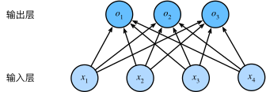

## 一、机器学习中的多分类策略

在多分类问题中，最常用的两种策略是 "一对一" (One-vs-One, OVO) 和 "一对多" (One-vs-Rest, OVR) 方法。这两种方法都是将多分类问题分解成多个二分类问题，进而应用二分类算法来解决。

### 1、一对多 (One-vs-Rest, OVR)

一对多方法将每个类别与所有其他类别进行对比，并为每个类别训练一个二分类器。

#### （1）步骤

**Step1：类别分解**：假设有$ K $ 个类别，则会训练$ K $ 个二分类器。每个分类器$ i $ 用于区分类别$ i $ 和所有其他类别。

**Step2：训练**：对于每个分类器$ i $，所有属于类别$ i $ 的样本被标记为正类 (1)，其他所有样本被标记为负类 (0)。然后，使用二分类算法（如逻辑回归、支持向量机等）训练模型。

**Step3：预测**：在预测阶段，给定一个新样本，所有$ K $ 个分类器都会对其进行预测，产生$ K $ 个得分或概率。最终，选择得分或概率最高的类别作为预测结果。

#### （2）优点

- 实现简单。
- 可扩展性好，适用于大型数据集。

#### （3）缺点

- 训练多个二分类器可能导致一些类别的样本不平衡问题。
- 每个分类器只关注一个类别，可能导致模型不够全局优化。

### 2、一对一 (One-vs-One, OVO)

一对一方法将每一对类别进行对比，并为每一对类别训练一个二分类器。

#### （1）步骤

**Step1：类别分解**：假设有$ K $ 个类别，则需要训练$ \frac{K(K-1)}{2} $ 个二分类器。每个分类器$ (i, j) $ 用于区分类别$ i $ 和类别$ j $。

**Step2：训练**：对于每个分类器$ (i, j) $，只使用类别$ i $ 和类别$ j $ 的样本进行训练，类别$ i $ 的样本标记为正类 (1)，类别$ j $ 的样本标记为负类 (0)。然后，使用二分类算法训练模型。

**Step3：预测**：在预测阶段，给定一个新样本，所有$ \frac{K(K-1)}{2} $ 个分类器都会对其进行预测。每个分类器会投票给一个类别。最终，选择得票数最高的类别作为预测结果。

#### （2）优点

- 每个分类器只处理两个类别的样本，通常效果较好。
- 适用于类别较多但样本量较少的情况。

#### （3）缺点

- 分类器数量随类别数量的增加呈平方级增长，训练和预测的计算复杂度较高。
- 在类别数量很多的情况下，训练和预测时间会显著增加。

### 3、OVO 和 OVR 的比较

- **计算复杂度**：
  - OVR：需要训练$ K $ 个分类器，训练和预测时间较少。
  - OVO：需要训练$ \frac{K(K-1)}{2} $ 个分类器，训练和预测时间较多。

- **处理样本不平衡**：
  - OVR：可能导致某些分类器的正负样本严重不平衡。
  - OVO：每个分类器只处理两个类别，样本不平衡问题较少。

- **模型性能**：
  - OVR：在某些情况下可能表现不佳，特别是当类别之间的边界不明显时。
  - OVO：通常能获得更高的分类精度，因为每个分类器只需区分两个类别，决策边界更明确。

### 4、实际应用中的选择

- 当类别数量较少（如 3-10 个）时，OVO 方法通常表现较好，因为其分类器较少且效果更好。
- 当类别数量较多时（如 10 个以上），OVR 方法更具优势，因为其计算复杂度较低，更易于扩展和实现。

# 二、SoftMax

线性回归模型适用于输出为连续值的情景。在另一类情景中，模型输出可以是一个像图像类别这样的离散值。对于这样的离散值预测问题，我们可以使用诸如softmax回归在内的分类模型。和线性回归不同，softmax回归的输出单元从一个变成了多个，且引入了softmax运算使输出更适合离散值的预测和训练。本节以softmax回归模型为例，介绍神经网络中的分类模型。

### 1、分类问题

让我们考虑一个简单的图像分类问题，其输入图像的高和宽均为2像素，且色彩为灰度。这样每个像素值都可以用一个标量表示。我们将图像中的4像素分别记为$x_1, x_2, x_3, x_4$。假设训练数据集中图像的真实标签为狗、猫或鸡（假设可以用4像素表示出这3种动物），这些标签分别对应离散值$y_1, y_2, y_3$。

我们通常使用离散的数值来表示类别，例如$y_1=1, y_2=2, y_3=3$。如此，一张图像的标签为1、2和3这3个数值中的一个。虽然我们仍然可以使用回归模型来进行建模，并将预测值就近定点化到1、2和3这3个离散值之一，但这种连续值到离散值的转化通常会影响到分类质量。因此我们一般使用更加适合离散值输出的模型来解决分类问题。

### 2、softmax回归模型

softmax回归跟线性回归一样将输入特征与权重做线性叠加。与线性回归的一个主要不同在于，softmax回归的输出值个数等于标签里的类别数。因为一共有4种特征和3种输出动物类别，所以权重包含12个标量（带下标的$w$）、偏差包含3个标量（带下标的$b$），且对每个输入计算$o_1, o_2, o_3$这3个输出：

$$
\begin{aligned}
o_1 &= x_1 w_{11} + x_2 w_{21} + x_3 w_{31} + x_4 w_{41} + b_1,\\
o_2 &= x_1 w_{12} + x_2 w_{22} + x_3 w_{32} + x_4 w_{42} + b_2,\\
o_3 &= x_1 w_{13} + x_2 w_{23} + x_3 w_{33} + x_4 w_{43} + b_3.
\end{aligned}
$$

下图用神经网络图描绘了上面的计算。softmax回归同线性回归一样，也是一个单层神经网络。由于每个输出$o_1, o_2, o_3$的计算都要依赖于所有的输入$x_1, x_2, x_3, x_4$，softmax回归的输出层也是一个全连接层。

既然分类问题需要得到离散的预测输出，一个简单的办法是将输出值$o_i$当作预测类别是$i$的置信度，并将值最大的输出所对应的类作为预测输出，即输出 $\underset{i}{\arg\max} o_i$。例如，如果$o_1,o_2,o_3$分别为$0.1,10,0.1$，由于$o_2$最大，那么预测类别为2，其代表猫。

然而，直接使用输出层的输出有两个问题。一方面，由于输出层的输出值的范围不确定，我们难以直观上判断这些值的意义。例如，刚才举的例子中的输出值10表示“很置信”图像类别为猫，因为该输出值是其他两类的输出值的100倍。但如果$o_1=o_3=10^3$，那么输出值10却又表示图像类别为猫的概率很低。另一方面，由于真实标签是离散值，这些离散值与不确定范围的输出值之间的误差难以衡量。

softmax运算符（softmax operator）解决了以上两个问题。它通过下式将输出值变换成值为正且和为1的概率分布：

$$
\hat{y}_1, \hat{y}_2, \hat{y}_3 = \text{softmax}(o_1, o_2, o_3)
$$

其中

$$
\hat{y}_1 = \frac{ \exp(o_1)}{\sum_{i=1}^3 \exp(o_i)},\quad
\hat{y}_2 = \frac{ \exp(o_2)}{\sum_{i=1}^3 \exp(o_i)},\quad
\hat{y}_3 = \frac{ \exp(o_3)}{\sum_{i=1}^3 \exp(o_i)}.
$$

容易看出$\hat{y}_1 + \hat{y}_2 + \hat{y}_3 = 1$且$0 \leq \hat{y}_1, \hat{y}_2, \hat{y}_3 \leq 1$，因此$\hat{y}_1, \hat{y}_2, \hat{y}_3$是一个合法的概率分布。这时候，如果$\hat{y}_2=0.8$，不管$\hat{y}_1$和$\hat{y}_3$的值是多少，我们都知道图像类别为猫的概率是80%。此外，我们注意到

$$
\underset{i}{\arg\max} o_i = \underset{i}{\arg\max} \hat{y}_i
$$

因此softmax运算不改变预测类别输出。

### 3、单样本分类的矢量计算表达式

为了提高计算效率，我们可以将单样本分类通过矢量计算来表达。在上面的图像分类问题中，假设softmax回归的权重和偏差参数分别为

$$
\boldsymbol{W} = 
\begin{bmatrix}
    w_{11} & w_{12} & w_{13} \\
    w_{21} & w_{22} & w_{23} \\
    w_{31} & w_{32} & w_{33} \\
    w_{41} & w_{42} & w_{43}
\end{bmatrix},\quad
\boldsymbol{b} = 
\begin{bmatrix}
    b_1 & b_2 & b_3
\end{bmatrix},
$$

设高和宽分别为2个像素的图像样本$i$的特征为

$$\boldsymbol{x}^{(i)} = \begin{bmatrix}x_1^{(i)} & x_2^{(i)} & x_3^{(i)} & x_4^{(i)}\end{bmatrix},$$

输出层的输出为

$$\boldsymbol{o}^{(i)} = \begin{bmatrix}o_1^{(i)} & o_2^{(i)} & o_3^{(i)}\end{bmatrix},$$

预测为狗、猫或鸡的概率分布为

$$\boldsymbol{\hat{y}}^{(i)} = \begin{bmatrix}\hat{y}_1^{(i)} & \hat{y}_2^{(i)} & \hat{y}_3^{(i)}\end{bmatrix}.$$

softmax回归对样本$i$分类的矢量计算表达式为

$$
\begin{aligned}
\boldsymbol{o}^{(i)} &= \boldsymbol{x}^{(i)} \boldsymbol{W} + \boldsymbol{b},\\
\boldsymbol{\hat{y}}^{(i)} &= \text{softmax}(\boldsymbol{o}^{(i)}).
\end{aligned}
$$

### 4、小批量样本分类的矢量计算表达式

为了进一步提升计算效率，我们通常对小批量数据做矢量计算。广义上讲，给定一个小批量样本，其批量大小为$n$，输入个数（特征数）为$d$，输出个数（类别数）为$q$。设批量特征为$\boldsymbol{X} \in \mathbb{R}^{n \times d}$。假设softmax回归的权重和偏差参数分别为$\boldsymbol{W} \in \mathbb{R}^{d \times q}$和$\boldsymbol{b} \in \mathbb{R}^{1 \times q}$。softmax回归的矢量计算表达式为

$$
\begin{aligned}
\boldsymbol{O} &= \boldsymbol{X} \boldsymbol{W} + \boldsymbol{b},\\
\boldsymbol{\hat{Y}} &= \text{softmax}(\boldsymbol{O}),
\end{aligned}
$$

其中的加法运算使用了广播机制，$\boldsymbol{O}, \boldsymbol{\hat{Y}} \in \mathbb{R}^{n \times q}$且这两个矩阵的第$i$行分别为样本$i$的输出$\boldsymbol{o}^{(i)}$和概率分布$\boldsymbol{\hat{y}}^{(i)}$。

### 5、交叉熵损失函数

前面提到，使用softmax运算后可以更方便地与离散标签计算误差。我们已经知道，softmax运算将输出变换成一个合法的类别预测分布。实际上，真实标签也可以用类别分布表达：对于样本$i$，我们构造向量$\boldsymbol{y}^{(i)}\in \mathbb{R}^{q}$ ，使其第$y^{(i)}$（样本$i$类别的离散数值）个元素为1，其余为0。这样我们的训练目标可以设为使预测概率分布$\boldsymbol{\hat y}^{(i)}$尽可能接近真实的标签概率分布$\boldsymbol{y}^{(i)}$。

我们可以像线性回归那样使用平方损失函数$\|\boldsymbol{\hat y}^{(i)}-\boldsymbol{y}^{(i)}\|^2/2$。然而，想要预测分类结果正确，我们其实并不需要预测概率完全等于标签概率。例如，在图像分类的例子里，如果$y^{(i)}=3$，那么我们只需要$\hat{y}^{(i)}_3$比其他两个预测值$\hat{y}^{(i)}_1$和$\hat{y}^{(i)}_2$大就行了。即使$\hat{y}^{(i)}_3$值为0.6，不管其他两个预测值为多少，类别预测均正确。而平方损失则过于严格，例如$\hat y^{(i)}_1=\hat y^{(i)}_2=0.2$比$\hat y^{(i)}_1=0, \hat y^{(i)}_2=0.4$的损失要小很多，虽然两者都有同样正确的分类预测结果。

改善上述问题的一个方法是使用更适合衡量两个概率分布差异的测量函数。其中，交叉熵（cross entropy）是一个常用的衡量方法：

$$
H\left(\boldsymbol y^{(i)}, \boldsymbol {\hat y}^{(i)}\right ) = -\sum_{j=1}^q y_j^{(i)} \log \hat y_j^{(i)},
$$
其中带下标的$y_j^{(i)}$是向量$\boldsymbol y^{(i)}$中非0即1的元素，需要注意将它与样本$i$类别的离散数值，即不带下标的$y^{(i)}$区分。在上式中，我们知道向量$\boldsymbol y^{(i)}$中只有第$y^{(i)}$个元素$y^{(i)}_{y^{(i)}}$为1，其余全为0，于是$H(\boldsymbol y^{(i)}, \boldsymbol {\hat y}^{(i)}) = -\log \hat y_{y^{(i)}}^{(i)}$。也就是说，交叉熵只关心对正确类别的预测概率，因为只要其值足够大，就可以确保分类结果正确。当然，遇到一个样本有多个标签时，例如图像里含有不止一个物体时，我们并不能做这一步简化。但即便对于这种情况，交叉熵同样只关心对图像中出现的物体类别的预测概率。

假设训练数据集的样本数为$n$，交叉熵损失函数定义为
$$
\ell(\boldsymbol{\Theta}) = \frac{1}{n} \sum_{i=1}^n H\left(\boldsymbol y^{(i)}, \boldsymbol {\hat y}^{(i)}\right )
$$
其中$\boldsymbol{\Theta}$代表模型参数。同样地，如果每个样本只有一个标签，那么交叉熵损失可以简写成$\ell(\boldsymbol{\Theta}) = -(1/n)  \sum_{i=1}^n \log \hat y_{y^{(i)}}^{(i)}$。从另一个角度来看，我们知道最小化$\ell(\boldsymbol{\Theta})$等价于最大化$\exp(-n\ell(\boldsymbol{\Theta}))=\prod_{i=1}^n \hat y_{y^{(i)}}^{(i)}$，即最小化交叉熵损失函数等价于最大化训练数据集所有标签类别的联合预测概率。

### 6、模型预测及评价

在训练好softmax回归模型后，给定任一样本特征，就可以预测每个输出类别的概率。通常，我们把预测概率最大的类别作为输出类别。如果它与真实类别（标签）一致，说明这次预测是正确的。

### 7、数值稳定的softmax

#### （1）背景

Softmax函数用于将神经网络的输出转换为概率分布，其定义为：
$$
\hat{y}_j = \frac{\exp(o_j)}{\sum_{k} \exp(o_k)}
$$
其中，$\hat{y}_j$是第$j$个类别的预测概率，$o_j$是未规范化的预测得分。

#### （2）数值稳定性问题

直接计算softmax可能会导致数值稳定性问题，特别是在计算大指数值时。例如，如果某些$o_k$非常大，$\exp(o_k)$可能会超过计算机可以表示的最大值，导致上溢（overflow）。这会使分子或分母变成`inf`（无穷大），结果变成无意义的数值。

为了解决这个问题，可以在计算softmax之前，减去一个常数，这个常数通常选择为所有$o_k$中的最大值$\max(o_k)$。具体计算如下：

假设我们有一组未规范化的预测得分$\mathbf{o}$。我们定义新的变量：
$$
o'_j = o_j - \max(o_k)
$$
然后计算softmax：
$$
\hat{y}_j = \frac{\exp(o'_j)}{\sum_{k} \exp(o'_k)}
$$
因为减去一个常数$\max(o_k)$不会改变softmax的相对值，我们引入这一减法项并同时乘回$\exp(\max(o_k))$，所以新的softmax值$\hat{y}_j$和原来的计算结果是相同的。下面是详细推导：

$$
\begin{aligned}
\hat{y}_j & = \frac{\exp(o_j)}{\sum_{k} \exp(o_k)} \\
& = \frac{\exp(o_j - \max(o_k)) \exp(\max(o_k))}{\sum_{k} \exp(o_k - \max(o_k)) \exp(\max(o_k))} \\
& = \frac{\exp(o_j - \max(o_k)) \exp(\max(o_k))}{\exp(\max(o_k)) \sum_{k} \exp(o_k - \max(o_k))} \\
& = \frac{\exp(o_j - \max(o_k))}{\sum_{k} \exp(o_k - \max(o_k))}
\end{aligned}
$$
通过这种方式，计算中的指数部分被减小，避免了可能的上溢问题。

#### （3）结合交叉熵损失的计算

在计算交叉熵损失时，我们可以进一步优化计算来避免下溢（underflow）问题。下溢问题发生在非常小的概率值接近零时。计算交叉熵损失时，我们实际上需要计算log(softmax)。通过将softmax和交叉熵结合，我们可以避免直接计算非常小的数值。

首先，交叉熵损失的定义是：
$$
\text{CrossEntropy} = -\sum_{j} y_j \log(\hat{y}_j)
$$
其中，$y_j$是真实标签的独热编码，$\hat{y}_j$是预测的概率分布。

通过前面的推导，softmax的对数可以写成：
$$
\begin{aligned}
\log(\hat{y}_j) & = \log\left( \frac{\exp(o_j - \max(o_k))}{\sum_{k} \exp(o_k - \max(o_k))}\right) \\
& = \log{(\exp(o_j - \max(o_k)))} - \log{\left( \sum_{k} \exp(o_k - \max(o_k)) \right)} \\
& = o_j - \max(o_k) - \log{\left( \sum_{k} \exp(o_k - \max(o_k)) \right)}
\end{aligned}
$$
这样，我们可以直接计算softmax的对数值而不需要计算非常小的概率值，从而避免了下溢问题。
