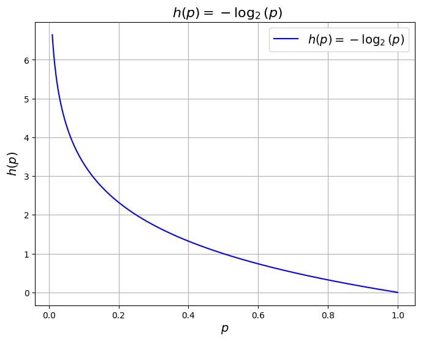
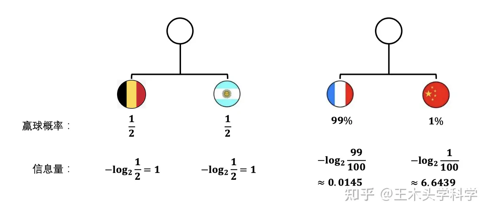
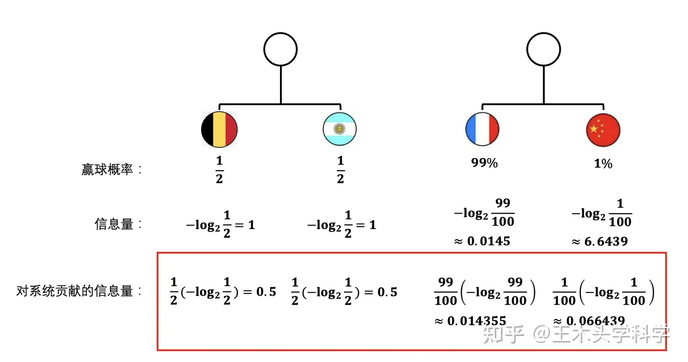
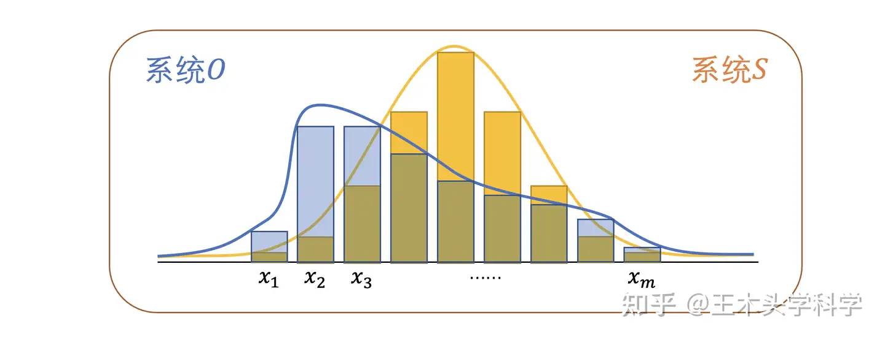
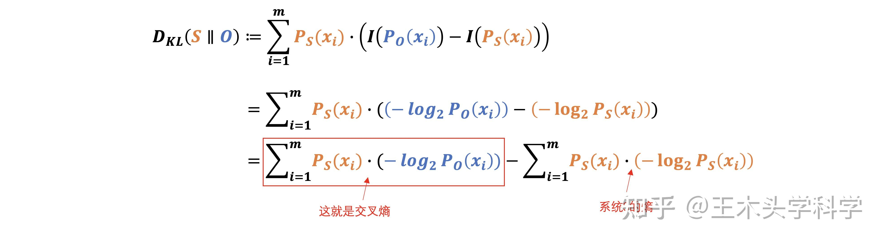

## 一、信息

首先，我们先来理解一下信息这个概念。信息是一个很抽象的概念，百度百科将它定义为：指音讯、消息、通讯系统传输和处理的对象，泛指人类社会传播的一切内容。我们知道我们的世界是由很多的信息构成的，我们需要了解这些信息、沟通这些信息，甚至是度量和测量这些信息的大小。那信息可以被度量么？可以的！香农提出的“信息熵”概念解决了这一问题。

假设我们需要搞清楚一件事，如果这件事的发生非常非常不确定，或者我们之前对此事一无所知，那么就需要了解大量的信息。相反，如果某件事经常发生，我们已经有了较多的了解，我们就不需要太多的信息就能把它搞清楚。所以，从这个角度出发，直觉上我们可以认为，一条信息的信息量的大小和它的不确定性有关系，而我们经常使用概率来说明一个事件的不确定性。

## 二、信息量

假设我们用随机变量$x$来表示事件。信息量可以被看成在学习$x$的值的时候的“惊讶程度”。举个例子说明一下，比如，有人说广州下雪了。对于这句话，我们是十分不确定的。因为广州几十年来下雪的次数寥寥无几，发生的概率很低。为了搞清楚这件事，我们就要去看天气预报，新闻，询问在广州的朋友，而这就需要大量的信息，信息量很大。再比如，你接到了妈妈打来的电话，让你晚上回家吃饭。对于这件事，因为它很可能发生，几乎不需要引入信息，信息量很小。我们想找到一个函数$h(x)$来衡量事件信息量的大小。这里用$h(x_1)$和$h(x_2)$来表示上面的两个例子的信息量，那么，怎么表示$h(x_1)$和$h(x_2)$之间的大小关系呢？怎么寻找到函数$h(x)$呢？

从上边的例子出发，首先，直觉上看，事件$x$的信息量应该和它的概率分布$p(x)$有关，而且信息量$h(x)$增大，$p(x)$减小，而$h(x)$减小，则$p(x)$增大，可以认为是$h(x)$和$\frac{1}{p(x)}$之间的关系。当然，此时也可能认为是$h(x)$和$−p(x)$的关系，我们后面再说。

其次，我们考虑观察两个事件同时发生时获得的信息量，假设是两个不相关的事件，它和每个事件的信息量有什么关系呢？也就是说你听说广州下雪了，同时你接到了妈妈的电话叫你回家吃饭，这两件事应该是独立的，所以它们的信息量应该是和的关系，即$h(x_1,x_2)=h(x_1)+h(x_2)$。

最后，一个信息量的函数应该是大于零、等于零还是小于零呢？如果你接到了妈妈的电话，你至多也就是觉得这个电话对你来说没有任何的信息，而你的信息是不会跑到你妈妈那里的。所以这个函数应该是大于等于0的，即$h(x)≥0$。回过头来看，前面认为的$h(x)$和$−p(x)$的关系是不太合理的，因为$p(x)$是一个大于等于0的数。

综上，就想到了以下函数：

$$
h(x) = \log_2 \frac{1}{p(x)}
$$

首先，函数满足$p(x)$减小，$h(x)$增大，而$p(x)$增大，则$h(x)$减小；

其次，因为两个事件是独立的，因此$p(x_1,x_2) = p(x_1)p(x_2)$。所以

$$
h(x_1,x_2) = \log_2 \frac{1}{p(x_1)p(x_2)} = \log_2 \frac{1}{p(x_1)} + \log_2 \frac{1}{p(x_2)} = - (\log_2 (p(x_1)) + \log_2 (p(x_2)))
$$

最后，显然$h(x)$是大于等于0的。

因此，我们得到了信息量函数 (information function):

$$
h(x) = - \log_2 p(x) \tag{1}
$$

其中, 对数函数底的选择是任意的，信息论中底常常选择为2，$h(x)$的单位为比特 (bit)，而机器学习中底常常选择为自然常数，$h(x)$的单位为奈特 (nat)。

$h(x)$也被称为随机变量$x$的自信息 (self-information)，描述的是随机变量的某个事件发生所带来的信息量。如下图所示：

## 三、信息熵 (Information Entropy)

熵这个概念现在已经比较出圈，原本偏门的学术概念，如今在互联网圈子里人尽皆知。尤其是“熵增”这一概念，因为它涉及到整个宇宙的宿命：宇宙的未来在不可对抗的熵增过程中归于热寂。

在科普内容中，熵通常被描述为对一个系统的混乱程度的度量。虽然很难还原先贤们最初提出熵这个概念的想法，但我们可以通过逆向工程来理解熵，具体来看系统的混乱程度是什么意思，以及为什么用信息量可以描述系统的混乱程度。

我们来看两个系统的例子：比利时对战阿根廷（系统1）和法国对中国（系统2）。

- 系统1：比利时对阿根廷，两队赢球的概率都是50%。
- 系统2：法国对中国，法国赢球的概率99%，中国赢球的概率1%。

### 1、哪个系统的混乱程度更高？

直觉上，法国对中国的比赛结果更确定，而比利时对阿根廷的比赛结果更不确定。我们用不确定的程度来描述比赛的混乱程度，比利时对阿根廷的比赛因为结果特别不确定，所以很混乱。

### 2、信息量计算

通过信息量来描述：
- 系统1（比利时对阿根廷）：无论谁获胜，信息量都是1bit。
- 系统2（法国对中国）：法国赢球的信息量很少，而中国赢球的信息量超过6.6bit。

如果简单地把信息量加起来，系统1的信息量总和是2bit，系统2的信息量总和取决于加权求和的结果，明显系统1的信息量更少。

### 3、熵的加权求和

熵是系统里所有可能事件对应的信息量的加权和，权重是事件发生的概率。这样，加权之后的熵才合理。比如，中国队夺冠的信息量很大，但它发生的概率只有1%，因此它对系统的总信息量贡献较小。

加上权重之后，就合理了，从上图就可以看出系统1得到的值的确是比系统2更大了。

而且这个加上权重的动作也挺合理的，就比如说，中国队夺冠了这个事情如果发生了的话，信息量的确还挺大的，但是它得真发生了才行了，可事实呢，它只有1%的可能性发生，99%的可能性都是法国夺冠。

所以，一个系统到底含有多少信息量，那还需要看具体一个事件对整个系统到底能贡献多少信息量才行。如果事件没发生，那就是没有贡献，就不能放在总和里面。越是一个事件贡献了多少信息量，就可以理解成信息量乘上对应事件发生的概率。

### 4、熵的定义

熵的定义：熵是所有事件对应的信息量的加权和，即系统信息量的期望值。熵公式表示为：

$$
H(S) = \mathbb{E}[I(x)] = -\sum_{i} P(x_i) \log P(x_i)
$$
其中：
- $ H(S) $ 表示系统 $ S $ 的熵
- $\mathbb{E}$ 是求期望
- $ I(x) $ 是求信息量
- $ P(x_i) $ 表示事件 $ x_i $ 发生的概率

可以看出，熵是信息量的期望值，是一个随机变量（一个系统，事件所有可能性）不确定性的度量。熵值越大，随机变量的取值就越难确定，系统也就越不稳定；熵值越小，随机变量的取值也就越容易确定，系统越稳定。

### 5、熵在概率分布比较中的作用

熵的定义明确后，我们的目的是比较两个概率分布（一个表示真实规律，一个表示机器学习猜测的规律）的差距。然而，真实规律的概率分布是不知道的，因此无法直接求它的熵。

即便不知道一个概率分布的熵具体是多少，也可以通过KL散度和交叉熵来衡量两个概率分布之间的差距。

## 四、相对熵（KL 散度）

假如说，下面这个图表示的是两个系统的概率分布，其中系统$S$代表的是真实的规律，系统$O$代表的是机器学习模型里面猜测的那个规律。

这两个系统的概率分布如果是相同的话，那么两个系统的熵也一定是相等的，两个系统越像，熵也越接近。

不过，两个系统的熵相同并不意味着它们的概率分布就一定相同。简单的一个数字，维度太少了。一张200元的高铁票和一件200元的衣服，它们价格相同，但却是完全不同的东西。

因此，比较两个系统的相似性不能仅仅依靠熵，而需要用到**KL散度**（Kullback-Leibler Divergence）这个概念。

KL散度通过比较每一个事件的信息量来衡量两个概率分布的不同。其定义为：

这里的定义是一个加权求和，其中的权重是事件在系统$S$中的概率。KL散度在两个系统中选择一个作为基准进行比较，因此它也叫**相对熵**。

相对熵具有以下性质：

- 如果 $p(x)$ 和 $q(x)$ 的分布相同，则其相对熵等于 0。
- $D_{KL}(p \parallel q) \neq D_{KL}(q \parallel p)$，相对熵不具有对称性。
- $D_{KL}(p \parallel q) \geq 0$。

我们的目标是什么？是希望机器学习模型中猜测出来的那个概率分布$O$与真实的概率分布$S$接近。如果用KL散度来表示接近程度的话，目标就是使得KL散度尽可能地接近数值0，因为KL散度正值太大、负值太小都不符合实际情况。

KL散度的定义可以变形为：

经过变形之后我们就能发现，KL散度可以被分成两个部分，其中后面的那个部分计算出来就是系统$S$的熵，这部分的值是与系统$O$无关的。所以，真正决定KL散度的其实是前面那部分，它的大小决定着KL散度的大小。

于是这部分就可以被单独拿出来讨论，所以它被定义成为了**交叉熵**。想知道系统$S$和系统$O$是否一样，不需要去计算它们的KL散度，只需要去看它们的交叉熵即可。

## 五、交叉熵

设 $p(x)$ 和 $q(x)$ 分别是离散随机变量 $X$ 的两个概率分布，其中 $p(x)$ 是目标分布，$p$ 和 $q$ 的交叉熵可以看作是使用分布 $q(x)$ 表示目标分布 $p(x)$ 的困难程度：

$$
H(p, q) = -\sum_i p(x_i) \log(q(x_i))
$$
如果我们的目标不用KL散度来表示，而是用交叉熵来表示，应该是什么样子的呢？从前面推导出的式子中我们可以看到，我们的目标可以表示为交叉熵的值与系统$S$的熵最接近时目标达成。

但这也带来了问题，即如何找到最合适的交叉熵，涉及到两种情况：

- 当交叉熵的值大于系统$S$的熵时，我们的目标是寻找交叉熵的最小值。
- 当交叉熵的值小于系统$S$的熵时，我们的目标是寻找交叉熵的最大值。

然而，数学上证明了交叉熵的值总是大于等于$S$的熵，因此只需要考虑如何**最小化交叉熵**。最小化交叉熵的方法也称为**最大似然估计法**。

**吉布斯不等式**证明了交叉熵总是大于等于熵，感兴趣的话可以进一步了解。

## 六、交叉熵与KL散度

设 $ p(x) $ 和 $ q(x) $ 分别是离散随机变量 $ X $ 的两个概率分布，其中 $ p(x) $ 是目标分布，$ q(x) $ 是近似分布。我们将围绕KL散度的计算形式来解释熵、交叉熵以及KL散度之间的关系。对于离散随机变量 $ X $，KL散度的定义为：

$$
D_{KL}(p \| q) = \sum_{i=1}^m p(x_i) \log \left(\frac{p(x_i)}{q(x_i)}\right)
$$

我们可以将KL散度的定义展开，利用对数的运算性质，这可以进一步拆解为：

$$
D_{KL}(p \| q) = \sum_{i=1}^m p(x_i) \left(\log(p(x_i)) - \log(q(x_i))\right)
$$

可以将它表示为两部分：

$$
D_{KL}(p \| q) = \sum_{i=1}^m p(x_i) \log(p(x_i)) - \sum_{i=1}^m p(x_i) \log(q(x_i))
$$

为了理解KL散度的计算，我们需要引入熵和交叉熵的概念：

- **熵（Entropy）**：目标分布 $ p(x) $ 的熵是对 $ p(x) $ 不确定性的度量，定义为：

  $$
  H(p) = -\sum_{i=1}^m p(x_i) \log(p(x_i))
  $$

- **交叉熵（Cross-Entropy）**：使用分布 $ q(x) $ 来近似分布 $ p(x) $ 的困难程度，定义为：

  $$
  H(p, q) = -\sum_{i=1}^m p(x_i) \log(q(x_i))
  $$

从KL散度的定义式可以看到：

$$
D_{KL}(p \| q) = \left[ -\sum_{i=1}^m p(x_i) \log(q(x_i)) \right] - \left[ -\sum_{i=1}^m p(x_i) \log(p(x_i)) \right]
$$

这可以进一步表示为：

$$
D_{KL}(p \| q) = H(p, q) - H(p)
$$

在机器学习中，目标的分布 $ p(x) $ 通常是训练数据的分布，它是固定的。通过最小化交叉熵 $ H(p, q) $ 可以等效地最小化KL散度 $ D_{KL}(p \| q) $，从而优化模型使得 $ q(x) $ 更加接近 $ p(x) $。

至此，我们已经了解了交叉熵的来源以及为什么在交叉熵最小时，两个概率分布最接近。

但这个概念是如何应用到神经网络中的？它对应的损失函数应该如何设计？为什么求交叉熵最小的方法，又可以被称为**最大似然估计法**？

## 七、从最大似然估计角度看交叉熵

### 1、最大似然估计（MLE）

假设有一组训练样本$X = \{x_1, x_2, \ldots, x_m\}$，这些样本的分布为$p(x)$。假设使用参数$\theta$ 参数化模型得到$q(x; \theta)$，现用这个模型来估计$X$ 的概率分布，得到似然函数：

$$
L(\theta) = q(X; \theta) = \prod_{i=1}^m q(x_i; \theta)
$$
最大似然估计（MLE）就是求得$\theta$ 使得$L(\theta)$ 的值最大，即：

$$
\theta_{ML} = \arg\max_\theta \prod_{i=1}^m q(x_i; \theta)
$$
对上式的两边同时取对数，得到对数似然函数（log-likelihood）：

$$
\theta_{ML} = \arg\max_\theta \sum_{i=1}^m \log q(x_i; \theta) 
$$
对上式的右边进行缩放并不会改变$\arg\max$ 的解，即上式的右边除以样本的个数$m$：

$$
\theta_{ML} = \arg\max_\theta \frac{1}{m} \sum_{i=1}^m \log q(x_i; \theta)
$$

### 2、和相对熵的关系

上式的最大化$\theta_{ML}$ 是和训练样本的分布无关的。为了使其可以用训练的样本分布表示，我们需要某种变换，因为训练样本的分布$p(x)$ 是已知的，也是对最大化似然的一个约束条件。

注意，上式中的：

$$
 \frac{1}{m} \sum_{i=1}^m \log q(x_i; \theta)
$$
相当于求随机变量$X$ 的函数$\log(q(X; \theta))$ 的均值。根据大数定理，随着样本容量的增加，样本的算术平均值将趋近于随机变量的期望。也就是说：

$$
\frac{1}{m} \sum_{i=1}^m \log q(x_i; \theta) \rightarrow \mathbb{E}_{X \sim P}[\log q(x; \theta)]
$$
其中，$\mathbb{E}_{X \sim P}$ 表示符合样本分布$P$ 的期望，这样就将最大似然估计使用真实样本的期望来表示：

$$
\theta_{ML} = \arg\max_\theta \mathbb{E}_{X \sim P}[\log q(x; \theta)] = \arg\min_\theta \mathbb{E}_{X \sim P}[-\log q(x; \theta)]
$$
对右边取负号，将最大化变成最小化运算。

### 3、和交叉熵的等价性

最大似然估计、相对熵、交叉熵的公式如下：

最大似然估计：
$$
 \theta_{ML} = \arg\min_\theta \mathbb{E}_{X \sim P}[-\log q(x; \theta)] 
$$

相对熵（KL 散度）：
$$
D_{KL}(p \parallel q) = \mathbb{E}_{X \sim P} \left[ \log \frac{p(x)}{q(x)} \right] = \mathbb{E}_{X \sim P}[\log p(x)] - \mathbb{E}_{X \sim P}[\log q(x)]
$$

交叉熵：
$$
H(p, q) = -\sum_{i} p(x_i) \log q(x_i) = -\mathbb{E}_{X \sim P}[\log q(x)]
$$
由于$\mathbb{E}_{X \sim P}[\log p(x)]$ 是训练样本的期望，是个固定的常数，在求最小值时可以忽略。所以最小化$D_{KL}(p \parallel q)$ 就变成了最小化$-\mathbb{E}_{X \sim P}[\log q(x)]$，这和最大似然估计是等价的。

从上面可以看出，最小化交叉熵也就是最小化$D_{KL}$，从而使预测的分布$q(x)$ 和训练样本的真实分布$p(x)$ 最接近。而最小化$D_{KL}$ 和最大似然估计是等价的。

## 八、多分类交叉熵

在多分类任务中，模型输出的是目标属于每个类别的概率，这些概率的和为1，其中概率最大的类别就是预测的分类。为了满足这一要求，使用softmax函数对模型的输出进行处理。

### 1、Softmax函数

Softmax函数可以将一个向量的每个分量映射到\[0, 1\]区间，并且对整个向量的输出做了归一化，保证所有分量输出的和为1。Softmax函数定义如下：

$$
S_i = \frac{e^{z_i}}{\sum_{j=1}^n e^{z_j}}
$$
其中，输入的向量为$ z_i (i=1, 2, \ldots, n) $。

通过softmax函数，可以将模型提取的特征向量$ (z_1, z_2, \ldots, z_k) $映射到每个类别的概率，概率最大的就是预测得到的目标类别。

### 2、交叉熵损失函数

在得到类别的概率分布后，使用交叉熵作为损失函数来衡量预测分布与真实分布之间的差异。交叉熵损失定义如下：

$$
H(p, q) = -\sum_{i} p(c_i) \log q(c_i)
$$
其中，$ p(c_i) $是训练数据中类别的真实分布，$ q(c_i) $是预测分布。

### 3、One-Hot编码

每个训练样本所属的类别是已知的，并且每个样本只会属于一个类别（概率为1），属于其他类别概率为0。具体的，可以假设有个三分类任务，三个类分别是：猫，猪，狗。现有一个训练样本类别为猫，则有：

$$
p(\text{cat}) = 1 \\
p(\text{pig}) = 0 \\
p(\text{dog}) = 0 
$$
假设预测得到的三个类别的概率分别为：

$$
q(\text{cat}) = 0.6, \quad q(\text{pig}) = 0.2, \quad q(\text{dog}) = 0.2
$$
计算 $ p $ 和 $ q $ 的交叉熵为：

$$
H(p, q) = -\left( p(\text{cat}) \log q(\text{cat}) + p(\text{pig}) \log q(\text{pig}) + p(\text{dog}) \log q(\text{dog}) \right) \\
= -\left( 1 \cdot \log 0.6 + 0 \cdot \log 0.2 + 0 \cdot \log 0.2 \right) \\
= -\log 0.6 = -\log q(\text{cat})
$$
利用这种特性，可以将样本的类别进行重新编码，这种编码方式就是one-hot编码。以上面例子为例，

$$
\text{cat} = (1, 0, 0) \\
\text{pig} = (0, 1, 0) \\
\text{dog} = (0, 0, 1)
$$
通过这种编码方式，在计算交叉熵时，只需要计算和训练样本对应类别预测概率的值，其他的项都是 $ 0 \cdot \log q(c_i) = 0 $。

## 九、二分类交叉熵

在二分类任务中，通常使用sigmoid函数将输出映射为正样本的概率，因为只有两个类别（正样本和负样本），只需要求得正样本的概率 $ q $，则 $ 1 - q $ 就是负样本的概率。

二分类的交叉熵可以看作是交叉熵损失的一个特例。交叉熵为：

$$
\text{Cross\_Entropy}(p, q) = -\sum_{i} p(x_i) \log q(x_i)
$$
这里只有两个类别 $ x \in \{x_1, x_2\} $，则有：

$$
\text{Cross\_Entropy}(p, q) = -(p(x_1) \log q(x_1) + p(x_2) \log q(x_2))
$$
因为只有两个选择，则有 $ p(x_1) + p(x_2) = 1 $ 和 $ q(x_1) + q(x_2) = 1 $。设训练样本中 $ x_1 $ 的概率为 $ p $，则 $ x_2 $ 为 $ 1 - p $; 预测的 $ x_1 $ 的概率为 $ q $，则 $ x_2 $ 的预测概率为 $ 1 - q $。上式可改写为：

$$
\text{Cross\_Entropy}(p, q) = -(p \log q + (1 - p) \log (1 - q))
$$
这就是二分类交叉熵的损失函数。

## Reference

- [一文搞懂交叉熵损失 ](https://www.cnblogs.com/wangguchangqing/p/12068084.html)
- [熵、条件熵、相对熵、交叉熵和互信息](https://www.cnblogs.com/dataanaly/p/12906163.html)
- [“交叉熵”如何做损失函数？打包理解“信息量”、“比特”、“熵”、“KL散度”、“交叉熵”](https://zhuanlan.zhihu.com/p/467294700)