本章介绍人工智能中的对抗攻击。在前面的章节中，我们了解了各种神经网络及其高准确率。然而，仅仅提高准确率并不足以应对实际应用中的挑战。神经网络还需要能够抵御恶意攻击。特别是在检测恶意行为时，攻击者会尝试欺骗网络。因此，研究对抗攻击是十分必要的。

## 一、对抗攻击简介

我们首先了解一下所谓的对抗攻击。比如，我们使用神经网络进行电子邮件垃圾邮件过滤。垃圾邮件发送者会尽力避免其邮件被分类为垃圾邮件。因此，模型需要具备高度的鲁棒性。

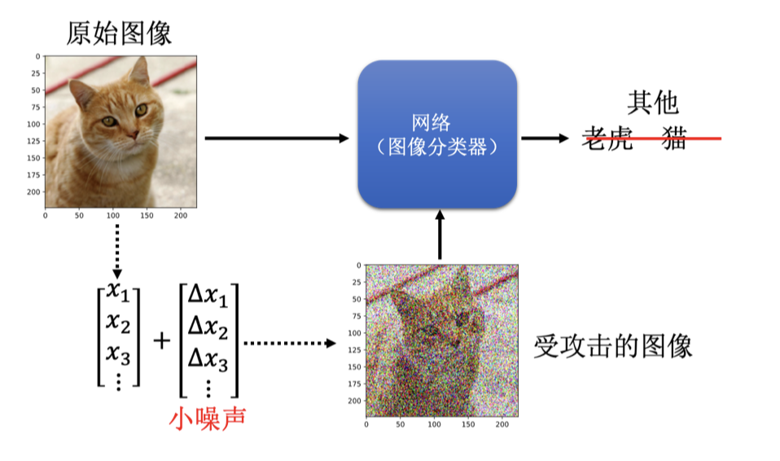

上图展示了一个图像识别模型的例子。在原始图像上加入微小的噪声，形成受攻击图像，然后输入网络中查看分类结果。尽管噪声微小到肉眼难以察觉，但网络的输出可能会发生显著变化。受攻击图像的输出被期望与原始图像不同。攻击可以分为两种类型：无目标攻击和有目标攻击。无目标攻击只需输出不是预期类别即为成功，而有目标攻击则要求输出为特定类别。

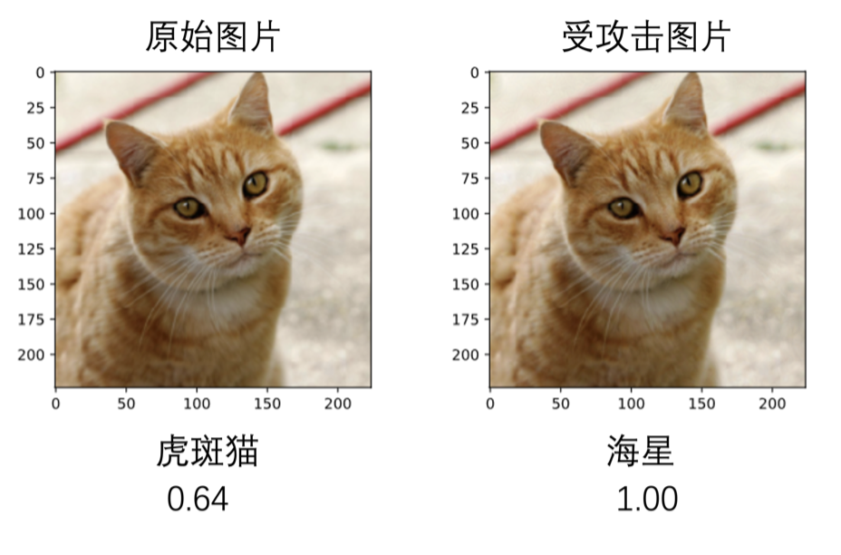

例如，使用50层的ResNet进行图像分类，如上图所示。原始图像被分类为虎斑猫，置信得分为0.64。加入噪声后，图像被错误分类为海星，且置信得分为1。网络在这种情况下给出了确定的错误答案。下图展示了普通噪声对识别结果的影响，较大噪声可能导致网络错误分类为壁炉。

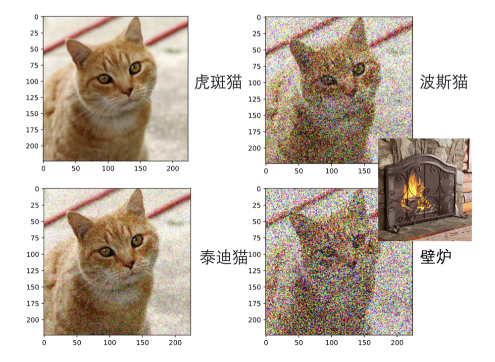

## 二、如何进行网络攻击

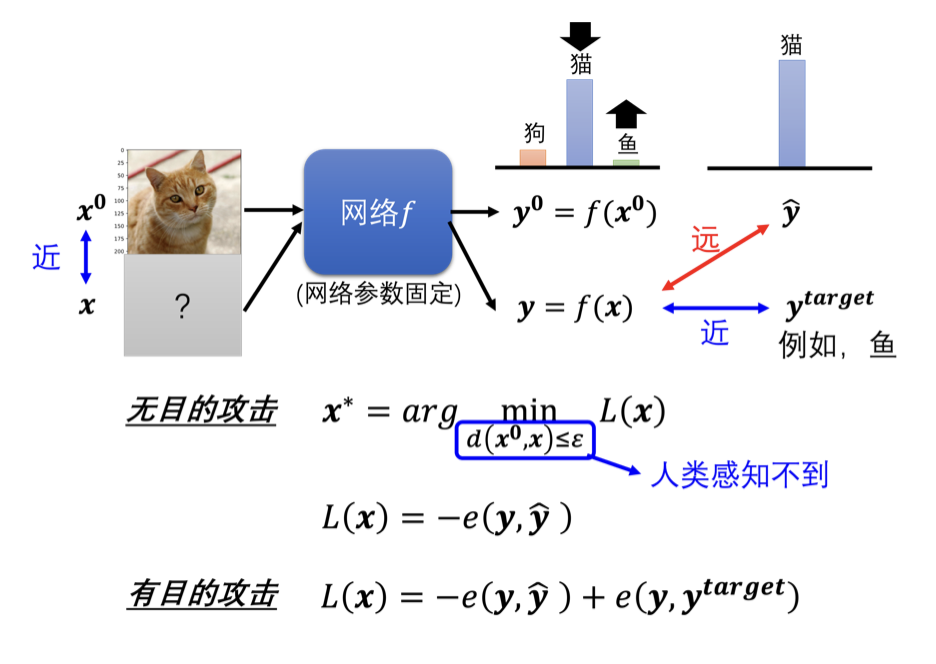

在解释噪声影响识别结果之前，我们先看看攻击的具体实施方法。如上图所示，假设网络的参数是固定的，我们需要找到一张新的图片$x$，使得网络输出$y$与正确答案$\hat{y}$的差距尽可能大。这是无目标攻击。如果是有目标攻击，我们希望$y$与$\hat{y}$越远越好，还要与目标类别$y_{target}$越近。我们的损失函数为：

$$
L(x) = -e(y, \hat{y}) + e(y, y_{target})
$$
为了最小化损失，同时保证加入的噪声尽可能小，我们需要加入一个限制，即$x$与$x_0$之间的差距要小于某个阈值$\epsilon$，可以表示为$L2$范数的形式：

$$
\|x_0 - x\|_2 \leq \epsilon
$$

假设$x$和$x_0$是向量，维度为图片的像素数。向量相减记为$\Delta x$，其距离可以使用$L2$范数表示：

$$
d(x_0, x) = \|\Delta x\|_2 = \sqrt{(\Delta x_1)^2 + (\Delta x_2)^2 + \cdots}
$$

或者使用$L-\infty$范数：

$$
\|\Delta x\|_\infty = \max(|\Delta x_1|, |\Delta x_2|, \cdots)
$$

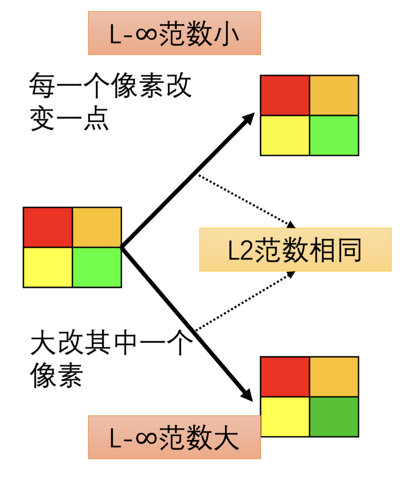

上图展示了$L2$范数和$L-\infty$范数的区别。$L-\infty$范数更符合人类感知能力，因为它关注最大的变化量。

我们要做的事情是找到一个$x$来最小化损失值，同时保证$x$和$x_0$之间的距离不超过$\epsilon$。这可以通过梯度下降来实现。下图展示了如何在更新梯度后进行限制，以保证$x$落在允许的范围内。

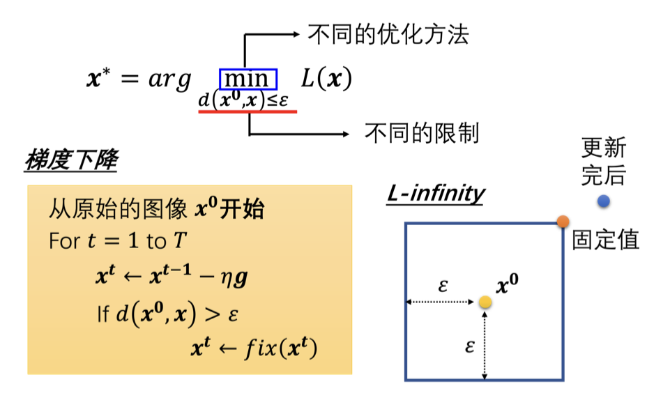

## 三、快速梯度符号法

快速梯度符号法(FGSM)是一种简单的攻击方法，只需一次梯度更新。具体来讲，FGSM将原始梯度$g$进行符号函数处理：

$$
g' = \text{sign}(g)
$$
然后将学习率$\eta$设置为$\epsilon$，得到更新后的$x$。下图展示了FGSM的效果。

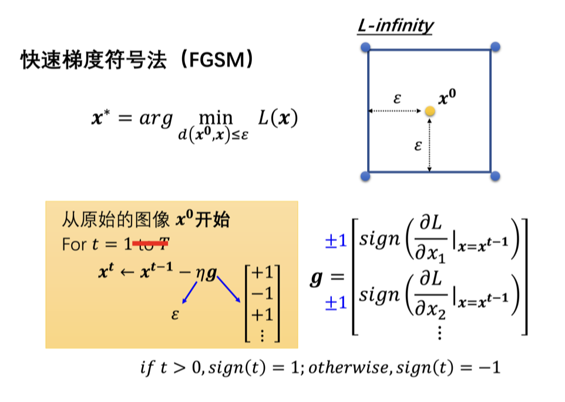

下图展示了基于迭代的FGSM，其效果比原始FGSM更好，但也更加复杂。

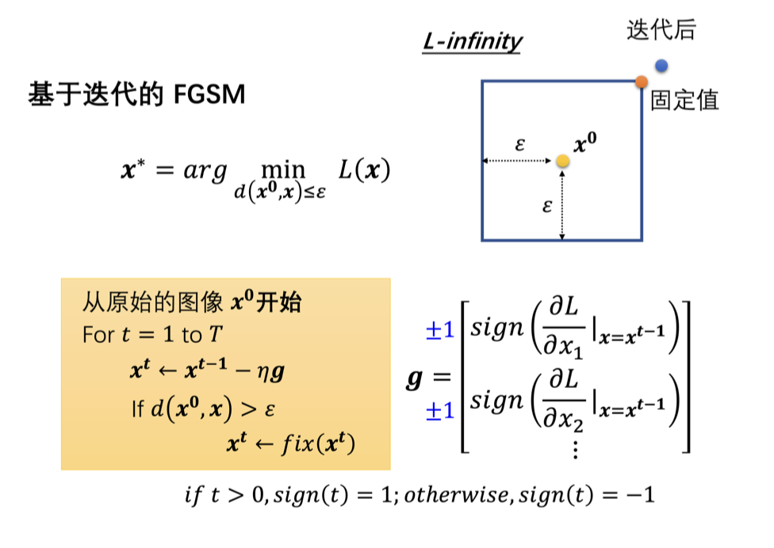

## 四、白盒攻击与黑盒攻击

### 1、白盒攻击

白盒攻击指的是攻击者完全了解模型的内部参数、结构、输入输出及损失函数等信息，从而能够计算梯度，并在图像上添加噪声来实现攻击。由于需要知道模型的具体参数，白盒攻击在实际中并不常见，因为大多数线上服务的模型参数是保密的。要保护模型不被白盒攻击，只需避免公开模型的详细信息。

### 2、黑盒攻击

黑盒攻击不需要知道模型的具体参数。攻击者通过一些方法来反推模型的参数。例如，如果知道模型使用的训练数据，可以训练一个代理网络模仿目标模型。如果代理网络和目标模型使用相同的训练数据，它们可能具有一定的相似性。攻击者可以对代理网络进行攻击，从而间接攻击目标模型。下图展示了这一过程。

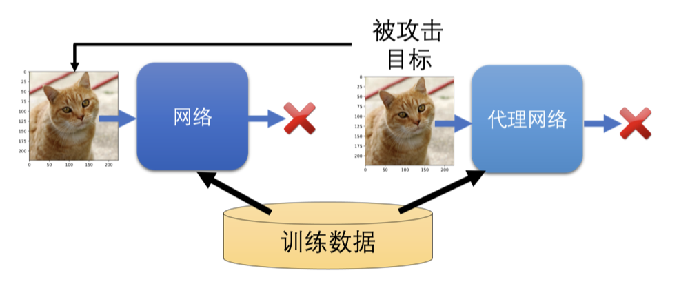

若没有训练数据且不清楚目标模型的训练数据，可以直接将现有图片输入目标模型，记录输入输出数据对，训练一个代理网络，再对代理网络进行攻击。黑盒攻击通常容易成功，如下图所示。图中列出不同网络架构（如ResNet-152、VGG-16等）作为代理网络和被攻击网络的组合，显示了不同组合下的攻击成功率。表中对角线部分代表白盒攻击，成功率最高；非对角线部分代表黑盒攻击，成功率也很高，证明黑盒攻击也具有较高的有效性。

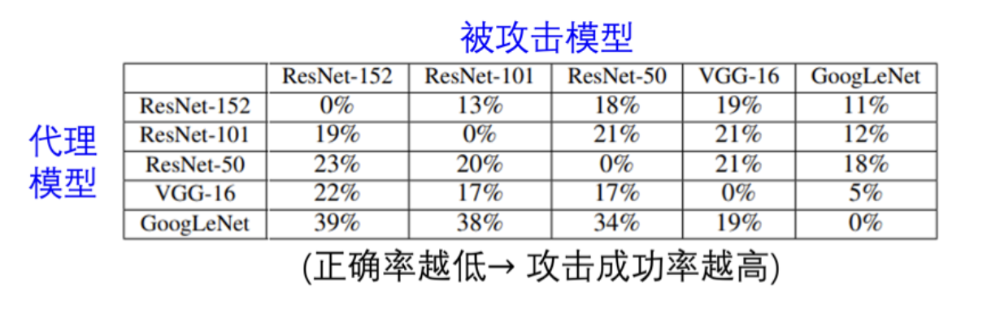

为了提高黑盒攻击的成功率，可以使用集成学习的方法，即使用多个代理网络进行攻击。如下图所示，使用不同组合的多个网络进行攻击，成功率进一步提高。

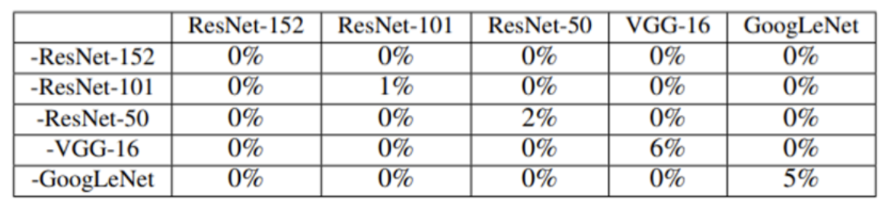

### 3、黑盒攻击成功的原因

实验表明，攻击方向对不同网络的影响非常相似。例如，下图展示了一张小丑鱼图片在不同方向上的移动情况。横轴表示在VGG-16上可以攻击成功的方向，纵轴表示随机方向。结果显示，在VGG-16攻击方向上移动，小丑鱼图片在其他网络上也很容易被攻击成功。这说明，数据本身特征在不同模型中的表现相似，是黑盒攻击成功的原因之一。

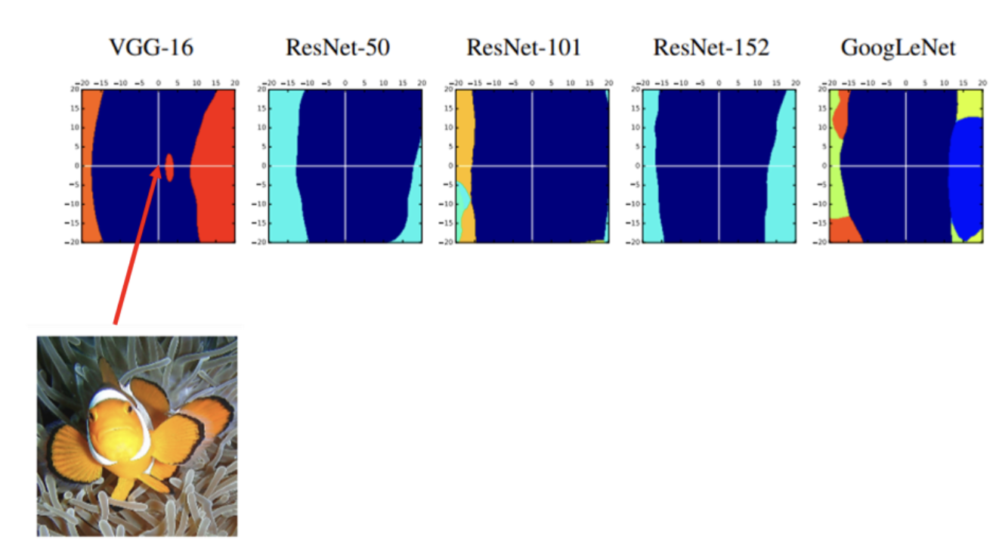

### 4、单像素攻击

单像素攻击只需修改图像中的一个像素就能误导模型，如下图所示。这些例子展示了单像素攻击的局限性，尽管攻击成功率不高，但展示了攻击模型的可能性。

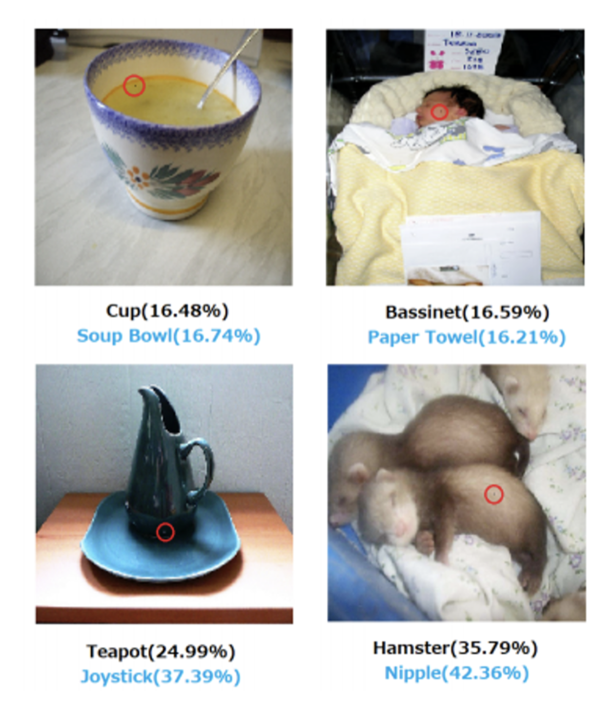

### 5、通用对抗攻击

通用对抗攻击旨在找到一个可以攻击所有图片的通用信号。现实中，我们不可能为每张图片单独寻找攻击信号，通用攻击提供了更为实际的攻击方式。

## 五、其他模态数据的攻击案例

除了图像，语音数据也可能被攻击。例如，通过语音合成或转换技术模拟某些人的声音进行诈骗。尽管语音合成系统可以产生以假乱真的声音，但这些声音仍然存在固定模式和特征，与真实声音有差异。利用机器学习方法可以检测这些差异。然而，加入微小噪声后，这些检测系统可能会误判合成声音为真实声音。

## 六、现实世界中的攻击

### 1、虚拟世界攻击

前述攻击大多在虚拟世界中进行，即在内存中对图像添加噪声。

### 2、物理世界攻击

在现实世界中，攻击可以通过物理手段实现。例如，人脸识别系统可以通过在脸上画妆或戴上特制眼镜来欺骗。如下图所示，戴上特制眼镜后，人脸识别系统将某人识别为另一知名艺人。文章考虑了物理世界的多角度观看和摄像头清晰度有限等问题。

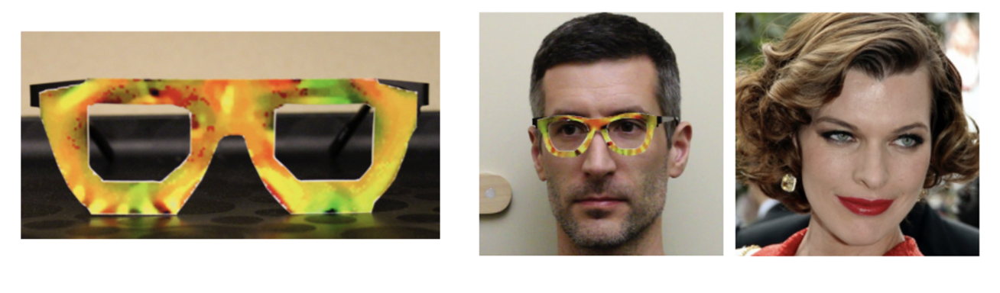

### 3、交通标志牌攻击

交通标志牌也可能被攻击，如下图所示。攻击者可能通过修改标志牌，使识别系统误读标志内容，从而导致潜在交通安全威胁。

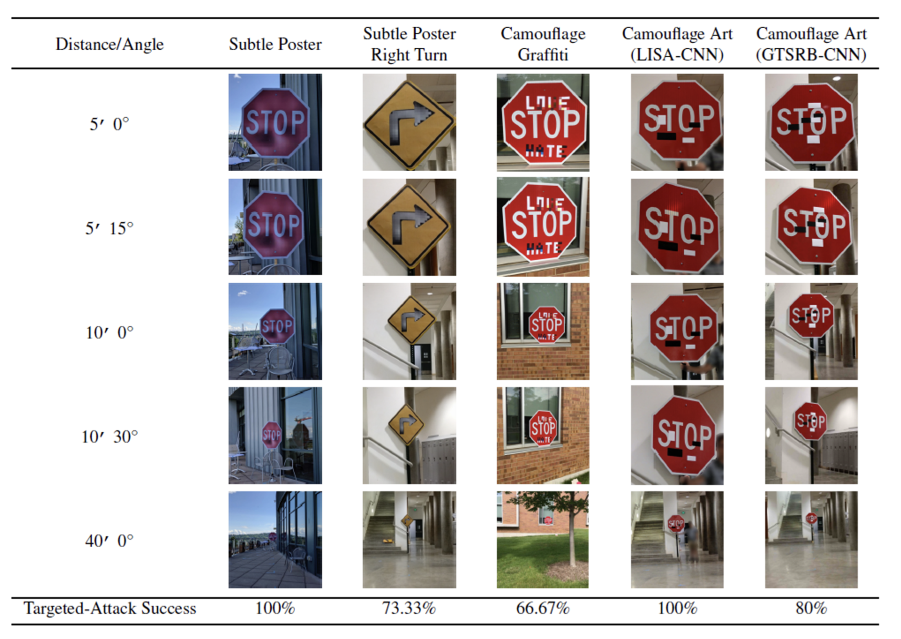

### 4、对抗性重编程

对抗性重编程让一个本来正常工作的图像识别系统做出一些它原本不会做的事情。想象一下，你有一个智能相机，它可以识别图片中的物体，比如区分猫和狗。但是，如果有人想要让这个相机把猫误认为是狗，他们可能会在猫的图片上做一些小改动，比如加上一些几乎看不见的点或线条。这些小改动就是所谓的“噪声”，它们对于我们人类来说可能看起来没什么大不了的，但是对于图像识别系统来说，这些小变化足以让它混淆，从而做出错误的判断。

例如，下图展示了将方块数量的图片输入到ImageNet分类器中，通过加入噪声让分类器输出特定结果，从而实现对抗性重编程。简单来说，对抗性重编程就像是给图像识别系统施了一个小小的魔法，让它看到的东西和实际上的东西不一样。

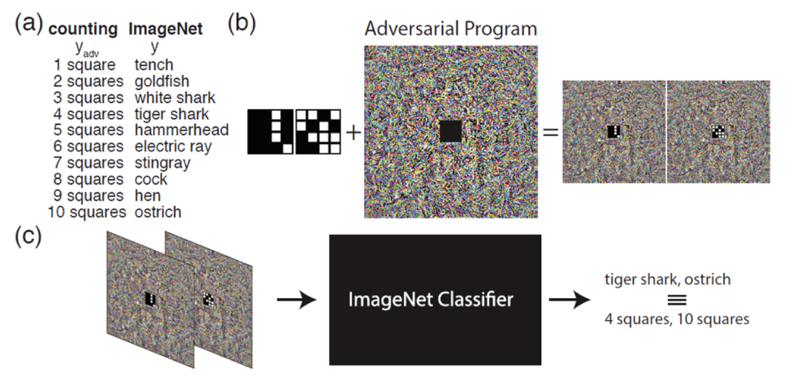

### 5、后门攻击

后门攻击在训练阶段就进行，目的是在测试阶段实现特定图片的错误识别。下图展示了这一方法，通过在训练数据中加入特定的、表面正常但实际有问题的数据，训练出带有后门的模型。这个模型在面对特定攻击图片时会产生错误识别，而对其他图片仍能正常识别。这种攻击方式非常隐蔽且危险，使用外部数据集时需谨慎检查数据集的安全性。

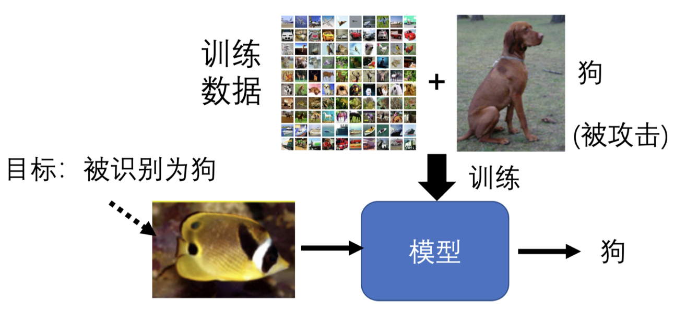

## 七、被动防御

在介绍了各种攻击方式后，我们继续介绍防御方式。防御方式主要分为两类：被动防御和主动防御。

### 1、被动防御

被动防御是指在已训练好的模型前加一个“盾牌”或滤波器，如下图所示。这种滤波器可以削减攻击信号的威力，使模型不易受到攻击影响。设计滤波器的方法比较简单，例如稍微模糊图片即可削弱攻击信号。

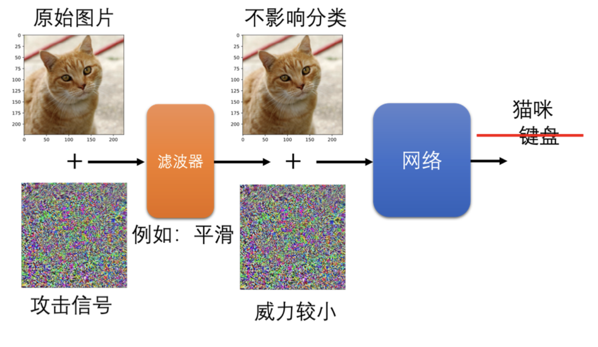

举个例子，如下图所示，左上角的图片在添加了非常小的噪声后被系统识别为键盘。通过轻微的平滑模糊化处理，图片变为右上角，再输入到同一个图像识别系统中，识别结果变成了正确的虎斑猫。这个滤波器的功能就是削弱攻击信号，让模型不会识别错误。

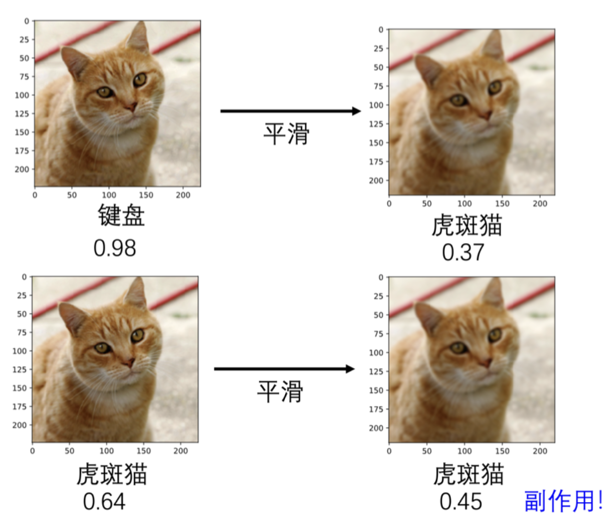

这类滤波器的原理是，某些方向上的特定攻击信号可以成功攻击图像，但并不是所有噪声都能成功。对于特定噪声，通过平滑模糊化处理，噪声改变后失去攻击力，而对原始图片影响很小，因此模型仍能正确识别。

不过，模糊化方法也有副作用。例如，对没有被攻击的图片进行平滑模糊化处理后，尽管仍能正确识别，但置信度会下降，如上图下方所示。因此，这种滤波器需要适度使用，否则可能导致正常图片识别出错。

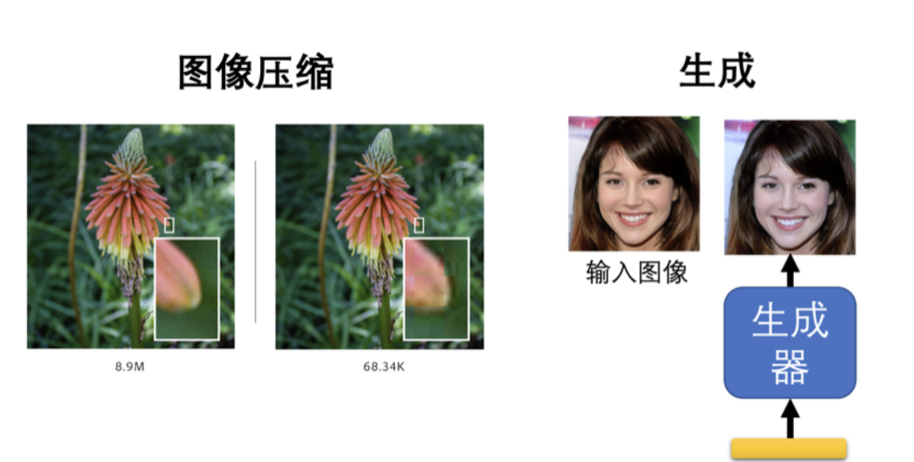

除了平滑模糊化，还有其他被动防御方法。例如，如上图所示，可以对图像进行压缩再解压缩。将图片存成JPEG格式会导致失真，而这种失真可能使攻击信号失效。还有一种基于生成的方法，即通过生成器生成与输入一模一样的图片。生成器在训练时未见过某些噪声，因此生成的图片不会包含攻击噪声，保护了原始模型。

被动防御有一个明显的弱点：一旦攻击者知道我们使用了某种防御方法，例如模糊化，就可以在攻击时加入相反信号来绕过防御。因此，这种防御方式的有效性取决于攻击者是否知晓防御策略。

### 2、强化版被动防御：随机化防御

随机化防御是一种强化版的被动防御。其思路是在防御时不只使用一种防御方法，而是多种方法结合，以增加攻击者预测防御方式的难度。例如，可以随机调整图片大小、位置等，再输入图像识别系统。这种随机化防御可以增加攻击难度，但如果攻击者知道随机化分布，也可能攻破这种防御。

## 八、主动防御

主动防御的思路是在训练模型时，训练一个强鲁棒性的模型。这种训练方式被称为对抗训练。

### 1、对抗训练

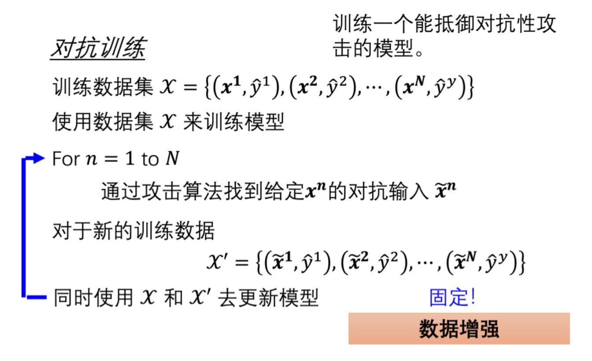

对抗训练是在训练过程中加入攻击数据，如上图所示。具体来说，我们有一些训练数据，用$x$表示其对应的标签$\hat{y}$。在训练阶段对模型进行攻击，将训练数据增加噪声产生攻击数据，用$\tilde{x}$表示。将这些攻击过的图片标上正确标签$\hat{y}$，形成新的数据集$X'$。同时使用$X'$和原始数据集$X$进行训练，得到强鲁棒性的模型。

对抗训练流程如下：
1. 训练初始模型。
2. 发现模型漏洞并填补。
3. 循环往复，直至训练出强鲁棒性模型。

对抗训练可以视为数据增强方法，因为产生了更多图片$\tilde{x}$，增加了训练数据量，从而提高模型泛化性能。

然而，对抗训练也有缺点：
1. 难以抵挡新的攻击方式。例如，若对抗训练使用的算法是1-4，但实际攻击使用算法5，模型可能无法防御。
2. 对抗训练需要大量计算资源。训练过程中要为每张图片找出新的$\tilde{x}$，若有100万张图片，就需找出100万个$\tilde{x}$，这非常耗时。
