## 一、引言

强化学习（Reinforcement Learning, RL）是一种实现通用人工智能的方法。为了更好地理解强化学习，我们可以从监督学习的角度入手。监督学习的基本原理是，给定一个输入，我们需要告诉机器对应的输出。这种方法依赖于大量带有标签的数据，如下图所示的图像分类器训练。

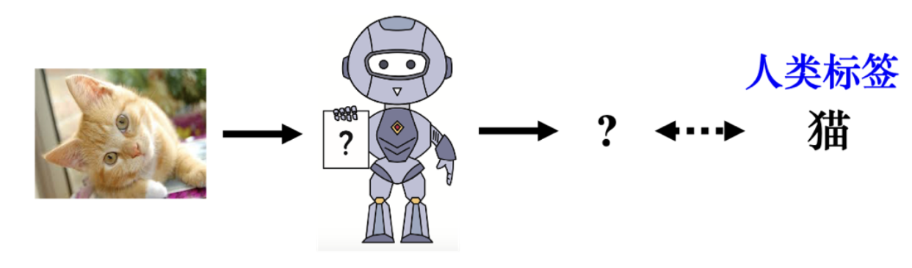

然而，自监督学习方法通过自动生成标签，减少了人工标记的需求。无监督学习方法，例如自编码器（Auto-Encoder, AE），虽然不使用人工标签，但依然存在隐含的标签。相比之下，强化学习在给定输入的情况下，并不知道最佳的输出是什么。

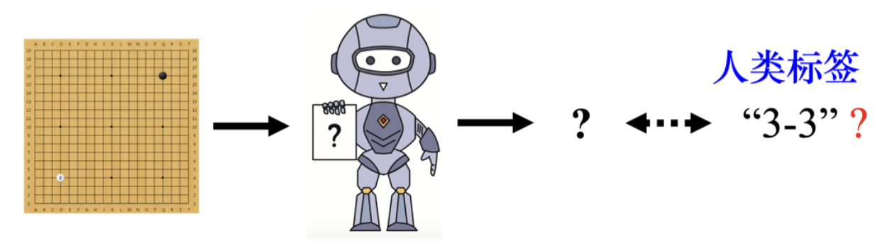

假设我们希望训练一个围棋AI，如上图所示。如果使用监督学习的方法，我们需要告诉机器每个盘势下的最佳落子位置，但这个最佳位置通常是未知的。即使通过阅读职业棋士的棋谱，也仅能提供较好的答案，而非最佳答案。因此，当正确答案未知或标注数据难以收集时，强化学习是一种更好的选择。

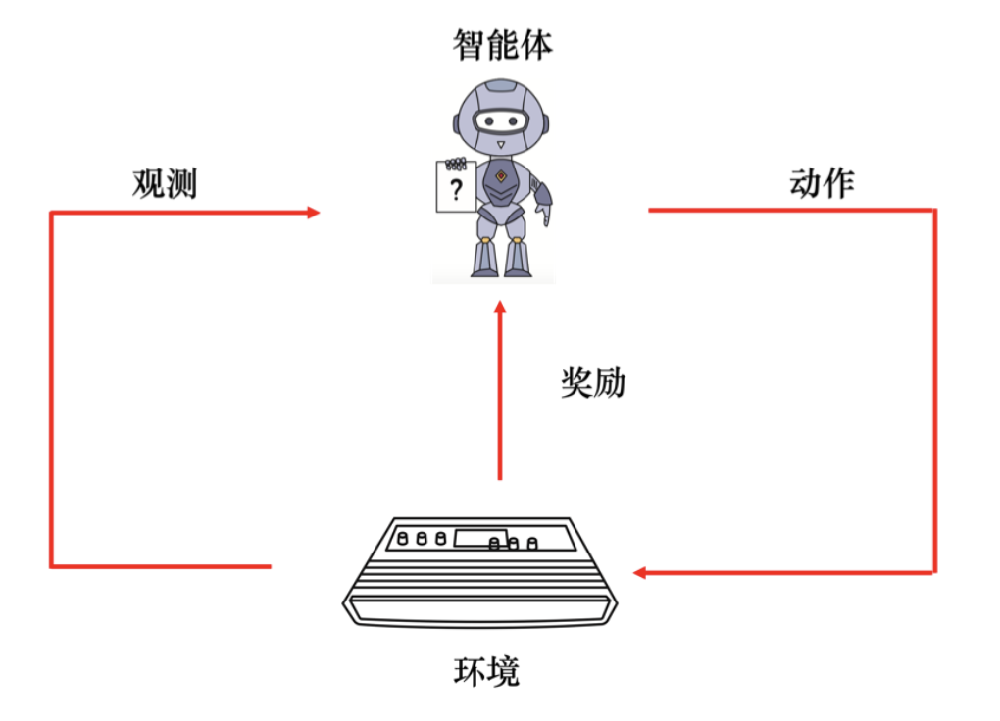

在强化学习中，机器通过与环境的互动来获取反馈和奖励（reward），从而评估其输出的好坏，并逐步学习一个模型。如上图所示，强化学习系统包含一个智能体（agent）和一个环境（environment）。智能体与环境互动，环境提供观测（observation），智能体根据观测采取动作（action），动作影响环境，环境反馈新的观测。

智能体的目标是最大化从环境获得的奖励总和。这个过程可以描述如下：

1. **观测（Observation）**：环境提供给智能体的输入。
2. **动作（Action）**：智能体对观测的反应，即输出。
3. **奖励（Reward）**：环境根据智能体的动作给予反馈。

智能体通过不断地互动和学习，优化其决策策略，以在长期内获得最大化的奖励。

## 二、强化学习应用

强化学习在许多领域都有应用，如玩视频游戏和下围棋。

### 1、玩电子游戏

强化学习可以用来玩电子游戏。早期的一些强化学习论文就研究了如何让机器玩《太空侵略者》。在《太空侵略者》中，如下图所示，我们操控太空梭来消灭外星人。可采取的动作有三个：左移、右移和开火。击中外星人可以得分，躲在防护罩后面可以抵挡攻击，但打到防护罩会使其消失。一些版本的游戏还有补给包，击中补给包可得高分。游戏结束的条件是所有外星人被消灭或太空梭被击中。

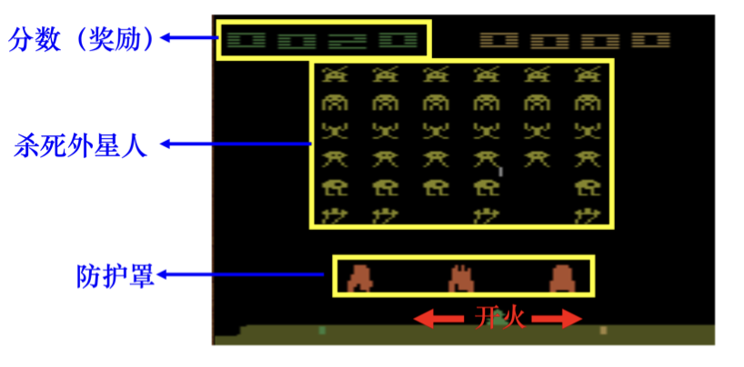

使用强化学习玩《太空侵略者》时，如下图所示，智能体通过操控摇杆来控制太空梭。

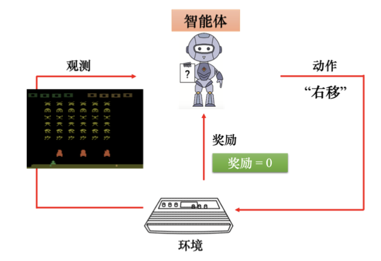

游戏主机作为环境操控外星人并提供观测，即游戏画面。智能体输入游戏画面，输出可采取的动作。例如，右移不会击中外星人，奖励为0；如下图所示，开火击中外星人则奖励为5分。智能体通过不断采取动作并获得奖励，目标是最大化总奖励。

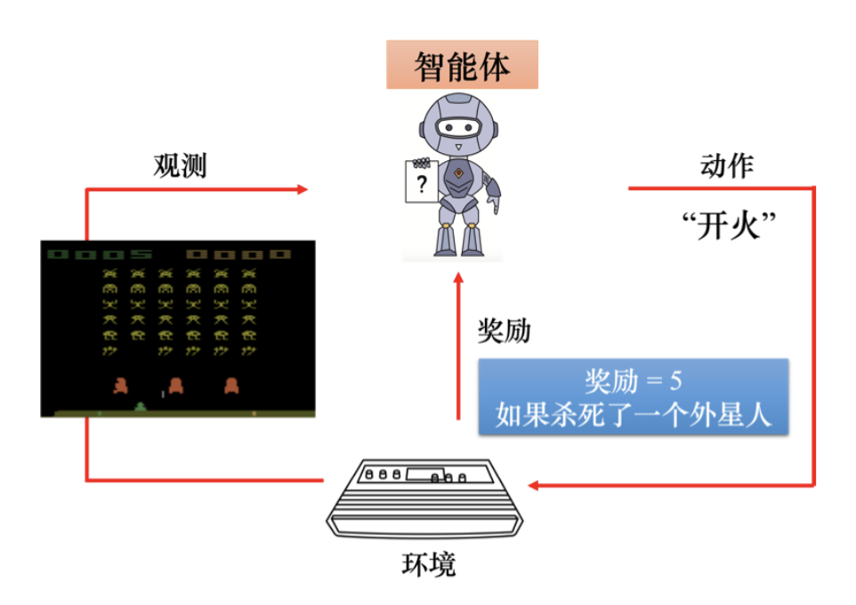

### 2、下围棋

使用强化学习下围棋时，如下图(a)所示，智能体是AlphaGo，环境是人类棋手。智能体输入为棋盘上黑子和白子的位置。初始状态下，棋盘是空的。智能体需决定下一步落子位置，共有$$19 \times 19$$个可能性。

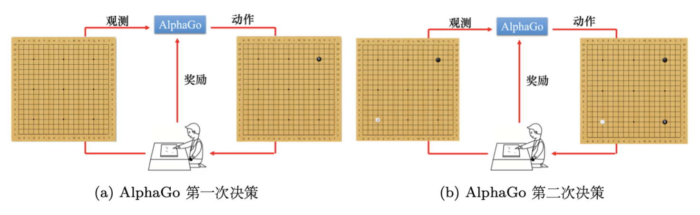

如上图(b)所示，智能体落子后，新的棋盘状态输入给对手。对手落子后，产生新的观测。智能体根据新的观测再决定下一步动作。这个过程不断重复。下围棋过程中，智能体的动作无法立即获得奖励。可以定义，如果赢得比赛，奖励为1分；输掉比赛，奖励为-1分。只有整场比赛结束，智能体才能得到奖励。智能体的目标是最大化可能获得的奖励。

在下围棋中，奖励非常稀疏，因此可能需要一个好的启发式函数（heuristic function）。例如，深蓝在国际象棋中击败人类时，使用了许多启发式函数，这些函数在中盘时也能提供奖励，而不仅仅在游戏结束时。

## 三、强化学习框架

强化学习的框架类似于传统机器学习，主要分为三个步骤：定义函数、定义损失函数、优化函数。

### 1、第一步：定义未知函数

在强化学习中，未知函数是智能体。智能体通常是一个策略网络（policy network）。在深度学习应用于强化学习之前，智能体可能只是一个查找表（look-up table），给定输入对应最佳输出。现在，智能体通常是一个复杂的神经网络，其输入是游戏画面上的像素，输出是每个动作的分数。

网络架构可以根据需求设计。如果输入是一张图片，可以使用卷积神经网络（CNN）。如果需要考虑整个游戏过程，可以使用循环神经网络（RNN）或Transformer。如下图所示，输入游戏画面，策略网络输出左移0.7分、右移0.2分、开火0.1分。

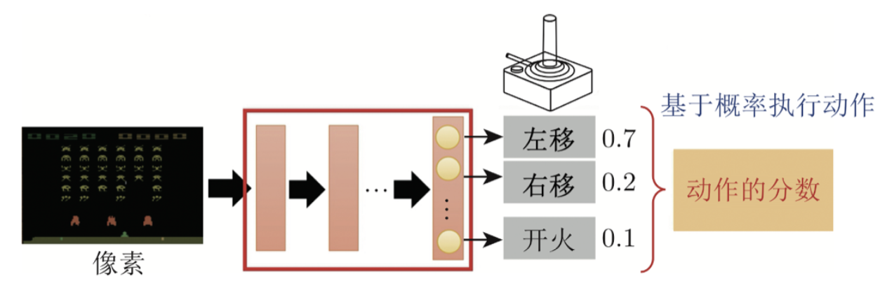

网络的最后一层通常是softmax层，每个动作的分数可以看作概率，按照概率采样决定动作。例如，智能体有70%的概率左移，20%的概率右移，10%的概率开火。随机性在许多游戏中非常重要，比如玩石头剪刀布，如果智能体总是出石头，很容易输。

### 2、第二步：定义损失函数

在强化学习中，定义损失函数是关键。假设初始游戏画面为$$s_1$$，智能体输出动作$$a_1$$（右移），奖励为0分。然后新的游戏画面为$$s_2$$，智能体采取新动作$$a_2$$（开火），击中外星人，奖励为5分。

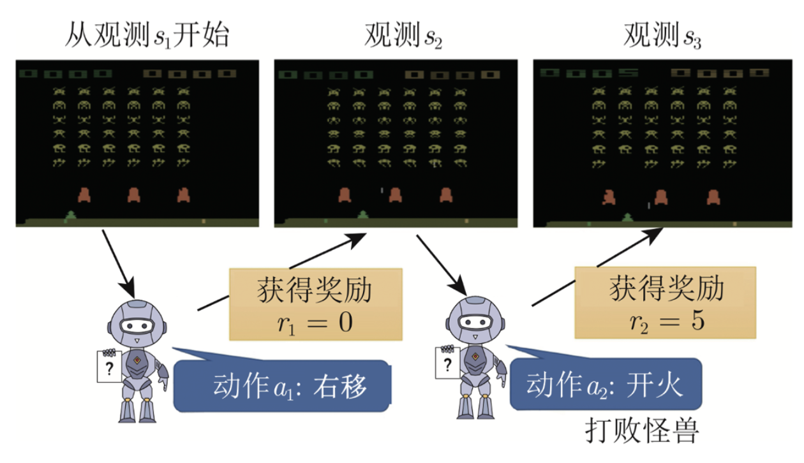

从游戏开始到结束的整个过程称为一个回合（episode）。总奖励（total reward）是所有奖励的总和，也称为回报（return），记为$$R$$。目标是最大化回报，即从游戏开始得到的$$r_1$$一直累加到游戏结束时的$$r_t$$。假设游戏互动$$T$$次，回报$$R$$定义为：

$$
R = \sum_{t=1}^{T} r_t
$$

回报需要最大化，因此优化问题是学习网络参数以最大化回报。虽然回报和损失函数不同，但可以通过最大化负回报来最小化损失。

### 3、第三步：优化

如下图所示，智能体与环境互动，环境输出观测$$s_1$$，智能体输入$$s_1$$输出$$a_1$$，环境再根据$$a_1$$输出新的观测$$s_2$$。这个过程不断重复，直到游戏结束。在整个过程中，状态和动作的组合序列称为轨迹（trajectory），记为$$\tau$$。

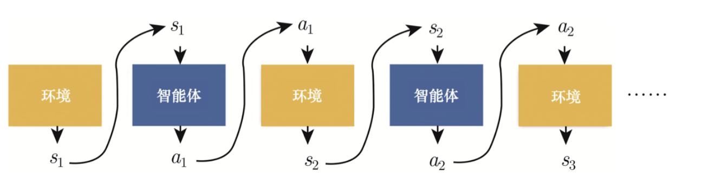

奖励函数通常依赖于状态和动作。轨迹中的总奖励是：

$$
R(\tau) = \sum_{t=1}^{T} r_t
$$

目标是最大化回报，这可以通过梯度上升（gradient ascent）来实现。然而，强化学习的优化问题比一般优化问题复杂，因为智能体的输出具有随机性，环境和奖励可能是黑盒且具有随机性。

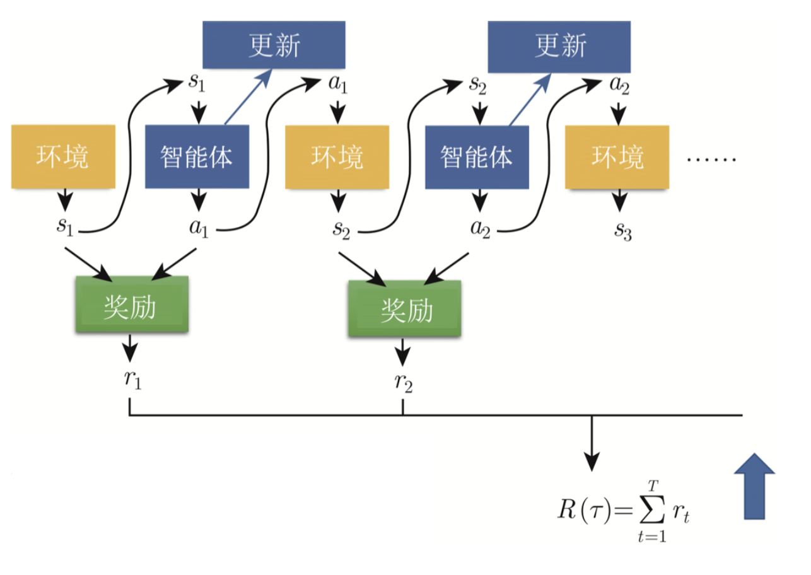

强化学习中的优化类似生成对抗网络（GANs）的训练。在GANs中，生成器（generator）与判别器（discriminator）相连，我们调整生成器参数，使判别器输出最大。在强化学习中，智能体类似生成器，环境和奖励类似判别器，我们调整智能体参数以最大化回报。然而，环境和奖励不是神经网络，不能直接通过梯度下降调整参数。

## 四、强化学习的训练

在强化学习中，我们让智能体在特定的观测到特定的动作，这可以看作一个分类问题。如下图所示，给定输入状态 $s$，智能体输出动作 $\hat{a}$。假设 $\hat{a}$ 是左移，我们希望智能体在看到这个游戏画面时左移。

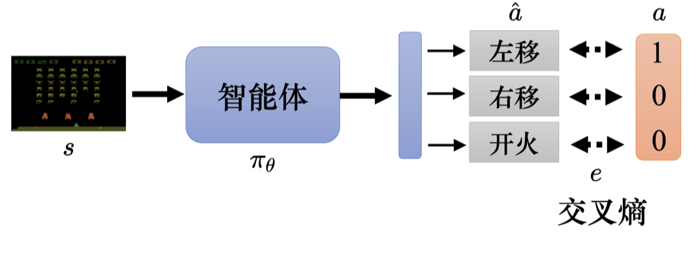

### 1、基本概念

#### （1）状态和动作

- **状态** $s$：智能体的输入，即观测到的环境。
- **动作** $a$：智能体的输出，即在该状态下采取的行为。

#### （2）损失函数

我们通过计算智能体输出与标准答案之间的交叉熵 $e$ 来衡量其性能。交叉熵越小，表示智能体的输出越接近标准答案。

$$
L = e
$$

其中，$L$ 是损失函数，$e$ 是交叉熵。

#### （3）负交叉熵

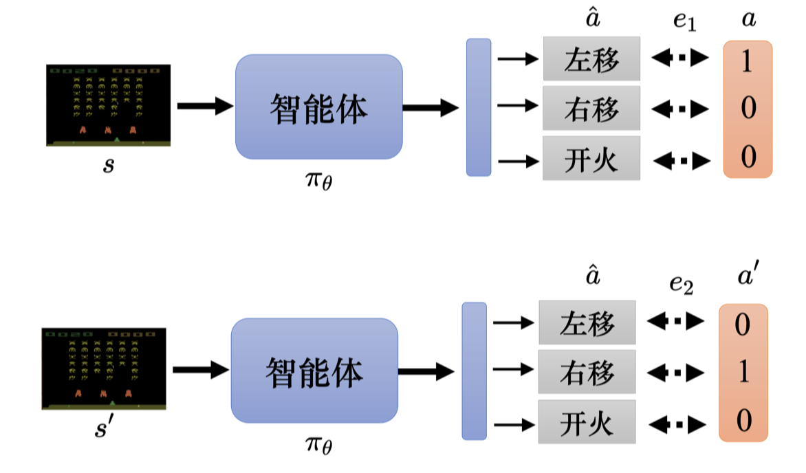

如果希望智能体不采取某个动作，可以使用负的交叉熵。假设我们希望智能体在状态 $s$ 时采取动作 $a$，但在状态 $s'$ 时不采取动作 $a'$。如上图所示，我们可以定义损失函数为：

$$
L = e_1 - e_2
$$

其中，$e_1$ 是希望采取动作的交叉熵，$e_2$ 是希望不采取动作的交叉熵。

### 2、优化过程

我们通过最小化损失函数来找到最优参数 $\theta^*$：

$$
\theta^* = \arg \min_\theta L
$$

如下图所示，我们需要收集训练数据，例如在状态 $s_1$ 时采取动作 $a_1$，在状态 $s_2$ 时不要采取动作 $a_2$。定义损失函数为：

$$
L = +e_1 - e_2 + e_3 - \cdots - e_N
$$

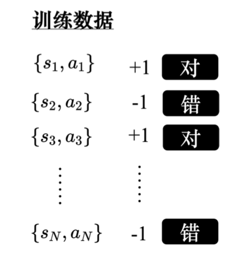

然后，通过最小化损失函数训练智能体，使其能够在新的状态下采取我们期望的动作。

### 3、动作执行程度

我们可以进一步考虑动作执行的程度，而不是简单的二分类问题。例如，每个状态-动作对（state-action pair）对应一个分数，该分数表示希望智能体执行该动作的程度。如下图所示：

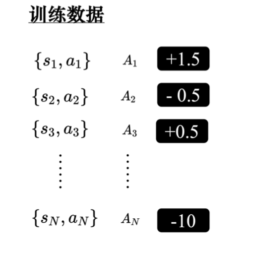

- $s_1$ 对应动作 $a_1$ 的分数为 +1.5
- $s_3$ 对应动作 $a_3$ 的分数为 +0.5

这表示我们希望智能体在状态 $s_1$ 时更强烈地执行动作 $a_1$，而在状态 $s_3$ 时较弱地执行动作 $a_3$。损失函数可以表示为：

$$
L = \sum_{i=1}^N A_i e_i
$$

其中，$A_i$ 是每个状态-动作对的权重，$e_i$ 是对应的交叉熵。

### 4、强化学习的三个阶段

强化学习一般分为三个阶段，使用策略梯度（policy gradient）等优化方法。关键在于如何定义权重 $A$，下面介绍四种常见的方法。

## 五、评价动作的标准

### 1、使用即时奖励作为评价标准

智能体与环境互动时，会收集一些训练数据（状态-动作对）。最简单的评价方式是将即时奖励作为动作好坏的评价标准。例如，智能体在状态 $s_1$ 执行动作 $a_1$ 得到奖励 $r_1$。若 $r_1$ 为正，则该动作是好的；若 $r_1$ 为负，则该动作是不好的。

下图显示了这种评价方式：

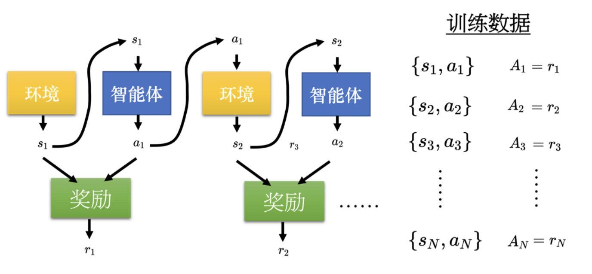

即时奖励评价的一个问题是，它让智能体变得短视，只考虑当前的奖励，而忽略了长期收益。每个动作不仅影响当前的奖励，还会影响后续的状态和奖励。例如，在《太空侵略者》的游戏中，左右移动没有即时奖励，但可以帮助瞄准并在射击时得分。如果仅根据即时奖励来评价，智能体可能会忽略左右移动这种重要的动作。

### 2、使用累积奖励作为评价标准

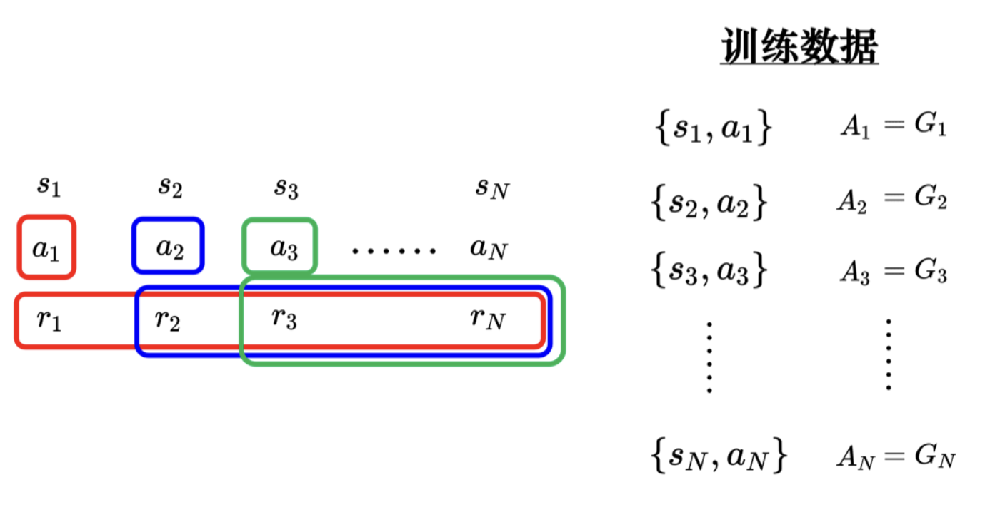

为了考虑长期收益，可以使用累积奖励 $G$ 来评价动作的好坏。累积奖励 $G_t$ 是从时间点 $t$ 开始到未来所有奖励的总和，如上图所示：

$$
G_t = \sum_{i=t}^{N} r_i
$$

例如，$G_1$, $G_2$, $G_3$ 的定义为：

$$
G_1 = r_1 + r_2 + r_3 + \cdots + r_N
$$

$$
G_2 = r_2 + r_3 + \cdots + r_N
$$

$$
G_3 = r_3 + \cdots + r_N
$$

累积奖励评价可以解决即时奖励评价的短视问题。例如，右移没有即时奖励，但可能有助于击中外星人，从而获得累积奖励。因此，右移也是一个好的动作。

### 3、使用折扣累积奖励作为评价标准

累积奖励的一个问题是，如果游戏非常长，将 $r_N$ 归功于 $a_1$ 可能不合适。为解决这一问题，可以引入折扣因子 $\gamma$ 来定义折扣累积奖励 $G'_t$：

$$
G'_t = \sum_{i=t}^{N} \gamma^{i-t} r_i
$$

下图给出了折扣累积奖励的示例：

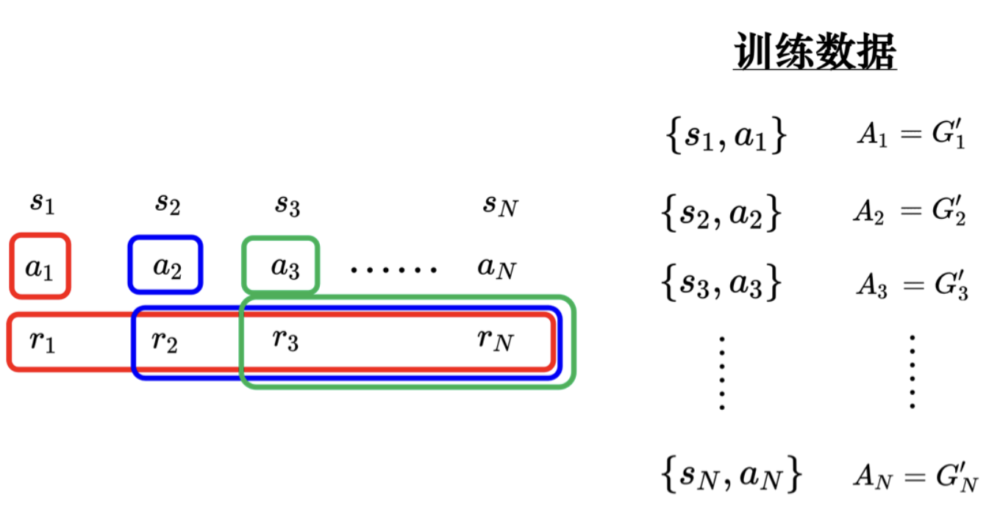
$$
G'_1 = r_1 + \gamma r_2 + \gamma^2 r_3 + \cdots
$$

折扣因子 $\gamma$ 的取值一般小于1（如0.9或0.99），用于降低距离当前动作较远的奖励权重。通过折扣因子，可以给距离当前动作较近的奖励较大的权重，而给距离较远的奖励较小的权重。这样可以更合理地评价每个动作的长期影响。

### 4、使用折扣累积奖励减去基线作为评价标准

由于奖励是相对的，使用折扣累积奖励 $G'$ 作为评价标准可能会有问题。例如，如果游戏中的每个动作都能获得正的分数，我们仍需要区分哪些动作更好。为此，可以引入基线 $b$，并使用 $G' - b$ 作为评价标准，使得评价结果有正有负。

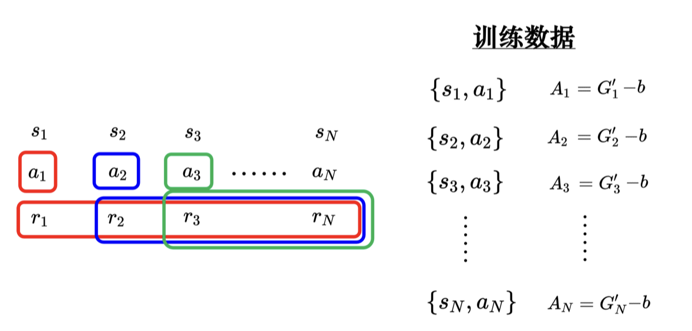

在策略梯度算法中，这种评价标准用于定义损失函数，并更新模型参数。下述算法详细描述了这一过程：

------

1. 初始化智能体网络参数 $\theta$；
2. 迭代 $T$ 次训练：
    - 使用智能体 $\pi_{\theta_{i-1}}$ 进行交互；
    - 获取数据 $\{s_1, a_1\}, \{s_2, a_2\}, \cdots, \{s_N, a_N\}$；
    - 计算 $A_1, A_2, \cdots, A_N$；
    - 计算损失 $L$；
    - 更新模型参数 $\theta_i \leftarrow \theta_{i-1} - \eta \nabla L$。
3. end

------

在一般训练中，数据收集在训练迭代之外进行，而强化学习则是在训练迭代过程中收集数据。这使得每次更新模型参数后，需要重新收集数据，从而导致训练过程非常耗时。

### 5、Actor-Critic

在强化学习中，Actor-Critic 算法包括两个主要部分：Actor（演员，策略网络）和 Critic（评论员，价值网络）。Actor 负责与环境交互并选择动作，而 Critic 评估 Actor 的表现。假设智能体的策略参数为 $\pi_{\theta}$，Critic 的任务是评估智能体在某个状态下的预期奖励。

Critic 可以有不同的变体。有些 Critic 只根据当前游戏画面来判断奖励，有些则根据当前画面和 Actor 所采取的动作来判断奖励。Critic 也被称为价值函数（value function），可以用 $V^{\pi_{\theta}}(s)$ 来表示。上标 $\pi_{\theta}$ 代表该价值函数对应的 Actor 策略为 $\pi_{\theta}$。

#### （1）价值函数

价值函数 $V^{\pi_{\theta}}(s)$ 表示在状态 $s$ 下，智能体 $\pi_{\theta}$ 预期得到的折扣累积奖励（discounted cumulative reward）。图(a) 显示了价值函数的输入为状态 $s$，输出为标量 $V^{\pi_{\theta}}(s)$。

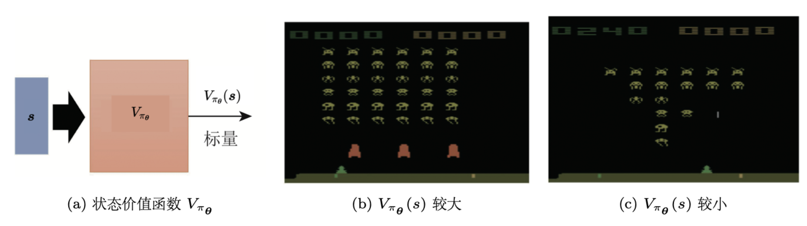

- **图(b)** 显示的游戏画面中有许多外星人，智能体接下来可能得到很高的累积奖励。
- **图(c)** 显示的画面中游戏已接近尾声，剩余外星人不多，累积奖励可能较低。

#### （2）Critic 的训练方法

Critic 有两种常用的训练方法：蒙特卡洛（Monte Carlo, MC）和时序差分（Temporal-Difference, TD）。

##### 蒙特卡洛方法

智能体与环境互动，收集到游戏记录。例如，状态 $s_a$ 的累积奖励为 $G'_a$，状态 $s_b$ 的累积奖励为 $G'_b$。使用蒙特卡洛方法训练价值函数 $V^{\pi_{\theta}}$，使 $V^{\pi_{\theta}}(s_a)$ 接近 $G'_a$，$V^{\pi_{\theta}}(s_b)$ 接近 $G'_b$，如下图所示。

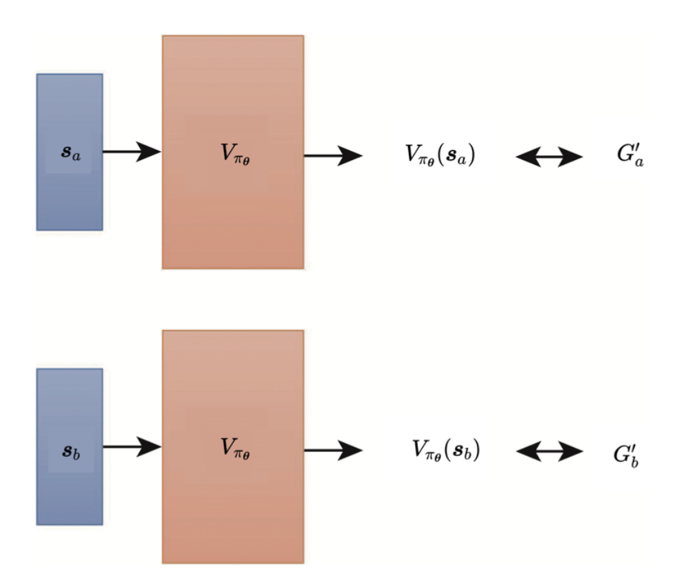

##### 时序差分方法

时序差分方法不需要完成整个游戏即可训练价值函数 $V^{\pi_{\theta}}(s)$。只需数据 $\{s_t, a_t, r_t, s_{t+1}\}$ 即可更新 $V^{\pi_{\theta}}(s)$ 的参数。时序差分方法中，$V^{\pi_{\theta}}(s_t)$ 和 $V^{\pi_{\theta}}(s_{t+1})$ 之间的关系如下：

$$
V^{\pi_{\theta}}(s_t) = r_t + \gamma V^{\pi_{\theta}}(s_{t+1})
$$

其中，$\gamma$ 是折扣因子。通过更新使得 $V^{\pi_{\theta}}(s_t) - \gamma V^{\pi_{\theta}}(s_{t+1})$ 接近 $r_t$。

#### （3）示例分析

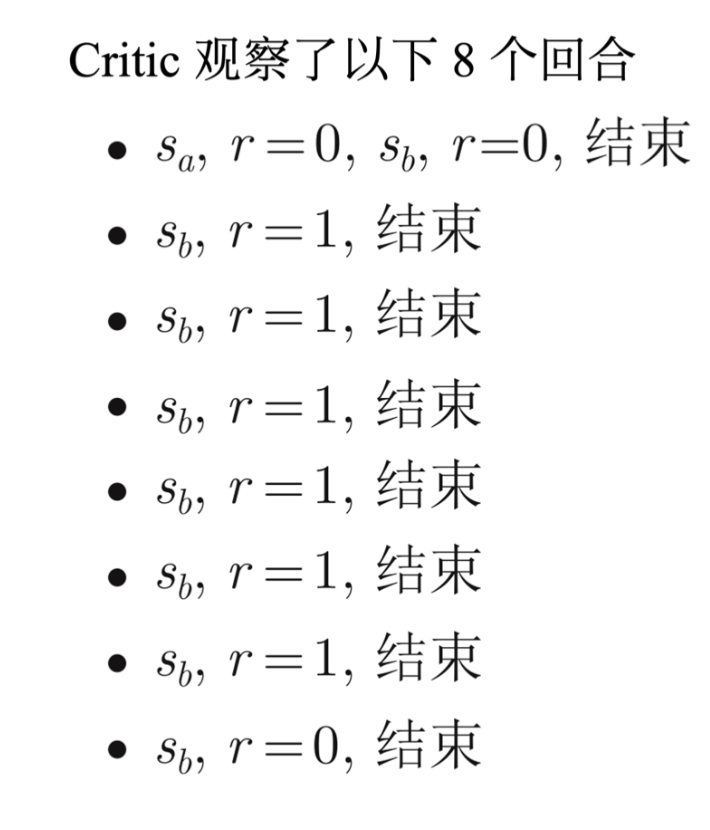

上图显示了某智能体玩游戏的记录，假设这些游戏都很简单，1-2 个回合就结束。假设 $\gamma = 1$，即不做折扣。状态 $s_b$ 出现八次，其中六次奖励为 1，两次奖励为 0，平均奖励为：

$$
V^{\pi_{\theta}}(s_b) = \frac{6 \times 1 + 2 \times 0}{8} = \frac{6}{8} = \frac{3}{4}
$$

对于状态 $s_a$，蒙特卡洛方法计算得到的 $V^{\pi_{\theta}}(s_a)$ 为 0，因为 $s_a$ 之后接 $s_b$ 得到的累积奖励为 0。时序差分方法计算得到的 $V^{\pi_{\theta}}(s_a)$ 为：

$$
V^{\pi_{\theta}}(s_a) = V^{\pi_{\theta}}(s_b) + r = \frac{3}{4} + 0 = \frac{3}{4}
$$

这两种方法的结果虽然不同，但都是正确的，只是背后的假设不同。

#### （4）Critic 训练 Actor

Critic 训练 Actor 的过程如下图所示。

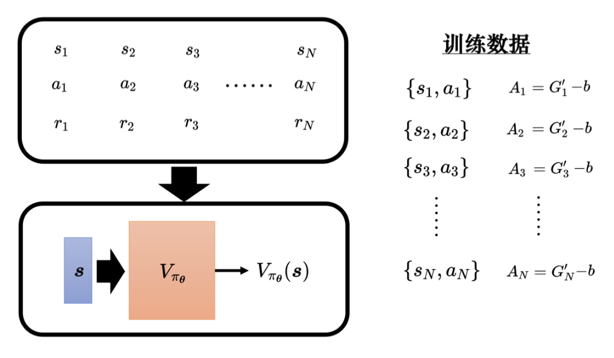

智能体与环境互动得到一系列状态-动作对 $\{s_t, a_t, r_t, s_{t+1}\}$，计算 A 值：
$$
A_t = G'_t - V^{\pi_{\theta}}(s_t)
$$

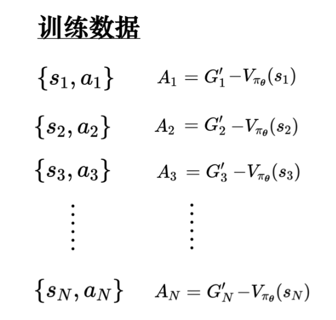

如上图所示，$A_t$ 代表状态 $s_t$ 下动作 $a_t$ 的好坏。$V^{\pi_{\theta}}(s_t)$ 是期望值，不同采样可能有不同的累积奖励。$G'_t$ 是在状态 $s_t$ 下执行 $a_t$ 后的累积奖励。如果 $A_t > 0$，说明 $a_t$ 优于随机采样的动作；如果 $A_t < 0$，说明 $a_t$ 较差。

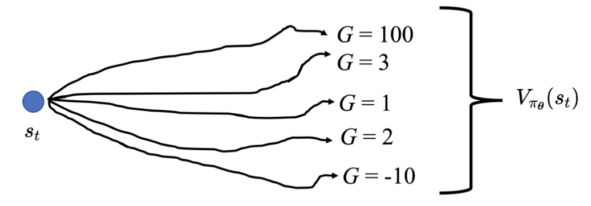

可以用平均去减掉平均，即优势 Actor-Critic 方法（Advantage Actor-Critic, A2C），如上图所示：

$$
A_t = r_t + V^{\pi_{\theta}}(s_{t+1}) - V^{\pi_{\theta}}(s_t)
$$

这样做能够更准确地评估动作的好坏。

### 6、优势 Actor-Critic

在 Actor-Critic 算法中，执行动作 $a_t$ 后，得到奖励 $r_t$ 并进入下一个状态 $s_{t+1}$。接下来，从状态 $s_{t+1}$ 开始游戏，会有许多不同的可能性，每种可能性都会得到一个奖励。把这些累积奖励平均，就是 $V^{\pi_{\theta}}(s_{t+1})$。虽然需要多次游戏才能得到这个平均值，但可以训练出一个好的 Critic 来直接估计 $V^{\pi_{\theta}}(s_{t+1})$，即在状态 $s_{t+1}$ 下接下来会得到的累积奖励的期望值。

在状态 $s_t$ 执行动作 $a_t$ 会得到奖励 $r_t$，然后进入状态 $s_{t+1}$，此时 $s_{t+1}$ 的期望奖励为 $V^{\pi_{\theta}}(s_{t+1})$。因此，$r_t + V^{\pi_{\theta}}(s_{t+1})$ 代表在状态 $s_t$ 执行动作 $a_t$ 的期望奖励。

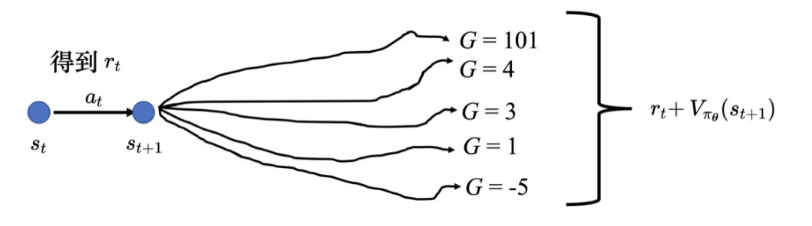

我们可以将 $G'_t$ 换成 $r_t + V^{\pi_{\theta}}(s_{t+1})$，如上图所示。使用 $r_t + V^{\pi_{\theta}}(s_{t+1}) - V^{\pi_{\theta}}(s_t)$ 来表示采取动作 $a_t$ 得到的期望奖励减去从一个分布采样动作的期望奖励。如果 $r_t + V^{\pi_{\theta}}(s_{t+1}) > V^{\pi_{\theta}}(s_t)$，则表示 $a_t$ 比从分布中随机采样的动作更好；反之则更差。这就是优势 Actor-Critic 方法 (Advantage Actor-Critic, A2C)。

在优势 Actor-Critic 中，优势函数 $A_t$ 定义为：
$$
A_t = r_t + V^{\pi_{\theta}}(s_{t+1}) - V^{\pi_{\theta}}(s_t)
$$

#### （1）Actor-Critic 训练技巧

Actor 和 Critic 都是神经网络。Actor 网络的输入是游戏画面，输出是每个动作的分数。Critic 网络的输入是游戏画面，输出是一个数值，代表接下来的累积奖励。

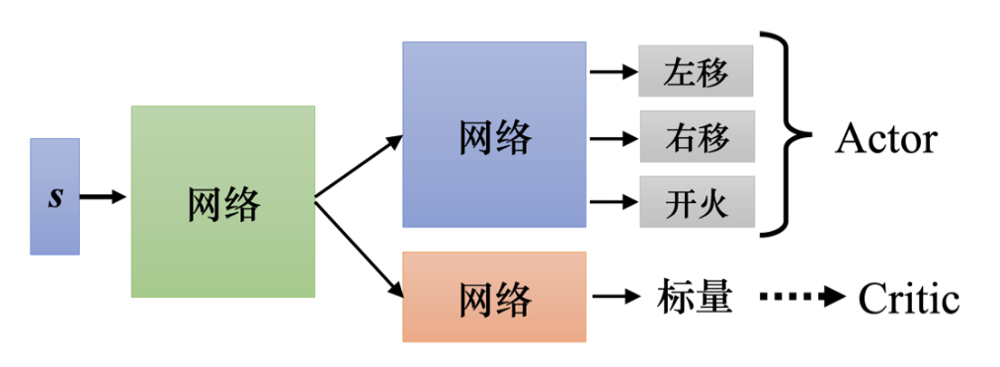

如上图所示，这两个网络的输入相同，所以部分参数可以共用。特别是当输入非常复杂时（如游戏画面），前几层通常是卷积神经网络，因此 Actor 和 Critic 可以共用前几层。在实践中，这种设计常见于 Actor-Critic 算法。

#### （2）深度 Q 网络 (DQN)

在强化学习中，Critic 也可以直接决定执行的动作，例如深度 Q 网络 (Deep Q-Network, DQN)。DQN 有多种变体，其中一篇知名论文“Rainbow: Combining Improvements in Deep Reinforcement Learning”将 DQN 的七种变体结合起来，因此称为彩虹 (Rainbow)。

#### （3）强化学习的其他技巧

强化学习中还有很多技巧，如稀疏奖励的处理方法和模仿学习。详细内容可以参考《Easy RL: 强化学习教程》。此外，视觉强化学习 (Visual Reinforcement Learning, VRL) 是强化学习中非常有潜力的方向。与传统基于状态的强化学习方法不同，VRL 直接从图片学习控制策略。感兴趣的同学可以阅读相关论文，参考 [Awesome Visual RL 论文清单](https://github.com/qiwang067/awesome-visual-rl)。
