## 一、前馈神经网络的局限性

在自然语言处理（NLP）任务中，我们常常需要将单词表示为向量，并将这些向量输入到神经网络中，输出一个概率分布，这个概率分布表示输入单词属于各个类别的概率。例如，“上海”可能表示为属于目的地和出发地的概率分布，如图所示。

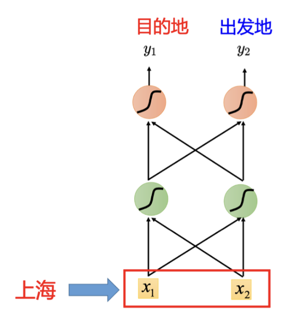

然而，前馈神经网络（Feedforward Neural Network， FNN）存在一个明显的问题：它们无法处理上下文信息。假设有两个用户，用户1说：“在6月1号抵达上海”，用户2说：“在6月1号离开上海”，在这种情况下，尽管“上海”在两个句子中的含义不同，但前馈神经网络会给出相同的输出，因为输入是相同的。在下图中，这意味着“上海”要么被认为是目的地，要么被认为是出发地，无法根据上下文进行区分。

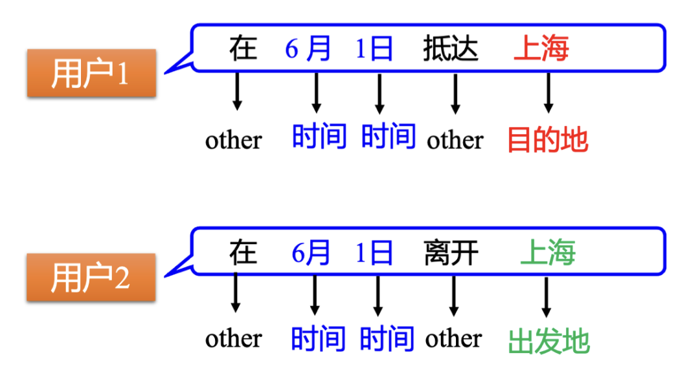

为了解决这个问题，我们需要一种能够记住上下文信息的神经网络。循环神经网络（Recurrent Neural Network， RNN）正是这样一种模型，它能够通过记忆之前的输入信息，根据上下文产生不同的输出。例如，RNN可以记住在看到“上海”之前是否看到了“抵达”或“离开”，从而做出不同的判断。

## 二、什么是循环神经网络（RNN）

### 1、介绍

循环神经网络（Recurrent Neural Networks， RNNs）是一类能够处理序列数据的神经网络。它们通过引入循环连接，使得网络可以记住先前的输入信息，并根据这些记忆调整当前的输出。

在RNN中，每一次隐藏层的神经元产生输出时，该输出会被存储到一个称为记忆元（memory cell）的结构中，如下图中的蓝色方块所示。下一次有输入时，这些神经元不仅会考虑当前的输入 $ x_1， x_2 $，还会考虑存储在记忆元里的值。除了 $ x_1， x_2 $，存在记忆元里的值 $ a_1， a_2 $ 也会影响神经网络的输出。

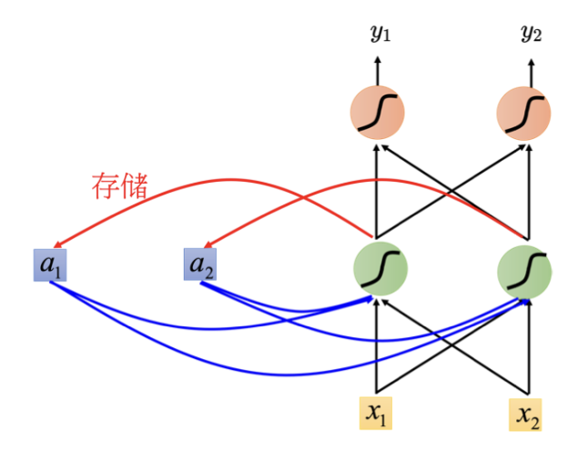

!>记忆元也可以简称为单元（cell），其值也被称为隐状态（hidden state）。隐状态是RNN能够记住上下文信息的关键。

### 2、有隐状态的循环神经网络

RNN的基本单元包含一个输入层、一个隐藏层和一个输出层。与传统神经网络的不同之处在于，隐藏层不仅接收当前时间步的输入，还接收上一个时间步隐藏层的输出。这种循环使得网络能够记住序列信息。

在时间步$t$，有小批量输入$\mathbf{X}_t \in \mathbb{R}^{n \times d}$，隐状态$\mathbf{H}_t \in \mathbb{R}^{n \times h}$通过以下公式计算：

$$
\mathbf{H}_t = \phi(\mathbf{X}_t \mathbf{W}_{xh} + \mathbf{H}_{t-1} \mathbf{W}_{hh}  + \mathbf{b}_h)
$$
其中：

- $ \mathbf{H}_t $ 是时间步 $ t $ 的隐藏状态，维度为 $ n \times h $，$ n $ 是批量大小，$ h $ 是隐藏层神经元数量。
- $ \phi $ 是激活函数，通常为非线性函数如 tanh 或 ReLU。
- $ \mathbf{X}_t $ 是输入数据的矩阵，维度为 $ n \times d $，其中 $ d $ 是输入特征的维度。
- $ \mathbf{W}_{xh} $ 是输入到隐藏层的权重矩阵，维度为 $ d \times h $。
- $ \mathbf{H}_{t-1} $ 是上一时间步的隐藏状态，维度同样为 $ n \times h $。
- $ \mathbf{W}_{hh} $ 是隐藏层自身的权重矩阵，维度为 $ h \times h $，用于表示上一时间步隐藏状态对当前隐藏状态的影响。
- $ \mathbf{b}_h $ 是隐藏层的偏置向量，维度为 $ h \times 1 $。

这个公式描述了如何利用当前时间步的输入 $ \mathbf{X}_t $ 和前一时间步的隐藏状态 $ \mathbf{H}_{t-1} $，结合权重和偏置，计算当前时间步的隐藏状态 $ \mathbf{H}_t $。这使得隐状态能够捕获序列的历史信息。RNN的输出计算如下：
$$
\mathbf{O}_t = \mathbf{H}_t \mathbf{W}_{hq} + \mathbf{b}_q
$$
其中：
- $ \mathbf{O}_t $ 是时间步 $ t $ 的输出，维度为 $ n \times q $，$ q $ 是输出层的神经元数量。
- $ \mathbf{H}_t $ 是时间步 $ t $ 的隐藏状态，维度为 $ n \times h $。
- $ \mathbf{W}_{hq} $ 是隐藏到输出层的权重矩阵，维度为 $ h \times q $。
- $ \mathbf{b}_q $ 是输出层的偏置向量，维度为 $ q \times 1 $。

这个公式表示了如何通过当前时间步的隐藏状态 $ \mathbf{H}_t $，结合权重和偏置，计算当前时间步的输出 $ \mathbf{O}_t $。RNN的参数包括隐藏层的权重$\mathbf{W}_{xh}$和$\mathbf{W}_{hh}$、偏置$\mathbf{b}_h$，以及输出层的权重$\mathbf{W}_{hq}$和偏置$\mathbf{b}_q$。这些参数在不同的时间步中共享，因此RNN的参数开销不会随着时间步的增加而增加。

### 3、RNN的计算示例

假设神经网络所有的权重都是1，所有的神经元没有任何的偏置（bias）。为了便于计算，假设所有的激活函数都是线性的，输入是序列 $[1， 1]^T， [1， 1]^T， [2， 2]^T， \ldots $，初始时记忆元的值都是0。

**第一次输入** $[1， 1]^T$：对于第一个隐藏层的神经元，它们接收到输入 $[1， 1]^T$ 和记忆元中的值（0和0），输出为2。同理，第二层隐藏层的输出为4。此时，绿色神经元的输出被存到记忆元中，更新为2。

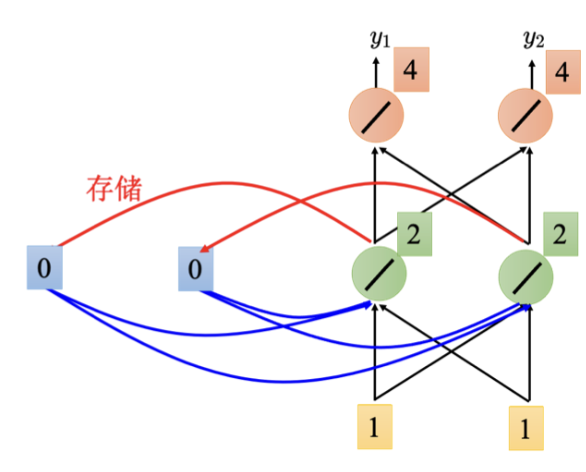

**第二次输入** $[1， 1]^T$：此时绿色神经元的输入为 $[1， 1]^T$ 和记忆元中的值（2和2），输出为6，第二层的输出为12。

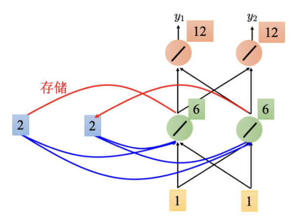

**第三次输入** $[2， 2]^T$：记忆元中的值更新为6，此时绿色神经元的输入为 $[2， 2]^T$ 和记忆元中的值（6和6），输出为16，第二层的输出为32。

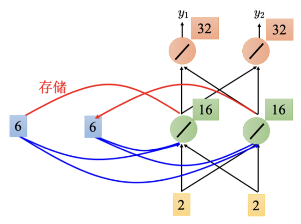

如第一次输入、第二次输入所示，因为RNN具有记忆元，即使输入相同，输出也可能不同。

### 4、RNN的循环特性

因为当前时刻的隐状态使用了上一时刻的隐状态，所以隐状态的计算是循环的（recurrent）。基于这种循环计算的隐状态，神经网络被称为循环神经网络（RNN）。

RNN在处理序列数据时能够考虑顺序信息，因此即使输入序列的顺序发生变化，输出也会不同。这使得RNN特别适用于时间序列分析、语言模型和序列标注等任务。

### 5、RNN在槽填充中的应用

槽填充任务旨在识别和填充句子中的关键元素，例如日期、地点等信息。RNN通过其循环结构能够逐步处理输入序列中的每个单词，并基于先前的记忆进行判断和填充。

假设用户说：“我想在6月1日抵达上海”。我们可以将“抵达”转化为一个向量，并输入到RNN中。

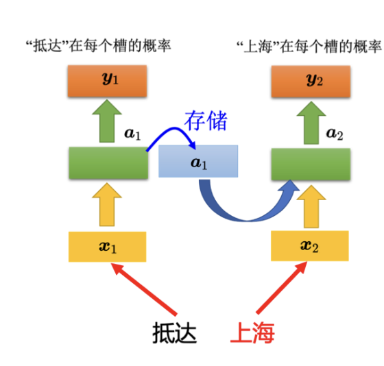

**Step1：初始输入**：

- 输入单词“抵达”，将其转换为向量并输入到RNN。
- RNN的隐藏层输出向量 $ a_1 $，该向量表示“抵达”属于各个槽的概率 $ y_1 $。
- 隐藏层的输出 $ a_1 $ 被存储在记忆元中。

**Step2：后续输入**：

- 输入单词“上海”，将其转换为向量。
- RNN的隐藏层不仅考虑当前输入“上海”，还结合存在记忆元中的值 $ a_1 $ 进行计算，得到新的隐藏层输出 $ a_2 $。
- 根据 $ a_2 $ 计算“上海”属于各个槽的概率 $ y_2 $。

如上图所示，这不是三个独立的网络，而是同一个网络在三个不同的时间点被使用了三次，并且使用了相同的权重。

通过引入记忆元，RNN能够根据上下文信息调整输出。例如，输入同一个单词“上海”，但由于先前输入的不同，RNN会产生不同的输出。

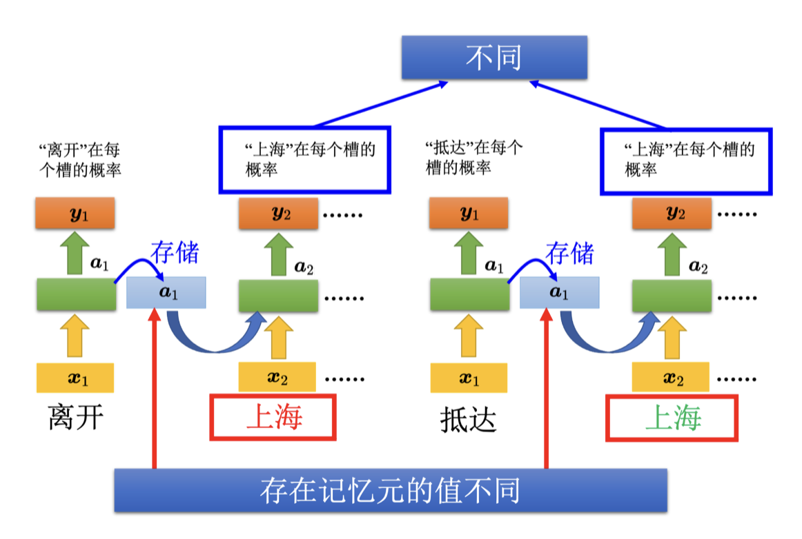

- 如果单词“上海”前面是“离开”，记忆元中存储的向量是“离开”的信息，那么隐藏层输出将考虑“离开”的上下文。
- 如果单词“上海”前面是“抵达”，记忆元中存储的向量是“抵达”的信息，那么隐藏层输出将考虑“抵达”的上下文。

尽管输入“上海”是相同的，由于记忆元中的值不同，RNN的隐藏层输出也不同，从而导致最终的输出不同。

## 三、RNN的类型

### 1、深层RNN

以下是合并并梳理的内容，包括对函数依赖关系和循环神经网络架构的讨论：

### 9.3.1 函数依赖关系

循环神经网络的架构是可以任意设计的，之前提到的 RNN 只有一个隐藏层，但 RNN 也可以是深层的。比如把 $x_t$丢进去之后，它可以通过一个隐藏层，再通过第二个隐藏层，以此类推 (通过很多的隐藏层) 才得到最后的输出。每一个隐藏层的输出都会被存在记忆元里面，在下一个时间点的时候，每一个隐藏层会把前一个时间点存的值再读出来，以此类推最后得到输出，这个过程会一直持续下去。在单向RNN中，信息只沿一个方向传播，即从过去传向未来。适用于单向时间序列预测等任务。

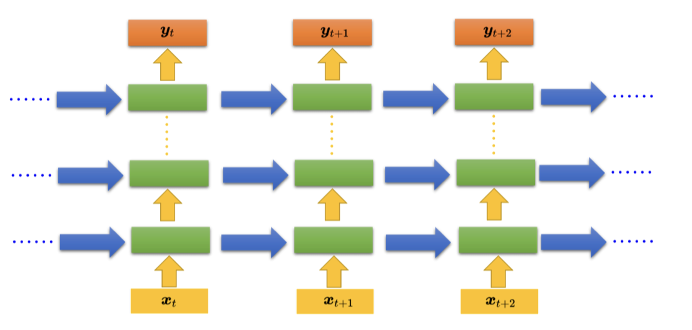

### 2、Elman网络和Jordan网络

在循环神经网络（Recurrent Neural Network, RNN）中，有多种变形结构。其中，Elman网络和Jordan网络是两种常见的变体。这两种网络在如何存储和使用信息上存在一些差异。

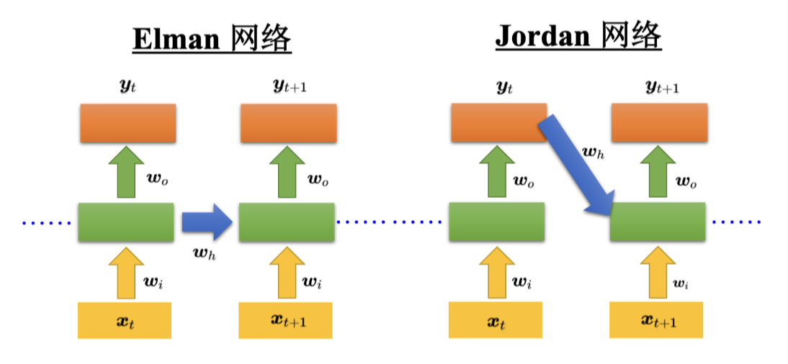

#### （1）简单循环网络（Simple Recurrent Network, SRN）

简单循环网络，亦称为Elman网络，是RNN的基础形式。其工作机制如下：

- **结构**：Elman网络的隐藏层输出会被存储起来，并在下一个时间点作为输入的一部分重新读入。Elman网络没有明确的目标控制，很难确定其能够学到什么样的隐藏层信息。
- **信息存储**：存储的是隐藏层的值，即在每个时间步，隐藏层的输出被存储到记忆元中，并在下一个时间步被读取。
- **记忆元存储的内容**：存储隐藏层的中间状态信息。

#### （2）Jordan网络

Jordan网络与Elman网络的主要区别在于其信息存储机制：

- **结构**：Jordan网络具有明确的目标控制，因为存储的是整个网络的输出值，而不是隐藏层的输出值，这些值更容易被直接用于控制和优化。
- **信息存储**：在每个时间步，网络的输出值被存储到记忆元中，并在下一个时间步作为输入的一部分重新读入。
- **记忆元存储的内容**：存储最终的输出信息，这使得Jordan网络在某些任务中更容易理解和使用。

### 3、双向RNN

双向循环神经网络（Bi-RNN）是一种改进的循环神经网络（RNN），通过同时考虑输入序列的前向和后向信息来提升模型的性能。相比于传统的单向RNN，Bi-RNN在处理序列数据时可以利用更多的上下文信息，从而更准确地进行预测和分类。

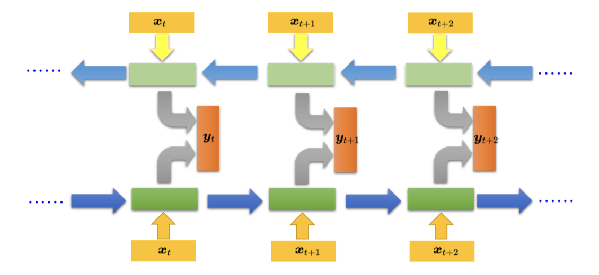

#### （1）单向RNN的局限

在传统的RNN中，输入序列是按照时间步从头到尾依次处理的。例如，对于一个句子中的单词序列 $ \{x_1, x_2, x_3, \ldots, x_T\} $，RNN会依次读取 $ x_1 $ 到 $ x_T $，并逐步更新隐藏状态。然而，这种单向处理方式存在一些局限性：

- 在生成某个时间步的输出 $ y_t $ 时，RNN只能利用当前及之前的输入信息 $ \{x_1, x_2, \ldots, x_t\} $。
- 无法利用当前时间步之后的信息 $ \{x_{t+1}, x_{t+2}, \ldots, x_T\} $。

这种局限性在某些任务中可能会导致性能下降。例如，在句子理解和槽填充任务中，后续单词的信息可能对当前单词的分类有重要作用。

#### （2）双向RNN的优势

为了克服单向RNN的局限性，双向RNN同时引入了两个RNN：一个正向RNN和一个反向RNN。

- **正向RNN**：从时间步 $ t = 1 $ 到 $ t = T $ 依次处理输入序列。
- **反向RNN**：从时间步 $ t = T $ 到 $ t = 1 $ 逆向处理输入序列。

在每个时间步 $ t $，正向RNN的隐藏状态 $ \overrightarrow{h_t} $ 和反向RNN的隐藏状态 $ \overleftarrow{h_t} $ 会被结合起来，共同用于生成输出 $ y_t $。

#### （3）处理过程

**Step1：正向处理**：

- 输入序列从 $ x_1 $ 到 $ x_T $ 依次进入正向RNN。
- 正向RNN依次计算隐藏状态 $ \overrightarrow{h_1}, \overrightarrow{h_2}, \ldots, \overrightarrow{h_T} $。

**Step2：反向处理**：

- 输入序列从 $ x_T $ 到 $ x_1 $ 逆向进入反向RNN。
- 反向RNN依次计算隐藏状态 $ \overleftarrow{h_T}, \overleftarrow{h_{T-1}}, \ldots, \overleftarrow{h_1} $。

**Step3：输出层**：

- 在每个时间步 $ t $，将正向隐藏状态 $ \overrightarrow{h_t} $ 和反向隐藏状态 $ \overleftarrow{h_t} $ 连接起来，形成完整的隐藏状态 $ h_t = [\overrightarrow{h_t}; \overleftarrow{h_t}] $。
- 使用连接后的隐藏状态 $ h_t $ 生成输出 $ y_t $。

这种结构使得Bi-RNN在生成 $ y_t $ 时，不仅可以利用到之前的输入 $ \{x_1, x_2, \ldots, x_t\} $，还可以利用到之后的输入 $ \{x_{t+1}, x_{t+2}, \ldots, x_T\} $，从而全面考虑整个序列的信息。

#### （4）Bi-RNN在槽填充中的应用

在槽填充任务中，Bi-RNN能够更好地理解句子结构和上下文。例如，对于句子“我想在6月1日抵达上海”：

- **正向RNN**：从“我”到“上海”依次处理。
- **反向RNN**：从“上海”到“我”逆向处理。

通过结合正向和反向的信息，Bi-RNN在决定“上海”是目的地时，可以考虑到整个句子的语境，从而获得更高的准确性。

#### （5）注意

由于双向循环神经网络使用了过去的和未来的数据， 所以我们不能盲目地将这一语言模型应用于任何预测任务。 尽管模型产出的困惑度是合理的， 该模型预测未来词元的能力却可能存在严重缺陷。

## Reference

- [李宏毅-机器学习](https://speech.ee.ntu.edu.tw/~hylee/ml/2022-spring.php)
- [动手学深度学习](https://zh.d2l.ai/chapter_recurrent-neural-networks/index.html)

