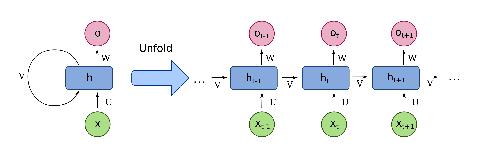

## 一、简介

循环神经网络（Recurrent Neural Networks, RNN）是一类用于处理序列数据的神经网络。与传统的前馈神经网络（Feedforward Neural Networks）不同，RNN具有内部的循环结构，能够保留序列中的历史信息，适用于处理时间序列、自然语言处理等任务。

## 二、RNN的结构

### 1、基本结构

RNN的基本单元包含一个输入层、一个隐藏层和一个输出层。与传统神经网络的不同之处在于，隐藏层不仅接收当前时间步的输入，还接收上一个时间步隐藏层的输出。这种循环使得网络能够记住序列信息。

### 2、数学表示

设输入序列为 $ x = (x_1, x_2, \ldots, x_T) $，对应的隐藏层状态为 $ h = (h_1, h_2, \ldots, h_T) $，输出序列为 $ y = (y_1, y_2, \ldots, y_T) $。

RNN的更新公式如下：
$$
h_t = \sigma(W_{xh} x_t + W_{hh} h_{t-1} + b_h)
$$

$$
y_t = \phi(W_{hy} h_t + b_y)
$$

其中：
- $ W_{xh} $：输入到隐藏层的权重矩阵
- $ W_{hh} $：隐藏层到隐藏层的权重矩阵
- $ W_{hy} $：隐藏层到输出层的权重矩阵
- $ b_h $、$ b_y $：偏置项
- $ \sigma $、$ \phi $：激活函数，常用的有sigmoid、tanh、ReLU等

## 三、RNN的类型

### 1、单向RNN

在单向RNN中，信息只沿一个方向传播，即从过去传向未来。适用于单向时间序列预测等任务。

### 2、双向RNN

双向RNN通过引入两个隐藏层，一个处理正向序列，另一个处理反向序列，能够利用上下文信息。适用于需要上下文理解的任务，如命名实体识别等。

## 四、RNN的训练

### 1、损失函数

常用的损失函数有均方误差（MSE）和交叉熵损失（Cross-Entropy Loss），具体取决于任务的性质（回归或分类）。

### 2、反向传播（Backpropagation Through Time, BPTT）

RNN的训练采用反向传播算法，但由于序列的时间依赖性，采用的是时间上的反向传播（BPTT）。BPTT通过展开时间步，将RNN变成一个深层神经网络，再进行误差反向传播。

### 3、梯度消失和爆炸

由于时间步的展开，梯度可能在长时间序列中消失或爆炸。常见的解决方法包括：
- 梯度裁剪（Gradient Clipping）：限制梯度的最大值
- 使用长短期记忆（LSTM）或门控循环单元（GRU）等改进的RNN结构

