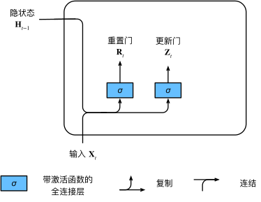
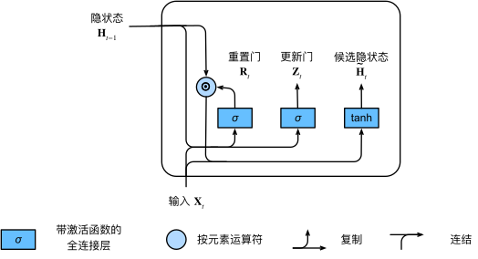

## 一、引入

在讨论如何在循环神经网络中计算梯度，以及矩阵连续乘积导致梯度消失或梯度爆炸的问题时，我们考虑了以下几种情况：

* 早期观测值对预测未来所有观测值非常重要。
  例如，序列的第一个观测值包含一个校验和，目标是在序列末尾辨别校验和是否正确。
  我们希望有机制能够在一个记忆元里存储重要的早期信息。
  否则，需要给这个观测值指定一个非常大的梯度，因为它会影响所有后续的观测值。

* 一些词元没有相关的观测值。
  例如，在对网页内容进行情感分析时，可能有一些辅助HTML代码与网页传达的情绪无关。
  我们希望有机制来跳过隐状态表示中的此类词元。

* 序列的各个部分之间存在逻辑中断。
  例如，书的章节之间或者证券的熊市和牛市之间可能会有过渡存在。
  在这种情况下，最好有方法来重置我们的内部状态表示。

学术界提出了许多方法来解决这些问题，其中最早的方法是"长短期记忆"（LSTM）。门控循环单元（GRU）是一个稍微简化的变体，通常能够提供同等的效果，并且计算速度更快。由于门控循环单元更简单，我们从它开始解读。

## 二、门控隐状态

门控循环单元与普通的循环神经网络之间的关键区别在于前者支持隐状态的门控。这意味着模型有专门的机制来确定何时更新隐状态，以及何时重置隐状态。这些机制是可学习的，并且能够解决上面列出的问题。例如，如果第一个词元非常重要，模型将学会在第一次观测之后不更新隐状态。模型也可以学会跳过不相关的临时观测，最后还将学会在需要的时候重置隐状态。

### 1、重置门和更新门

我们首先介绍重置门和更新门。我们把它们设计成(0, 1)区间中的向量，这样我们就可以进行凸组合。重置门允许我们控制“可能还想记住”的过去状态的数量；更新门将允许我们控制新状态中有多少个是旧状态的副本。

对于给定的时间步$t$，假设输入是一个小批量$\mathbf{X}_t \in \mathbb{R}^{n \times d}$（样本个数$n$，输入个数$d$），上一个时间步的隐状态是$\mathbf{H}_{t-1} \in \mathbb{R}^{n \times h}$（隐藏单元个数$h$）。那么，重置门$\mathbf{R}_t \in \mathbb{R}^{n \times h}$和更新门$\mathbf{Z}_t \in \mathbb{R}^{n \times h}$的计算如下所示：

$$
\begin{aligned}
\mathbf{R}_t = \sigma(\mathbf{X}_t \mathbf{W}_{xr} + \mathbf{H}_{t-1} \mathbf{W}_{hr} + \mathbf{b}_r),\\
\mathbf{Z}_t = \sigma(\mathbf{X}_t \mathbf{W}_{xz} + \mathbf{H}_{t-1} \mathbf{W}_{hz} + \mathbf{b}_z),
\end{aligned}
$$

其中$\mathbf{W}_{xr}, \mathbf{W}_{xz} \in \mathbb{R}^{d \times h}$和$\mathbf{W}_{hr}, \mathbf{W}_{hz} \in \mathbb{R}^{h \times h}$是权重参数，$\mathbf{b}_r, \mathbf{b}_z \in \mathbb{R}^{1 \times h}$是偏置参数。

### 2、候选隐状态

接下来，我们将重置门$\mathbf{R}_t$与常规隐状态更新机制集成，得到在时间步$t$的候选隐状态$\tilde{\mathbf{H}}_t \in \mathbb{R}^{n \times h}$。

$$
\tilde{\mathbf{H}}_t = \tanh(\mathbf{X}_t \mathbf{W}_{xh} + \left(\mathbf{R}_t \odot \mathbf{H}_{t-1}\right) \mathbf{W}_{hh} + \mathbf{b}_h),
$$

其中$\mathbf{W}_{xh} \in \mathbb{R}^{d \times h}$和$\mathbf{W}_{hh} \in \mathbb{R}^{h \times h}$是权重参数，$\mathbf{b}_h \in \mathbb{R}^{1 \times h}$是偏置项，符号$\odot$是Hadamard积（按元素乘积）运算符。在这里，我们使用tanh非线性激活函数来确保候选隐状态中的值保持在区间$(-1, 1)$中。

### 3、隐状态

上述的计算结果只是候选隐状态，我们仍然需要结合更新门$\mathbf{Z}_t$的效果。这一步确定新的隐状态$\mathbf{H}_t \in \mathbb{R}^{n \times h}$在多大程度上来自旧的状态$\mathbf{H}_{t-1}$和新的候选状态$\tilde{\mathbf{H}}_t$。

$$
\mathbf{H}_t = \mathbf{Z}_t \odot \mathbf{H}_{t-1}  + (1 - \mathbf{Z}_t) \odot \tilde{\mathbf{H}}_t.
$$

每当更新门$\mathbf{Z}_t$接近$1$时，模型就倾向只保留旧状态。此时，来自$\mathbf{X}_t$的信息基本上被忽略，从而有效地跳过了依赖链条中的时间步$t$。相反，当$\mathbf{Z}_t$接近$0$时，新的隐状态$\mathbf{H}_t$就会接近候选隐状态$\tilde{\mathbf{H}}_t$。

