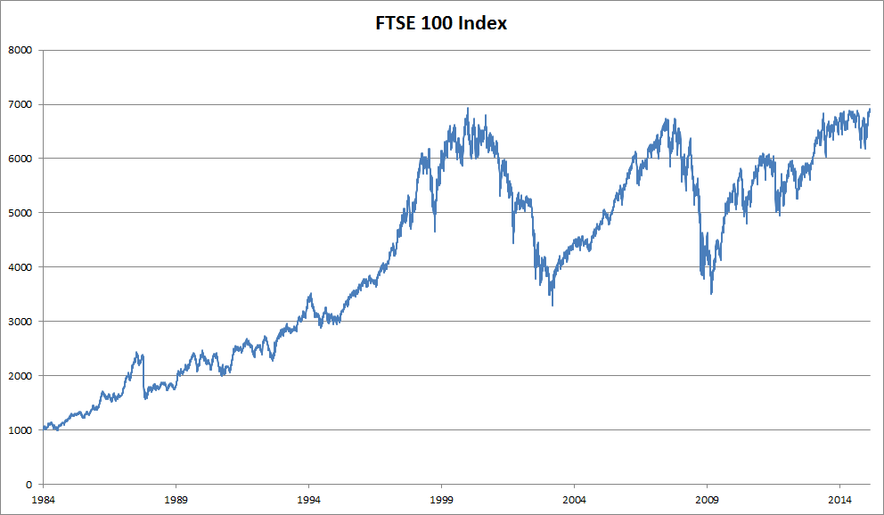

## 一、序列模型

想象一下有人正在看网飞（Netflix，一个国外的视频网站）上的电影。一名忠实的用户会对每一部电影都给出评价，毕竟一部好电影需要更多的支持和认可。然而，事情并不那么简单。随着时间的推移，人们对电影的看法会发生很大的变化。事实上，心理学家甚至对这些现象起了名字：

- **锚定效应**：基于其他人的意见做出评价。例如，奥斯卡颁奖后，受到关注的电影的评分会上升，尽管它还是原来那部电影。这种影响将持续几个月，直到人们忘记了这部电影曾经获得的奖项。这种效应会使评分提高半个百分点以上。
- **享乐适应**：人们迅速接受并且适应一种更好或者更坏的情况作为新的常态。例如，在看了很多好电影之后，人们会强烈期望下部电影会更好。因此，在许多精彩的电影被看过之后，即使是一部普通的也可能被认为是糟糕的。
- **季节性**：少有观众喜欢在八月看圣诞老人的电影。
- **外部事件**：有时，电影会由于导演或演员在制作中的不当行为变得不受欢迎。
- **小众电影**：有些电影因为其极度糟糕只能成为小众电影。*Plan9 from Outer Space*和*Troll2*就因为这个原因而臭名昭著。

简而言之，电影评分决不是固定不变的。因此，使用时间动力学可以得到更准确的电影推荐。当然，序列数据不仅仅是关于电影评分的。下面给出了更多的场景。

- **用户行为**：在使用程序时，许多用户都有很强的特定习惯。例如，在学生放学后社交媒体应用更受欢迎。在市场开放时股市交易软件更常用。
- **股市预测**：预测明天的股价要比过去的股价更困难，尽管两者都只是估计一个数字。在统计学中，前者称为外推法，而后者称为内插法。
- **连续数据**：音乐、语音、文本和视频都是连续的。如果它们的序列被我们重排，那么就会失去原有的意义。比如，一个文本标题“狗咬人”远没有“人咬狗”那么令人惊讶，尽管组成两句话的字完全相同。
- **地震预测**：地震具有很强的相关性，即大地震发生后，很可能会有几次小余震，这些余震的强度比非大地震后的余震要大得多。
- **人类互动**：人类之间的互动也是连续的，这可以从微博上的争吵和辩论中看出。

## 二、统计工具

处理序列数据需要统计工具和新的深度神经网络架构。为了简单起见，我们以股票价格（富时100指数）为例。用$x_t$表示价格，即在时间步$t$时观察到的价格$x_t$。$t$对于本文中的序列通常是离散的，并在整数或其子集上变化。

假设一个交易员想在$t$日的股市中表现良好，于是通过以下途径预测$x_t$：

$$
x_t \sim P(x_t \mid x_{t-1}, \ldots, x_1)
$$

### 1、自回归模型

为了实现这个预测，交易员可以使用回归模型。仅有一个主要问题：输入数据的数量，输入$x_{t-1}, \ldots, x_1$本身因$t$而异。也就是说，输入数据的数量将会随着我们遇到的数据量的增加而增加，因此需要一个近似方法来使这个计算变得容易处理。本章后面的大部分内容将围绕着如何有效估计$P(x_t \mid x_{t-1}, \ldots, x_1)$展开。

简单地说，它归结为以下两种策略：

1. **截断序列长度**：假设在现实情况下相当长的序列$x_{t-1}, \ldots, x_1$可能是不必要的，只需要满足某个长度为$\tau$的时间跨度，即使用观测序列$x_{t-1}, \ldots, x_{t-\tau}$。当下获得的最直接的好处是参数的数量总是不变的。这种模型被称为自回归模型，因为它们是对自己执行回归。

2. **使用隐藏状态**：保留一些对过去观测的总结$h_t$，并且同时更新预测$\hat{x}_t$和总结$h_t$。这就产生了基于$\hat{x}_t = P(x_t \mid h_{t})$估计$x_t$，以及公式$h_t = g(h_{t-1}, x_{t-1})$更新的模型。这类模型也被称为隐变量自回归模型。

这两种情况都有一个显而易见的问题：如何生成训练数据？一个经典方法是使用历史观测来预测下一个未来观测。尽管时间不会停滞不前，一个常见的假设是序列本身的动力学不会改变。统计学家称不变的动力学为静止的。因此，整个序列的估计值都将通过以下的方式获得：

$$
P(x_1, \ldots, x_T) = \prod_{t=1}^T P(x_t \mid x_{t-1}, \ldots, x_1)
$$

### 2、马尔可夫模型

在自回归模型的近似法中，我们使用$x_{t-1}, \ldots, x_{t-\tau}$而不是$x_{t-1}, \ldots, x_1$来估计$x_t$。只要这种近似是精确的，我们就说序列满足马尔可夫条件。特别是，如果$\tau = 1$，得到一个一阶马尔可夫模型，$P(x)$由下式给出：

$$
P(x_1, \ldots, x_T) = \prod_{t=1}^T P(x_t \mid x_{t-1}) \text{ 当 } P(x_1 \mid x_0) = P(x_1)
$$
当假设$x_t$仅是离散值时，这样的模型特别棒，因为在这种情况下，使用动态规划可以沿着马尔可夫链精确地计算结果。例如，我们可以高效地计算$P(x_{t+1} \mid x_{t-1})$：

$$
\begin{aligned}
P(x_{t+1} \mid x_{t-1}) &= \frac{\sum_{x_t} P(x_{t+1}, x_t, x_{t-1})}{P(x_{t-1})}\\
&= \frac{\sum_{x_t} P(x_{t+1} \mid x_t, x_{t-1}) P(x_t, x_{t-1})}{P(x_{t-1})}\\
&= \sum_{x_t} P(x_{t+1} \mid x_t) P(x_t \mid x_{t-1})
\end{aligned}
$$

利用这一事实，我们只需要考虑过去观察中的一个非常短的历史：$P(x_{t+1} \mid x_t, x_{t-1}) = P(x_{t+1} \mid x_t)$。隐马尔可夫模型中的动态规划超出了本节的范围，而动态规划这些计算工具已经在控制算法和强化学习算法中广泛使用。

### 3、因果关系

原则上，将$P(x_1, \ldots, x_T)$倒序展开也没什么问题。毕竟，基于条件概率公式，我们总是可以写出：

$$
P(x_1, \ldots, x_T) = \prod_{t=T}^1 P(x_t \mid x_{t+1}, \ldots, x_T)
$$
然而，在许多情况下，数据存在一个自然的方向，即在时间上是前进的。未来的事件不能影响过去。因此，解释$P(x_{t+1} \mid x_t)$应该比解释$P(x_t \mid x_{t+1})$更容易。例如，对于某些可加性噪声$\epsilon$，我们可以找到$x_{t+1} = f(x_t) + \epsilon$，而反之则不行。而这个向前推进的方向恰好也是我们通常感兴趣的方向。
