## 一、基本概念

### 1、人工智能

人工智能是指由人类创造的智能系统，这种智能不是指人类本身的智能，而是机器所展现的智能。然而，“智能”本身的定义并不统一，每个人对智能的理解可能不同：

- 有人认为 ChatGPT 是一种人工智能。
- 有人认为只有像机器人那样可以移动的设备才算人工智能。
- 有人认为能够进行决策或选土豆的机器才算人工智能。

因此，人工智能没有一个明确的标准定义，它更多是一个模糊的目标，而不是一个具体的技术概念。实际上，许多关于人工智能的论文很少使用“人工智能”这一术语，因为这个词汇没有明确的定义。

### 2、生成式人工智能

相比于人工智能，生成式人工智能（Generative AI， GAI）的定义则比较明确。生成式人工智能的目的是让机器产生复杂且有结构的结果。以下是一些典型的生成式人工智能任务：

- **文章生成**：生成由一系列有意义的文字组成的文本。
- **图像生成**：生成由一组像素组成的视觉内容。
- **语音生成**：生成由一系列取样点组成的声音。

**“复杂”** 的定义是指生成的结果有太多可能性，无法穷举。例如，要写一篇 100 字的中文文章，其可能的字组合有 $1000^{100} \approx 10^{300} $ 种，这种复杂性远超过了宇宙中的原子数量（约 $10^{80}$），因此无法进行穷举。生成式人工智能的任务通常是处理这种复杂性，并生成具有一定结构的内容。

**“有结构”** 的定义是指生成的结果具有一定的组织形式，如序列、列表或树状结构等。

### 3、生成式人工智能与其他任务的区分

为了更好地理解生成式人工智能，我们可以从以下几个方面来区分它与其他类型的人工智能任务：

- **分类问题** 不是生成式人工智能的任务。分类问题是从有限的选项中做出选择。例如：
  - **垃圾邮件检测**：系统需要判断邮件是垃圾邮件还是正常邮件，只有两个结果选项。
  - **人脸识别**：系统判断某张图片中是否有特定的个人，仍然是从有限选项中做出选择。

- **图像识别系统**：如果系统只是识别图片中是否包含猫或狗，这也属于分类任务，而不是生成式人工智能的任务。它只能在预定义的选项中进行分类，而不涉及生成新的内容。

当机器从有限的选项中做选择时，这种任务就不属于生成式人工智能的范畴。

### 4、机器学习

**机器学习（Machine Learning， ML）** 是另一个常与人工智能一起提到的概念。其目标是让机器从数据中找出一个函数。例如：

假设有一个函数，形式为 $ y = f(x) = ax + b $。已知输入 $ x = 4 $ 时，输出 $ y = 5 $；输入 $ x = 2 $ 时，输出 $ y = -1 $。通过解方程组，我们可以求出 $ a = 3 $ 和 $ b = -7 $。知道了 $ a $ 和 $ b $ 的值后，我们可以代入新的 $ x $，算出新的 $ y $。例如 $ x = 1 $ 时， $ y = 1 \times 3 - 7 = -4 $。

这个过程对于人类来说很简单，但如果这是一个机器学习问题，则需要让机器通过一系列的方法，自动找到参数。在机器学习领域，未知数（如 $ a $ 和 $ b $）被称为参数（parameter）。

现实中的问题往往比 $ y = ax + b $ 复杂得多。例如，要让机器学会分辨一张图片中是猫还是狗，就需要找到一个函数 $ f $，其输入是一张图片，输出只有两个可能：猫或狗。这个函数 $ f $ 可能包含上万个参数，这些参数构成一个复杂的模型。

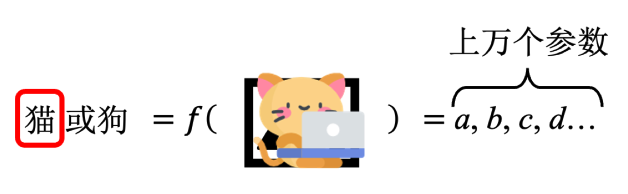

在机器学习中，模型是一个带有大量未知参数的函数。通过提供大量标注数据（如猫和狗的图片），机器可以自动找到这些参数，这个过程称为训练（training）。提供的数据叫做训练数据。训练完成后，可以用新的数据测试模型的性能，这称为测试（testing）或推断（inference）。

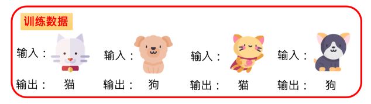

### 5、深度学习

在机器学习领域，复杂的模型通常表示为神经网络（neural network）。神经网络是由大量参数组成的函数，被组织成网状结构。让机器自动找到这些参数的过程称为深度学习（Deep Learning， DL）。深度学习是机器学习的一种。

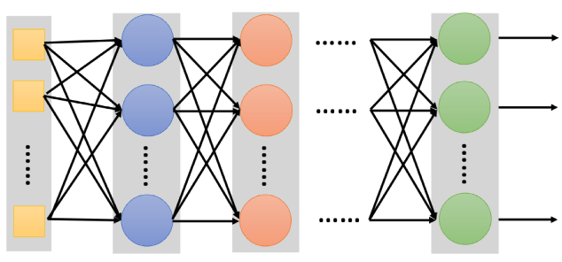

## 二、基本原理

### 1、生成式人工智能与深度学习的关系

- 生成式人工智能可以通过机器学习（特别是深度学习）来实现。
- 机器学习不仅解决生成式人工智能问题，还解决其他问题，如分类问题。
- 深度学习是机器学习的一种技术。

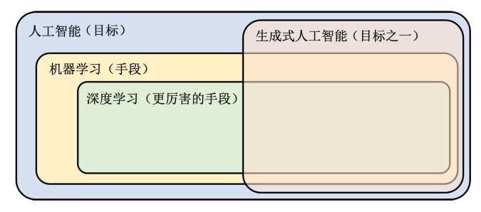

生成式人工智能、深度学习和机器学习的关系可以总结如下：

- 生成式人工智能是一个目标，可以使用深度学习技术来实现。
- 深度学习是机器学习的一种，因此生成式人工智能通常被视为深度学习的应用之一。

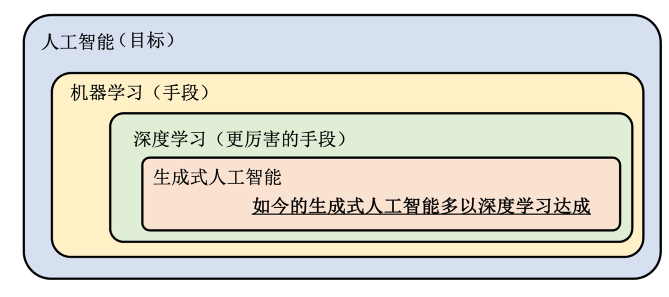

尽管生成式人工智能和深度学习的关系如此密切，但它们的定义和目标有所不同。生成式人工智能专注于生成复杂且有结构的结果，而深度学习是实现这一目标的主要技术手段。

以 ChatGPT 为例，ChatGPT 是一个复杂的函数，其输入是一段文字，输出是相应的回答。ChatGPT 能够回答各种问题，这表明其背后的函数非常复杂，包含数亿甚至数十亿个参数，这种模型被称为 Transformer，是神经网络的一种，它通过自注意力机制（self-attention mechanism）来处理输入数据。这种机制允许模型在处理每个输入元素时，都能考虑到输入序列中其他所有元素的信息，从而能够捕捉到更复杂的依赖关系。Transformer 模型的训练涉及大量的参数，通过反复迭代和优化，模型能够逐步提高生成质量。

要构建 ChatGPT 这样的人工智能，需要准备大量的输入和输出数据，并通过机器学习和深度学习技术来找到这些参数。

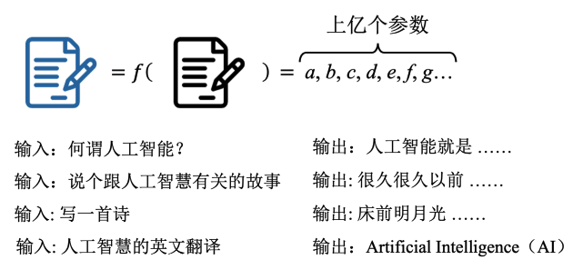

### 2、文生图模型的原理

文生图模型（例如 Stable Diffusion、Midjourney、DALL·E）同样可以被视为一个复杂的函数，其输入是一段文字，输出是一张图片。为了找到这个函数，我们需要收集大量的文字与对应的图片数据，然后使用深度学习技术来训练模型，找到这些参数。一旦训练完成，模型就能够根据输入的文字生成相应的图片。

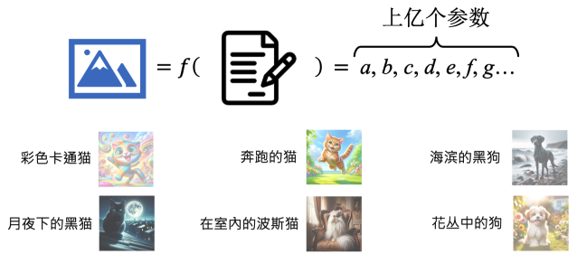

### 3、生成式人工智能的挑战

生成式人工智能面临的一个主要挑战是数据的多样性和复杂性。在训练过程中，可能无法收集到所有可能的输入和输出组合，而在实际使用中，用户可能提出完全不同的问题。例如，要求生成一篇关于“联想”的文章，可能在训练数据中从未出现过。模型需要能够生成全新的语句，这种能力可以被视为一种创造力。

### 4、ChatGPT 的工作原理

ChatGPT 生成答案的核心原理是文字接龙。生成一个完整答案被分解为一系列文字接龙问题。对于每一个未完成的句子，模型预测下一个最合理的字，然后将这个字添加到句子末尾，继续预测下一个字。这个过程重复进行，直到生成完整的答案。这样，生成复杂语句的问题变成了多个较小的分类问题，即从有限的选项中选择最合适的字。

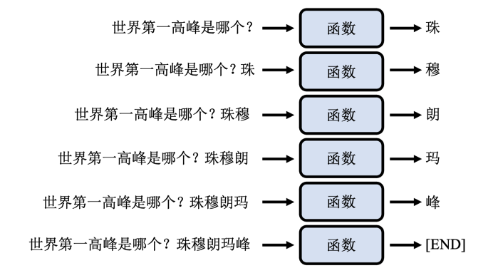

### 5、语言模型与自回归生成

语言模型（language model）是在进行文字接龙的模型，它将生成完整答案的问题分解为一系列分类问题，使得生成过程变得可解。自回归生成（autoregressive generation）是将复杂对象拆解成较小单位，然后按固定顺序生成这些单位的策略。对于文本生成，自回归模型一次生成一个字符或单词，并将其作为下一次生成的条件。自回归生成的优点是可以逐步构建复杂的输出，同时能够处理输入数据的依赖关系。然而，这种方法也有其局限性，例如生成过程较慢，并且每一步生成都依赖于前一步的准确性。ChatGPT 就是采用自回归生成策略。

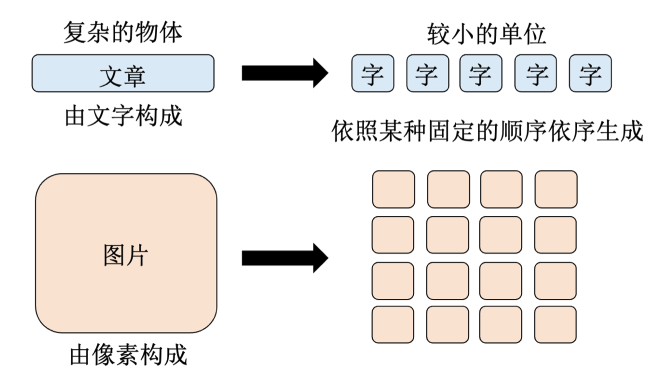

OpenAI 也曾使用类似方法来生成图片，但这种方法没有广泛流行，具体原因将在后面讨论。

## 三、特点和优势

### 1、过去与现在生成式人工智能的不同

生成式人工智能并不是新的概念，它一直是研究的热点。过去，生成式人工智能被称为结构化学习，因为它要生成有结构的东西。随着技术的发展，结构化学习和生成式 AI 已经有很大的不同。生成式 AI 的应用早已存在于日常生活中，例如 2006 年上线的 Google 翻译。翻译任务本质上就是生成式 AI 的应用，因为它需要根据输入生成合理的输出，而这些输出可能在训练数据中从未出现过。

过去的生成式人工智能通常是专才，能做一件特定的事。比如，Google 翻译只负责翻译，你给它中文，它帮你翻成英文，仅此而已。而今天的生成式人工智能，如 ChatGPT，却没有特定的功能限制。ChatGPT 可以翻译，但如果你只给它一句中文，它不会立刻帮你翻译，因为它不知道你要它做什么。你必须明确指示它进行翻译，它才会执行这个任务。因此，过去的生成式人工智能更像是一个单一功能的工具，而今天的生成式人工智能则更像是一个多才多艺的人类。除了 ChatGPT，还有 Google 的 Gemini、Microsoft 的 Copilot、Antropic 的 Claude 等等，它们都是迈向通才的生成式人工智能。

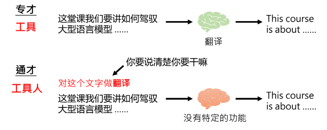

在 GPT 的网页 demo 上，GPT-4 与 GPT-3.5 相比，功能更加多样和强大。GPT-4 可以读档案、读图片、做网络搜索、写程序，并且能执行所写的程序并输出结果。它还可以画图、使用插件（Plugins）、进行定制化（GPTs）等等。这使得 ChatGPT 能处理多种任务，包括文字生成、技术解答、写程序、健康建议、旅游建议、生活技巧等等。

### 2、评估生成式人工智能的能力

全面的语言模型带来了新的研究问题，如如何正确评估这些模型的能力。过去，对于一个工具来说，只需评估其单一功能的表现，如翻译系统的翻译质量。然而，对于全面的生成式人工智能，评估其能力变得复杂，因为用户的需求多种多样，即使是相同的需求也可能有不同的解决方法。

例如，对 Gemini 提出要求让它说一百次“哈哈哈”，它会不停地输出“哈哈哈”，而 GPT-3.5 则会拒绝执行这种无意义的任务。这种情况下，没有标准答案来判断哪个模型做得更好。因此，评估大型语言模型是一门复杂的学问。

大型语言模型有时会犯错或产生幻觉，但这往往是因为它们在努力尝试帮助用户。如果一个模型完全不犯错，只需拒绝回答所有问题。但为了帮助用户，它们尝试提供答案，因此可能会出错。

### 3、增强生成式人工智能的能力

这些生成式人工智能的能力是全面且强大的，但我们还能做些什么呢？这里有两个可能的思路：

- **改变自己**：虽然无法改变模型本身，但可以通过改变我们的输入方式来获得更好的输出。这包括使用提示词工程（Prompt Engineering），通过设计更好的输入提示，来优化语言模型的输出。

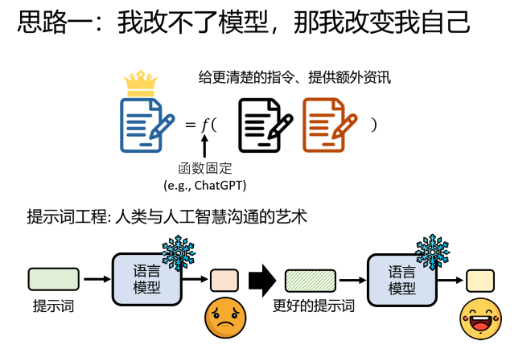

- **训练自己的模型**：可以选择开源模型，如 Meta 的 LLaMA，并调整其参数来满足特定需求。这需要一定的技术，但通过调整参数可以得到更符合需求的输出。

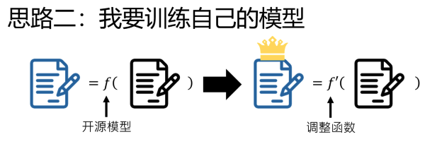

#### （1）生成模型的强化方法一：神奇“咒语”

第一种强化方法是使用一些神奇的“咒语”，如`Chain of Thought (COT)`，即让模型逐步思考。当让模型一步一步地解决问题时，它的正确率显著提高。例如，解数学题时，如果指示它`Let’s think step by step`，正确率会从 17.7% 提高到 78%。

还有一些咒语如情绪勒索，当对模型说`"这件事对我很重要"`时，它的能力会有所增强。研究表明，一些特定的咒语对模型性能的提升有显著效果，而有些咒语则没有明显影响。

#### （2）生成模型的强化方法二：提供更多信息

第二种强化方法是提供更多的信息。如果模型没有得到正确的答案，可能是因为信息不足。提供额外的信息或范例，可以让模型输出更准确的答案。例如，当要求模型进行情感分析时，提供正面和负面的句子范例，可以帮助模型理解任务并给出正确的答案。这种方法被称为 `In-Context Learning`，即通过提供上下文范例来增强模型的表现。

## 四、生成策略

在前一章节中，我们学习了一些在不训练模型的情况下强化语言模型能力的方法，包括使用神奇的咒语和提供额外的知识。本章我们将探讨其他方法，即在完全固定语言模型参数的情况下，提升其能力。

### 1、拆解任务

有时候我们希望能直接输入任务，语言模型就能给出完整的输出。然而，当任务非常复杂时，语言模型可能很难一次性完成。这时，可以将复杂任务拆解成多个简单步骤，让语言模型逐个击破。

例如，假设你要写一篇关于生成式AI的报告。直接要求ChatGPT生成这篇报告，可能效果不佳且篇幅有限。这时，可以把任务拆解成几个步骤。首先，让ChatGPT列出报告大纲，如：

```text
1. 生成式AI的重要性
2. 生成式AI的种类
3. 生成式AI的技术原理
```

然后，再逐个撰写大纲中的每个部分。可能会出现前言不搭后语的情况，这时可以将已写内容摘要后提供给ChatGPT，以此为基础继续撰写新的段落。这种方法能够更好地完成长篇报告。

拆解任务的想法不仅适用于当下。2022年10月的论文《Recursive Reprompting and Revision》使用大型语言模型写长篇小说，发现模型容易在人物设定和剧情上出错。因此，先让模型撰写小说大纲，然后逐步填充细节，从而完成更一致的长篇小说。

在回顾上章提到的“模型思考（或模型解释）”时，Chain of Thought（思维链）技术同样是拆解任务的一种表现。当要求语言模型一步一步思考时，它会将计算过程详细列出，再给出答案。这样实际上是将原本的数学问题拆解成两个步骤：列出计算过程，再根据计算过程得出答案。

比如，解决数学问题时，如果直接写出答案，即使对人类来说也很难做到。通过先列出详细的计算过程，再根据这些步骤得出答案，语言模型更有可能得出精确的答案。这种方法和将问题拆解成两部分的方式在本质上是相同的，因为语言模型在生成文字时，是通过逐字接龙的方式完成的。

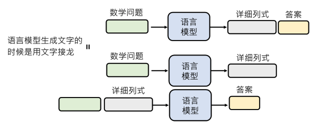

因此，思维链技术（Chain of Thought）会有效果，因为它等于让语言模型将解数学问题的过程拆解成多个步骤。这也解释了为什么对GPT-3.5而言，思维链技术的作用不大。对于某些模型或较老的模型，神奇咒语（如思维链技术）可能有效，但对新的模型（如GPT-3.5）则不明显，因为这些新模型已经学会了自行拆解步骤完成任务。

### 2、模型检查自己的答案

除了将复杂任务拆解成多个小任务，我们还可以在原来的任务后添加一个步骤，即让语言模型检查自己的错误。这一步骤让语言模型在生成答案后，再次检查其输出是否正确。有时，模型可以发现并修正自己的错误，最终得到正确的答案。

有人可能会质疑：如果错误的答案是语言模型自己产生的，那么它是否能检查出自己的错误并进行修正？其实，这类似于人类在考试后检查自己的答案。我们在考试中往往能够通过检查发现错误，因为计算答案很难，但验证答案是否正确相对容易。

例如，在鸡兔同笼问题中，假设已知鸡和兔共35只，合起来有94只脚。如果一个答案是20只鸡和20只兔，你可以立刻判断这是错误的，因为总共有35只头，而这个答案显然不符。因此，即使不会解这个问题，看到错误的答案时，还是能迅速识别其错误。同样，语言模型可能无法立即给出正确答案，但在产生错误答案后，再次审视时，有机会发现错误。

通过拟人化的说法，我们可以说这些语言模型具有某种自我反省的能力。例如，假设要求GPT-4介绍台大玫瑰花节，它可能会生成一个错误的回答，因为实际上没有这个节日。但如果在同一对话中再次要求它检查上述信息是否正确，它可能会发现之前的错误，并修正其回答，提供正确的信息。虽然这个过程并未真正改变模型的参数，但在同一对话中，模型能够识别并纠正自己的错误。

这种自我检查能力在GPT-4中表现较为明显，而在GPT-3.5中则不太可靠。GPT-3.5在被要求检查错误时，往往会表面道歉，但实际上没有修正错误的答案。这种差异表明，较新的模型在自我检查和修正能力上有更好的表现。

一个实际应用是`Constitutional AI`技术。在这项技术中，人类与语言模型的对话内容会被再次提交给同一模型进行自我检查，以确定是否有不符合道德规范或法律的问题。模型会自我批判并产生新的、更合规的答案。这种自我反省后的结果才是真正提供给用户的答案。

这段内容考验了我们对语言模型自我反省能力的理解。尽管模型能够在对话中进行自我检查并修正错误，但这并不会永久改变模型的行为。模型的参数固定，即使经过多次反省，其输出也不会有本质改变。要让模型永久记住并改变其行为，需要通过进一步的训练。

### 3、为什么语言模型的回答会不一致？

有时候你可能会发现，每次问语言模型同样的问题，它的答案都会有所不同。这是因为语言模型在回答问题时，并不是输出一个确定的答案，而是输出一个概率分布。也就是说，模型实际上给出了每一个可能接在输入后面的词的概率。

当你给语言模型一个句子，比如“台湾大”，模型可能会输出以下概率分布：
- 50%的概率下一个词是“学”（如“台湾大学”）
- 25%的概率是“车”（如“台湾大车队”）
- 25%的概率是“哥”（如“台湾大哥大”）

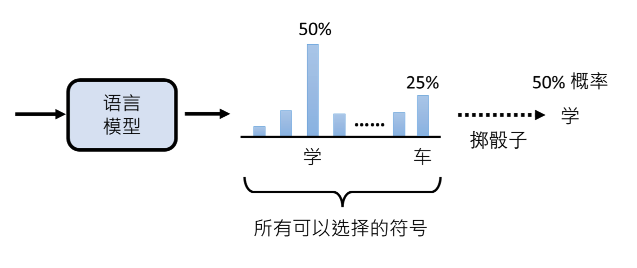

语言模型根据这个概率分布掷一个“骰子”来决定实际要生成的词。因此，即使模型的参数是固定的，输入相同的句子，每次生成的词可能都不同。这就像使用同一颗骰子，每次掷出来的结果可能不同。因此，同一个问题，每次回答可能都不同。

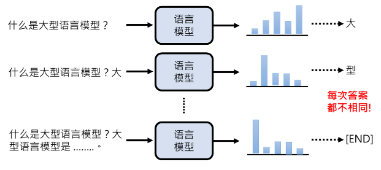

## 五、强化语言模型的能力

为了应对同一个问题可能产生不同答案的情况，有一些方法可以用来强化语言模型的能力。例如，`Self-Consistency`方法让语言模型对同一个问题回答多次，然后取最常出现的答案作为正确答案。

### 1、Self-Consistency

你可以让语言模型对同一个问题回答多次，例如第一次的答案是3，第二次是5，第三次是3。通过多次实验，最终选择最常出现的答案作为正确答案。

### 2、组合各种方法

你可以将复杂任务拆解成多个步骤，并在每一步中应用自我反省和多次尝试的方法。

举个例子，假设有一个复杂任务，可以拆解成三个步骤。先让语言模型产生第一个步骤的多个答案，然后通过自我反省检查每个答案的正确性。再根据检查结果进入下一步，重复这个过程，最终得到正确的答案。

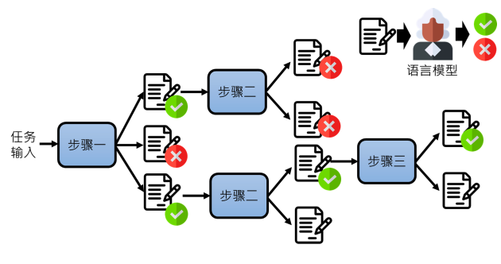

这种方法叫做**Tree of Thought (ToT)**，是一种将不同技术组合起来解决复杂任务的策略。类似的还有其他“of Thought”方法，例如**Algorithm of Thought**和**Graph of Thought**，它们都是通过将复杂任务拆解成小任务，并利用语言模型逐步解决每个小任务来实现最终目标。

### 3、使用工具

语言模型虽然很强大，但在某些任务上仍然存在局限性。例如，它们在复杂运算方面表现不佳。如果让 GPT-3.5 计算一个六位数乘以六位数的乘法，它的答案可能会部分正确，但整体上会有错误。这是因为语言模型主要依赖文字接龙的方式来生成答案，对于复杂的数学运算并不擅长。

就像人类依赖工具来增强自身能力一样，语言模型也可以通过使用工具来提升其性能。本章将展示几种语言模型可以使用的工具来增强其能力。

#### （1）搜索引擎

第一个与语言模型搭配的工具是搜索引擎。许多人误以为大型语言模型本身就是搜索引擎，但实际上，语言模型并不能准确查找或提供实时信息。例如，当你问 GPT-4 "SORA 是什么" 时，它可能会给出错误的答案，因为它只是通过文字接龙生成答案，而不是从实际的资料库中检索信息。

将语言模型与搜索引擎结合，可以显著提高其回答问题的准确性。具体方法是将困难的问题先通过搜索引擎查询，然后将搜索结果作为额外信息提供给语言模型。这种方法被称为 **Retrieval Augmented Generation (RAG)**。

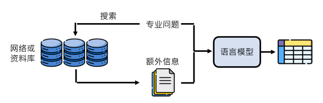

RAG 的实现并不复杂，且效果显著。通过增加搜索步骤，即使是同一个语言模型，也能根据不同的搜索结果生成不同的答案。特别是当搜索对象是独特的资料库时，模型可以生成其他模型无法提供的专有答案。这使得 RAG 成为一种快速且有效的定制化语言模型的方法。

如果 GPT-4 能使用搜索引擎，当你问它 "SORA 是什么" 时，它的答案会更加准确。事实上，GPT-4 可以使用搜索引擎来获取最新信息。你可以直接告诉它先进行搜索，然后再回答问题。例如，如果你让 GPT-4 在 Bing 上搜索，它会显示 "Doing research with Bing"，然后根据搜索结果给出更准确的答案，并提供信息来源。

#### （2）写程序

语言模型的另一个强大的工具是写程序。当你向大型语言模型提出数学问题时，例如著名的鸡兔同笼问题，以前模型往往通过文字接龙方式来解决问题。这种方法常常会出现奇怪的错误，导致错误的答案。然而，今天的 GPT-4 处理这些问题的方式已经有了显著改进。

当你问 GPT-4 鸡兔同笼的问题时，它不再依赖文字接龙来解答，而是通过编写程序代码来解决问题。它会列出相关的数学方程，然后编写代码来调用所需的工具包，并使用 `solve` 函数来解方程，最终打印出答案。这种方法大大减少了错误的可能性，因为程序代码的执行结果通常是可靠的。

通过写程序来增强语言模型的能力的概念并不是新鲜事。这种方法被称为 **Program of Thought**。类似于其他 “of Thought” 的方法，这一概念不需要重新训练语言模型，而是通过编写和执行程序代码来增强模型的能力。

举个例子，当你向语言模型提问一个数学问题时，如果它直接使用文字接龙的方式来解决问题，可能会产生错误的答案。但如果它编写程序并执行该程序，通常会得到正确的答案。这种方法早在 2022 年 11 月，即 GPT-3.5 上线之前，就已经被提出并使用。

当你要求 GPT-4 重复“哈哈哈哈”100次时，它能够准确地产生300个“哈”。这一过程的实现并不是简单的文字接龙，而是通过编写和执行程序代码来完成的。GPT-4 会写一段程序，将“哈哈哈哈”重复100次并存储在一个变量中，然后打印出结果。这确保了输出的准确性。

你可以通过观察到 GPT-4 在回答过程中显示的“Finish Analyzing”提示，了解到它实际上是编写并执行了一段程序代码。这种能力使得 GPT-4 能够解决一些其他语言模型难以解决的问题，通过编写和执行代码来得到正确的答案。

#### （3）文字生图

在当前的技术环境中，语言模型不仅可以进行文本生成，还能结合其他工具来扩展其功能。一个显著的例子是 **文字生图** AI 的使用。GPT-4 可以通过调用如 **DALL-E** 这样的工具，将文字描述转换为图像。这种能力为用户提供了全新的创造性应用场景。

**文字生图** AI 是一种基于文本描述生成图像的技术。用户输入一段文字描述，AI 根据这些描述生成相应的图像。例如，DALL-E 是一种流行的文字生图 AI，它可以根据用户的文字输入生成具有想象力的图像。

#### （4）插件模式

除了内建的工具如搜索引擎和文字生图 AI，GPT-4 还可以通过 **插件模式** 调用更多工具。插件模式允许用户从上千个工具中选择三个进行使用。在插件模式中，语言模型使用文字接龙的方式来操控工具：

**Step1：定义工具的符号**：语言模型会生成一个特殊的符号来表示调用工具的开始。

**Step2：发出工具指令**：在这个符号和结束符号之间的内容就是操作工具的指令。

**Step3：使用工具的结果**：工具的输出作为文字接龙的一部分，用来继续生成对话内容。

假设你想询问“用五美金可以换多少新台币”，GPT-4 可能会进行如下操作：

**Step1：生成问题**：GPT-4 生成“**五美金可以换**”这一部分。

**Step2：调用工具**：生成一个符号，表示要用工具进行网络搜索，找到美元对台币的最新汇率。

**Step3：获取信息**：搜索“美元对台币的汇率”并找到结果，例如1美金=31.5台币。

**Step4：计算结果**：生成另一段符号来表示计算，得到“5 × 31.5 = 157.5”。

**Step5：提供答案**：最终得到答案是“157.5 新台币”。

这种方法使得 GPT-4 可以通过利用外部工具的功能来回答更复杂的问题，而不是仅仅依赖文字接龙的方式。

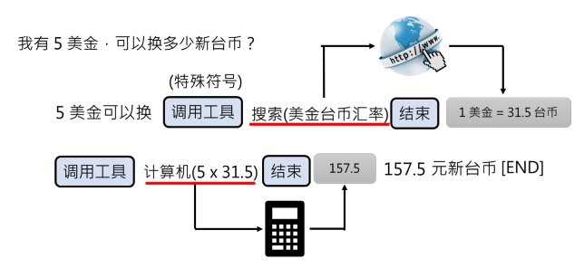

## Reference

- 李宏毅 - 《生成式人工智能导论》 (2024 春)