## 一、引言

目前越来越多的基于生成式的软件出现, 极大程度上改变了我们的生活。 例如, 我们可以通过一张照片, 让软件自动生成一段音乐, 或者是让软件自动生成一段视频。 本章具体介绍它们背后的基础模型——生成模型。到目前为止，我们学习到的网络本质上都是一个函数，即提供一个输入 $x$，网络就可以输出一个结果 $y$。前几章介绍的各种网络可以应对不同类型的输入 $x$ 和输出 $y$。例如，当输入 x 是一张图片时，可以使用卷积神经网络等模型进行处理；当输入 $x$ 是序列数据时，可以使用基于循环神经网络架构的模型进行处理，其中输出 y 可以是数值、类别，也可以是一个序列。目前，这些网络已经可以涵盖多数日常问题。

## 二、生成对抗网络

### 1、生成器

接下来，我们将介绍另一种架构——生成模型。与先前介绍的模型不同的是，生成模型中的网络会作为一个生成器 (generator) 使用。具体来说，在模型输入时会将一个随机变量 $z$ 与原始输入 $x$ 一并输入到模型中，这个变量是从随机分布中采样得到。输入时可以采用向量拼接的方式将 $x$ 和 $z$ 一并输入，或在 $x$、$z$ 长度一样时，将二者相加作为输入。这个变量 $z$ 的特别之处在于其非固定性，即每次使用网络时都会从一个随机分布中采样得到一个新的 $z$。通常，我们对该随机分布的要求是其足够简单，可以较为容易地进行采样，或可以直接写出该随机分布的函数，例如高斯分布 (Gaussian distribution) 、均匀分布 (uniform distribution) 等等。

所以每次有一个输入 $x$ 的同时，我们都从随机分布中采样得到 $z$，来得到最终的输出 $y$。随着采样得到的 $z$ 不同，我们得到的输出 $y$ 也会不同。同理，对于网络来说，其输出也不再固定，而变成了一个复杂的分布。我们也将这种可以输出一个复杂分布的网络称为生成器，如下图所示。

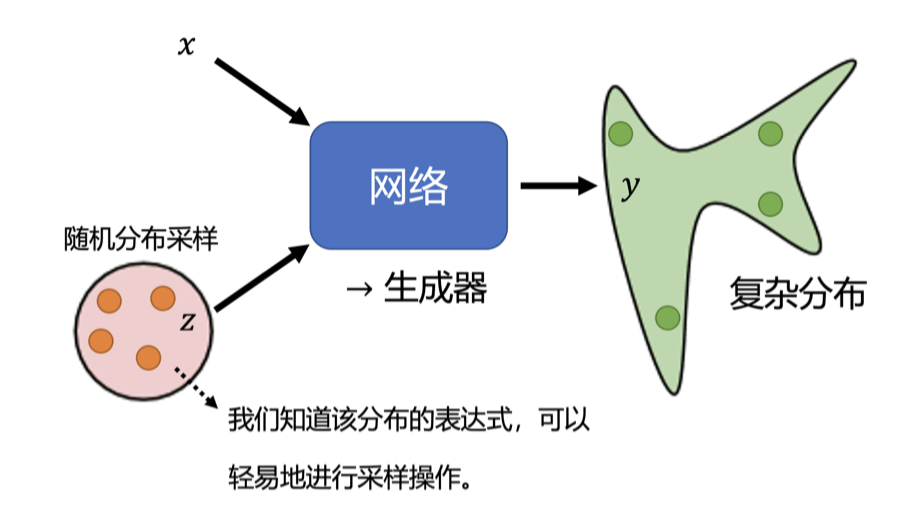

接下来我们介绍如何训练生成器。首先，我们为什么需要训练生成器，为什么需要输出一个分布呢？下面介绍一个视频预测的例子，即给模型一段视频短片，让它预测接下来发生的事情。视频环境是小精灵游戏，预测下一帧的游戏画面，如下图所示。

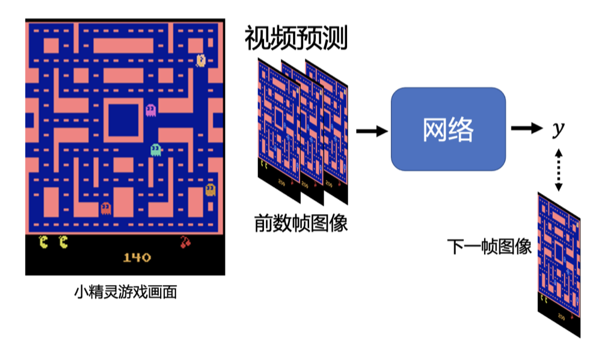

要预测下一帧的游戏画面，我们只需要将过去几帧游戏画面输入给网络。要得到这样的训练数据很简单，只需要在玩小精灵的同时进行录制，就可以训练我们的网络，只要让网络的输出 y 与真实图像越接近越好。当然，在实践中，为了保证高效训练，我们会将每一帧画面分割为很多块作为输入，并行进行预测。接下来为了简化，假设网络是一次性输入整个画面。如果我们使用前几章介绍的基于监督学习的训练方法，我们得到的结果可能会是十分模糊的，甚至游戏中的角色消失、出现残影，如下图所示。

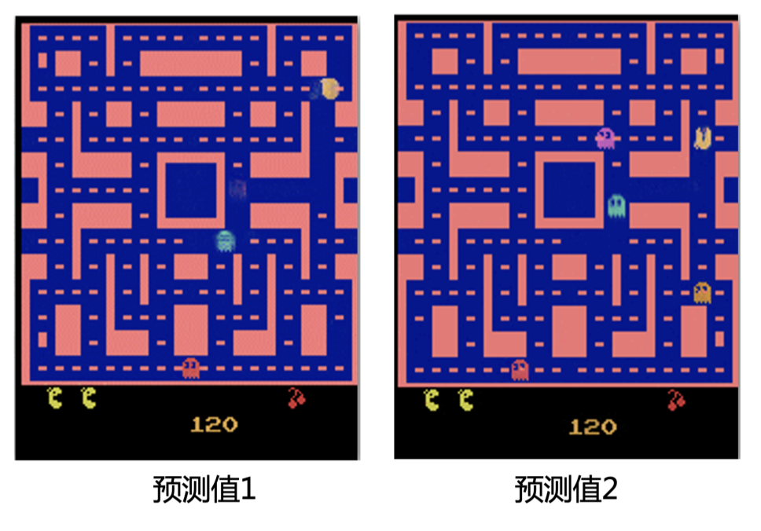

造成该问题的原因是，监督学习中的训练数据对于同样的转角同时存储有角色向左转和向右转两种输出。当我们在训练的时候，对于一条向左转的训练数据，网络得到的指示就是要学会游戏角色向左转的输出。同理，对于一条向右转的训练数据，网络得到的指示就是学会角色向右转的输出。但是实际上这两种数据可能会被同时训练，所以网络就会学到一个折中的结果，即“两面讨好”。当输出同时距离向左转和向右转最近时，网络就会得到一个错误的结果——向左转是对的，向右转也是对的。

所以我们应该如何解决这个问题呢？答案是让网络有概率地输出一切可能的结果，或者说输出一个概率分布，而不是单一的输出，如下图所示。当我们给网络一个随机分布时，网络的输入会加上一个 $z$，这时输出就变成了一个非固定的分布，包含了向左转和向右转的可能。举例来说，假设我们选择的 $z$ 服从一个二项分布，即只有 0 和 1 并且各占 50%。那么我们的网络就可以学到 $z$ 采样到 1 的时候就向左转，采样到 0 的时候就向右转，这样就可以解决问题。

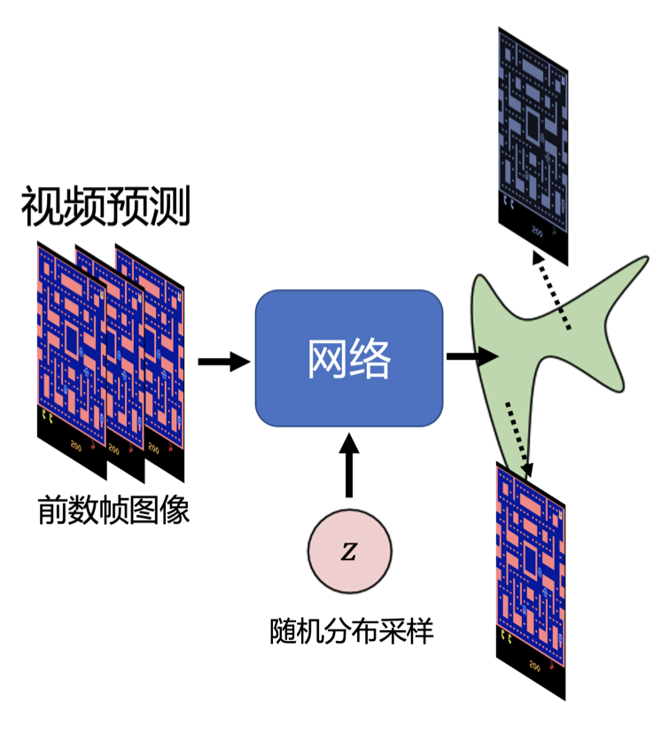

回到生成器的讨论中，我们为什么需要这类生成模型呢？答案是当我们的任务需要“创造性”的输出，或者我们想要一个可以输出多种可能的模型时，这些输出都是正确的。

这可以类比于让很多人一起处理一个开放式的问题，或者是头脑风暴，大家的回答五花八门各自发挥，但回答都是正确的。所以生成模型也可以被理解为让模型拥有了创造的能力。再举两个更具体的例子，对于画图，假设画一个红眼睛的角色，每个人画出来的可能都不一样。对于聊天机器人，它也需要有创造力。比如我们对机器人说，你知道有哪些童话故事吗？聊天机器人会回答安徒生童话、格林童话等，没有一个标准的答案。所以对于生成模型来说，需要能够输出一个分布，或者说多个答案。

当然，在生成模型中，非常知名的就是生成式对抗网络 (generative adversarial network)，通常缩写为 GAN。这一节我们将介绍生成对抗网络。

我们通过让机器生成动画人物的面部来形象地介绍 GAN。首先介绍的是无限制生成 (unconditional generation)，即不需要原始输入 $x$。其对应的是需要原始输入 $x$ 的条件型生成 (conditional generation)。如下图所示，对于无限制的 GAN，唯一的输入就是 $z$，这里假设为正态分布采样出的向量。其通常是一个低维的向量，例如 50、100 的维度。

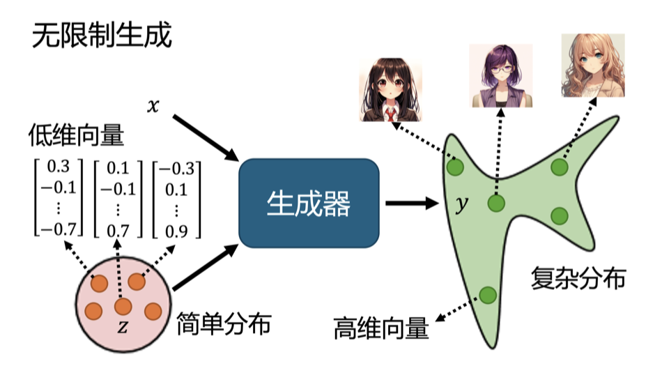

我们首先从正态分布中采样得到一个向量 $z$，并输入到生成器中，生成器会给我们一个对应的输出——一个动漫人物的脸。生成器输出一个动漫人物面部的过程其实很简单，一张图片就是一个高维向量，所以生成器实际上做的就是输出一个高维向量，比如一个 64×64 的图片 (如果是彩色图片，那么输出就是 64×64×3)。当输入的向量 $z$ 不同时，生成器的输出就会改变，所以我们从正态分布中采样出不同的 $z$，得到的输出 $y$ 也会不同，动漫人脸照片也不同。当然，我们也可以选择其他的分布，但根据经验，分布之间的差异可能并没有非常大。大家可以找到一些文献，并且尝试去探讨不同分布之间的差异。我们这里选择正态分布是因为其简单且常见，而且生成器会将这个简单的分布映射到一个更复杂的分布。所以我们后续的讨论都以正态分布为前提。

### 2、辨别器

在 GAN 中，除了生成器以外，我们还需要训练一个判别器 (discriminator)，其通常是一个神经网络。判别器会输入一张图片，输出一个标量，其数值越大就代表输入的图片越像真实的动漫人物图像，如下图所示。举例来说，对于图中的动漫人物头像，输出就是 1。假设 1 是最大的值，画得很好的动漫图像输出就是 1，不知道在画什么的图像输出 0.5，再差一些的输出 0.1 等等。判别器本质上也是一个神经网络，由我们自己设计，可以用卷积神经网络，也可以用 Transformer，只要能够实现所需的输入输出即可。当然，对于这个例子，因为输入是一张图片，所以选择卷积神经网络，因为其在处理图像上有非常大的优势。

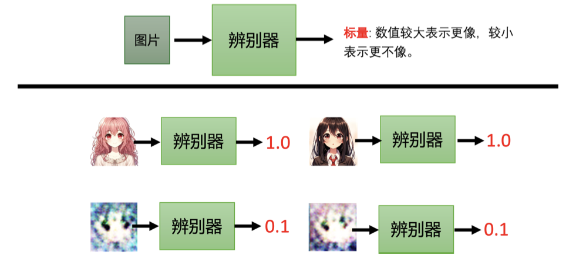

我们回到动漫人物图片的例子，生成器学习画出动漫人物的过程如下图所示。首先，第一代生成器的参数几乎是完全随机的，所以它根本不知道要怎么画动漫人物，画出来的东西就是一些噪音。判别器学习的目标是成功分辨生成器输出的动漫图片。

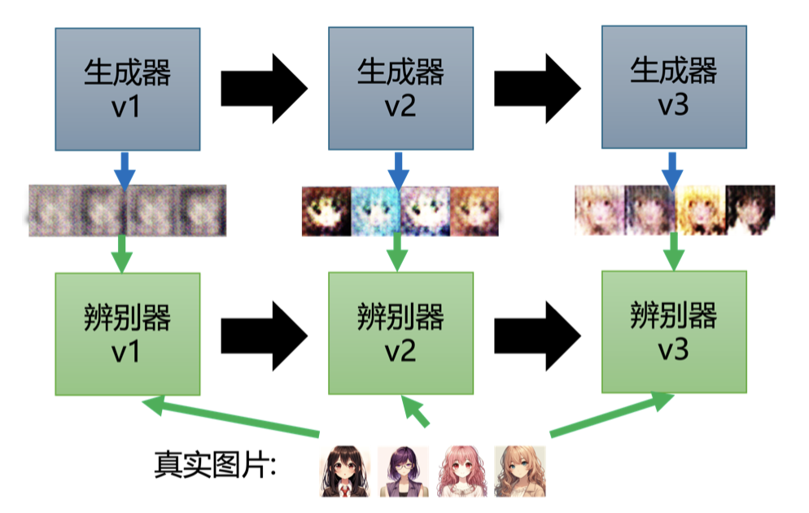

在上图的例子里，可能非常容易，对判别器来说，它只要看图片中是否有两个黑黑的眼睛即可。接下来生成器就要通过训练调整参数来骗过判别器。假设判别器判断一张图片是否真实的依据是看图片有没有眼睛，那新的生成器就需要输出有眼睛的图片。生成器产生眼睛，它就可以骗过第一代判别器。同时判别器也会进化，试图分辨新的生成器与真实图片之间的差异。例如，通过有没有嘴巴来识别真假。所以第三代的生成器就会想办法骗过第二代判别器，比如把嘴巴加上去。当然，判别器也会逐渐进步，越来越严格，来“逼迫”生成器产生的图片越来越像动漫人物。因此，生成器和判别器之间是互相促进的关系，最终生成器会学会画出动漫人物的脸，而判别器也会学会分辨真假图片，这就是 GAN 的训练过程。

GAN 最早出现在 2014 年的一篇文章中，作者把生成器和判别器当作敌人，并且生成器和判别器之间有对抗关系，所以用了“对抗”这个词。这只是一个拟人化的说法，其实我们也可以将它们看作亦敌亦友的关系，毕竟它们一直在互相进步，不断提升自己，超越对方。

## 三、生成器与辨别器的训练过程

下面，我们从算法角度来解释生成器和判别器是如何运作的，如下图所示。生成器和判别器是两个网络，在训练前我们要先分别进行参数初始化。

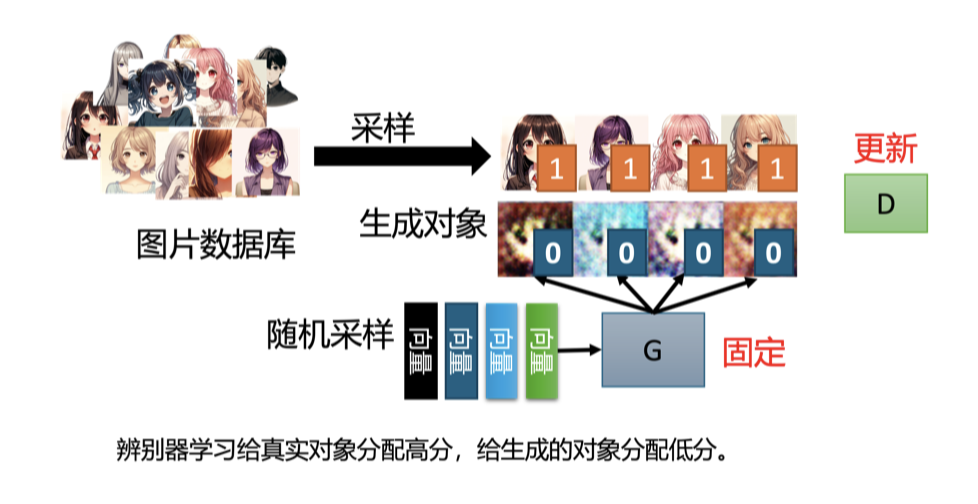

训练的第一步是固定生成器，只训练判别器。因为生成器的初始参数是随机初始化的，所以它什么都没有学习到，输入一系列采样得到的向量给它，它的输出肯定都是些随机、混乱的图片，就像是坏掉的老式电视收不到信号时的花屏一样，与真实的动漫头像完全不同。同时，我们会有一个很多动漫人物头像的图像数据库，可以通过爬虫等方法得到。我们会从这个图库中采样一些动漫人物头像图片出来，来与生成器产生出来的结果对比从而训练判别器。判别器的训练目标是要分辨真正的动漫人物与生成器产生出来的动漫人物间的差异。

具体来说，我们把真正的图片都标记为 1，生成器产生出来的图片都标记为 0。接下来对于判别器来说，这就是一个分类或回归的问题。如果是分类的问题，我们就把真正的人脸当作类别 1，生成器产生出来的图片当作类别 2，然后训练一个分类器。如果当作回归的问题，判别器看到真实图片就要输出 1，生成器的图片就要输出 0，并且进行 0-1 之间的打分。总之，判别器就学着去分辨真实图像和生成图像间的差异。

我们训练完判别器以后，接下来第二步，固定判别器，训练生成器，如下图所示。训练生成器的目的就是让生成器想办法去骗过判别器，因为在第一步中判别器已经学会分辨真图和假图间的差异。生成器如果可以骗过判别器，那生成器产生出来的图片可能就可以以假乱真。

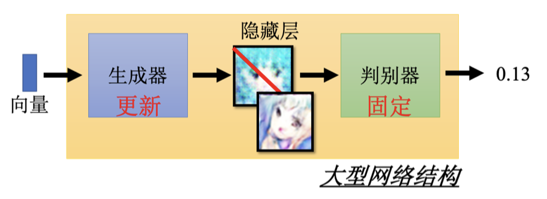

具体的操作如下：首先生成器输入一个向量，其可以来源于我们之前介绍的高斯分布中采样数据，并产生一个图片。接着我们将这个图片输入到判别器中，判别器会给这个图片一个打分。这里判别器是固定的，它只需要给更“真”的图片更高的分数即可，生成器训练的目标就是让图片更加真实，也就是提高分数。

对于真实场景中，生成器和判别器都是有很多层的神经网络，我们通常将两者一起当作一个比较大的网络来看待，但是不会调整判别器部分的模型参数。假设要输出的分数越大越好，那我们完全可以直接调整最后的输出层，改变一下偏差值设为很大的值，那输出的得分就会很高，但是完全达不到我们想要的效果。所以我们只能训练生成器部分，训练方法与前几章介绍的网络训练方法基本一致，只是我们希望优化目标越大越好，这与之前我们希望损失越小越好不同。当然我们也可以直接在优化目标前加“负号”，就当作损失看待也可以，这样就变为了让损失变小。另一种方法，我们可以使用梯度上升进行优化，而取代之前的梯度下降优化算法。

总结一下，GAN 算法的两个步骤：
1. 固定生成器训练判别器；
2. 固定判别器训练生成器。

接下来就是重复以上的训练，训练完判别器固定判别器训练生成器。训练完生成器以后再用生成器去产生更多的新图片再给判别器做训练。训练完判别器后再训练生成器，如此反复地去执行。当其中一个进行训练的时候，另外一个就固定住，期待它们都可以在自己的目标处达到最优，如下图所示。

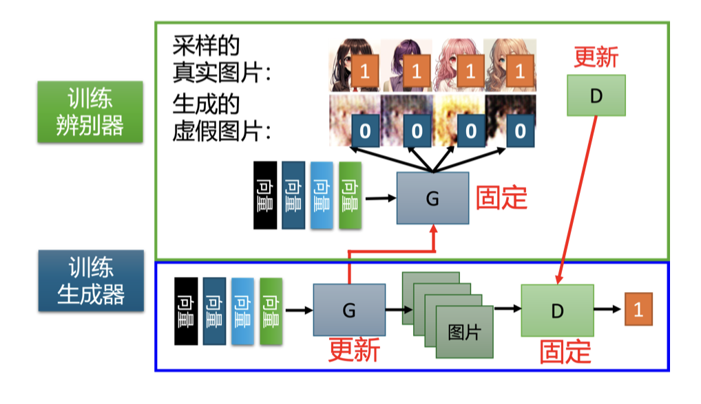

## 四、GAN 的应用案例

下面介绍一些 GAN 算法的应用。

首先介绍 GAN 生成动画人物人脸的例子，如下图所示。这些分别是训练 100 轮、1000 轮、2000 轮、5000 轮、10000 轮、20000 轮和 50000 轮的结果。我们可以看到训练 100 轮时，生成的图片还比较模糊；训练到 1000 轮时，机器就产生了眼睛；训练到 2000 轮时，嘴巴就生成出来了；训练到 5000 轮时，已经开始有一点人脸的轮廓了，并且机器学到了动画人物水汪汪大眼睛的特征；训练到 10000 轮以后，外部轮廓已经可以明显感觉到，只是还有些模糊，有些水彩画的感觉；训练到 20000 轮后生成的图片完全可以以假乱真，并且 50000 轮后生成的图片已经十分逼真了。

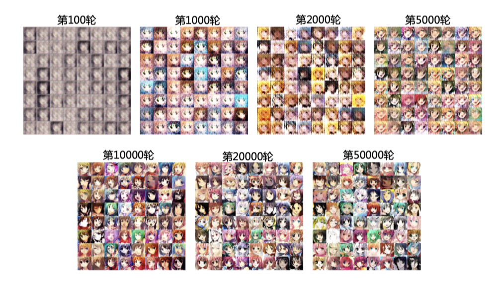

除了产生动画人物以外，当然也可以产生真实的人脸，如下图所示。这种产生高清人脸的技术叫做渐进式 GAN (Progressive GAN)，上下两排都是由机器产生的人脸。

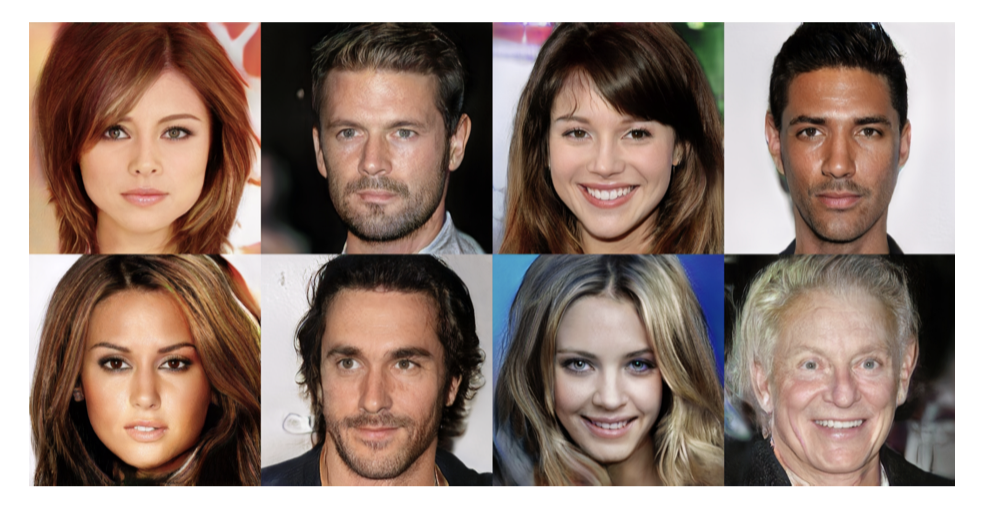

同样，我们可以用 GAN 产生我们从未见过的人脸，如下图所示。举例来说，先前我们介绍的 GAN 中的生成器，是输入一个向量，输出一张图片。此外，我们还可以对输入的向量进行内插，在输出部分我们就会看到两张图片之间的连续变化。比如，我们输入一个向量通过 GAN 产生一个看起来非常严肃的男人，同时输入另一个向量通过 GAN 产生一个微笑着的女人，那么输入这两个向量中间的数值向量，就可以看到这个男人逐渐地笑了起来。另一个例子，输入一个向量产生一个往左看的人，同时输入一个向量产生一个往右看的人，我们在中间做内插，机器并不会傻傻地将两张图片叠在一起，而是生成一张正面的脸。神奇的是，我们在训练的时候其实并没有真的输入正面的人脸，但机器可以自己学到把这两张左右脸做内插，应该会得到一个往正面看的人脸。

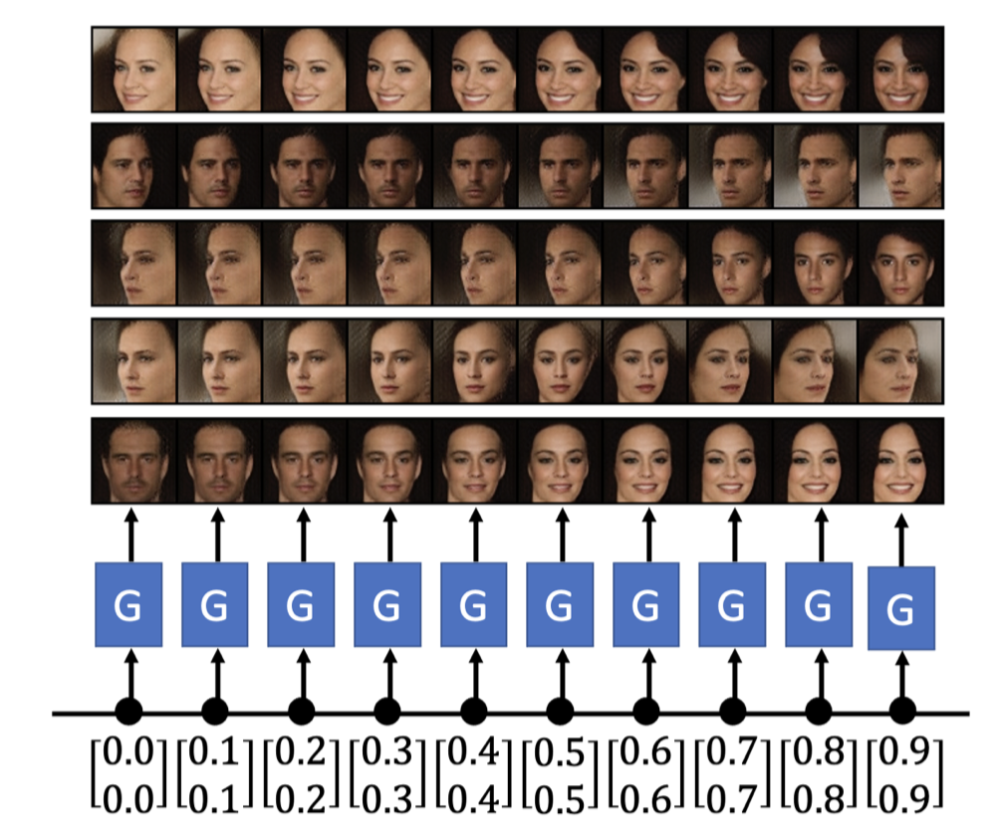

不过，如果我们不加约束，GAN 会产生一些很奇怪的图片，如下图所示。比如我们使用 BigGAN 算法，会产生一个左右不对称的玻璃杯，甚至产生一个网球狗，这还是很有趣的。

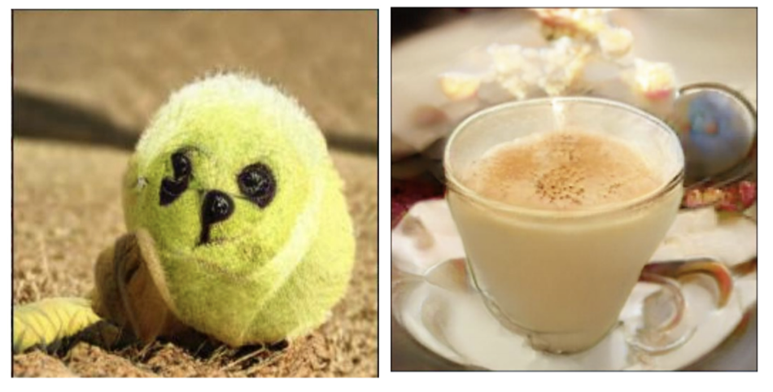

## 五、GAN 的理论介绍

这一小节我们将从理论层面介绍 GAN，即为什么生成器与判别器的交互可以产生人脸图片。首先，我们需要了解训练的目标是什么。在训练网络时，我们要确定一个损失函数，然后使用梯度下降策略来调整网络参数，使得设定的损失函数的数值最小或最大即可。

生成器的输入是一系列从分布中采样出的向量，生成器就会产生一个比较复杂的分布，如下图所示，我们称之为 $$P_G$$。另外，我们还有一系列的数据，这些原始数据本身会形成另外一个分布，我们称之为 $$P_{data}$$。训练的效果是希望 $$P_G$$ 和 $$P_{data}$$ 尽可能地相似。

我们再举一个一维的简单例子说明 $$P_G$$ 和 $$P_{data}$$。我们假设生成器的输入是一个一维的向量，如上图的橙色曲线，生成器的输出也是一维的向量，如图的绿色曲线，真正的数据同样是一个一维的向量，它的分布用蓝色曲线来表示。假设每次我们输入 5 个点，那每一个点的位置就会随着训练次数而改变，产生一个新的分布。可能本来所有的点都集中在中间，但是通过生成器，通过一个网络里面很复杂的训练后，这些点就分成两边，变成图片中的分布的样子。而其中 $$P_{data}$$ 就是指真正数据的分布，在实际应用中真正数据分布可能是更极端的，比如左边的数据比较多，右边的数据比较少。我们训练的结果是希望两个分布 $$P_G$$ 和 $$P_{data}$$ 越接近越好，即图片中的公式所示，表达的是这两个分布之间的差异。我们可以将其视为两个分布间的某种距离，如果这个距离越大，就代表这两个分布越不像；差异越小，代表这两个分布越相近。所以差异就是衡量两个分布相似度的一个指标。我们现在的目标就是训练一组生成器模型中的网络参数，使生成的 $$P_G$$ 和 $$P_{data}$$ 之间的差异越小越好，这个最优生成器称为 $$G^*$$。

训练生成器的过程类似于训练卷积神经网络等简单网络。相比于之前的找一组参数最小化损失函数，我们现在定义了生成器的损失函数，即 $$P_G$$ 和 $$P_{data}$$ 之间的差异。

对于一般的神经网络，其损失函数是可以计算的，但是对于生成器的差异，我们应该怎么处理呢？对于连续的差异例如 KL 散度和 JS 散度是很复杂的，在实际离散的数据中，我们或许无法计算其对应的积分。

对于 GAN，只要我们知道怎样从 $$P_G$$ 和 $$P_{data}$$ 中采样，就可以计算得到差异，而不需要知道实际的公式。例如，我们对于图库进行随机采样时，就会得到 $$P_{data}$$。对于生成器，我们需要从正态分布中采样出来的向量通过生成器生成一系列的图片，这些图片就是 $$P_G$$ 采样出来的结果。所以我们有办法从 $$P_G$$ 采样，也可以从 $$P_{data}$$ 进行采样。接下来，我们将介绍如何在只做以上采样的前提下，即不知道 $$P_G$$ 和 $$P_{data}$$ 的形式以及公式的情况下，估算得到差异，这其中要依靠判别器的力量。

我们首先回顾下判别器的训练方式。首先，我们有一系列的真实数据，也就是从 $$P_{data}$$ 采样得到的数据。同时，还有一系列的生成数据，从 $$P_G$$ 中采样出来的数据。根据真实数据和生成数据，我们会去训练一个判别器，其训练目标是看到真实数据就给它比较高的分数，看到生成的数据就给它比较低的分数。我们可以把它当做是一个优化问题，具体来说，我们要训练一个判别器，其可以最大化一个目标函数，当然如果我们最小化它就可以称它为损失函数。

这个目标函数如下图所示，其中有一些 $$y$$ 是从 $$P_{data}$$ 中采样得到的，也就是真实的数据，而我们把这个真正的数据输入到判别器中，得到一个分数。另一方面，我们还有一些 $$y$$ 来源于生成器，即从 $$P_G$$ 中采样出来的，将这些生成图片输入至判别器中同样得到一个分数，再取 $$\log(1 - D(y))$$。

我们希望目标函数 $$V$$ 越大越好，其中 $$y$$ 如果是从 $$P_{data}$$ 中采样得到的真实数据，它就要越大越好；如果是从 $$P_G$$ 采样得到的生成数据，它就要越小越好。这个过程在 GAN 提出之初，人们将其写为这样其实还有一个缘由，就是为了让判别器和二分类产生联系，因为这个目标函数本身就是一个交叉熵乘上一个负号。训练一个分类器时的操作就是要最小化交叉熵，所以当我们最大化目标函数的时候，其实等同于最小化交叉熵，也就是等同于是在训练一个分类器。这个过程的目的是将上图中蓝色点从 $$P_{data}$$ 采样出的真实数据当作类别 1，把从 $$P_G$$ 采样出的假的数据当作类别 2。有两个类别的数据，训练一个二分类的分类器，训练后就等同于解决了这个优化问题。而图中红框里面的数值，它本身就和 JS 散度有关。或许最原始的 GAN 的文章，它的出发点是从二分类开始的，一开始是把判别器写成二分类的分类器然后有了这样的目标函数，然后再经过一番推导后发现这个目标函数的最大值和 JS 散度是相关的。

当然我们还是要直观理解下为什么目标函数的值会和散度有关。这里我们假设 $$P_G$$ 和 $$P_{data}$$ 的差距很小，就如上图所示蓝色的星星和红色的星星混在一起。这里，判别器就是在训练一个 0、1 分类的分类器，但是因为这两组数据差距很小，所以在解决这个优化问题时，就很难让目标函数 $$V$$ 达到最大值。但是当两组数据差距很大时，也就是蓝色的星星和红色的星星并没有混在一起，那么就可以轻易地把它们分开。当判别器可以轻易把它们分开的时候，目标函数就可以变得很大。所以当两组数据差距很大的时候，目标函数的最大值就可以很大。当然这里面有很多的假设，例如判别器的分类能力无穷大。

我们再来看下计算生成器 + 判别器的过程，我们的目标是要找一个生成器去最小化两个分布 $$P_G$$ 和 $$P_{data}$$ 的差异。这个差异是通过使用训练好的判别器来最大化其目标函数值来实现。最小和最大的 MinMax 过程就像是生成器和判别器进行互动，互相“欺骗”的过程。注意，这里的差异函数不一定使用 KL 或者 JS 等函数，可以尝试不同的函数来得到不同的差异衡量指标。

## 六、WGAN 算法

因为要进行 MinMax 操作，所以 GAN 是很不好训练的。我们接下来介绍一个 GAN 训练的小技巧，就是著名的 Wasserstein GAN (Wasserstein Generative Adversarial Network)。在讲这个之前，我们分析下 JS 散度有什么问题。

首先，JS 散度的两个输入 $P_G$ 和 $P_{\text{data}}$ 之间的重叠部分往往非常少。这个其实也是可以预料到的，我们从不同的角度来看：图片其实是高维空间里低维的流形，因为在高维空间中随便采样一个点，它通常都没有办法构成一个人物的头像，所以人物头像的分布，在高维的空间中其实是非常狭窄的。换个角度解释，如果是以二维空间为例，图片的分布可能就是二维空间的一条线，也就是 $P_G$ 和 $P_{\text{data}}$ 都是二维空间中的两条直线。而二维空间中的两条直线，除非它们刚好重合，否则它们相交的范围是几乎可以忽略的。从另一个角度解释，我们从来都不知道 $P_G$ 和 $P_{\text{data}}$ 的具体分布，因为其源于采样，所以也许它们是有非常小的重叠分布范围。比如采样的点不够多，就算是这两个分布实际上很相似，也很难有任何的重叠的部分。

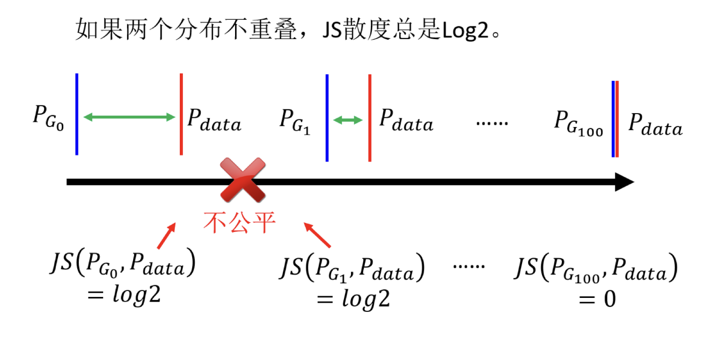

所以以上的问题就会对于 JS 散度造成以下问题：首先，对于两个没有重叠的分布，JS 散度的值都为 $\log 2$，与具体的分布无关。就算两个分布都是直线，但是它们的距离不一样，得到的 JS 散度的值就都会是 $\log 2$，如上图所示。所以 JS 散度的值并不能很好地反映两个分布的差异。另外，对于两个有重叠的分布，JS 散度的值也不一定能够很好地反映两个分布的差异。因为 JS 散度的值是有上限的，所以当两个分布的重叠部分很大时，JS 散度不好区分不同分布间的差异。所以既然从 JS 散度中看不出来分布的差异，那么在训练的时候，我们就很难知道我们的生成器有没有在变好，我们也很难知道我们的判别器有没有在变好。所以我们需要一个更好的衡量两个分布差异的指标。

我们从更直观的实际操作角度来说明，当使用 JS 散度训练一个二分类的分类器，来去分辨真实和生成的图片时，会发现实际上正确率几乎都是 100%。原因在于采样的图片根本就没几张，对于判别器来说，采样 256 张真实图片和 256 张假的图片，它直接用硬背的方法都可以把这两组图片分开。所以实际上如果用二分类的分类器训练判别器下去，识别正确率都会是 100%。根本就没有办法看出生成器有没有越来越好。所以过去尤其是在还没有 WGAN 这样的技术时，训练 GAN 真的就很像盲盒。根本就不知道训练的时候，模型有没有越来越好，所以旧时的做法是每次更新几次生成器后，就需要把图片打印可视化出来看。然后就要一边吃饭，一边看图片生成的结果，然后跑一跑就发现内存报错了就需要重新再来，所以过去训练 GAN 真的是很辛苦的。这也不像我们在训练一般的网络的时候，有个损失函数，然后那个损失值随着训练的过程慢慢变小，当我们看到损失值慢慢变小时，我们就放心网络有在训练。但是对于 GAN 而言，我们根本就没有这样的指标，所以我们需要一个更好的衡量两个分布差异的指标。否则只能够用人眼看，用人眼守在电脑前面看，发现结果不好，就重新用一组超参数调一下网络。

既然是 JS 散度的问题，肯定有人就想问说会不会换一个衡量两个分布相似程度的方式，就可以解决这个问题了呢？是的，于是就有了 Wasserstein，或使用 Wasserstein 距离的想法。

Wasserstein 距离的想法如下，假设两个分布分别为 $P$ 和 $Q$，我们想要知道这两个分布的差异，我们可以想像有一个推土机，它可以把 $P$ 这边的土堆挪到 $Q$ 这边，那么推土机平均走的距离就是 Wasserstein 距离。在这个例子里面，我们假设 $P$ 集中在一个点，$Q$ 集中在一个点，对推土机而言，假设它要把 $P$ 这边的土挪到 $Q$ 这边，那它要平均走的距离就是 $D$，那么 $P$ 和 $Q$ 的 Wasserstein 距离就是 $D$。但是如果 $P$ 和 $Q$ 的分布不是集中在一个点，而是分布在一个区域，那么我们就要考虑所有的可能性，也就是所有的推土机的走法，然后看平均走的距离是多少，这个平均走的距离就是 Wasserstein 距离。Wasserstein 距离可以想象为有一个推土机在推土，所以 Wasserstein 距离也称为推土机距离 (Earth Mover’s Distance, EMD)。

所以 Wasserstein 距离的定义如下图所示。

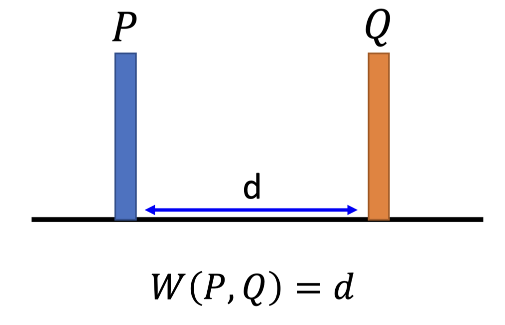

但是如果是更复杂的分布，要算 Wasserstein 距离就有点困难了，如下图所示。假设两个分布分别是 $P$ 和 $Q$，我们要把 $P$ 变成 $Q$，那有什么样的做法呢？我们可以把 $P$ 的土搬到 $Q$ 来，也可以反过来把 $Q$ 的土搬到 $P$。所以当我们考虑比较复杂分布的时候，两种分布计算距离就有很多不同的方法，即不同的“移动”方式，从中计算出来的距离，即推土机平均走的距离就不一样。对于左边这个例子，推土机平均走的距离比较少；右边这个例子因为舍近求远，所以推土机平均走的距离比较大。那两个分布 $P$ 和 $Q$ 的 Wasserstein 距离会有很多不同的值吗？这样的话，我们就不知道到底要用哪一个值来当作是 Wasserstein 距离了。

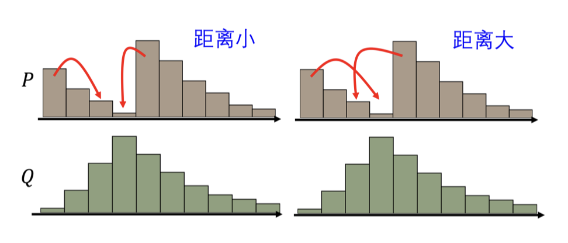

为了让 Wasserstein 距离只有一个值，我们将距离定义为穷举所有的“移动”方式，然后看哪一个推土的方法可以让平均的距离最小。那个最小的值才是 Wasserstein 距离。所以其实要计算 Wasserstein 距离挺麻烦的，因为里面还要解一个优化问题。

我们这里先避开这个问题，先来看看 Wasserstein 距离有什么好处，如下图所示。假设两个分布 $P_G$ 和 $P_{\text{data}}$ 它们的距离是 $d_0$，那在这个例子中，Wasserstein 距离算出来就是 $d_0$。

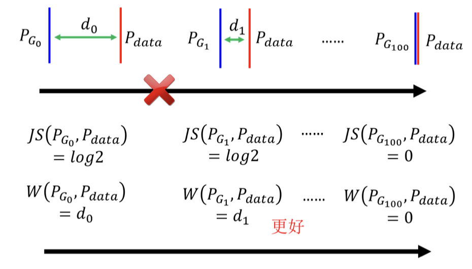

同样的，假设两个分布 $P_G$ 和 $P_{\text{data}}$ 它们的距离是 $d_1$，那在这个例子中，Wasserstein 距离算出来就是 $d_1$。假设 $d_1$ 小于 $d_0$，那 $d_1$ 的 Wasserstein 距离就会小于 $d_0$。所以 Wasserstein 距离可以很好地反映两个分布的差异。从左到右我们的生成器越来越进步，但是如果同时观察判别器，你会发现你观察不到任何规律。因为对于判别器而言，每一个例子算出来的 JS 散度，都是一样的 $\log 2$，所以判别器根本就看不出来这边的分布有没有变好。但是如果换成 Wasserstein 距离，由左向右的时候我们会知道，我们的生成器做得越来越好。所以我们的 Wasserstein 距离越小，对应的生成器就越好。这就是为什么我们要用 Wasserstein 距离的原因，我们换一个计算差异的方式，就可以解决 JS 距离有可能带来的问题。

可以再举一个演化的例子——人类眼睛的生成。人类的眼睛是非常复杂的，它是由其他原始的眼睛演化而来的。比如说有一些细胞具备有感光的能力，这可以看做是最原始的眼睛。

那这些最原始的眼睛怎么变成最复杂的眼睛呢？它只是一些感光的细胞在皮肤上经过一系列的突变产生更多的感光细胞，中间有很多连续的步骤。举例来说，感光的细胞可能会出现在一个比较凹陷的地方，皮肤凹陷下去，这样感光细胞可以接受来自不同方向的光源。然后慢慢地把凹陷的地方保护住并在里面放一些液体，最后就变成了人的眼睛。所以这个过程是一个连续的过程，是一个从简单到复杂的过程。当使用 WGAN 时，使用 Wasserstein 距离来衡量分布间的偏差的时候，其实就制造了类似的效果。本来两个分布 $P_{G0}$ 和 $P_{\text{data}}$ 距离非常遥远，你要它一步从开始就直接跳到结尾，这是非常困难的。但是如果用 Wasserstein 距离，你可以让 $P_{G0}$ 和 $P_{\text{data}}$ 慢慢挪近到一起，可以让它们的距离变小一点，然后再变小一点，最后就可以让它们对齐在一起。所以这就是为什么我们要用 Wasserstein 距离的原因，因为它可以让我们的生成器一步一步地变好，而不是一下子就变好。

所以 WGAN 实际上就是用 Wasserstein 距离来取代 JS 距离，这个 GAN 就叫做 WGAN。

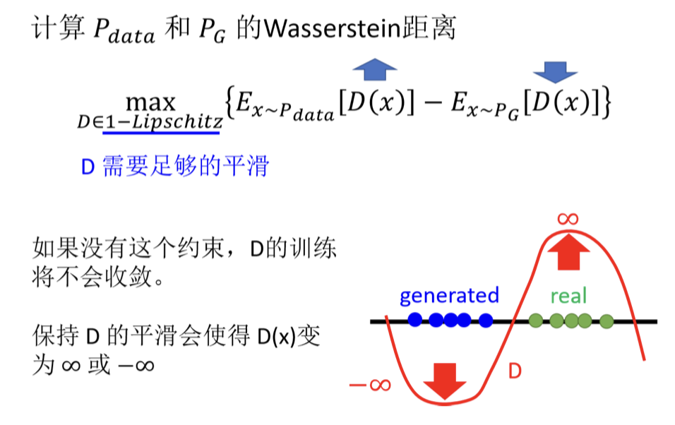

那接下来的问题是，Wasserstein 距离是要如何计算呢？我们可以看到，Wasserstein 距离的定义是一个最优化的问题，如图所示。这里我们简化过程直接介绍结果，也就是解图中最大化问题的解，解出来以后所得到的值就是 Wasserstein 距离，即 $P_{G0}$ 和 $P_{\text{data}}$ 的 Wasserstein 距离。我们观察一下上图的公式，即我们要找一个函数 $D$，这个函数 $D$ 是一个函数，我们可以想像成是一个神经网络，这个神经网络的输入是 $x$，输出是 $D(x)$。$x$ 如果是从 $P_{\text{data}}$ 采样来的，我们要计算它的期望值 $E_{x\sim P_{\text{data}}}$，如果 $x$ 是从 $P_G$ 采样来的，那我们要计算它的期望值 $E_{x\sim P_G}$，然后再乘上一个负号，所以如果要最大化这个目标函数就会达成。如果 $x$ 是从 $P_{\text{data}}$ 采样得到的，那么判别器的输出要越大越好，如果 $x$ 是从 $P_G$ 采样得到的，从生成器采样出来的输出应该要越小越好。

此外还有另外一个限制。函数 $D$ 必须要是一个 $1-Lipschitz$ 的函数。我们可以想像成，如果有一个函数的斜率是有上限的 (足够平滑，变化不剧烈)，那这个函数就是 $1-Lipschitz$ 的函数。如果没有这个限制，只看大括号里面的值只单纯要左边的值越大越好，右边的值越小越好，那么在蓝色的点和绿色的点，也就是真正的图像和生成的图像没有重叠的时候，我们可以让左边的值无限大，右边的值无限小，这样的话，这个目标函数就可以无限大。这时整个训练过程就根本就没有办法收敛。所以我们要加上这个限制，让这个函数是一个  $1-Lipschitz$ 的函数，这样的话，左边的值无法无限大，右边的值无法无限小，所以这个目标函数就可以收敛。所以当判别器够平滑的时候，假设真实数据和生成数据的分布距离比较近，那就没有办法让真实数据的期望值非常大，同时生成的值非常小。因为如果让真实数据的期望值非常大，同时生成的值非常小，那它们中间的差距很大，判别器的更新变化就很剧烈，它就不平滑了，也就不是 $1-Lipschitz$ 了。

那接下来的问题就是如何确保判别器一定符合 $1-Lipschitz$ 函数的限制呢？其实最早刚提出 WGAN 的时候也没有什么好想法。最早的一篇 WGAN 的文章做了一个比较粗糙的处理，就是训练网络时，把判别器的参数限制在一个范围内，如果超过这个范围，就把梯度下降更新后的权重设为这个范围的边界值。但其实这个方法并不一定真的能够让判别器变成 $1-Lipschitz$ 函数。虽然它可以让判别器变得平滑，但是它并没有真的去解这个优化问题，它并没有真的让判别器符合这个限制。

后来就有了一些其它的方法，例如有一篇文章叫做 Improved WGAN，它就是使用了梯度惩罚 (gradient penalty) 的方法，这个方法可以让判别器变成 1-Lipschitz 函数。具体来说，如图 8.22 所示，假设蓝色区域是真实数据的分布，橘色是生成数据的分布，在真实数据这边采样一个数据，在生成数据这边取一个样本，然后在这两个点之间取一个中间的点，然后计算这个点的梯度，使之接近于 1。就是在判别器的目标函数里面，加上一个惩罚项，这个惩罚项就是判别器的梯度的范数减去 1 的平方，这个惩罚项的系数是一个超参数，这个超参数可以让你的判别器变得越平滑。在 Improved WGAN 之后，还有 Improved Improved WGAN，就是把这个限制再稍微改一改。另一个方法是将判别器的参数限制在一个范围内，让它是 1-Lipschitz 函数，这个叫做谱归一化。总之，这些方法都可以让判别器变成 1-Lipschitz 函数，但是这些方法都有一个问题，就是它们都是在判别器的目标函数里面加了一个惩罚项，这个惩罚项的系数是一个超参数，这个超参数会让你的判别器变得越平滑。
