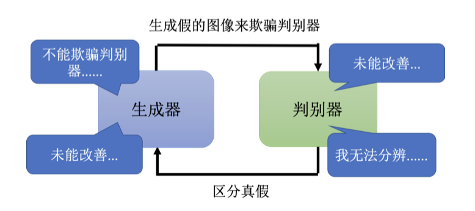
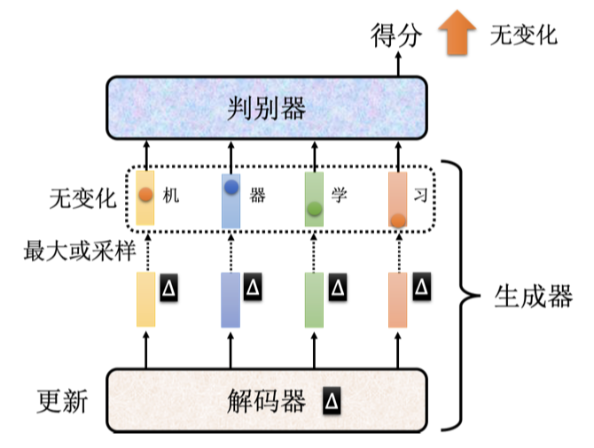
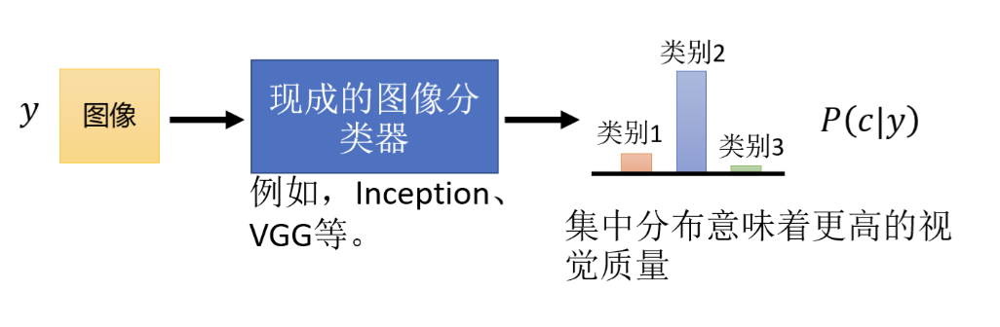
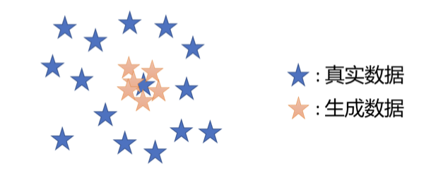
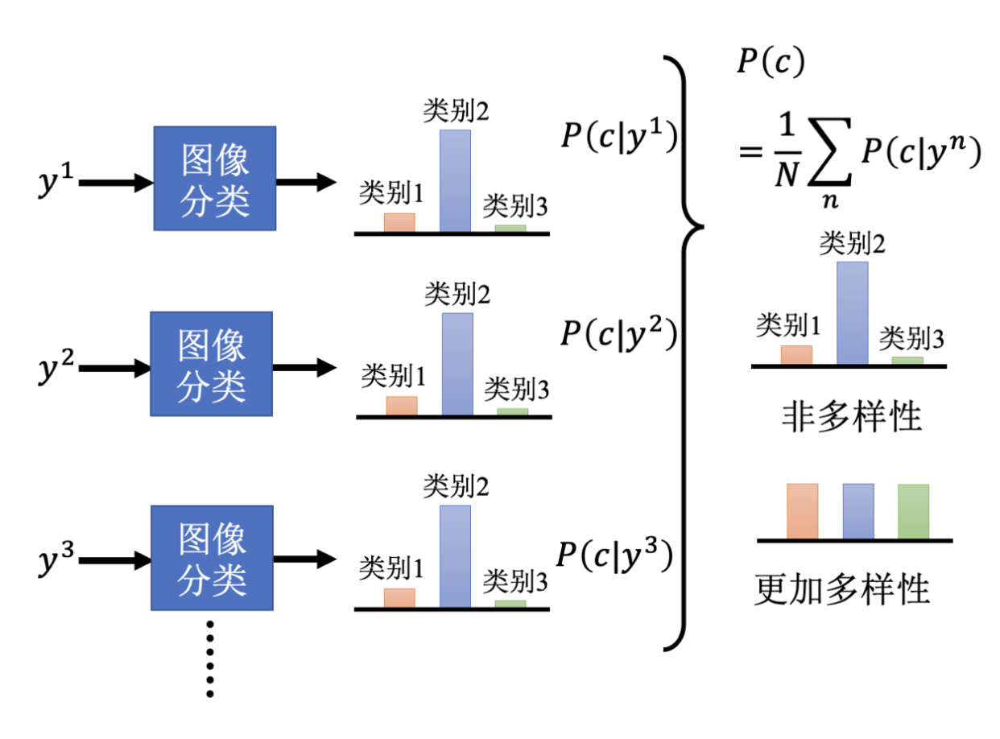
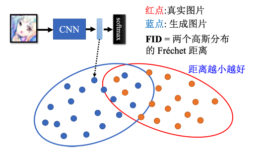

## 一、引言

目前越来越多的基于生成式的软件出现, 极大程度上改变了我们的生活。 例如, 我们可以通过一张照片, 让软件自动生成一段音乐, 或者是让软件自动生成一段视频。 本章具体介绍它们背后的基础模型——生成模型。到目前为止，我们学习到的网络本质上都是一个函数，即提供一个输入 $x$，网络就可以输出一个结果 $y$。前几章介绍的各种网络可以应对不同类型的输入 $x$ 和输出 $y$。例如，当输入 x 是一张图片时，可以使用卷积神经网络等模型进行处理；当输入 $x$ 是序列数据时，可以使用基于循环神经网络架构的模型进行处理，其中输出 y 可以是数值、类别，也可以是一个序列。目前，这些网络已经可以涵盖多数日常问题。

## 二、生成对抗网络

### 1、生成器

接下来，我们将介绍另一种架构——生成模型。与先前介绍的模型不同的是，生成模型中的网络会作为一个生成器 (generator) 使用。具体来说，在模型输入时会将一个随机变量 $z$ 与原始输入 $x$ 一并输入到模型中，这个变量是从随机分布中采样得到。输入时可以采用向量拼接的方式将 $x$ 和 $z$ 一并输入，或在 $x$、$z$ 长度一样时，将二者相加作为输入。这个变量 $z$ 的特别之处在于其非固定性，即每次使用网络时都会从一个随机分布中采样得到一个新的 $z$。通常，我们对该随机分布的要求是其足够简单，可以较为容易地进行采样，或可以直接写出该随机分布的函数，例如高斯分布 (Gaussian distribution) 、均匀分布 (uniform distribution) 等等。

所以每次有一个输入 $x$ 的同时，我们都从随机分布中采样得到 $z$，来得到最终的输出 $y$。随着采样得到的 $z$ 不同，我们得到的输出 $y$ 也会不同。同理，对于网络来说，其输出也不再固定，而变成了一个复杂的分布。我们也将这种可以输出一个复杂分布的网络称为生成器，如下图所示。

接下来我们介绍如何训练生成器。首先，我们为什么需要训练生成器，为什么需要输出一个分布呢？下面介绍一个视频预测的例子，即给模型一段视频短片，让它预测接下来发生的事情。视频环境是小精灵游戏，预测下一帧的游戏画面，如下图所示。

要预测下一帧的游戏画面，我们只需要将过去几帧游戏画面输入给网络。要得到这样的训练数据很简单，只需要在玩小精灵的同时进行录制，就可以训练我们的网络，只要让网络的输出 y 与真实图像越接近越好。当然，在实践中，为了保证高效训练，我们会将每一帧画面分割为很多块作为输入，并行进行预测。接下来为了简化，假设网络是一次性输入整个画面。如果我们使用前几章介绍的基于监督学习的训练方法，我们得到的结果可能会是十分模糊的，甚至游戏中的角色消失、出现残影，如下图所示。

造成该问题的原因是，监督学习中的训练数据对于同样的转角同时存储有角色向左转和向右转两种输出。当我们在训练的时候，对于一条向左转的训练数据，网络得到的指示就是要学会游戏角色向左转的输出。同理，对于一条向右转的训练数据，网络得到的指示就是学会角色向右转的输出。但是实际上这两种数据可能会被同时训练，所以网络就会学到一个折中的结果，即“两面讨好”。当输出同时距离向左转和向右转最近时，网络就会得到一个错误的结果——向左转是对的，向右转也是对的。

所以我们应该如何解决这个问题呢？答案是让网络有概率地输出一切可能的结果，或者说输出一个概率分布，而不是单一的输出，如下图所示。当我们给网络一个随机分布时，网络的输入会加上一个 $z$，这时输出就变成了一个非固定的分布，包含了向左转和向右转的可能。举例来说，假设我们选择的 $z$ 服从一个二项分布，即只有 0 和 1 并且各占 50%。那么我们的网络就可以学到 $z$ 采样到 1 的时候就向左转，采样到 0 的时候就向右转，这样就可以解决问题。

回到生成器的讨论中，我们为什么需要这类生成模型呢？答案是当我们的任务需要“创造性”的输出，或者我们想要一个可以输出多种可能的模型时，这些输出都是正确的。

这可以类比于让很多人一起处理一个开放式的问题，或者是头脑风暴，大家的回答五花八门各自发挥，但回答都是正确的。所以生成模型也可以被理解为让模型拥有了创造的能力。再举两个更具体的例子，对于画图，假设画一个红眼睛的角色，每个人画出来的可能都不一样。对于聊天机器人，它也需要有创造力。比如我们对机器人说，你知道有哪些童话故事吗？聊天机器人会回答安徒生童话、格林童话等，没有一个标准的答案。所以对于生成模型来说，需要能够输出一个分布，或者说多个答案。

当然，在生成模型中，非常知名的就是生成式对抗网络 (generative adversarial network)，通常缩写为 GAN。这一节我们将介绍生成对抗网络。

我们通过让机器生成动画人物的面部来形象地介绍 GAN。首先介绍的是无限制生成 (unconditional generation)，即不需要原始输入 $x$。其对应的是需要原始输入 $x$ 的条件型生成 (conditional generation)。如下图所示，对于无限制的 GAN，唯一的输入就是 $z$，这里假设为正态分布采样出的向量。其通常是一个低维的向量，例如 50、100 的维度。

我们首先从正态分布中采样得到一个向量 $z$，并输入到生成器中，生成器会给我们一个对应的输出——一个动漫人物的脸。生成器输出一个动漫人物面部的过程其实很简单，一张图片就是一个高维向量，所以生成器实际上做的就是输出一个高维向量，比如一个 64×64 的图片 (如果是彩色图片，那么输出就是 64×64×3)。当输入的向量 $z$ 不同时，生成器的输出就会改变，所以我们从正态分布中采样出不同的 $z$，得到的输出 $y$ 也会不同，动漫人脸照片也不同。当然，我们也可以选择其他的分布，但根据经验，分布之间的差异可能并没有非常大。大家可以找到一些文献，并且尝试去探讨不同分布之间的差异。我们这里选择正态分布是因为其简单且常见，而且生成器会将这个简单的分布映射到一个更复杂的分布。所以我们后续的讨论都以正态分布为前提。

### 2、辨别器

在 GAN 中，除了生成器以外，我们还需要训练一个判别器 (discriminator)，其通常是一个神经网络。判别器会输入一张图片，输出一个标量，其数值越大就代表输入的图片越像真实的动漫人物图像，如下图所示。举例来说，对于图中的动漫人物头像，输出就是 1。假设 1 是最大的值，画得很好的动漫图像输出就是 1，不知道在画什么的图像输出 0.5，再差一些的输出 0.1 等等。判别器本质上也是一个神经网络，由我们自己设计，可以用卷积神经网络，也可以用 Transformer，只要能够实现所需的输入输出即可。当然，对于这个例子，因为输入是一张图片，所以选择卷积神经网络，因为其在处理图像上有非常大的优势。

我们回到动漫人物图片的例子，生成器学习画出动漫人物的过程如下图所示。首先，第一代生成器的参数几乎是完全随机的，所以它根本不知道要怎么画动漫人物，画出来的东西就是一些噪音。判别器学习的目标是成功分辨生成器输出的动漫图片。

在上图的例子里，可能非常容易，对判别器来说，它只要看图片中是否有两个黑黑的眼睛即可。接下来生成器就要通过训练调整参数来骗过判别器。假设判别器判断一张图片是否真实的依据是看图片有没有眼睛，那新的生成器就需要输出有眼睛的图片。生成器产生眼睛，它就可以骗过第一代判别器。同时判别器也会进化，试图分辨新的生成器与真实图片之间的差异。例如，通过有没有嘴巴来识别真假。所以第三代的生成器就会想办法骗过第二代判别器，比如把嘴巴加上去。当然，判别器也会逐渐进步，越来越严格，来“逼迫”生成器产生的图片越来越像动漫人物。因此，生成器和判别器之间是互相促进的关系，最终生成器会学会画出动漫人物的脸，而判别器也会学会分辨真假图片，这就是 GAN 的训练过程。

GAN 最早出现在 2014 年的一篇文章中，作者把生成器和判别器当作敌人，并且生成器和判别器之间有对抗关系，所以用了“对抗”这个词。这只是一个拟人化的说法，其实我们也可以将它们看作亦敌亦友的关系，毕竟它们一直在互相进步，不断提升自己，超越对方。

## 三、生成器与辨别器的训练过程

下面，我们从算法角度来解释生成器和判别器是如何运作的，如下图所示。生成器和判别器是两个网络，在训练前我们要先分别进行参数初始化。

训练的第一步是固定生成器，只训练判别器。因为生成器的初始参数是随机初始化的，所以它什么都没有学习到，输入一系列采样得到的向量给它，它的输出肯定都是些随机、混乱的图片，就像是坏掉的老式电视收不到信号时的花屏一样，与真实的动漫头像完全不同。同时，我们会有一个很多动漫人物头像的图像数据库，可以通过爬虫等方法得到。我们会从这个图库中采样一些动漫人物头像图片出来，来与生成器产生出来的结果对比从而训练判别器。判别器的训练目标是要分辨真正的动漫人物与生成器产生出来的动漫人物间的差异。

具体来说，我们把真正的图片都标记为 1，生成器产生出来的图片都标记为 0。接下来对于判别器来说，这就是一个分类或回归的问题。如果是分类的问题，我们就把真正的人脸当作类别 1，生成器产生出来的图片当作类别 2，然后训练一个分类器。如果当作回归的问题，判别器看到真实图片就要输出 1，生成器的图片就要输出 0，并且进行 0-1 之间的打分。总之，判别器就学着去分辨真实图像和生成图像间的差异。

我们训练完判别器以后，接下来第二步，固定判别器，训练生成器，如下图所示。训练生成器的目的就是让生成器想办法去骗过判别器，因为在第一步中判别器已经学会分辨真图和假图间的差异。生成器如果可以骗过判别器，那生成器产生出来的图片可能就可以以假乱真。

具体的操作如下：首先生成器输入一个向量，其可以来源于我们之前介绍的高斯分布中采样数据，并产生一个图片。接着我们将这个图片输入到判别器中，判别器会给这个图片一个打分。这里判别器是固定的，它只需要给更“真”的图片更高的分数即可，生成器训练的目标就是让图片更加真实，也就是提高分数。

对于真实场景中，生成器和判别器都是有很多层的神经网络，我们通常将两者一起当作一个比较大的网络来看待，但是不会调整判别器部分的模型参数。假设要输出的分数越大越好，那我们完全可以直接调整最后的输出层，改变一下偏差值设为很大的值，那输出的得分就会很高，但是完全达不到我们想要的效果。所以我们只能训练生成器部分，训练方法与前几章介绍的网络训练方法基本一致，只是我们希望优化目标越大越好，这与之前我们希望损失越小越好不同。当然我们也可以直接在优化目标前加“负号”，就当作损失看待也可以，这样就变为了让损失变小。另一种方法，我们可以使用梯度上升进行优化，而取代之前的梯度下降优化算法。

总结一下，GAN 算法的两个步骤：
1. 固定生成器训练判别器；
2. 固定判别器训练生成器。

接下来就是重复以上的训练，训练完判别器固定判别器训练生成器。训练完生成器以后再用生成器去产生更多的新图片再给判别器做训练。训练完判别器后再训练生成器，如此反复地去执行。当其中一个进行训练的时候，另外一个就固定住，期待它们都可以在自己的目标处达到最优，如下图所示。

## 四、GAN 的应用案例

下面介绍一些 GAN 算法的应用。

首先介绍 GAN 生成动画人物人脸的例子，如下图所示。这些分别是训练 100 轮、1000 轮、2000 轮、5000 轮、10000 轮、20000 轮和 50000 轮的结果。我们可以看到训练 100 轮时，生成的图片还比较模糊；训练到 1000 轮时，机器就产生了眼睛；训练到 2000 轮时，嘴巴就生成出来了；训练到 5000 轮时，已经开始有一点人脸的轮廓了，并且机器学到了动画人物水汪汪大眼睛的特征；训练到 10000 轮以后，外部轮廓已经可以明显感觉到，只是还有些模糊，有些水彩画的感觉；训练到 20000 轮后生成的图片完全可以以假乱真，并且 50000 轮后生成的图片已经十分逼真了。

除了产生动画人物以外，当然也可以产生真实的人脸，如下图所示。这种产生高清人脸的技术叫做渐进式 GAN (Progressive GAN)，上下两排都是由机器产生的人脸。

同样，我们可以用 GAN 产生我们从未见过的人脸，如下图所示。举例来说，先前我们介绍的 GAN 中的生成器，是输入一个向量，输出一张图片。此外，我们还可以对输入的向量进行内插，在输出部分我们就会看到两张图片之间的连续变化。比如，我们输入一个向量通过 GAN 产生一个看起来非常严肃的男人，同时输入另一个向量通过 GAN 产生一个微笑着的女人，那么输入这两个向量中间的数值向量，就可以看到这个男人逐渐地笑了起来。另一个例子，输入一个向量产生一个往左看的人，同时输入一个向量产生一个往右看的人，我们在中间做内插，机器并不会傻傻地将两张图片叠在一起，而是生成一张正面的脸。神奇的是，我们在训练的时候其实并没有真的输入正面的人脸，但机器可以自己学到把这两张左右脸做内插，应该会得到一个往正面看的人脸。

不过，如果我们不加约束，GAN 会产生一些很奇怪的图片，如下图所示。比如我们使用 BigGAN 算法，会产生一个左右不对称的玻璃杯，甚至产生一个网球狗，这还是很有趣的。

## 五、GAN 的理论介绍

生成对抗网络（GAN）是由一个生成器网络（$G$）和一个判别器网络（$D$）组成的神经网络模型。GAN的核心目标是通过对抗的方式训练两个网络，使生成器能够生成与真实数据难以区分的假数据。

### 1、完美生成器的数学模型

生成对抗网络（GAN）由一个生成器网络（$G$）和一个判别器网络（$D$）组成。GAN的目标是通过训练使生成的数据和真实数据在分布上尽可能相似。形式上，我们希望生成的数据分布$p_G(x)$与真实数据分布$p_{data}(x)$相等，即：

$$
p_G(x) = p_{data}(x)
$$

如果生成器$G$生成的数据满足这个关系，我们就可以认为GAN完成了训练，也就是说，生成器的输出与真实数据在分布上是相同的。

### 2、转化为最优化问题

在GAN的原始论文中，训练过程转化为一个优化问题，其中包含两个相对立的目标：生成器$G$试图最大化判别器$D$的错误率，而判别器$D$试图最大化其正确率。

#### （1）判别器的目标

判别器$D$的目标是根据样本$x$来区分数据来自真实数据分布还是生成器产生的分布。它的损失函数可以写作：

$$
L_D = \mathbb{E}_{x \sim p_{data}(x)}[\log(D(x))] + \mathbb{E}_{z \sim p_z(z)}[\log(1 - D(G(z)))]
$$

其中，$\mathbb{E}_{x \sim p_{data}(x)}$表示对真实数据分布的期望，$\mathbb{E}_{z \sim p_z(z)}$表示对生成器输入的期望。

判别器$D$的任务是分辨输入的数据是真实的还是生成的。对真实数据，我们希望判别器能识别出来，并输出一个接近1的值（表示“真实”）。对生成的数据，我们希望判别器能识别出来，并输出一个接近0的值（表示“生成”）。

> [!TIP]
>
> log函数（对数函数）的图像如下：
>
> - 当$x$接近0时，$\log(x)$趋向于负无穷大。
> - 当$x$等于1时，$\log(1) = 0$。
> - 当$x$大于1时，$\log(x)$为正值，并且随$x$的增大而增大。

##### 1）结合log函数来看判别器的损失函数

**真实数据部分**，对于$\mathbb{E}_{x \sim p_{data}(x)}[\log(D(x))]$，我们希望最大化这个值：

- 当$D(x)$接近1时，$\log(D(x))$最大，并且接近0。
- 我们希望最大化$\mathbb{E}_{x \sim p_{data}(x)}[\log(D(x))]$，这意味着我们希望$D(x)$尽可能接近1，这样$\log(D(x))$值最大（即最接近0）。

**生成数据部分**，对于$\mathbb{E}_{z \sim p_z(z)}[\log(1 - D(G(z)))]$，我们希望最大化这个值：

- 当$D(G(z))$接近0时，$\log(1 - D(G(z)))$最大，并且接近0。
- 我们希望最大化$\mathbb{E}_{z \sim p_z(z)}[\log(1 - D(G(z)))]$，这意味着我们希望$D(G(z))$尽可能接近0，这样$\log(1 - D(G(z)))$值最大（即最接近0）。

##### 2）为什么整体损失函数的最大化有意义？

最大化$L_D$意味着：

- **对于真实数据**，$D(x)$尽可能接近1，使得$\log(D(x))$尽可能大，这表明判别器能够正确识别真实数据。
- **对于生成数据**，$D(G(z))$尽可能接近0，使得$\log(1 - D(G(z)))$尽可能大，这表明判别器能够正确识别生成数据。

通过这种方式，判别器能够更好地区分真实数据和生成数据，从而优化判别器的性能。

#### （2）生成器的目标

生成器$G$的目标是生成能够欺骗判别器$D$的样本。它的损失函数可以写作：

$$
L_G = \mathbb{E}_{z \sim p_z(z)}[\log(1 - D(G(z)))]
$$

生成器$G$的任务是生成能够让判别器$D$认为是“真实”的样本。因此，它希望判别器对其生成的样本$G(z)$输出一个接近1的值（表示“真实”）。

##### 1）结合log函数来看生成器的损失函数

对于$\mathbb{E}_{z \sim p_z(z)}[\log(1 - D(G(z)))]$，我们希望最小化这个值：

- 当$D(G(z))$接近1时，$\log(1 - D(G(z)))$趋向于负无穷大。
- 我们希望最小化$\mathbb{E}_{z \sim p_z(z)}[\log(1 - D(G(z)))]$，这意味着我们希望$D(G(z))$尽可能接近1，这样$\log(1 - D(G(z)))$值最小（即最接近负无穷大）。

##### 2）为什么整体损失函数的最小化有意义？

最小化$L_G$意味着：

- **对于生成数据**，$D(G(z))$尽可能接近1，使得$\log(1 - D(G(z)))$尽可能小，这表明生成器生成的数据足够“真实”以欺骗判别器。

通过这种方式，生成器能够不断改进其生成样本的质量，使得它们看起来更像真实数据，从而优化生成器的性能。

#### （3）联合目标函数

GAN的训练过程可以被视为一个极小极大问题，其联合目标函数为：

$$
\min_G \max_D V(D, G) = \mathbb{E}_{x \sim p_{data}(x)}[\log D(x)] + \mathbb{E}_{z \sim p_z(z)}[\log(1 - D(G(z)))]
$$

判别器$D$的目标是最大化：

$$
\mathbb{E}_{x \sim p_{data}(x)}[\log D(x)] + \mathbb{E}_{z \sim p_z(z)}[\log(1 - D(G(z)))]
$$

生成器$G$的目标是最小化：

$$
\mathbb{E}_{z \sim p_z(z)}[\log(1 - D(G(z)))]
$$

然而，在实践中，生成器$G$的训练目标通常会进行一些变换，以避免梯度消失问题。常见的做法是最大化$\mathbb{E}_{z \sim p_z(z)}[\log(D(G(z)))]$：

$$
L_G' = \mathbb{E}_{z \sim p_z(z)}[\log(D(G(z)))]
$$

这种变换不会改变最优解，但能够使生成器的梯度更加明显，便于训练。

联合目标函数可以表示为：

$$
\min_G \max_D V(D, G)
$$

这个目标函数的含义是：

- 对于判别器$D$，其目标是最大化$V(D, G)$，即更好地区分真实样本和生成样本。
- 对于生成器$G$，其目标是最小化$V(D, G)$，即生成更逼真的样本，使判别器难以区分。

这种对抗性的训练方式确保了生成器和判别器在训练过程中不断相互提升，使得最终生成的样本质量越来越高，直至生成的样本与真实数据难以区分。

#### （4）生成器和判别器的博弈过程

在GAN的训练过程中，生成器$G$和判别器$D$不断通过博弈来提升各自的性能。这个博弈过程可以分为以下几个步骤：

**Step1：初始化**：初始化生成器$G$和判别器$D$的参数。

**Step2：训练判别器$D$**：

- 从真实数据分布$p_{data}(x)$中采样一批真实样本$x$。
- 从潜在空间分布$p_z(z)$中采样一批随机噪声$z$，并通过生成器生成对应的假样本$G(z)$。
- 使用这两批样本计算判别器的损失函数$L_D$：
  $$
  L_D = -\left[\mathbb{E}_{x \sim p_{data}(x)}[\log(D(x))] + \mathbb{E}_{z \sim p_z(z)}[\log(1 - D(G(z)))]\right]
  $$
- 通过梯度下降法更新判别器$D$的参数，使得$L_D$最大化。

**Step3：训练生成器$G$**：

- 从潜在空间分布$p_z(z)$中采样一批随机噪声$z$。
- 使用生成器生成对应的假样本$G(z)$。
- 使用这批假样本计算生成器的损失函数$L_G$：
  $$
  L_G = -\mathbb{E}_{z \sim p_z(z)}[\log(D(G(z)))]
  $$
- 通过梯度下降法更新生成器$G$的参数，使得$L_G$最小化。

**Step4：重复上述过程**：不断重复训练判别器和生成器，直到模型收敛或达到预设的训练轮数。

在这个博弈过程中，判别器$D$不断提升其辨别真实数据和生成数据的能力，而生成器$G$不断提升其生成高质量样本的能力。

### 3、优化问题的最优解证明

为了证明GAN的优化问题最优解可以使生成的数据分布$p_G(x)$与真实数据分布$p_{data}(x)$一致，我们可以参考原始GAN论文中的证明思路。这个证明过程需要以下几个步骤：

#### （1）定义联合目标函数

GAN的目标函数是：

$$
\min_G \max_D V(D, G) = \mathbb{E}_{x \sim p_{data}(x)}[\log D(x)] + \mathbb{E}_{z \sim p_z(z)}[\log(1 - D(G(z)))]
$$

为了简化分析，我们可以引入生成数据分布$p_G(x)$，将目标函数重写为：

$$
V(D, G) = \int_x p_{data}(x) \log D(x) \, dx + \int_x p_G(x) \log(1 - D(x)) \, dx
$$

#### （2）找到判别器的最优解

给定生成器$G$，我们首先求解判别器$D$的最优解。目标是最大化$V(D, G)$，即：

$$
D^* = \arg \max_D V(D, G)
$$

对$V(D, G)$关于$D(x)$求导并设导数为0：

$$
\frac{\partial V(D, G)}{\partial D(x)} = \frac{p_{data}(x)}{D(x)} - \frac{p_G(x)}{1 - D(x)} = 0
$$

解得：

$$
D(x) = \frac{p_{data}(x)}{p_{data}(x) + p_G(x)}
$$

这就是给定生成器$G$时判别器$D$的最优解。

#### （3）证明生成器的最优解使得$p_G(x) = p_{data}(x)$

将$D^*(x)$代入目标函数$V(D, G)$中：

$$
V(D^*, G) = \int_x p_{data}(x) \log \left( \frac{p_{data}(x)}{p_{data}(x) + p_G(x)} \right) dx + \int_x p_G(x) \log \left( \frac{p_G(x)}{p_{data}(x) + p_G(x)} \right) dx
$$

进一步简化：

$$
V(D^*, G) = \int_x p_{data}(x) \log \left( \frac{p_{data}(x)}{p_{data}(x) + p_G(x)} \right) dx + \int_x p_G(x) \log \left( \frac{p_G(x)}{p_{data}(x) + p_G(x)} \right) dx
$$

考虑到$p_{data}(x) + p_G(x)$，这个表达式可以被视为两个对数项的和：

$$
V(D^*, G) = \int_x p_{data}(x) \log \left( \frac{p_{data}(x)}{p_{data}(x) + p_G(x)} \right) dx + \int_x p_G(x) \log \left( \frac{p_G(x)}{p_{data}(x) + p_G(x)} \right) dx
$$

将其表示为一个熵形式：

$$
V(D^*, G) = -\log(4) + 2 \cdot JSD(p_{data} \parallel p_G)
$$

其中，$JSD$表示Jensen-Shannon散度。

Jensen-Shannon散度定义为：

$$
JSD(p_{data} \parallel p_G) = \frac{1}{2} \left[ KL(p_{data} \parallel \frac{p_{data} + p_G}{2}) + KL(p_G \parallel \frac{p_{data} + p_G}{2}) \right]
$$

其中，$KL$表示Kullback-Leibler散度。

由于$JSD(p_{data} \parallel p_G) \geq 0$，并且当且仅当$p_{data} = p_G$时$JSD(p_{data} \parallel p_G) = 0$，我们可以得出：

$$
V(D^*, G) = -\log(4)
$$

当且仅当$p_{data}(x) = p_G(x)$时，这个表达式达到其最小值。因此，当生成器$G$的分布$p_G(x)$等于真实数据分布$p_{data}(x)$时，目标函数$V(D, G)$达到其最优解。

通过以上步骤的推导，我们证明了GAN的优化问题的最优解确实可以使生成的数据分布$p_G(x)$与真实数据分布$p_{data}(x)$一致。这意味着在理想情况下，生成器可以生成与真实数据无差别的样本。

## 六、训练难点与技巧

GAN以难以训练闻名。以下是一些原因和训练技巧。

首先，回顾一下判别器和生成器的任务。判别器旨在分辨真实图片与生成的假图片，而生成器则试图生成假图片以骗过判别器。生成器和判别器相互竞争和提升，如上图所示。如果判别器过强，生成器难以生成逼真的图片；如果生成器过强，判别器难以区分真假图片。如果其中一个网络停止训练，另一个也会受到影响。若判别器未训练好，就无法有效区分真假图片，生成器也因此无法改进，导致整个训练过程停滞。因此，GAN难以训练的原因在于两个网络必须同时训练并达到较好的状态。

### 1、生成文字的难点

训练GAN生成文字是最困难的领域之一。生成文字需要一个序列到序列的模型，其中的解码器产生一段文字。这个序列到序列模型就是生成器，Transformer是常用的解码器，在GAN中充当生成器的角色。

### 2、序列到序列的GAN与图像GAN的区别

从算法角度看，序列到序列的GAN和图像GAN没有太大区别。判别器判断生成的文字是否为真实文本，生成器调整参数以骗过判别器。然而，序列到序列模型在用梯度下降训练时困难较大。解码器参数的微小变化对判别器输出的影响很小，导致梯度下降难以奏效。即使使用强化学习来训练生成器，由于强化学习本身也难以训练，难度更大。

假设我们在生成一个中文句子时，每次生成一个汉字，汉字就是词元；在生成英文句子时，每次生成一个字母，字母就是词元。词元是产生序列的基本单位。当输出分布只有微小变化时，分数最大的词元不变，判别器输出也不会改变。因此，无法计算梯度，也无法进行梯度下降。

### 3、ScratchGAN的创新

ScratchGAN通过调节超参数和使用训练技巧，从随机初始化参数开始训练生成器生成文字。其技巧包括使用SeqGAN-Step技术、大批量训练（如上千），以及强化学习方法、调整强化学习参数和添加正则化技巧。

### 4、其他生成模型

除了GAN，还有VAE和流模型等生成模型。GAN擅长生成图像，但生成文字时有些问题，VAE或流模型可能更适合。训练这些模型时，需要平衡多个损失项，才能获得好的结果。

我们可以尝试用高斯分布变量作为输入，通过监督学习生成图片。假设我们有一堆图片，每张图片配有一个从高斯分布中采样得到的向量，通过监督学习训练一个网络，输入为向量，输出为图片。虽然这种方法可行，但纯随机向量训练效果较差，需要使用特殊方法如生成式潜在优化来改进效果。

这些方法和技巧使得即使在困难的训练过程中，也能有效地训练GAN生成高质量的输出。

## 七、GAN 的性能评估方法

接下来我们介绍GAN的评估方法，了解如何判断生成器的好坏。

### 1、人工评估法

早期评估生成器的方法很直观，就是由人眼来判断生成器产生的图片是否像真实图片。这种方法不客观且不稳定。例如，早期的GAN论文通常通过展示一些生成的图片来判断生成器的效果，没有精确的数字结果。

### 2、自动评估方法

为了更客观和自动化地评估生成器，研究人员设计了不同的方法。

#### （1）特定任务评估法

- 对于特定任务，如生成动画人物头像，可以设计专门用于识别动画人物面部的系统，看看生成器生成的图片是否可以被识别。如果能识别，说明生成器效果较好。
- 这种方法只能针对特定任务，不能普遍适用。

#### （2）图像分类系统评估法

- 训练一个图像分类系统，将GAN生成的图片输入系统，输出概率分布。比如，这张图片是猫的概率、狗的概率等。
- 如果概率分布集中，说明生成的图片质量高。如果生成的图片是模糊的，概率分布会非常平均。

在评估GAN生成器的性能时，使用图像识别系统是一个可能的方法，但这种方法并不够全面，因为它容易受到模式崩塌问题的影响。

### 3、模式崩塌和模式丢失

#### （1）模式崩塌（Mode Collapse）

**模式崩塌**指的是在训练GAN的过程中，生成器输出的图片总是那几张固定的图片，无法生成多样的样本。具体来说，假设蓝色的星星代表真实数据的分布，红色的星星代表GAN生成的数据分布。生成器可能学会了一些特定的模式，判别器无法识别这些模式是生成的还是原始的，导致生成器输出的图片缺乏多样性。

**模式崩塌的原因**：从直觉上理解，模式崩塌可能是因为生成器找到了判别器的一个盲点。当生成器学会生成这种图片后，判别器总是认为这些图片是真的，因此生成器只会不断输出这些图片。

**解决模式崩塌的方法**：虽然到目前为止，还没有一个非常好的解决模式崩塌的方法，但有一种策略是：

- 在训练过程中，保存生成器的多个训练节点。
- 当发现模式崩塌的迹象时，停止训练并使用模式崩塌前的模型。

尽管如此，模式崩塌的问题是显而易见的：生成器总是生成相同的图片，这显然不是一个好的生成器。

#### （2）模式丢失（Mode Dropping）

与模式崩塌相关的另一个问题是模式丢失。**模式丢失**指的是GAN能够很好地生成训练集中的数据，但无法生成训练集之外的数据，即生成器缺乏想象力。生成器输出的图片只有真实数据的一部分，而非真实数据的全部多样性。

**模式丢失的表现：**现代的高性能GAN（如BGAN、ProgressGAN）能够生成非常真实的人脸图片，但这些图片来来回回就是那几张。即使这些图片看起来很真实，但缺乏足够的多样性。随着时间的推移，你会发现这些脸总有某些独特的特征，使人觉得这些脸是生成的。

**模式丢失的难题：**到目前为止，模式丢失的问题还没有得到根本的解决。即使GAN生成的图片分布看起来很真实，但实际上真实数据的多样性可能更大。研究人员还在不断探索解决这个问题的方法。

### 4、评估生成器的多样性和质量

为了全面评估GAN的性能，研究人员使用多种方法来评估生成器生成图片的多样性和质量。

#### （1）图像分类器评估法

将生成的图片输入图像分类器，查看分类结果的分布。如果分类结果集中，说明生成图片的多样性不足；如果分类结果分散，说明多样性较好。

#### （2）Inception 分数

使用Inception网络评估生成图片的质量和多样性。Inception分数越高，说明生成图片的质量和多样性越好。

#### （3）Fréchet Inception Distance (FID)

将生成图片和真实图片输入Inception网络，提取隐藏层输出向量，计算两者之间的Fréchet距离。距离越小，说明生成图片的质量越高。

FID (Frechet Inception Distance) 算是目前比较常用的一种度量方式。有一篇 Google 完成的论文叫做“Are GANs Created Equal? A Large-Scale Study”，其中尝试了不同的 GAN。每个 GAN 的训练分类、训练损失都有些不同，并且每种 GAN 都用不同的随机种子进行多次训练，取结果的平均值。结果显示，所有的 GAN 表现都差不多。那么，是否与 GAN 相关的研究都是白忙一场呢？

事实上未必如此。该论文在做实验时，不同的 GAN 使用的网络架构都是同一个，只是通过调整超参数，如随机种子和学习率，进行测试。网络架构未变。因此，是否有某些网络架构或某些种类的 GAN 在不同网络架构上表现更稳定，还有待研究。

此外，还有一种情况。如果 GAN 生成的图片与真实图片一模一样，那么 FID 会是零，因为两个分布完全相同。如果你不知道真实数据的样子，只看生成器的输出，可能会觉得效果非常好，FID 也会非常小。但是如果生成的图片与训练数据一模一样，那还不如直接从训练数据集中采样一些图像出来，就不需要训练生成器了。我们训练生成器是希望它产生新的图片，即训练集中没有的人脸。

对于这种问题，普通的度量标准无法侦测到。那怎么解决呢？其实有一些方法，比如使用一个分类器判断图片是否真实，是否来自于训练集。这个分类器输入一张图片，输出一个概率，代表这张图片是否来自训练集。如果概率是 1，代表图片来自训练集；如果概率是 0，代表图片不是来自训练集。但如果生成器学到的是把所有训练数据中的图片左右反转，分类器可能会认为图片来自训练集，因为只是左右反转而已。进行分类或相似度比较时也无法区分。

因此，GAN 的评估非常困难，如何评估生成器的好坏也是一个值得研究的课题。

