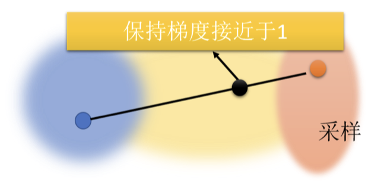

## 一、JS 散度的公式及介绍

JS 散度 (Jensen-Shannon Divergence) 是一种衡量两个概率分布 $P$ 和 $Q$ 之间差异的度量，其定义如下：

$$
D_{JS}(P \| Q) = \frac{1}{2} D_{KL}(P \| M) + \frac{1}{2} D_{KL}(Q \| M)
$$
其中，$M = \frac{1}{2}(P + Q)$，$D_{KL}$ 是 Kullback-Leibler 散度，定义为：

$$
D_{KL}(P \| Q) = \sum_{x} P(x) \log \frac{P(x)}{Q(x)}
$$
JS 散度具有对称性，即 $D_{JS}(P \| Q) = D_{JS}(Q \| P)$，且其值域为 $[0, \log 2]$。JS 散度在两个分布完全相同（即 $P = Q$）时取值 0，在两个分布完全不相交时取值 $\log 2$。

## 二、JS 散度及其问题

在进行GAN（生成对抗网络）的训练时，JS（Jensen-Shannon）散度常被用来衡量生成分布$ P_G $ 和真实分布$ P_{\text{data}} $ 之间的差异。然而，这种方法存在许多问题，尤其是在高维数据的情况下。

### 1、重叠部分少

首先，JS 散度的两个输入$ P_G $ 和$ P_{\text{data}} $ 之间的重叠部分往往非常少。这个现象在高维空间中特别明显。例如，图片其实是高维空间里低维的流形，在高维空间中随便采样一个点，它通常都没有办法构成一个人物的头像。所以，人物头像的分布在高维空间中是非常狭窄的。

以二维空间为例，图片的分布可能是一条线。也就是说，$ P_G $ 和$ P_{\text{data}} $ 都是二维空间中的两条直线。除非它们完全重合，否则它们相交的范围几乎可以忽略不计。这就导致$ P_G $ 和$ P_{\text{data}} $ 的具体重叠部分非常少。

另外，从采样的角度看，我们从来都不知道$ P_G $ 和$ P_{\text{data}} $ 的具体分布，因为其源于采样。即使这两个分布实际上很相似，如果采样的点不够多，也很难有任何的重叠部分。

### 2、JS 散度的值无法反映分布的差异

由于重叠部分少，JS 散度在以下两种情况下无法很好地反映分布的差异：

- **没有重叠的分布**：对于两个没有重叠的分布，JS 散度的值都为$ \log 2 $，与具体的分布无关。即使两个分布都是直线，但是它们的距离不一样，得到的 JS 散度的值都会是$ \log 2 $（见下图）。

- **有重叠的分布**：对于两个有重叠的分布，JS 散度的值也不一定能够很好地反映两个分布的差异。因为 JS 散度的值是有上限的，所以当两个分布的重叠部分很大时，JS 散度无法区分不同分布间的差异。

由于 JS 散度无法准确反映分布的差异，在训练过程中，我们难以判断生成器和判别器是否在变好。

### 3、训练中的实际操作问题

从实际操作角度来看，使用 JS 散度训练一个二分类的分类器去分辨真实和生成的图片时，正确率几乎都是 100%。这是因为采样的图片很少，对于判别器来说，采样 256 张真实图片和 256 张生成图片，它可以直接记住这两组图片，并轻松将它们分开。

在过去，尤其是在没有 WGAN 技术之前，训练 GAN 像是开盲盒，模型的改进无法通过损失函数值反映出来。因此，训练者需要不断地打印生成的图片进行可视化检查，费时费力。这种情况下，GAN 的训练非常辛苦，不像其他网络的训练，可以通过损失值的变化来判断训练效果。

总之，JS 散度在高维数据和少量样本情况下，无法有效地衡量两个分布的差异，导致我们无法准确判断生成器和判别器的性能。这也使得GAN的训练过程变得困难和不确定。我们需要寻找更好的指标来衡量两个分布的差异，Wasserstein 距离因此成为了一个重要的替代方案。

## 三、Wasserstein 距离介绍

### 1、Wasserstein 距离的概念与定义
Wasserstein 距离，也称为推土机距离 (Earth Mover’s Distance, EMD)，可以通过以下方式直观理解：假设两个分布 $P$ 和 $Q$，我们需要将 $P$ 的土堆移至 $Q$ 的位置，推土机平均移动的距离就是 Wasserstein 距离。

### 2、计算 Wasserstein 距离的挑战

当我们要计算两个复杂分布 $ P $ 和 $ Q $ 之间的 Wasserstein 距离时，我们面临一些困难。为了计算 Wasserstein 距离，我们需要考虑如何将分布 $ P $ 转变为分布 $ Q $。这种“转变”的方式可以看作是用推土机将 $ P $ 的“土”搬到 $ Q $ 的地方，或者反向操作，将 $ Q $ 的“土”搬到 $ P $ 的地方。

然而，当分布很复杂时，我们会发现有很多不同的“移动”方式。不同的“移动”方式对应不同的推土机路线，从而计算出的距离也会有所不同。比如，左图展示了两种不同的推土机路径：

- **左边的例子**：推土机可以通过比较短的路径将土从 $ P $ 移到 $ Q $。
- **右边的例子**：推土机需要选择较远的路径才能完成相同的任务。

因此，面对复杂的分布时，我们会遇到这样的问题：计算出的 Wasserstein 距离可能会有很多不同的值。为了得到一个合理的 Wasserstein 距离，我们需要穷举所有可能的“移动”方式，找到一种使得平均距离最小的方式。这需要解决一个优化问题，这也是计算 Wasserstein 距离时的一大挑战。

### 3、Wasserstein 距离的优势

尽管计算 Wasserstein 距离很复杂，但它在很多方面优于传统的 JS 散度。Wasserstein 距离可以提供一种直观的度量来反映两个分布之间的差异，具体体现在以下几个方面：

- **反映分布的差异**：Wasserstein 距离可以有效地反映两个分布之间的实际差异。比如，假设两个分布 $ P_G $ 和 $ P_{\text{data}} $ 之间的 Wasserstein 距离是 $ d_0 $，如果分布变得更加相似，Wasserstein 距离会减少到 $ d_1 $，且 $ d_1 < d_0 $。这使得 Wasserstein 距离可以清晰地展示生成器的改进情况。

- **训练过程中的有效指标**：在训练过程中，JS 散度可能会导致判别器看到的训练信号不足，无法正确反映生成器的改进情况，因为 JS 散度对于分布之间的差异变化反应迟钝。然而，Wasserstein 距离提供了一个连续的、可靠的度量，使得我们可以直观地判断生成器的训练效果。

## 四、Wasserstein GAN (WGAN)

Wasserstein GAN (WGAN) 是一种基于 Wasserstein 距离的生成对抗网络，它通过引入 Wasserstein 距离来改进传统的对抗训练算法。

### 1、WGAN 的基本概念

WGAN 通过使用 Wasserstein 距离来代替 JS 散度来衡量生成数据分布与真实数据分布之间的差异。具体来说，WGAN 通过最优化一个目标函数来实现这一点。这个目标函数包含了 Wasserstein 距离的计算，它的数学表达式如下：

$$
\text{Wasserstein 距离} = \sup_{D \in \mathcal{D}} \mathbb{E}_{x \sim P_{\text{data}}}[D(x)] - \mathbb{E}_{x \sim P_G}[D(x)]
$$

其中，$D(x)$ 是一个判别器网络，我们可以将其视作一个神经网络，它的输入是样本 $x$，输出是 $D(x)$。这个目标函数的意义在于最大化真实样本的期望值与生成样本的期望值之间的差距。

### 2、如何计算 Wasserstein 距离？

计算 Wasserstein 距离实际上是一个最优化问题。我们需要找到一个函数 $D$，使得上式中的目标函数值最大化。具体来说，目标是：

$$
\text{Maximize } \mathbb{E}_{x \sim P_{\text{data}}}[D(x)] - \mathbb{E}_{x \sim P_G}[D(x)]
$$

在这个最优化问题中，$D$ 是一个 $1$-Lipschitz 函数。$1$-Lipschitz 函数是指其斜率受到限制的函数，意味着其变化不能过于剧烈。

### 3、$1$-Lipschitz 函数的定义与意义

在 WGAN 中，判别器 $D$ 必须满足 $1$-Lipschitz 条件。$D$ 是一个 $1$-Lipschitz 函数意味着它的斜率有上限，可以用以下数学条件来表示：

$$
|D(x_1) - D(x_2)| \leq \|x_1 - x_2\|
$$

这里的 $1$-Lipschitz 条件确保了判别器的平滑性。如果没有这个条件，判别器可能会在真实数据和生成数据之间造成无限大的差异，从而使得目标函数无法收敛。因此，我们需要确保 $D$ 不仅要最大化目标函数的值，而且要保持平滑性。

### 4、确保 $1$-Lipschitz 函数的技术方法

为了确保 $D$ 是一个 $1$-Lipschitz 函数，WGAN 采用了以下几种技术手段：

- **初始方法**：在最初的 WGAN 文章中，作者采用了一个简单的技巧来保证 $D$ 的 $1$-Lipschitz 条件。他们将判别器的输出限制在一个固定的范围内，如果超过了这个范围，就将其设置为边界值。这种方法虽然有效，但并不完美地保证 $D$ 符合 $1$-Lipschitz 条件。

- **改进的 WGAN（Improved WGAN）**：为了更严格地保证 $1$-Lipschitz 条件，后来提出了一种更先进的技术，叫做 **梯度惩罚（Gradient Penalty）**。具体来说，梯度惩罚通过在目标函数中加入一个惩罚项来实现：
  $$
  \text{目标函数} = \mathbb{E}_{x \sim P_{\text{data}}}[D(x)] - \mathbb{E}_{x \sim P_G}[D(x)] + \lambda \mathbb{E}_{\hat{x} \sim P_{\hat{x}}}[(\|\nabla_{\hat{x}} D(\hat{x})\|_2 - 1)^2]
  $$
  
  这里，$P_{\hat{x}}$ 是真实数据样本和生成数据样本之间的均匀分布，$\lambda$ 是梯度惩罚的超参数，用来控制惩罚项的强度。
  
  
  
  通过这个梯度惩罚项，$D$ 的梯度可以被控制在一个合理的范围内，从而确保 $D$ 符合 $1$-Lipschitz 条件。
  
- **谱归一化（Spectral Normalization）**：另一个保持 $1$-Lipschitz 条件的方法是 **谱归一化**。谱归一化通过对判别器的权重进行归一化来控制其最大奇异值，从而保证 $1$-Lipschitz 条件。具体来说，谱归一化的目标是使得权重矩阵的最大奇异值为 1。

$$
\text{权重矩阵} \leftarrow \frac{\text{权重矩阵}}{\text{最大奇异值}}
$$

### 5、WGAN 的实际效果与优势

WGAN 相比传统的 GAN 方法具有以下几个优势：

- **稳定的训练过程**：WGAN 通过优化 Wasserstein 距离而不是 JS 散度，能够有效地处理训练过程中的不稳定性问题，使得生成器和判别器的训练更加稳定。

- **更可靠的训练指标**：由于 Wasserstein 距离的值随着训练的进行而连续变化，WGAN 能够提供一个有效的训练指标，使得生成器的改进能够被清晰地反映出来。

- **改善生成质量**：通过合理设计目标函数和应用 $1$-Lipschitz 条件，WGAN 可以生成质量更高的图像或其他数据类型。

