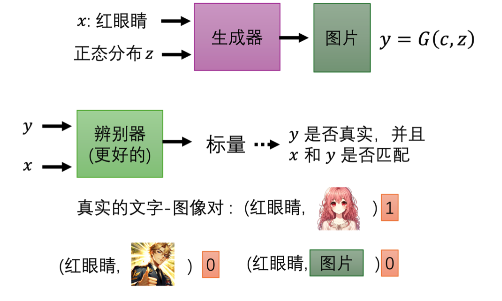
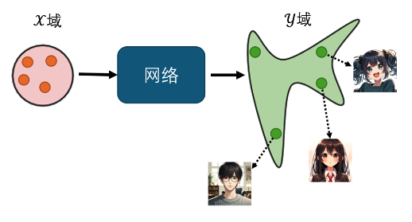
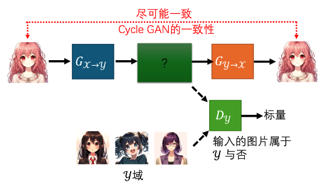
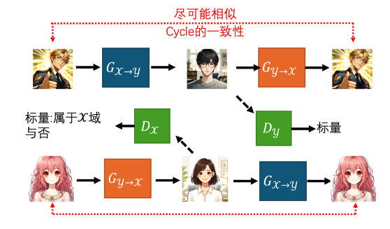
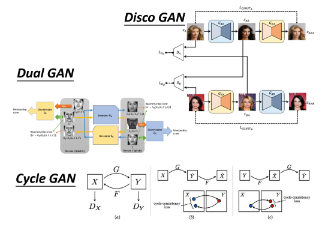

## 一、条件型生成

### 1、概念

在之前介绍的 GAN 中，生成器没有输入任何的条件，仅输入一个随机的分布来生成图片。现在我们希望可以操控生成器的输出，即给它一个条件 $x$，让它根据条件 $x$ 和输入 $z$ 生成输出 $y$。 

### 2、条件型生成器的应用 - 文字生成图片
这种情况下，条件 $x$ 是一段文字。我们希望输入一段文字，生成器可以产生对应描述的图片。例如，输入“红眼睛”，生成器生成一个红眼睛的角色，每次生成的角色会因为不同的 $z$ 而有所不同，但都会符合“红眼睛”的条件。

生成器现在有两个输入：一个是从正态分布中采样的 $z$，另一个是条件 $x$。生成的输出 $y$ 是一张图片。判别器的输入是图片 $y$ 和条件 $x$，输出一个数值，评估 $y$ 和 $x$ 是否匹配。

训练方法

- 真实图片和匹配的条件：输出 1 分。
- 生成的图片和匹配的条件：输出 0 分。
- 生成的图片和不匹配的条件：输出 0 分。

为了提高判别器的准确性，除了正样本和负样本，还需要故意配错文字和图片，训练判别器识别不匹配的情况。生成器和判别器反复训练，最后得到较好的结果。

### 3、条件型 GAN - 图像生成图像
可以输入一张图片生成另一张图片，比如：
- 房屋设计图生成房屋图片
- 黑白图片上色
- 素描变实景
- 白天变晚上
- 起雾变晴天

这种应用称为图像翻译或 Pix2pix。训练过程中，判别器输入两张图片，判断它们是否匹配。

### 4、GAN 和监督学习结合
单纯使用 GAN 生成的图片虽然真实，但可能缺乏控制。因此，结合监督学习的方法，生成器不仅要骗过判别器，还要生成的图片尽量与标准答案接近。

### 5、声音生成图片
给 GAN 听一段声音，比如狗叫声，生成对应的狗的图片。训练时使用成对的声音和图像数据。

### 6、生成会动的图片
给 GAN 一张蒙娜丽莎的画像，让蒙娜丽莎开始讲话等。

条件型 GAN 在许多领域都有广泛应用，通过引入条件，生成器能够根据输入条件生成符合特定需求的输出，提高了生成模型的实用性和控制性。

## 二、风格转换

GAN可以应用于无监督学习中，而无需成对的数据。我们以前介绍的大多是监督学习，需要成对的数据 (输入 $x$ 和输出 $y$) 进行训练。但在某些情况下，我们只有输入和输出，而它们之间没有成对关系。

### 1、图像风格转换
例如，我们希望将真实照片转换成动漫头像，但没有这些照片与动漫头像的成对数据。绘制这些动漫头像成本太高，因此我们需要在没有成对数据的情况下训练网络。

在无条件生成中，生成器的输入是高斯分布，输出是一个复杂的分布。现在，我们将输入改为$x$域的图片分布，输出改为$y$域的图片分布。判别器同时输入$x$和$y$域的图片，输出这两张图片是否匹配的数值。

如果仅使用一般的GAN，生成器可能会忽视输入。因此，我们引入Cycle GAN来解决这个问题。

### 2、Cycle GAN
Cycle GAN训练两个生成器：
- 第一个生成器将$x$域的图片转换为$y$域的图片。
- 第二个生成器将$y$域的图片还原回$x$域的图片。

训练时增加一个目标，即输入一张图片从$x$域转换为$y$域后，再从$y$域转换回$x$域，输入和输出要尽可能接近。这就是Cycle GAN的一致性。加入第二个生成器后，生成器不能随便生成与输入无关的图片，否则第二个生成器无法还原。

虽然机器可能学到奇怪的转换，但实际上使用Cycle GAN时，输入和输出往往会看起来非常像，效果很好。Cycle GAN还可以是双向的，训练$x$到$y$的转换，同时也训练$y$到$x$的转换。

### 3、其他GAN变种

除了Cycle GAN，还有其他风格转换的GAN，如Disco GAN、Dual GAN等。StarGAN可以在多种风格间转换，比Cycle GAN更高级。

### 4、文字风格转换
例如，将负面句子转换为正面句子。可以收集负面和正面的句子，用Cycle GAN的方法进行训练。判别器判断生成器的输出是否像真正的正面句子，另一个生成器将正面句子转换回负面句子。

### 5、其他应用示例
- 文本摘要：将长文章变成简短摘要。
- 无监督翻译：将英文句子翻译成中文句子。
- 无监督语音识别：将声音转换为文字。
