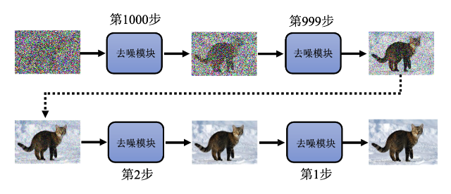
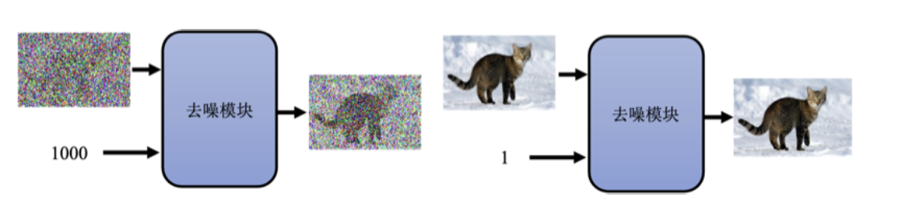
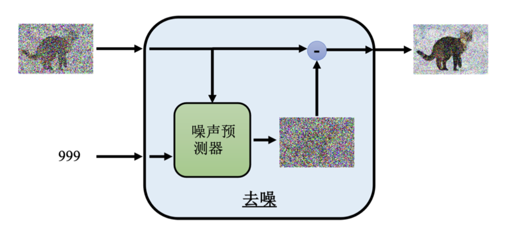
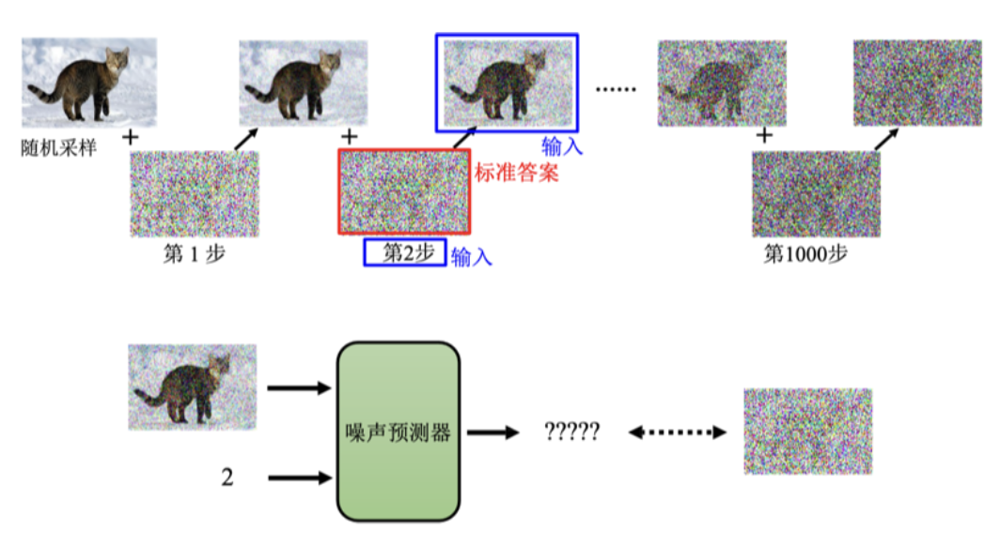
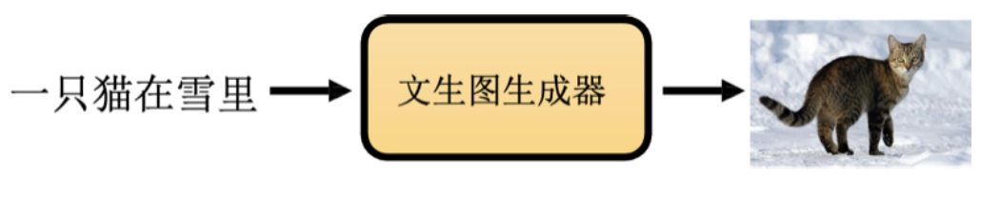
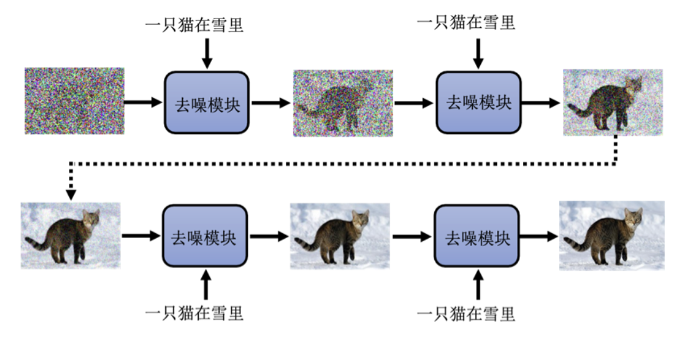
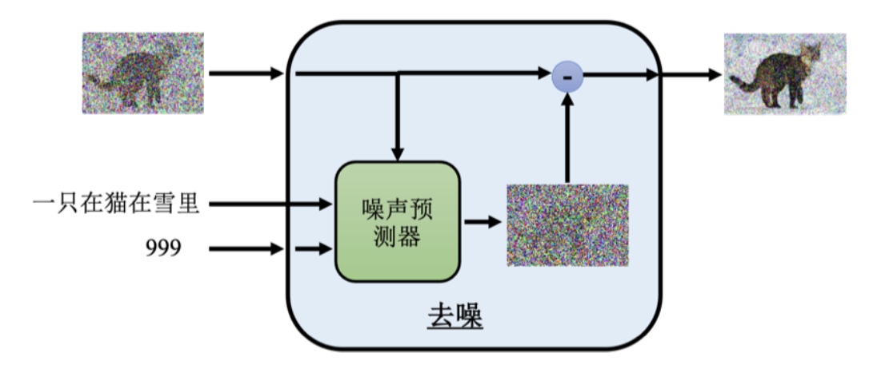
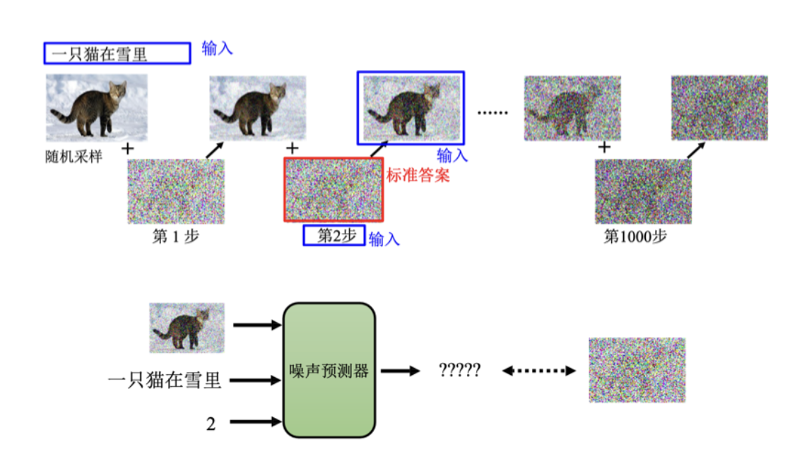

扩散模型 (diffusion model) 是一种基于物理热力学扩散思想的生成模型。本章主要介绍最知名的去噪扩散概率模型 (Denoising Diffusion Probabilistic Model, DDPM)。目前，许多成功的图像生成系统，如 DALL-E、谷歌的 Imagen 和 Stable Diffusion，基本上都是基于类似的方法来实现其扩散模型。

## 一、扩散模型的运作方法

### 1、生成图片的步骤

扩散模型生成图片的第一步是采样一个噪声图片，即从高斯分布中采样出一个向量。这个向量的维度与生成图片的大小相同。假设要生成一张 256×256 的图片，则从正态分布采样的向量维度也是 256×256，将其排成一张图片。接下来，通过去噪模块对输入的噪声图进行处理，逐步滤除噪声，使得图像逐渐显现出形状，最终生成清晰的图片。去噪的次数是事先定好的，每个步骤有一个编号，如下图所示。

### 2、去噪模型的工作原理

去噪模型反复使用同一个去噪模型，但因为输入图片在不同步骤的噪声程度不同，需要根据每个步骤的编号调整去噪策略。去噪模型除了输入要去噪的图片外，还输入一个表示噪声严重程度的编号。编号 1000 表示刚开始去噪时的噪声程度较大，编号 1 表示去噪步骤快结束时的噪声程度较小，如下图所示。

去噪模型内部有一个噪声预测器 (noise predictor)，它通过输入图片和噪声程度编号，预测出图片中的噪声，并将预测的噪声从输入图片中扣除，以达到去噪效果，如下图所示。

> [!TIP]
>
> Q: 为什么不直接使用一个端到端的模型，输入是要被去噪的图片，输出就直接是去噪的结果呢?
>
> A: 虽然可以这么做，但多数论文还是选择使用一个噪声预测器。这是因为产生一张图片和产生噪声的难度是不一样的。如果去噪模型可以生成一张带噪声的猫的图片，它几乎就等于能够画出一只猫。因此，生成一张带噪声的猫的图片比直接生成去噪后的清晰图片要容易一些。因此，使用噪声预测器相对简单，而使用端到端模型直接产生去噪结果则更加困难。

### 3、噪声预测器的训练

训练噪声预测器需要成对的数据，这些数据是人为创造的。具体方法是从数据集中拿出一张图片，随机从高斯分布中采样噪声并加到图片上，逐步增加噪声，生成不同噪声程度的图片。这个加噪声的过程称为前向过程 (forward process) 或扩散过程，如下图所示。

在训练过程中，噪声预测器的输入是加噪声后的图片和当前步骤的编号，输出是图片中的噪声，这样就可以训练噪声预测器预测噪声，并通过扣除噪声实现去噪。

## 二、文本与图像生成

为了实现图像生成模型，需要准备图片与文字成对的数据。ImageNet 中每张图片有一个类别标记，但这些标记不包含图片的描述。Midjourney、Stable Diffusion 或 DALL-E 的数据通常来自 LAION 数据库，该数据库包含 58.5 亿张图片，并配有多种语言的描述，这使得这些模型能够生成高质量的图像，如下图所示。

### 1、文本与去噪模块的结合

在去噪模块中加入文字描述，使去噪模块不仅根据输入图片去噪，还根据文字描述生成特定内容的图片。在每个去噪步骤中，去噪模块都会额外输入文字描述，如下图所示。

### 2、噪声预测器的改进

噪声预测器需要接收额外的文字输入。在训练过程中，每张图片都有对应的文字描述。在进行扩散过程后，训练时给噪声预测器提供加噪声后的图片、当前步骤编号以及文字描述。噪声预测器根据这三项输入产生适当的噪声，并输出标准答案，如下面两个图所示。

通过上述步骤，噪声预测器能够根据输入图片、步骤编号和文字描述，预测出图片中的噪声，并最终生成符合描述的清晰图像。