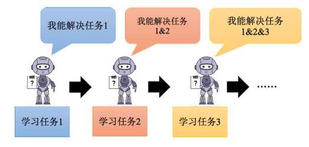
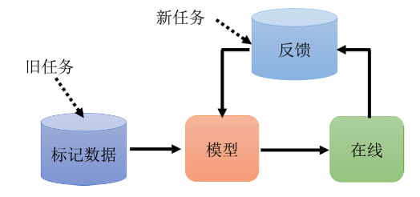
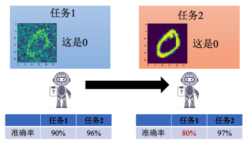
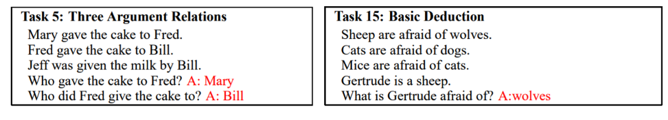
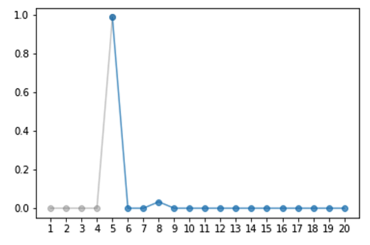
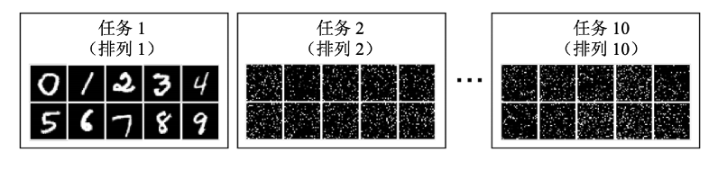
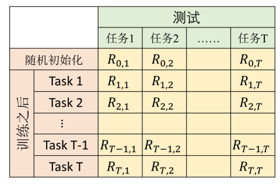
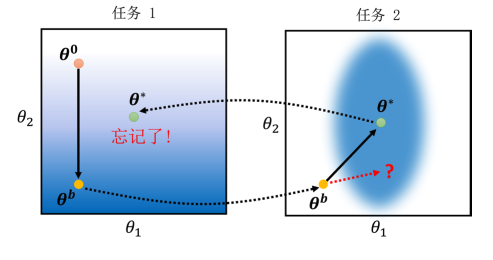
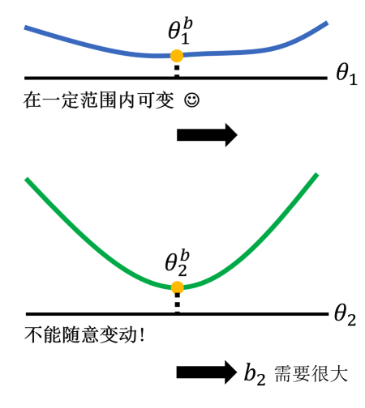
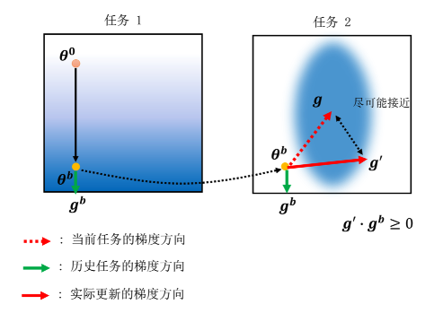

终身学习也称为持续学习（`Continuous Learning`）、无止尽学习（`Never-Ending Learning`）、增量学习（`Incremental Learning`）。终身学习本质上基于人类对人工智能的想象，希望人工智能能像人类一样持续不断地学习。

## 一、灾难性遗忘

如下图所示，我们首先训练机器进行语音识别（任务一），然后教它进行图像识别（任务二），接着再教它做翻译（任务三）。这样一来，机器学会了这三个任务。如果不断教机器新技能，等它学会成百上千个技能后，它将变得非常强大，甚至超过人类。这就是终身学习（LifeLong Learning, LLL）。

虽然终身学习的目标看似遥远且难以实现，但在实际应用中却非常有用。假设我们通过收集数据训练模型，模型上线后收到用户反馈并获取新的训练数据。我们希望形成一个循环：模型上线后获取新数据，更新模型，模型更新后再次获取新反馈和数据，循环往复，模型将越来越强大。这种情景也可以看作是终身学习的问题。

### 1、终身学习的难点

不断更新数据和网络参数似乎可以实现终身学习，但实际情况并不简单。假设我们有两个任务：第一个任务是识别包含噪声的手写数字“0”，第二个任务是识别噪声较少的手写数字。这两个任务可以看作是同一个任务的不同域。虽然现在的终身学习还没有达到同时学习完全不同任务的程度，但即使是类似的任务，也会遇到一些问题。

我们先训练一个简单的网络来完成第一个手写数字识别任务，准确率为90%。接着用同一个模型训练第二个任务，任务二的准确率提高到97%，但任务一的准确率从90%降到80%。这表明模型忘记了如何完成任务一。这种现象称为灾难性遗忘（Catastrophic Forgetting）。

接下来以QA任务为例，即给定一篇文档，模型根据文档回答问题。我们使用“bAbi”数据集，它包含20个子任务。假设第五个任务是根据几个句子回答问题“谁给了蛋糕给Fred？”。我们希望模型依次学习这20个任务，或者同时学习这20个任务。

实验结果表明，当模型依次学习多个任务时，学习新任务后旧任务的准确率会下降，如下图所示（依次学习20个任务任务5的准确率）。这种情况类似一个上下两端都有水龙头的池子，新任务进来，旧任务被冲走，模型永远无法掌握多个技能。

### 2、解决灾难性遗忘的问题

尽管多任务学习（`Multitask Learning`）能够同时学习多个任务，但这种方法有局限性。例如，随着任务数量增加，训练时间会变得非常长。如果我们能够解决终身学习的技术问题，就能高效地学习新任务。

多任务学习的效果通常作为终身学习的上限参考。虽然每个任务用一个独立模型也可行，但这会产生大量模型，占用存储空间，并且无法利用任务间的共通信息。终身学习和迁移学习（`Transfer Learning`）的关注点不同，迁移学习关注前一个任务的学习对新任务的帮助，而终身学习更注重新任务学习后能否回头解决旧任务。

## 二、终身学习评估方法

在终身学习中，我们需要评估模型的表现，通常通过一系列任务来进行。评估任务通常比较简单，如下图所示，任务一是常规的手写数字识别，任务二是对手写数字进行特定规则的排列。还有更简单的任务是将数字右转一次。

如下图所示，评估方法如下：

### 1、初始化参数

首先，有一系列任务和一个随机初始化的参数，用于这些任务，得到初始准确率。

### 2、逐任务训练与测试

让模型先学习第一个任务，然后在所有任务上分别测量准确率，得到$$R_{1,1}, R_{1,2}, \ldots, R_{1,T}$$。接着学习第二个任务，再次在所有任务上测量准确率，得到$$R_{2,1}, R_{2,2}, \ldots, R_{2,T}$$，依此类推，直到学习完所有任务。

通过这种方法，我们可以得到一个准确率表格来评估终身学习的效果。

### 3、最终准确率

最终准确率可以用以下公式表示：

$$
\text{最终准确率} = \frac{1}{T} \sum_{i=1}^{T} R_{T,i}
$$

这里，$$T$$是任务的总数，$$R_{T,i}$$是模型在任务$$i$$上的最终准确率。

### 4、反向迁移

另一种评估方法是反向迁移，表示为：

$$
\text{反向迁移} = \frac{1}{T-1} \sum_{i=1}^{T-1} (R_{T,i} - R_{i,i})
$$

反向迁移评估模型在学习新任务后，对旧任务表现的变化。具体来说，它衡量模型在学习最后一个任务后，对之前所有任务准确率的平均变化。

## 三、终身学习的主要解法

解决终身学习问题，特别是灾难性遗忘，学术界提出了几种主要方法。以下介绍一种关键方法：选择性的突触可塑性（Selective Synaptic Plasticity）。

### 1、选择性的突触可塑性

选择性的突触可塑性方法只允许神经网络中某些神经元之间的连接具有可塑性，其余部分必须固定。这类方法也称为基于正则的方法。

#### （1）灾难性遗忘

假设我们有两个任务，并且模型只有两个参数$$\theta_1$$和$$\theta_2$$。如上图所示，模型在不同任务上的损失函数示意图中，颜色越蓝表示损失越小，颜色越红表示损失越大。

- **训练任务一**：从初始参数$$\theta_0$$出发，通过梯度下降方法更新参数，得到参数$$\theta_b$$。
- **训练任务二**：将$$\theta_b$$复制到任务二中进行训练，得到参数$$\theta^*$$。
- **回到任务一**：使用$$\theta^*$$在任务一上进行测试，结果发现表现不好，因为$$\theta^*$$只对任务二有效。

这种现象就是灾难性遗忘。

#### （2）解决方法

为了解决这个问题，我们在训练任务二时，尽量不改变对任务一重要的参数，而是更新其他对新任务重要的参数。

假设$$\theta_b$$是任务一学到的参数，在选择性的突触可塑性方法中，每个参数$$\theta_{b,i}$$被赋予一个系数$$b_i$$，表示该参数对任务一的重要性。更新参数时，我们修改损失函数如下：

$$
L'(\theta) = L(\theta) + \lambda \sum_{i} b_i (\theta_i - \theta_{b,i})^2
$$

这里，$$L(\theta)$$是原始损失函数，第二项表示当前参数$$\theta_i$$与之前参数$$\theta_{b,i}$$的差异，并乘以重要性系数$$b_i$$。当$$b_i=0$$时，不关心参数的变化，容易发生遗忘；当$$b_i$$趋近无穷大时，参数不会在新任务上妥协，但可能学不好新任务。

#### （3）设定重要性系数

设定重要性系数$$b_i$$的方法如下：

- 如果移动某个参数时，损失值在一定范围内都很小（即接近最优参数），则该参数重要性小，$$b_i$$可以设小一些。
- 如果某个参数对损失值敏感，则其重要性大，$$b_i$$设大一些。

如下图所示，移动$$\theta_{b,1}$$时，损失值变化不大，因此$$b_1$$可以较小；而$$\theta_{b,2}$$变化敏感，因此$$b_2$$较大。

### 2、基于梯度的方法

在基于正则的方法之前，还有一种梯度回合记忆（Gradient Episodic Memory, GEM），又称为基于梯度的方法。原理如下图所示：

**Step1：**计算当前任务的梯度方向。

**Step2：**计算历史任务的梯度方向。

**Step3：**将当前任务和历史任务的梯度向量求和，得到实际梯度方向。

这种方法可以尽量避免灾难性遗忘，但需要存储过去的数据，可能违背终身学习不依赖历史数据的初衷。不过，由于只存储少量信息，与选择性突触可塑性方法类似，实际操作中还是可接受的。