## 一、简介

网络压缩（network compression）是一个重要方向，尤其对于像 BERT 或 GPT 这样的大模型。网络压缩的目标是简化这些大模型，使其参数更少，但性能与原模型相差不大。这对于资源受限的环境尤其重要。例如，智能手表等边缘设备只有有限的内存和计算力，无法运行过于庞大的模型，因此需要更小的模型。

为什么在边缘设备上运行模型？直接在边缘设备上进行计算的一个常见理由是减少延迟。如果需要将数据传到云端再返回，可能会有不可接受的延迟。比如，自驾车的传感器需要即时反应，延迟过长会影响安全。此外，为了保护隐私，直接在设备上处理数据也能避免将敏感信息传输到云端。

接下来介绍五种以软件为导向的网络压缩技术，这些技术仅在软件上进行压缩，不考虑硬件加速。

## 二、网络剪枝

网络剪枝（network pruning）是通过移除网络中不重要的参数来简化模型。大模型中很多参数可能并没有实际作用，它们只占用空间和计算资源。通过剪枝可以找出并移除这些无用的参数，从而得到一个更小的网络。

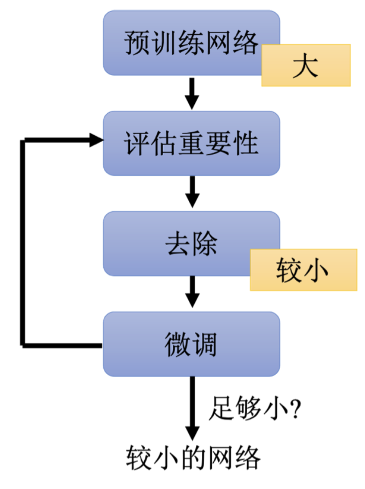

**网络剪枝的过程**如上图所示：

- 训练一个大网络。
- 评估每个参数或神经元的重要性，例如通过其绝对值大小来判断。
- 移除不重要的参数或神经元。
- 对剪枝后的网络进行微调。
- 重复剪枝和微调的过程，直到网络足够小且性能满足要求。

### 1、参数剪枝

如果以参数为单位进行剪枝，得到的网络形状可能会不规则，导致实现困难并且难以用 GPU 加速。因此，实际操作中常常将被剪枝的参数设为零，而不是完全移除，这样实现较容易，但无法真正减小网络大小。

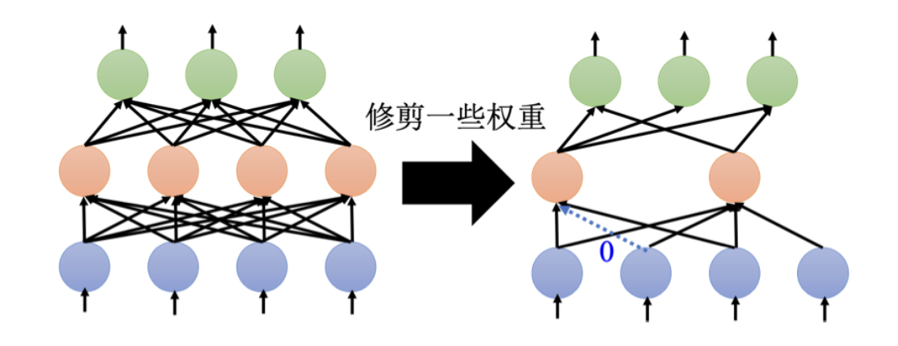

### 2、神经元剪枝

以神经元为单位进行剪枝，可以保持网络架构的规则性，更容易实现和加速。剪掉神经元后只需调整层输入输出的维度即可。

### 3、大网络为何易于训练

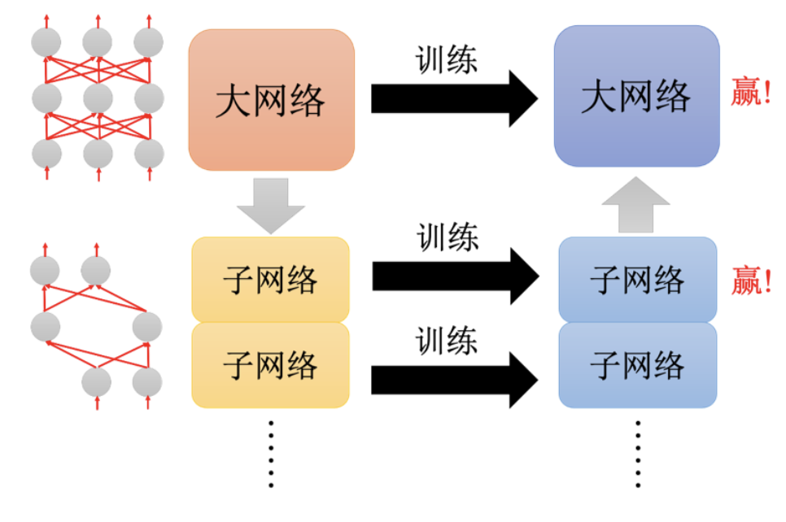

直接训练一个小网络通常效果不如先训练一个大网络再剪枝，这是因为大的网络包含更多的子网络（sub-networks）。根据**彩票假说（lottery ticket hypothesis）**，大网络中包含许多子网络，每个子网络可能有不同的初始参数配置。某些配置可能更有利于训练成功，就像买彩票买得越多，中奖的概率越高。大的网络因为有更多的子网络组合，成功训练的概率也就更大。

**彩票假说的验证**如下图所示：

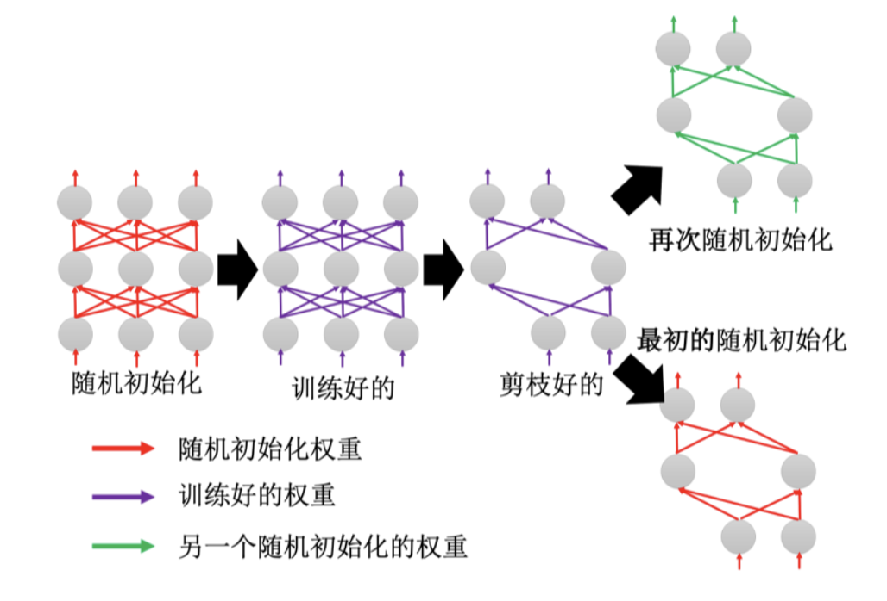

1. 训练一个大网络。
2. 通过剪枝得到一个小网络。
3. 用剪枝后保留的参数初始化小网络，再次训练。
4. 实验证明直接用这组幸运的参数初始化的小网络能训练成功。

### 4、对彩票假说的质疑

论文“Rethinking the Value of Network Pruning”质疑彩票假说，认为只有在某些特定情况下（如学习率较小，非结构化剪枝）才能观察到彩票假说的现象。该研究表明，直接训练小网络有时也能达到剪枝后小网络的效果，彩票假说的正确性仍需进一步验证。

## 三、知识蒸馏

知识蒸馏（Knowledge Distillation）是一种使网络变小的方法。具体来说，先训练一个大的网络，称为教师网络（Teacher Network），然后根据教师网络来训练一个较小的学生网络（Student Network）。不同于网络剪枝（直接删除大网络的部分参数），知识蒸馏通过让小网络学习大网络的输出，从而间接提高小网络的性能。

### 1、知识蒸馏的基本概念

假设我们在进行手写数字识别，首先将训练数据输入教师网络，教师网络会产生输出。由于这是一个分类问题，教师网络的输出是一个概率分布，例如对于某张图片，教师网络输出的概率可能是：1的概率为0.7，7的概率为0.2，9的概率为0.1。接下来，我们将同样的图片输入学生网络，但学生网络学习的目标不是图片的正确标签，而是逼近教师网络的输出。例如，学生网络的目标是输出1的概率为0.7，7的概率为0.2，9的概率为0.1。

### 2、为什么不直接训练小网络？

直接训练一个小网络往往效果不如使用知识蒸馏的方法。知识蒸馏提供了一种利用大网络（教师网络）丰富知识的方式，从而间接提升小网络的性能。Hinton等人在2015年发表了关于知识蒸馏的经典论文“Distilling the Knowledge in a Neural Network”，这篇论文系统地介绍了知识蒸馏的概念及其优势。

### 3、知识蒸馏的优势

知识蒸馏的一个优势是教师网络提供了额外的信息。例如，在数字识别中，教师网络输出的概率分布可以帮助学生网络更好地区分相似的数字。如下图所示，直接告诉学生网络某个数字是1可能过于困难，因为1与7或9可能相似。而通过学习教师网络的概率分布，学生网络能够更容易地学习到这些相似性。

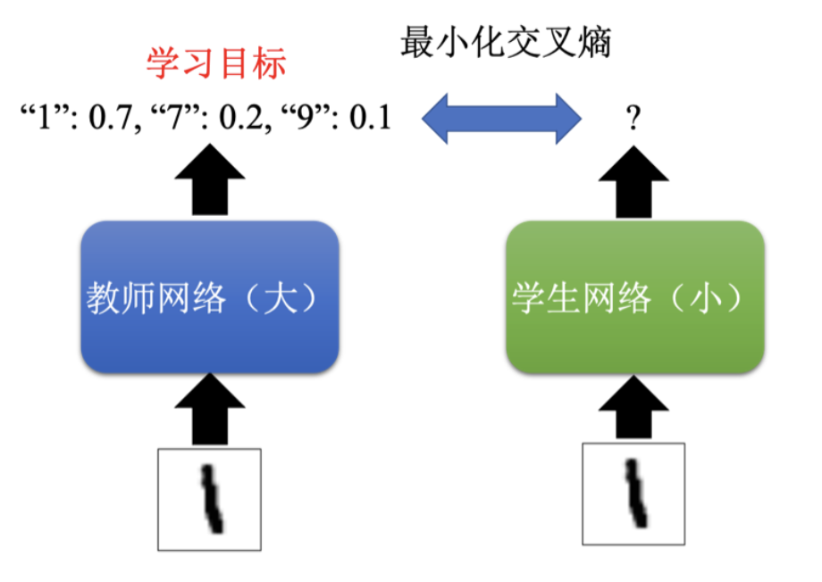

Hinton的研究还表明，教师网络可以帮助学生网络在没有看到某些数字训练数据的情况下学会这些数字。例如，训练数据中没有数字7，但教师网络见过数字7，并将其与数字1或9的关系告知学生网络，学生网络就有机会学会数字7的特征。

### 4、温度参数

在知识蒸馏中，有一个常用的小技巧是修改Softmax函数，加上一个温度参数（Temperature）。Softmax函数将每个神经元的输出取指数再归一化，公式如下所示。
$$
\text{Softmax}(z_i) = \frac{e^{z_i}}{\sum_{j} e^{z_j}} \quad 
$$

温度参数$T$在取指数之前将每个数值除以$T$，公式如下所示。温度参数$T$可以调节输出分布的平滑程度，$T > 1$时，分布变得平滑。

$$
\text{Softmax}(z_i, T) = \frac{e^{z_i / T}}{\sum_{j} e^{z_j / T}} \quad 
$$

例如，教师网络的原始输出如下所示，若不加温度，学生网络的学习效果与直接学习正确答案差异不大。
$$
y_1 = 100, \quad y_2 = 10, \quad y_3 = 1 \quad 
$$

经过Softmax函数处理后的输出接近：

$$
y'_1 = 1, \quad y'_2 \approx 0, \quad y'_3 \approx 0
$$

但如果设定温度$T$为100，公式如下所示，分类结果保持不变，但输出分数更为平滑。这样学生网络可以更有效地学习教师网络的输出。
$$
\frac{y_1}{T} = 1, \quad \frac{y_2}{T} = 0.1, \quad \frac{y_3}{T} = 0.01 \quad \text{(公式 17.4)}
$$

经过Softmax函数处理后的输出变为：

$$
y'_1 = 0.56, \quad y'_2 = 0.23, \quad y'_3 = 0.21
$$
温度$T$是一个需要调节的超参数。温度过大，输出分布过于平滑，学生网络无法有效学习；温度过小，输出分布过于集中，学生网络的学习难度加大。因此，温度$T$的设定需要在实际应用中不断调整，类似于学习率。

总结来说，知识蒸馏通过大网络指导小网络学习，使得小网络能够在性能上接近甚至超过直接训练的小网络。这种方法利用了教师网络丰富的知识，是一种高效的模型压缩技术。

## 四、参数量化

参数量化（Parameter Quantization）是一种通过减少存储每个参数所需的位数来压缩模型的方法。例如，一个参数通常使用64位或32位存储，但我们可以尝试用16位甚至8位来存储，从而减少存储空间。参数量化最简单的做法是将存储位数减少一半，网络大小也会相应减半，并且性能不会有显著下降，有时甚至会有所提升。

### 1、权重聚类

权重聚类（Weight Clustering）是进一步压缩参数的方法。如下图所示，首先对网络参数进行聚类，将数值接近的参数分成一组。设定好聚类数目，例如四组，然后用每组的平均值表示这一组的所有参数。存储时只需记录两个内容：一是每组的代表数值，二是每个参数所属的组。这样一来，每个参数只需几个比特即可存储。

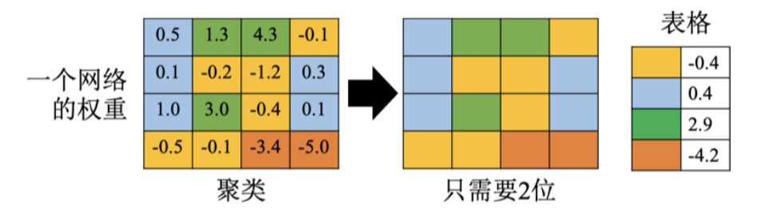

例如，如果将参数分成四组，每个参数只需2位存储，而不是原来的16位或8位。

### 2、哈夫曼编码

哈夫曼编码（Huffman Encoding）通过对常见的数值使用较少的位数描述，而对罕见的数值使用较多的位数描述，从而减少平均存储位数。这样可以进一步压缩参数存储空间。

### 3、二值网络

在一些研究中，参数被量化为二值权重（Binary Weights），即权重值仅为+1或-1。这样，每个权重只需1位存储。这种二值网络（Binary Network）虽然简单，但性能不一定差。例如，二值连接（Binary Connect）技术在图像识别任务中（如MNIST、CIFAR-10、SVHN数据集）表现良好，甚至有时优于传统网络。

二值网络限制了网络容量（Network Capacity），从而减少过拟合的风险。

### 4、权重聚类的更新

在训练过程中考虑权重聚类的方法有两种：一种是先训练网络，然后再进行权重聚类；另一种是在训练过程中同时进行权重聚类。后一种方法通过将量化作为损失的一部分，使得训练过程自然形成权重聚类的效果。

每个聚类的代表数值通常是该组参数的平均值。

## 五、网络架构设计

在本节中，我们将介绍如何通过网络架构设计来减少参数量，重点讲解深度可分离卷积（depthwise separable convolution）。在介绍这一方法前，我们先复习一下传统的卷积神经网络（CNN）。

### 1、传统卷积层回顾

在CNN的卷积层中，每一层的输入是一个特征映射。如下图所示，特征映射有两个通道，每个滤波器的高度是2，滤波器是一个立方体，通道有多少，滤波器就有多厚。当滤波器扫过特征映射时，会生成另一个特征映射。我们有多少滤波器，输出的特征映射就有多少通道。例如，有4个滤波器，每个滤波器的参数量是 $3 \times 3 \times 2$，总共的参数量是 $3 \times 3 \times 2 \times 4 = 72$ 个参数。

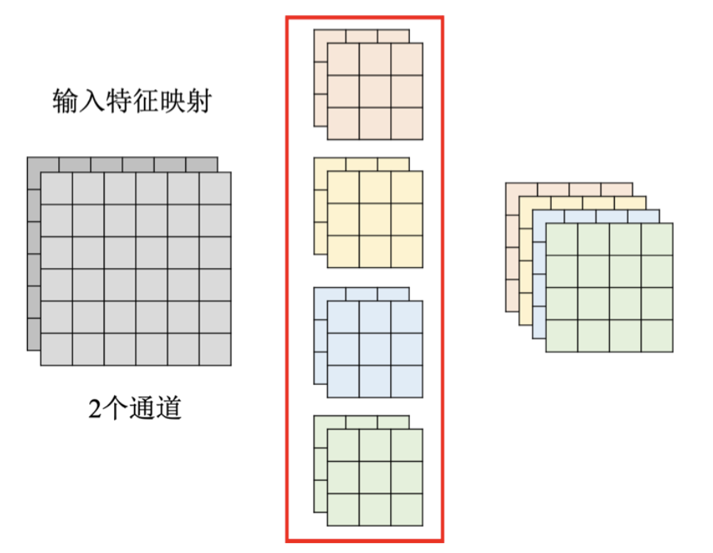

### 2、深度可分离卷积

深度可分离卷积分为两个步骤：深度卷积（depthwise convolution）和点卷积（pointwise convolution）。

#### （1）深度卷积

深度卷积中，每个通道对应一个滤波器，每个滤波器只处理一个通道。如下图所示，如果输入特征映射有两个通道，深度卷积层中就有两个滤波器。与传统卷积不同，深度卷积中滤波器的数量与通道数量相同，且每个滤波器只负责一个通道。因此，输入和输出的通道数量相同。

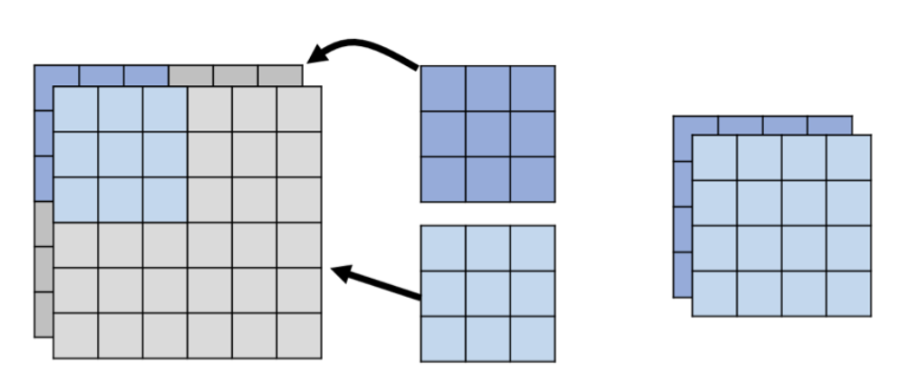

#### （2）点卷积

仅使用深度卷积会有一个问题：通道之间没有互动。因此，需要增加点卷积。点卷积使用大小为 $1 \times 1$ 的滤波器，处理不同通道之间的关系。如下图所示，点卷积通过 $1 \times 1$ 滤波器扫描深度卷积产生的特征映射，从而生成新的特征映射。点卷积可以改变通道数量，但滤波器的大小被限制为 $1 \times 1$，只考虑通道之间的关系。

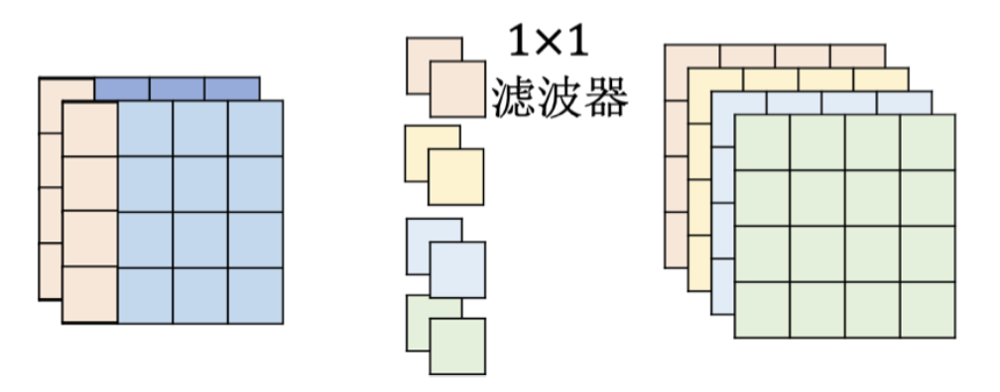

#### （3）参数量计算

如下图所示，计算深度可分离卷积的方法的参数量。假设输入特征映射有两个通道，每个滤波器大小为 $3 \times 3$。深度卷积总参数量为 $3 \times 3 \times 2 = 18$。点卷积有四个滤波器，每个滤波器大小为 $1 \times 1$，总参数量为 $2 \times 4 = 8$。

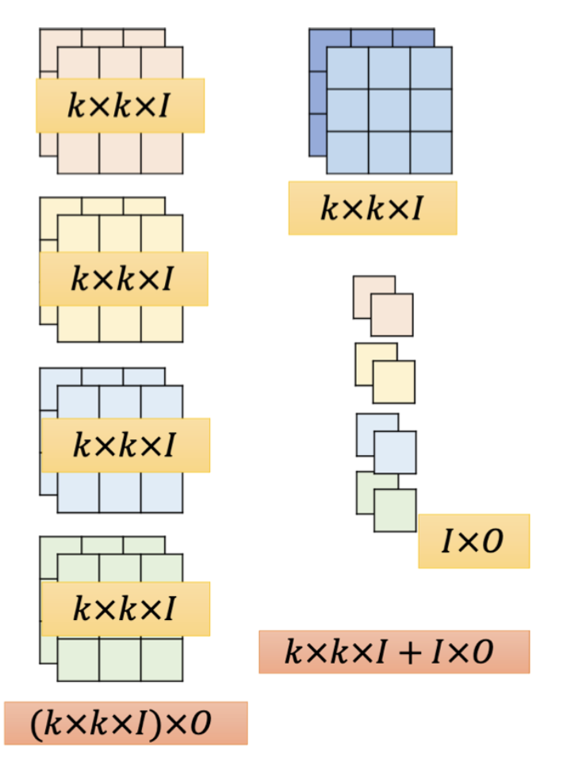

对比一般卷积和深度可分离卷积的参数量：

- 一般卷积的参数量为 $k \times k \times I \times O$
- 深度可分离卷积的参数量为 $k \times k \times I + I \times O$

设输入通道数量为 $I$，输出通道数量为 $O$，核大小为 $k \times k$。一般卷积的参数量是 $(k \times k \times I) \times O$。深度卷积的参数量为 $k \times k \times I$，点卷积的参数量为 $I \times O$。比较两者参数量，通常 $O$ 较大，忽略 $O$ 的部分后，参数量主要取决于 $k \times k$。假设核大小为 $2 \times 2$，深度可分离卷积的网络大小约为一般卷积的 $\frac{1}{4}$。假设核大小为 $3 \times 3$，网络大小约为一般卷积的 $\frac{1}{9}$。

$$
k \times k \times I + I \times O \quad \text{vs.} \quad k \times k \times I \times O
$$

### 3、低秩近似

在深度可分离卷积之前，有一种用低秩近似（low-rank approximation）的方法来减少网络层的参数量。如下图所示，假设有一层有 $N$ 个神经元，输出有 $M$ 个神经元，这两层之间的参数量是 $N \times M$。可以在 $N$ 和 $M$ 之间插入一层，神经元数量为 $K$，这层不用激活函数。原来一层的参数量是 $N \times M$，拆成两层后的参数量为 $N \times K + K \times M$。如果 $K$ 远小于 $N$ 和 $M$，整体参数量会减少。

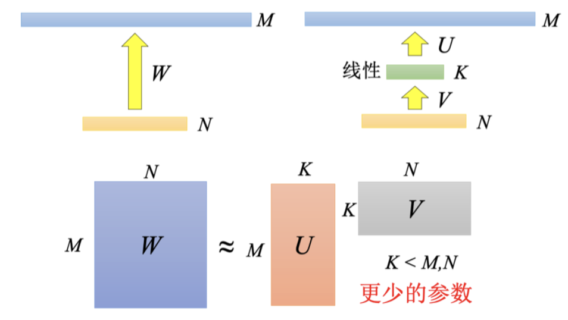

假设原来参数量是 $N = 1000$, $M = 1000$，插入 $K = 20$ 或 $50$，参数量大幅减少。虽然减少参数量，但这种方法会对参数的可能性有所限制。

### 4、深度卷积和点卷积的关系

深度卷积和点卷积可以视为低秩近似的一种应用。将一层网络拆成两层，减少参数量。如下图所示，原来卷积的一个滤波器参数量为 $3 \times 3 \times 2 = 18$，经过滤波器后得到特征映射。将一般卷积拆成深度卷积和点卷积后，深度卷积的输出成为中间值，点卷积综合这些中间值得到最终输出。通过这种方式，将一层网络拆成两层，参数需求减少。

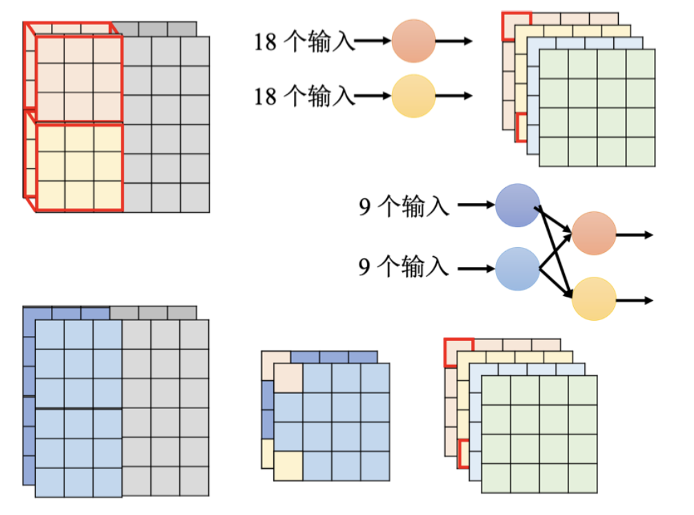

这种网络架构设计通过将一般卷积层拆分为深度卷积和点卷积层，有效减少了参数量，是网络架构设计中的一种重要方法。

## 六、动态计算

动态计算（dynamic computation）是为了让网络可以自由调整计算量的方法。与前几种方法单纯地缩小网络不同，动态计算的目的是根据设备的计算资源动态调整计算量。

### 1、为什么需要动态计算？

- **不同设备**：不同设备的计算资源不同，训练好的网络如果能在不同设备上运行而不需要重新训练，将更为高效。
- **相同设备，不同状态**：即使在同一设备上，计算资源也会变化。例如，当手机电量充足时，可以使用更多计算资源；当电量不足时，需要减少计算资源分配。

### 2、为什么不训练多个网络？

在不同计算资源下使用不同网络虽然可行，但会占用大量存储空间。期望的是一个网络能根据计算资源调整计算量，而不是存储多个网络。

### 3、如何实现动态计算？

#### （1）动态深度

一个实现方法是让网络调整其深度。图像分类时，可以在层与层之间加上额外的层，根据每层的输出决定是否输出最终结果。如下图所示，网络可以在计算资源充足时运行所有层，而在计算资源不足时，只运行部分层。

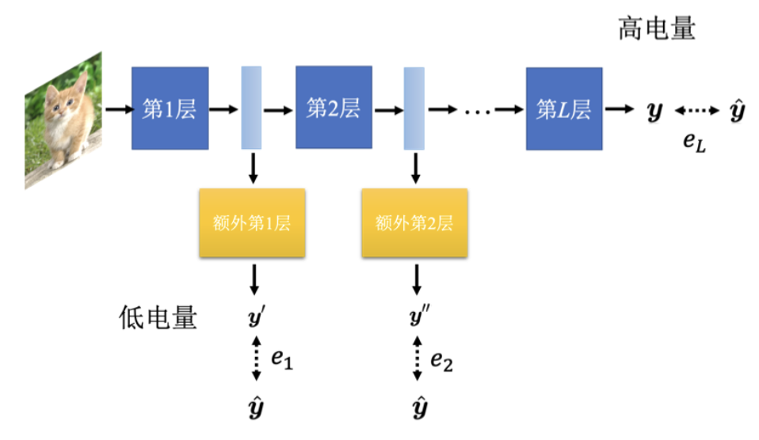

**训练方法**：
训练时将每个额外层的输出与标准答案的距离加起来，最小化这个损失函数：
$$
L = e_1 + e_2 + \cdots + e_L
$$
通过这种方法，可以实现动态深度，但这并不是最优方法。更好的方法参考 MSDNet[7]。

#### （2）动态宽度

另一个方向是让网络调整其宽度。设定多个不同的宽度，同一张图片输入时，每个宽度的网络会有不同输出。希望所有输出与正确答案越接近越好：
$$
L = e_1 + e_2 + e_3
$$
如下图所示，三个网络并不是独立的，而是同一个网络的不同宽度选择。相同颜色表示相同权重，训练时考虑所有情况，最小化损失。

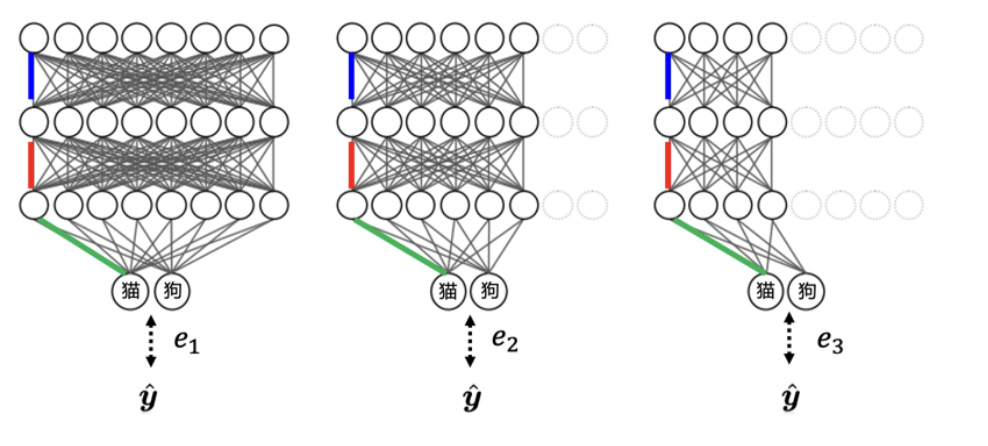

### 4、网络自行决定宽度和深度

网络自行决定宽度和深度的需求源自于图像的难易程度不同。简单的图像可能只需要通过一层网络，而复杂图像则需要通过更多层。如下图所示，不同复杂度的图像需要不同层数的计算。

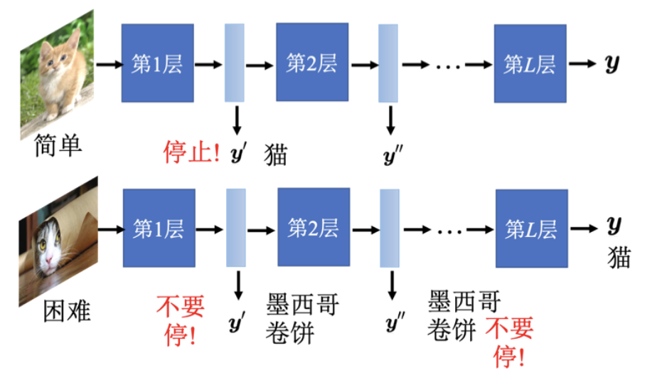

## 七、总结

动态计算方法在计算资源有限和充足的情况下都能有效工作。前面提到的网络压缩技术，如网络架构设计、知识蒸馏、网络剪枝和参数量化，可以结合使用，实现更好的压缩效果。
