## 一、BERT 模型结构

BERT (Bidirectional Encoder Representations from Transformers) 是一个基于 Transformer 编码器的自监督学习模型。其架构与 Transformer 编码器完全相同，包含自注意力机制、残差连接和归一化等组件。BERT 的输入和输出都是序列，且长度相同。

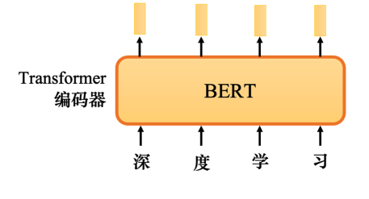

BERT 主要应用于自然语言处理（NLP）任务，如文本分类、问答系统等。虽然 BERT 最早用于文本处理，但它也可用于其他序列数据，如语音和视频。在 NLP 中，BERT 的输入通常是一段文本序列。

## 二、输入处理与掩码机制

BERT 训练时需对输入文本进行处理，具体步骤如下：

1. **输入文本序列**：例如，一段包含 100 个词元的文本。
2. **词元定义**：词元是文本处理的基本单位，通常在中文中将一个汉字视为一个词元。
3. **随机掩码**：对输入文本中的部分词元进行随机掩码。

有两种掩码方法：

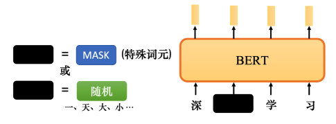

- **添加特殊符号 "MASK"**：用 "MASK" 词元替换随机选择的词元。
- **随机替换词元**：用随机选择的另一个词元替换原词元。

这两种方法在训练时随机选择使用。

## 三、BERT 模型训练

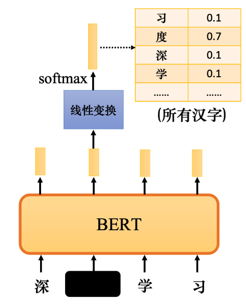

掩码后的文本序列输入 BERT，输出也是一个序列。训练目标是预测掩码位置的原始词元，具体步骤如下：

1. **输入掩码序列**：例如，掩码后输入序列为 $[\text{MASK}]$ 或随机替换的词元。
2. **输出向量处理**：BERT 输出一个向量序列，对应输入序列中的每个词元。
3. **线性变换与 softmax**：对掩码位置的输出向量进行线性变换，再通过 softmax 生成分布，预测掩码位置的词元。

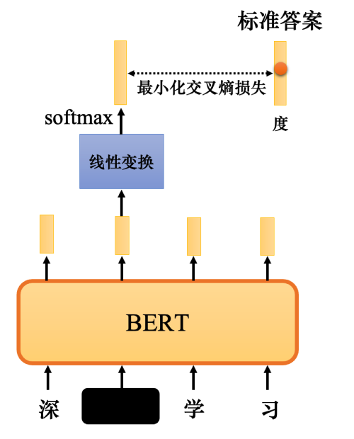

训练目标是最小化预测输出与真实词元之间的交叉熵损失。

## 四、训练 BERT 的其他方法

### 1、下一句预测 (Next Sentence Prediction, NSP)

在 NSP 中，训练数据由两个句子组成，用特殊词元 $[\text{SEP}]$ 分隔，并在序列开头添加 $[\text{CLS}]$。BERT 需要预测第二个句子是否是第一个句子的后续句子。

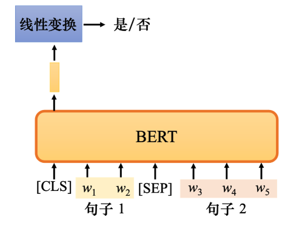

然而，研究表明 NSP 对 BERT 的实际任务帮助不大，如论文 "Robustly Optimized BERT Approach (RoBERTa)" 指出 NSP 几乎无用，其他如 SCAN-BERT 和 XLNet 也支持这一结论。

### 2、句序预测 (Sentence Order Prediction, SOP)

SOP 方法被认为更有效，它要求 BERT 判断两个句子的顺序是否正确。例如：

- 句子 1 在句子 2 之前
- 句子 2 在句子 1 之前

这种方法因任务更具挑战性，被用于 ALBERT 模型中，ALBERT 是 BERT 的改进版本。

## 五、BERT使用方式

BERT是一种强大的自然语言处理模型，通过预训练和微调来解决各种任务。以下是关于如何使用BERT的详细说明：

### 1、预训练阶段
在预训练阶段，BERT学习两个任务：
- **掩盖字符填空**：随机掩盖输入序列中的一些字符，然后让模型预测这些掩盖字符。这类似于做填空题。

- **预测句子顺序**：判断两个句子是否有顺序关系。虽然这个任务的实际应用不多，但它帮助模型理解上下文关系。

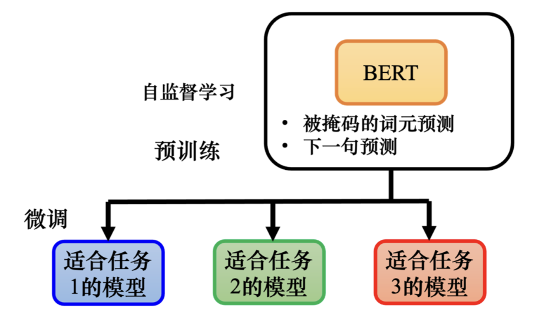

通过以上任务，BERT学会了如何填空。在完成预训练后，BERT可以用于各种下游任务，即实际关心的任务。这些任务可以是分类、序列标注、自然语言推理等。

### 2、微调阶段
微调是指在预训练的基础上，使用特定任务的标注数据对BERT进行进一步训练，以使其适应特定任务。BERT在预训练时学会了填空题，但通过微调，它可以解决各种感兴趣的任务。

### 3、下游任务
下游任务是使用BERT的实际任务。尽管BERT的预训练只是学会了填空，但它具有解决多种任务的潜力，例如情感分析、词性标注、自然语言推理和问答系统。微调BERT就是将其能力应用于这些特定任务。

### 4、BERT的能力评估

为了评估BERT的能力，通常会在多个任务上进行测试。这些任务集合被称为任务集，最著名的标杆是通用语言理解评估（GLUE），包含以下9个任务：
1. 语言可接受性语料库（CoLA）
2. 斯坦福情感树库（SST-2）
3. 微软研究院释义语料库（MRPC）
4. 语义文本相似性基准测试（STSB）
5. Quora问题对（QQP）
6. 多类型自然语言推理数据库（MNLI）
7. 问答自然语言推断（QNLI）
8. 识别文本蕴含数据集（RTE）
9. Winograd自然语言推断（WNLI）

通过在这些任务上的平均表现，可以评估BERT模型的整体性能。

### 5、BERT的使用场景

#### （1）情感分析

情感分析是一种分类任务，输入一个序列（例如句子），输出一个类别（例如正面或负面情感）。BERT（Bidirectional Encoder Representations from Transformers）在情感分析中表现出色，下面介绍BERT如何解决这个问题。

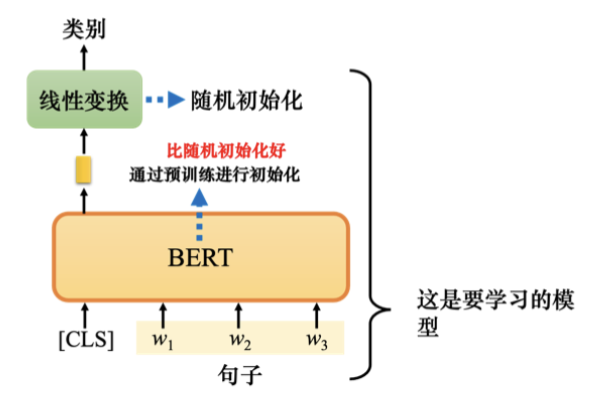

如上图所示，BERT处理情感分析任务的步骤如下：

1. **输入处理**：将句子输入BERT，并在句子前添加特殊词元$$[CLS]$$。
2. **输出向量**：BERT将句子的每个词（包括$$[CLS]$$）映射到对应的输出向量。
3. **线性变换**：对$$[CLS]$$对应的向量应用线性变换，即乘上一个矩阵。
4. **分类**：通过softmax函数确定输出类别（正面或负面）。

**训练情感分析模型**：要让BERT执行情感分析，需要标注数据，即大量的句子及其对应的情感标签（正面或负面）。训练过程如下：

1. **初始化**：线性变换的参数是随机初始化的，而BERT的参数则来自预训练（学会填空任务的BERT）。
2. **训练**：通过梯度下降法同时更新线性变换和BERT模型的参数，以最小化损失函数。

**预训练与微调**：BERT的骨干是一个巨大的Transformer编码器，其参数来自于预训练阶段。预训练的BERT参数比随机初始化的参数表现更好，如下图所示：

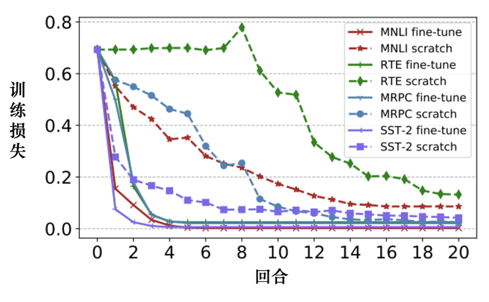

- **横轴**：训练的回合数。
- **纵轴**：训练损失。

微调过程中，预训练的BERT参数使得模型的损失下降更快、更低。

BERT的训练可以分为两个阶段：

1. **预训练**：使用无监督学习方法，BERT通过大量未标注的数据进行学习填空任务。
2. **微调**：使用少量标注数据进行特定任务（如情感分析）的训练，这个过程可以视为半监督学习。

#### （2）词性标注
词性标注（Part-Of-Speech Tagging，POS Tagging）是指给定一个句子，标注每个单词的词性（如名词、动词等）。输入和输出序列的长度相同，每个输入词对应一个词性标签。

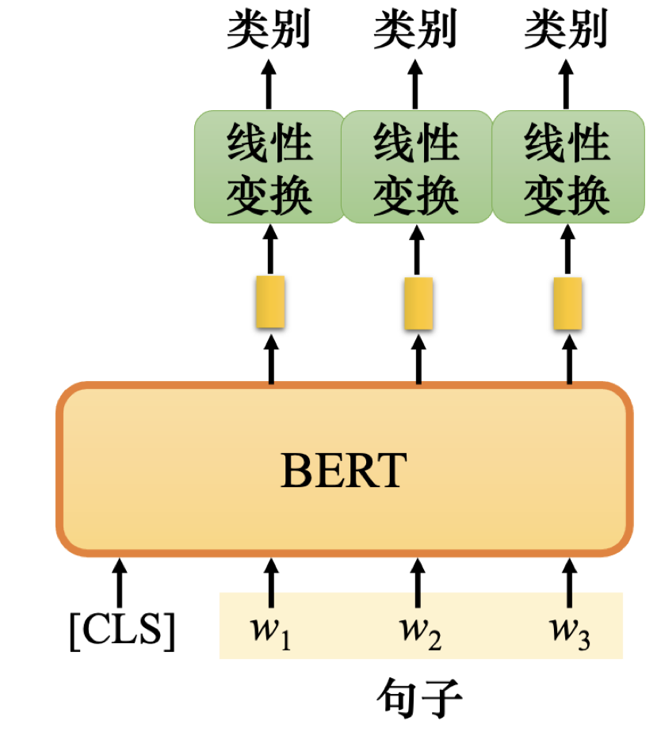

BERT处理词性标注任务的步骤如下（如上图所示）：

1. **输入处理**：将句子输入BERT。
2. **输出向量**：BERT将句子的每个词（若为中文则为每个字）映射到对应的输出向量。
3. **线性变换和softmax**：将每个输出向量依次通过线性变换和softmax层。
4. **类别预测**：网络预测每个单词所属的类别（词性）。

**训练词性标注模型：**词性标注需要带标签的数据，即句子及其对应的词性标签。训练过程如下：

1. **初始化**：BERT的参数来自预训练阶段，而线性变换的参数是随机初始化的。
2. **训练**：通过梯度下降法更新BERT和线性变换的参数，以最小化损失函数。

**预训练与微调：**BERT的编码器部分在预训练过程中已经找到了一组较好的初始化参数。与随机初始化的网络相比，预训练参数使得模型在下游任务中表现更好。

#### （3）自然语言推理
在自然语言推理 (Natural Language Inference, NLI) 任务中，模型输入两个句子并输出一个类别。输入的两个句子通常是前提 (premise) 和假设 (hypothesis)，模型需要判断假设是否可以从前提中推断出，即前提与假设之间的关系是矛盾的、相符的还是中性的。

例如，前提是“一个骑马的人跳过一架坏掉的飞机 (A person on a horse jumps over a broken down airplane)”，假设是“这个人在一家餐馆里 (A person is at a diner)”，这显然是矛盾的。机器需要判断并输出这两个句子之间的关系。

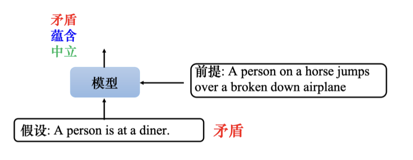

**BERT 如何处理 NLI：**

1. **输入处理**：将两个句子输入BERT，中间用特殊的分隔词元 [SEP] 分隔，句首放置 [CLS] 词元。
2. **输出处理**：BERT 输出的序列中，只取 [CLS] 词元对应的向量，进行线性变换和 softmax 操作。
3. **类别预测**：根据 [CLS] 词元的向量，预测句子对的关系类别。

如下图所示，BERT 通过这种方法处理自然语言推理任务，并需要标注数据进行训练。

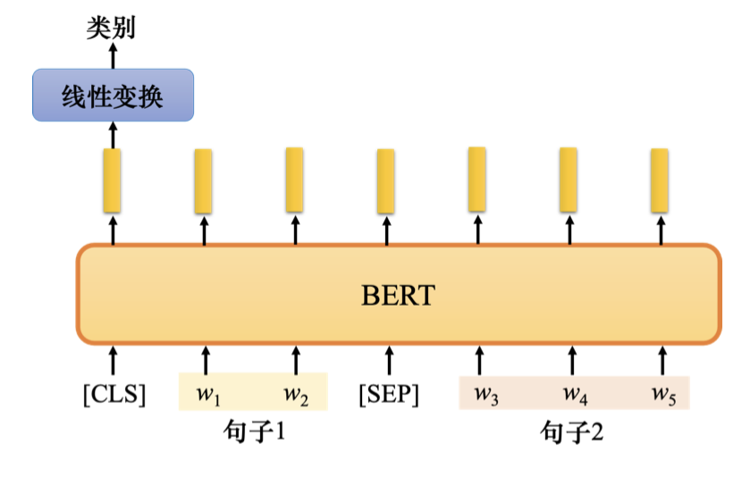

#### （4）基于提取的问答 (Extraction-based Question Answering)

在基于提取的问答任务中，给机器一篇文章和一个问题，机器需要在文章中找到答案片段。答案必须是文章中的一部分。

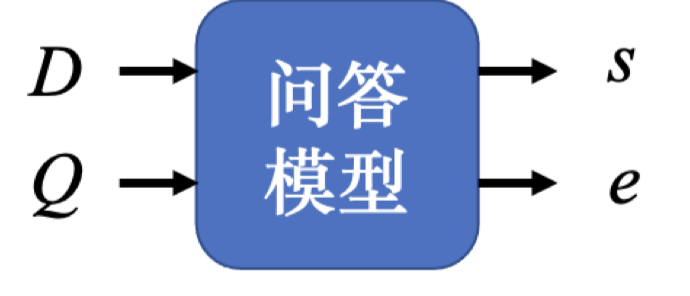

给定一个问题和一篇文章，模型需要输出答案所在的起始位置和结束位置。例如，问题是“重力是什么？”文章中的第17个字是“重力”，那么模型应输出 s = 17 和 e = 17。

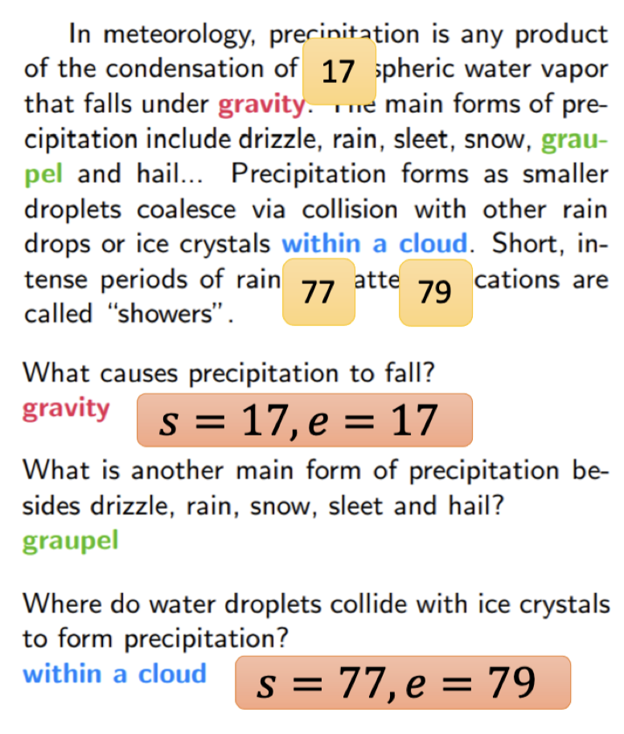

**BERT 如何处理问答任务**

1. **输入处理**：将问题和文章输入BERT，中间用 [SEP] 分隔，句首放置 [CLS] 词元。
2. **输出处理**：BERT 输出的向量序列中，有两个随机初始化的向量（橙色和蓝色向量），分别表示答案的起始和结束位置。
3. **内积计算**：计算橙色向量与文章中每个词元向量的内积，再通过 softmax 得到起始位置概率分布。类似地，蓝色向量计算结束位置概率分布。
4. **位置预测**：根据概率分布，预测答案的起始和结束位置。

如下图所示，这个方法依赖于 BERT 预训练模型，并需要标注数据进行微调训练。

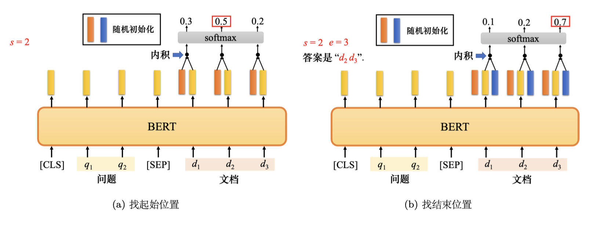

> [!TIP]
>
> 理论上，BERT 可以处理任意长度的输入序列，但实际上，由于计算复杂度限制，BERT 的最大输入长度为 512。对于超过此长度的文章，可以将其分段处理。

##### 训练 BERT 的挑战

训练BERT需要大量的计算资源和数据。例如，谷歌的原始BERT使用了30亿个词汇进行预训练，训练时间长达数天到数百天，具体取决于硬件配置。尽管训练BERT的过程非常耗时，但使用预训练的BERT模型进行微调只需短时间。

谷歌已经提供了预训练的BERT模型，通常没有必要自己从头开始训练BERT。主要的研究方向在于如何更有效地训练和微调模型，以提高性能和效率。

##### 序列到序列 (Seq2Seq) 预训练

为了处理Seq2Seq任务，可以使用预训练的编码器和解码器。

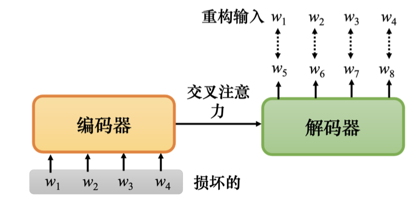

损坏输入句子，通过编码器进行处理，再由解码器还原原始句子。例如：

1. **输入扰动**：将输入句子进行掩码、删除单词或打乱顺序等操作。
2. **解码还原**：解码器输出还原后的句子。

这种方法训练一个Seq2Seq模型，使其能够更好地处理生成任务。

包括MASS、BART和T5等预训练模型，提出了不同的损坏和还原方法，并在大规模语料库上进行训练。特别是T5在C4语料库上进行了广泛的实验，探索了各种组合和方法，以提高预训练效果。

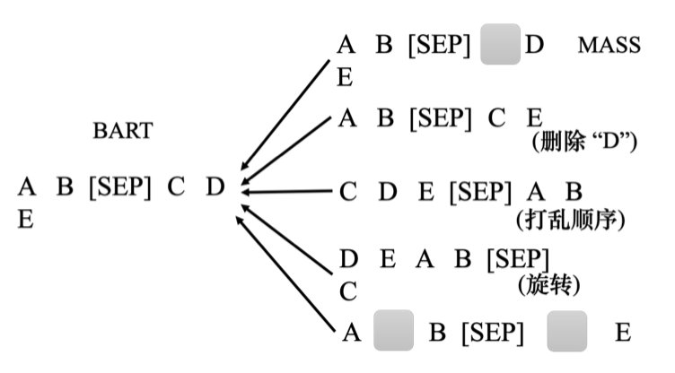

## 六、BERT 的作用和原理

BERT (Bidirectional Encoder Representations from Transformers) 是一种非常强大的自然语言处理模型。其核心在于能够生成每个词的上下文嵌入向量，这使得模型能够理解单词在不同上下文中的不同含义。

### 1、嵌入向量的意义

当输入一串文字时，BERT 会为每个字生成一个对应的向量，这个向量称为嵌入（embedding）。这个向量代表了输入字的意思。例如，输入“深度学习”时，模型输出4个向量，分别代表“深”、“度”、“学”和“习”的意思。

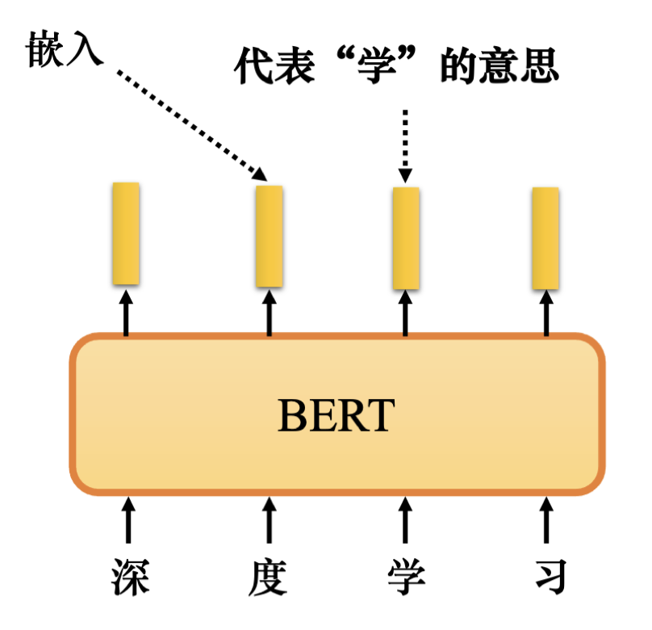

这些嵌入向量可以表示文字之间的相似性。意思相近的字，它们的向量距离会更接近。例如，“果”和“草”都是植物，所以它们的向量比较接近；而“鸟”和“鱼”都是动物，它们的向量也会比较接近。

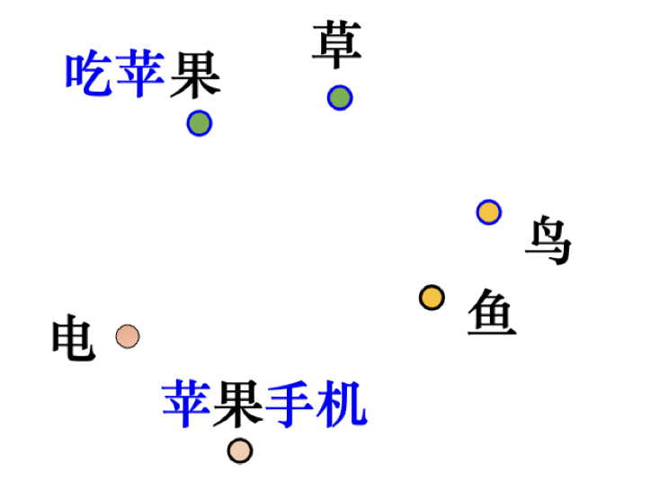

### 2、上下文对词义的影响

中文和很多其他语言一样，存在一字多义的现象。BERT 可以根据上下文生成不同的嵌入向量，从而准确捕捉单词在不同上下文中的不同含义。例如，“果”在“吃苹果”和“苹果手机”这两个句子中的含义不同，BERT 会生成不同的向量表示这两个“果”。

BERT 在训练时会通过掩码语言模型（Masked Language Model，MLM）来学习单词的上下文。具体来说，BERT 会随机掩盖输入句子中的一些词，然后让模型预测这些被掩盖的词。这种方法让 BERT 学会了从上下文中提取信息，并生成语境化的嵌入。

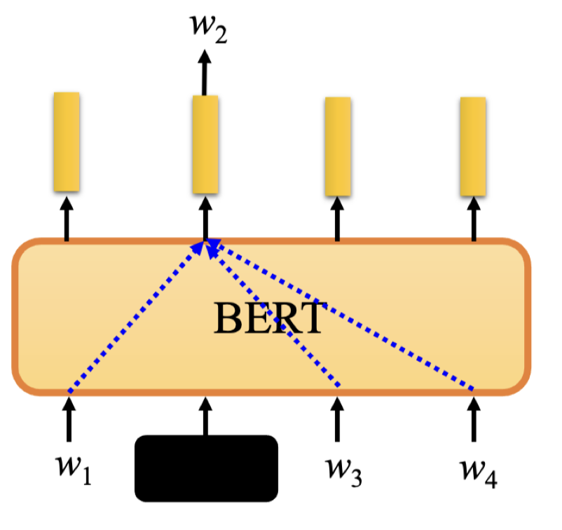

通过对比句子中同一个词的嵌入向量相似度，可以验证 BERT 对不同上下文的理解能力。例如，给定10个包含“果”字的句子，其中前5句的“果”指可吃的苹果，后5句的“果”指苹果公司。计算这些句子中“果”字嵌入向量的相似度，可以发现前5句的“果”相似度较高，后5句的“果”相似度也较高，但前后两组之间的相似度较低。这表明 BERT 能区分“果”在不同上下文中的不同含义。

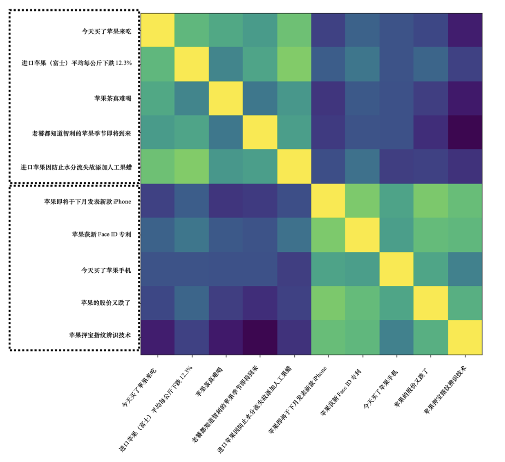

### 3、词嵌入的历史

BERT 的方法并不是第一个尝试上下文词嵌入的技术。在 BERT 之前，有一种称为连续词袋模型（Continuous Bag Of Words，CBOW）的技术，它通过预测被掩盖的词来生成词嵌入。CBOW 是一个简单的线性模型，而 BERT 则是它的深度学习版本，能够生成更复杂和语境化的词嵌入。

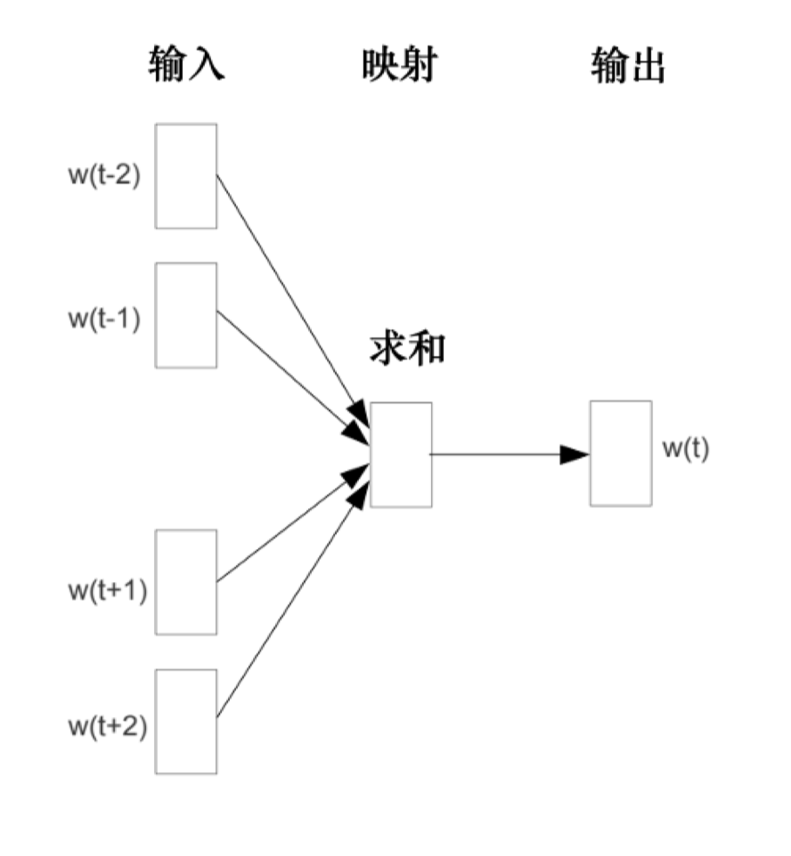

> [!TIP]
>
> **Q: 为什么连续词袋模型（CBOW）只用两个变换？能不能再复杂点？**
>
> **A:** 可以用更复杂的模型，但作者 Thomas Mikolov 选择线性模型是因为当时的计算能力有限，训练大模型比较困难。而 BERT 则是一个深度版本的连续词袋模型。

### 4、BERT 的应用

BERT 不仅适用于文字，还可以用于其他类型的数据，如蛋白质序列、DNA序列和音乐音符。对于DNA分类问题，可以将DNA序列中的每个碱基（A、T、C、G）对应到一个单词，然后使用 BERT 进行分类。

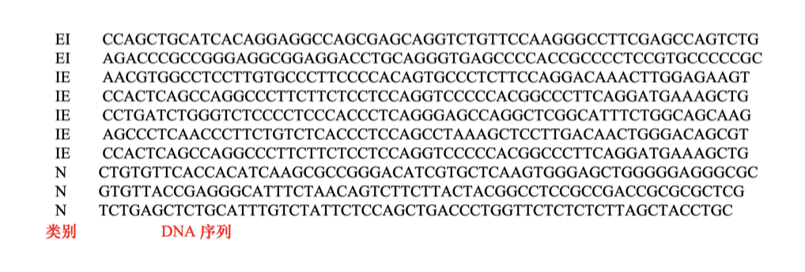

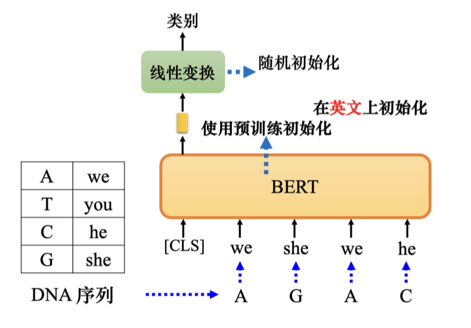

实验表明，使用 BERT 进行这些非文字数据的分类效果也非常好。

> [!TIP]
>
> **Q: 如果将 DNA 序列预处理成一个无意义的序列，BERT 的目的是什么？**
>
> **A:** 即使将 DNA 序列转换成无意义的单词序列，BERT 仍然可以很好地进行分类。BERT 的能力不仅在于理解语义，还可能在于提供了良好的初始化参数，使得训练大型模型更容易。

### 5、对BERT的进一步思考

虽然 BERT 能够生成代表单词语义的嵌入向量，但它的强大性能可能不完全源于它能理解语义。一种可能的解释是，BERT 提供了一组非常好的初始化参数，使得在训练大型模型时更容易达到好的效果。这些问题仍需要进一步研究来回答。

## 七、BERT的变种

BERT 有很多变种，其中多语言 BERT (multi-lingual BERT) 是一个重要的版本。多语言 BERT 使用多种语言进行训练，如中文、英文、德文、法文等。谷歌发布的多语言 BERT 使用了104种不同的语言进行训练，因此它可以处理这104种语言的任务。

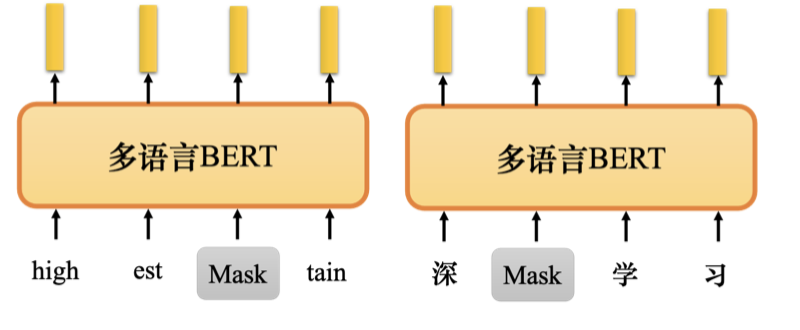

### 1、多语言 BERT 的神奇功能

一个神奇的现象是，多语言 BERT 即使只用英文问答数据训练，也能在中文问答任务中表现良好。例如，实验中使用了两个数据集进行微调：英文问答数据集SQuAD和台达电的中文数据集DRCD。在BERT提出之前，最强的模型是QANet，其F1分数为78.1%。但如果使用多语言BERT进行训练，即使只用英文数据集进行微调，它在中文问答测试集上的F1分数也能达到78%，这与QANet的表现差不多。

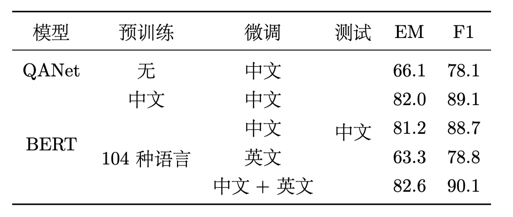

### 2、多语言 BERT 的工作原理

多语言 BERT 能够在不同语言间对齐相似的词汇嵌入。例如，对于意思相同的词，如“兔子”和“rabbit”，“跳”和“jump”，它们的嵌入向量非常接近。这个对齐可以通过平均倒数排名 (Mean Reciprocal Ranking, MRR) 来验证。MRR 的值越高，表示不同语言的嵌入对齐得越好。谷歌发布的104种语言的多语言 BERT 在 MRR 上的表现非常好，说明它能够有效地对齐不同语言的词汇。

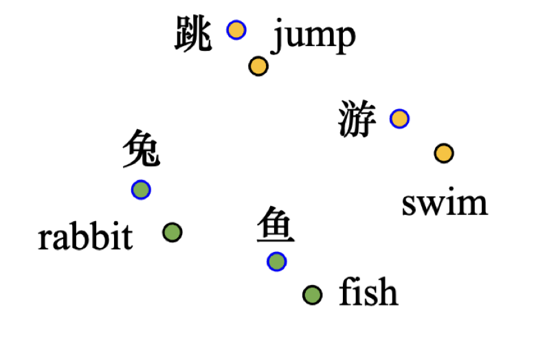

### 3、数据量的重要性

在多语言 BERT 的训练中，数据量是关键因素。李宏毅团队最初使用每种语言20万个句子进行训练，结果并不理想。后来他们增加了每种语言的数据量到1000K，结果显著改善。这说明，足够的数据量对于多语言模型的成功至关重要。

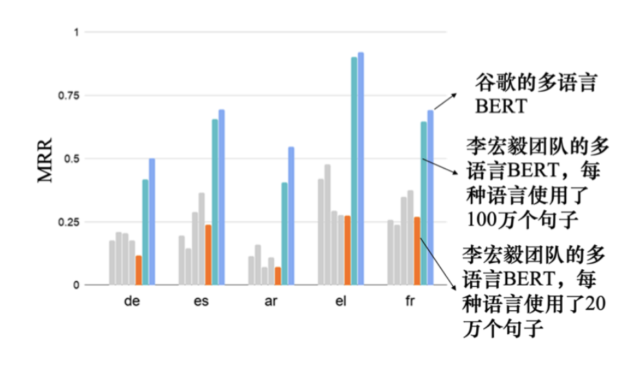

### 4、多语言 BERT 的语言区分能力

虽然多语言 BERT 可以对齐不同语言的词汇，但它仍然能区分不同的语言。训练多语言 BERT 时，给它英文句子，它会用英文填空；给它中文句子，它会用中文填空。这表明它知道语言信息的存在，并不会混淆不同语言的符号。

例如，给多语言 BERT 一个英文句子，它会生成英文嵌入。把所有英文单词的嵌入平均起来，再把所有中文单词的嵌入平均起来，两者的差距表示了中文和英文之间的差别。多语言 BERT 可以通过调整向量来实现不同语言间的转换。

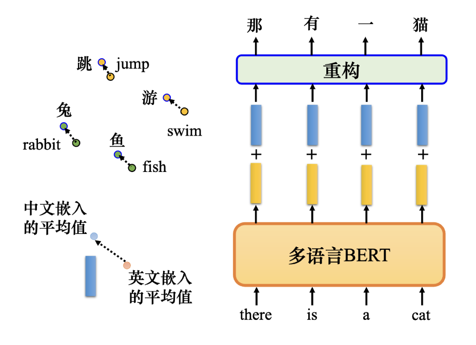

### 5、无监督翻译

多语言 BERT 还能实现一定程度的无监督翻译。比如，把一个英文句子输入多语言 BERT，再加上中文和英文嵌入的差异向量，它会认为输入的是中文句子，并可以生成相应的中文嵌入。这种方法可以实现无监督的词元级翻译，尽管不是完美的翻译，但也显示了多语言 BERT 的潜力。

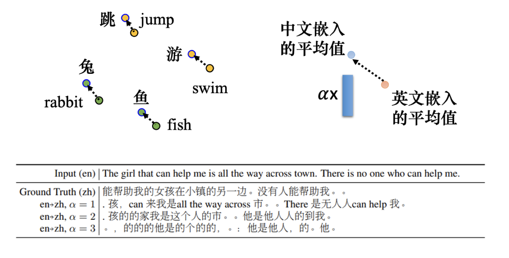