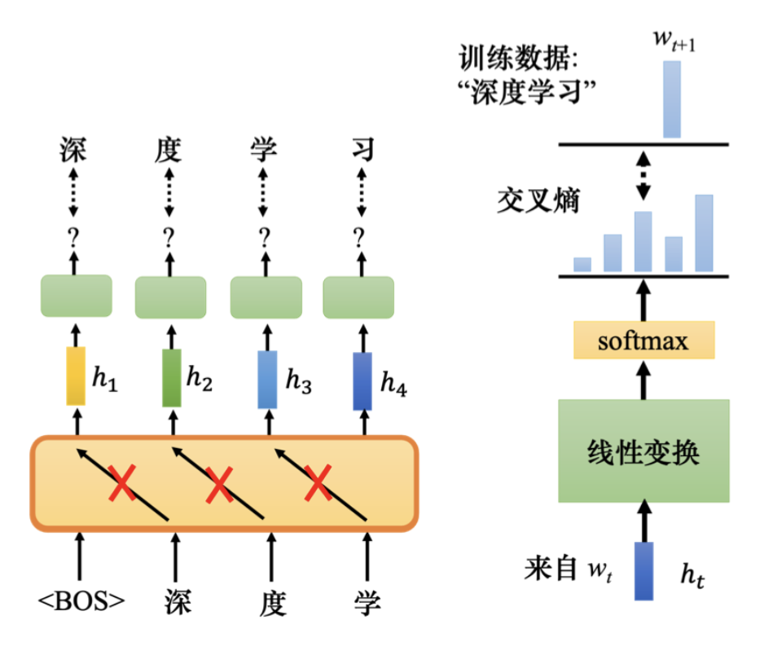
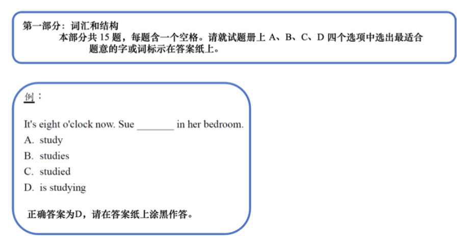
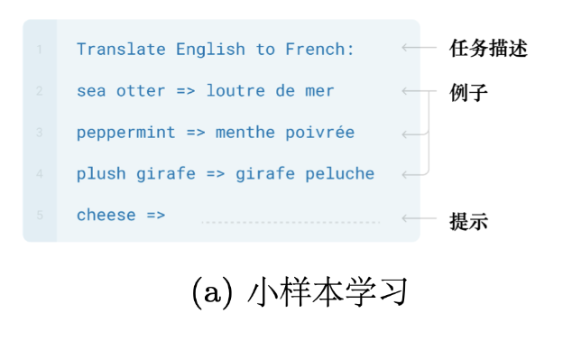
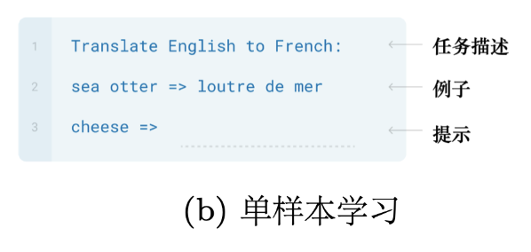
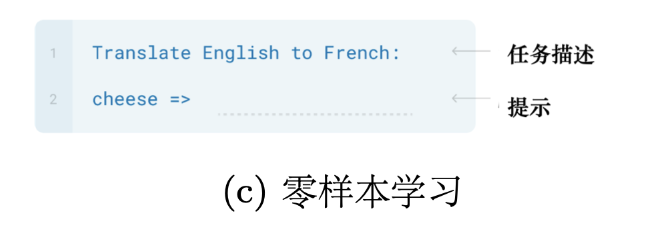
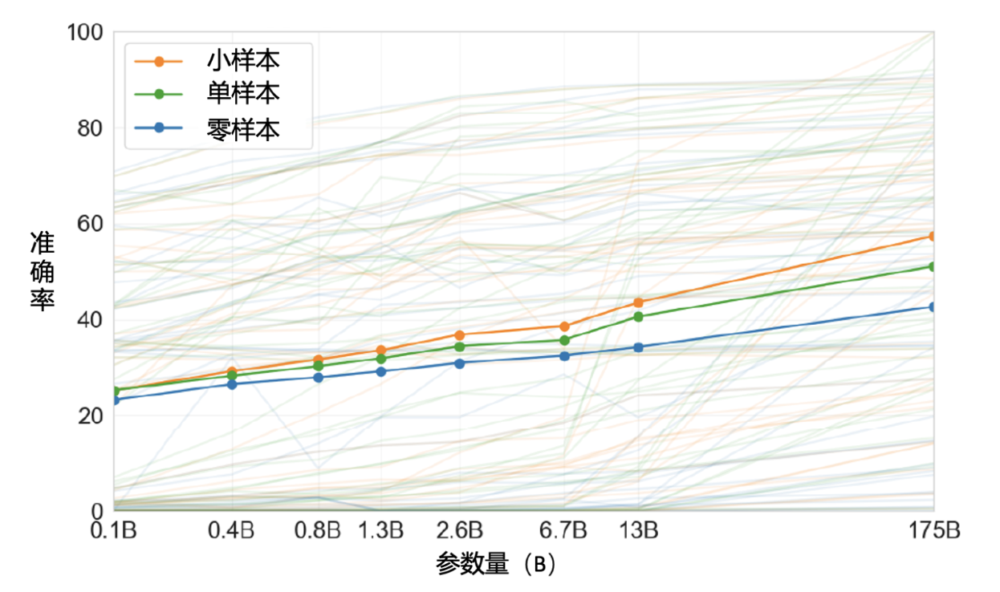
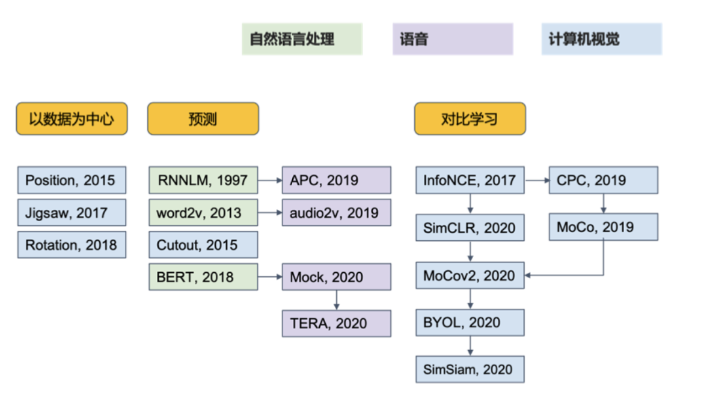

在自监督学习中，除了 BERT 系列，还有一个非常著名的模型——GPT 系列。BERT 的任务是填空，而 GPT 的任务是预测接下来会出现的词元。

如下图所示，假设训练数据中有一个句子是“深度学习”。给 GPT 输入词元 $<BOS>$（beginning of sentence），GPT 会输出一个嵌入（embedding）。接下来用这个嵌入去预测下一个词元。在这个例子中，根据训练数据，下一个词元应该是“深”。训练模型时，根据 $<BOS>$ 的嵌入，GPT 要输出词元“深”。

## 一、操作步骤

对一个嵌入 $h$ 进行线性变换，再进行 softmax 操作可以得到一个分布。与一般分类问题类似，输出的分布与正确答案的交叉熵（cross entropy）越小越好，即要预测下一个词元。

继续以“深度学习”为例，给 GPT 输入 $<BOS>$ 和“深”，它产生嵌入，然后预测下一个词元是“度”。如此反复，给它 $<BOS>$、 “深”和“度”，预测下一个词元是“学”，再输入 $<BOS>$、 “深”“度”和“学”，下一个词元是“习”。

实际上，GPT 是用大量的句子训练的。GPT 建立在 Transformer 的解码器基础上，但它会做 mask 的注意力。在给定 $<BOS>$ 预测“深”时，不会看到接下来的词汇。给 GPT “深”预测“度”时，也不会看到接下来的词汇。因为 GPT 可以预测下一个词元，它有生成的能力，可以不断预测下一个词元，产生完整的文章。

## 二、应用实例

GPT 最著名的例子是写了一篇关于独角兽的假新闻，声称在安第斯山脉发现了独角兽。GPT 可以将一句话补完，用在下游任务上，如问答或其他自然语言处理任务。

GPT 和 BERT 可以采用类似的方法。BERT 是在 Transformer 编码器后接一个线性分类器，GPT 也可以接一个分类器，但 GPT 的模型太大，微调可能很困难。

## 三、小样本学习

如下图所示，假设考生在进行托福听力测验，有一个题目的说明，让考生从 A/B/C/D 四个选项中选出正确答案。给一个范例，看到新问题后，考生可以举一反三作答。我们希望 GPT 系列也能进行小样本学习（few-shot learning）。

小样本学习即在少量样本上的快速学习能力。每类只有 $k$ 个标注样本，如果 $k = 1$，称为单样本学习（one-shot learning）；如果 $k = 0$，称为零样本学习（zero-shot learning）。

假设要 GPT 做翻译，如下图所示，先输入“把英语翻译成法语（Translate English to French）”，然后给它几个范例，接下来输入“cheese”，希望它产生翻译结果。在训练时，GPT 并未教它做翻译，只是学习补全前半段的文字。输入前半段的文字，让它翻译即可。

GPT 的小样本学习不涉及梯度下降，训练时也没有调 GPT 模型参数。这种训练称为语境学习（in-context learning），与一般学习不同。

## 四、单样本与零样本学习

我们可以给 GPT 更大的挑战，如下图所示，考托福听力测验时，只给一个例子，让 GPT 进行单样本学习。

更进一步，如下图所示，直接给它一个叙述，让 GPT 自行理解并翻译，即零样本学习。如果 GPT 能做到这一点，将非常惊人。

GPT 系列是否达成这一目标见仁见智。虽然它不是完全不可能答对，但正确率较低。

## 五、实验结果

如下图所示，纵轴是正确率，第 3 代 GPT（GPT-3）测试了 42 个任务。三条实线分别代表小样本、单样本和零样本在 42 个任务中的平均正确率。横轴代表模型的大小，从 1 亿参数到 1750 亿参数。小样本部分的平均正确率从 20% 提高到 50% 以上。对于某些任务，GPT-3 表现不错，如加减法；但对于逻辑推理等任务，结果不如人意。

## 六、自监督学习的应用

如下图所示，自监督学习不仅用于文字，还可用于语音和计算机视觉（Computer Vision，CV）。自监督学习的技术很多，BERT 和 GPT 系列只是其中一种，属于预测类。计算机视觉中的典型模型有 SimCLR 和 BYOL。在语音领域，也可以训练语音版的 BERT，通过填空题或预测下一部分声音信号。

在自然语言处理领域，有 GLUE 语料库，用于评估模型表现。语音领域有类似的基准语料库——语言处理通用性能基准（Speech processing Universal PERformance Benchmark，SUPERB），包含 10 个任务，评估模型识别内容、说话者、语气和语义的能力。还有一个工具包——s3prl，包含各种自监督学习模型，用于语音下游任务。因此，自监督学习不仅能用于自然语言处理，还能用于计算机视觉和语音。