在介绍自编码器（autoencoder）之前，我们先简单回顾一下自监督学习的框架。

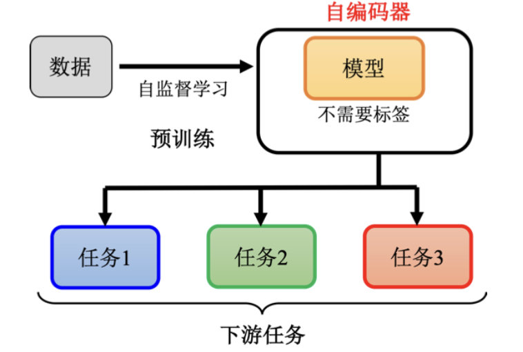

自监督学习利用大量的无标注数据，通过设计一些不需要标注数据的任务（如填空题或预测下一个词元）来训练模型。这种训练过程称为预训练。尽管这些模型（如BERT或GPT）在预训练任务中没有直接应用价值，但它们可以用于其他下游任务中。

在有BERT或GPT模型之前，还有一种更早期的、不需要标注数据的任务：自编码器。因此，自编码器可以看作一种自监督学习的预训练方法。

## 一、自编码器的概念

自编码器的基本结构包括两个网络：编码器和解码器。编码器将输入（例如一张图片）转换成一个向量，而解码器则将这个向量重新转换回图片。训练的目标是使编码器的输入与解码器的输出尽可能接近，这个过程称为重构（reconstruction）。

自编码器的工作原理类似于Cycle GAN模型，两者都希望输入经过两次转换后与原始输入尽可能接近。自编码器的输出称为嵌入（也称为表示或编码），它通常是一个低维度的向量。通过这种降维方法，我们可以用更少的维度表示高维数据，这对后续任务处理非常有用。

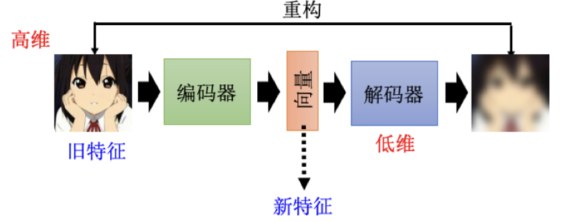

## 二、为什么需要自编码器?

自编码器在将高维图片压缩为低维向量时，帮助我们发现图片变化的有限性。例如，对于一张3×3的图片，我们可以用二维向量来表示它的有限变化。这种降维的过程使得复杂的数据变得更简单，从而在后续任务中需要较少的训练数据。

自编码器并不是一个新的概念，早在2006年，深度学习之父Hinton就提出了自编码器的概念。那时，由于网络结构不成熟，人们认为深度神经网络难以训练，因此采用受限玻尔兹曼机（RBM）技术分层训练。虽然RBM技术现在很少使用，但它在当时是必要的。

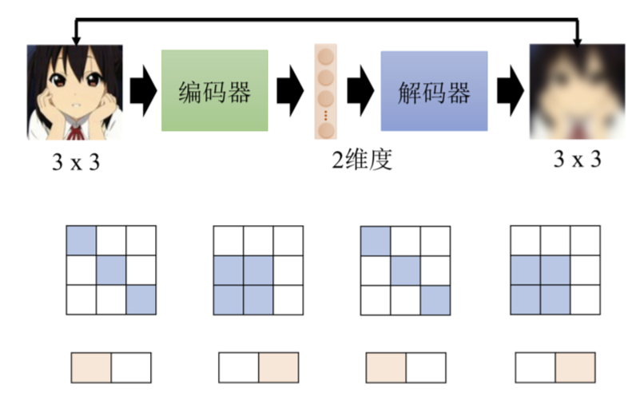

## 三、去噪自编码器

去噪自编码器（denoising autoencoder）是自编码器的一种变体。其输入是加入噪声的图片，而输出则是去噪后的图片。这样，编码器和解码器不仅要重构原图，还要学会去除噪声。

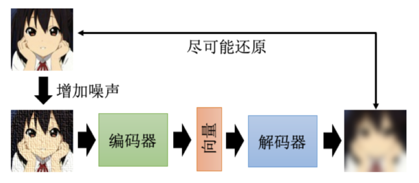

去噪自编码器的思想也可以应用于BERT模型中，输入的掩码实际上是一种噪声，BERT模型需要去还原被掩码的词。

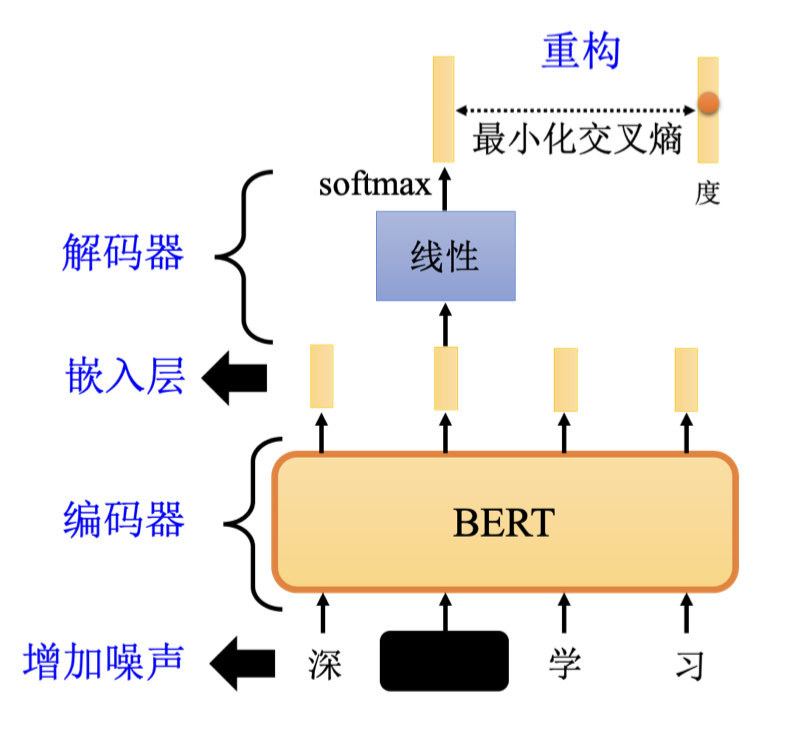

## 四、自编码器应用之特征解耦

自编码器可以用于特征解耦（feature disentanglement），即将纠缠在一起的特征分离。例如，将语音信号中的内容和说话者特征分离开来。通过训练自编码器，我们可以将复杂的信息压缩到低维向量中，并解耦不同的特征。

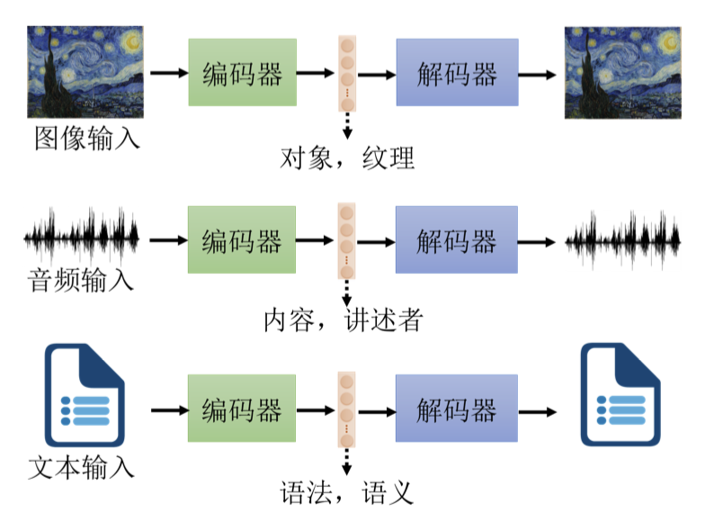

特征解耦可以应用于语音转换，即将一个人的声音转换成另一个人的声音。通过训练一个自编码器，了解编码器输出的哪些维度代表内容，哪些维度代表声音特征，就可以实现声音转换。

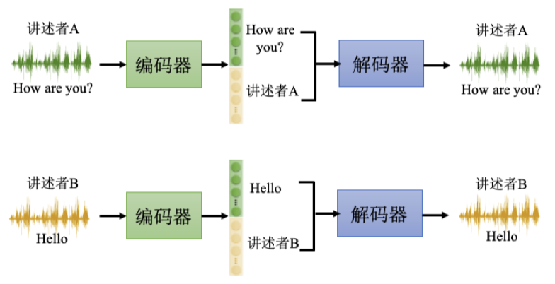

## 五、自编码器应用之离散隐表征

自编码器不仅可以用于连续隐表征，还可以用于离散隐表征。传统的嵌入通常是一个向量，由一串实数组成，但嵌入也可以是其他形式，例如二进制或独热向量（one-hot vector）。

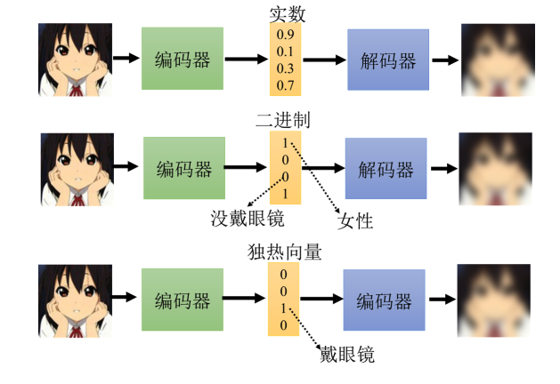

### 1、二进制隐表征

在二进制隐表征中，每个维度可以表示某种特征的有无。例如，对于输入的一张图片，如果是女生，第一维是1；如果是男生，第一维是0；如果戴眼镜，第三维是1；如果不戴眼镜，第三维是0。这样，嵌入由0和1组成，更易于解释编码器的输出。

### 2、独热向量隐表征

独热向量是一种特殊的二进制向量，其中只有一维是1，其他都是0。例如，在手写数字识别任务中，可以将图片输入自编码器，并强迫中间的隐表征为独热向量。如果编码维度为10，那么每个独热向量就对应一个数字，从而实现无监督分类。

### 3、向量量化变分自编码器 (VQ-VAE)

向量量化变分自编码器是离散隐表征技术中的一种知名方法。其基本原理是：输入一张图片后，编码器输出一个连续向量。然后，通过与一个码本（包含一排向量）计算相似度，选择最相似的向量作为编码。这个码本中的向量是通过学习得到的。

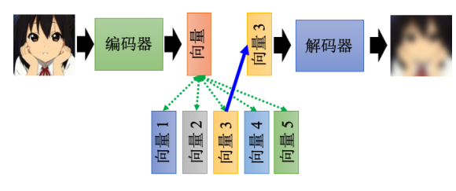

将这个过程类比自注意力机制，编码器输出的向量作为查询（query），码本中的向量作为键（key）。然后选取最相似的向量，将其作为解码器的输入。这种方法确保解码器的输入是离散的，即只能是码本中的某一个向量。

例如，如果码本中有32个向量，解码器的输入就只有32种可能。这种离散隐表征可用于语音信号处理，学习到最基本的发音单位，如音标或拼音。

### 4、文本隐表征

自编码器的嵌入形式不仅限于向量，也可以是一段文字。假设我们要处理一篇文章，可以将其输入编码器，生成一段文字作为隐表征，再通过解码器还原原文。这段文字隐表征可能就是文章的摘要。

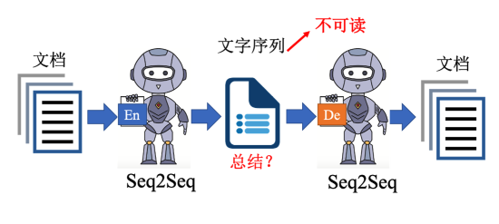

这种方法需要使用Seq2Seq模型，如Transformer。编码器输入文章，输出一段文字；解码器输入这段文字，输出文章。这种自编码器在训练时只需要大量的未标注数据。

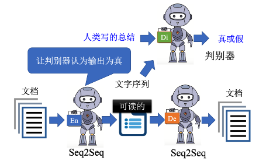

然而，训练中编码器和解码器可能会发明自己的“暗号”，生成的文字虽然解码器能理解，但人类无法看懂。这时，可以借助生成对抗网络（GAN）的概念，添加一个判别器来区分机器生成的句子和人类句子。编码器要生成既能被解码器还原的句子，又能骗过判别器，使得生成的文字看起来像人类写的摘要。

为了训练这样的网络，可以采用强化学习方法。类似于CycleGAN，通过生成器和判别器的对抗，使得输入和输出尽可能接近。这样，我们可以从自编码器的角度来看待CycleGAN的思路。

## 六、自编码器的其他应用

自编码器不仅仅用于编码和解码，还可以用于更多的实际应用。我们已经了解了编码器的重要性，但解码器在很多情况下也扮演着重要角色。

### 1、生成模型

如下图所示，自编码器的解码器可以单独作为一个生成器来使用。生成器的功能是输入一个向量，输出一个特定的东西，比如一张图片。变分自编码器（Variational Autoencoder, VAE）就是利用解码器进行生成的一种模型。

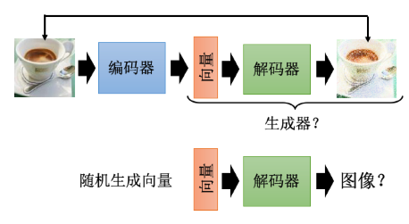

在VAE中，我们从一个已知的分布（例如高斯分布）中采样一个向量，然后将其输入解码器，看看解码器能否生成一张图片。VAE不仅仅是将自编码器中的解码器拿出来使用，它还包含了一些其他的机制，具体细节可以参考相关文献。

### 2、压缩

自编码器还可以用于数据压缩，如下图所示。在处理图片时，如果图片太大，可以采用一些压缩方法，比如JPEG压缩。类似地，自编码器也可以用于压缩，将编码器的输出视为压缩结果。

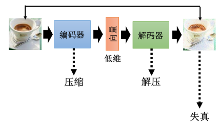

一张图片通常是一个高维向量，而编码器的输出是一个低维向量，可以看作是压缩结果。编码器的功能就是压缩数据，而解码器的功能就是解压缩数据。然而，自编码器实现的是有损压缩，即在压缩和解压缩过程中会有一定的失真。这种失真类似于JPEG图片压缩时的失真。
