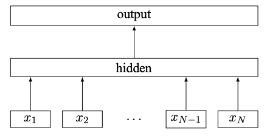

FastText的词向量模型是一个高效的学习单词及其子词单元表示的方法。它是基于神经网络的词嵌入技术，与Word2Vec相似，但最大的区别在于FastText不仅考虑整个单词，还考虑其内部的字符级n-grams。

## 一、子词嵌入
FastText的核心在于对每个单词采用其构成的字符n-grams来捕捉词形和词义的内在联系。这种方法特别适合处理形态丰富的语言（如德语或芬兰语），可以更好地处理和理解这些语言中词汇的派生和变形。

### 1. 子词选择
- **定义**：n-gram是指从给定样本的序列中提取的n个连续项目的集合。对于词向量，这些项目是字符。
- **示例**：对于单词"where"，如果设置n的范围为3到6，其n-grams可能包括：<wh, whe, wher, where, here, ere, re>，加上边界符号：<where>。

### 2. 向量表示
- 每个n-gram都有一个关联的向量，单词的向量是其所有n-grams的向量的总和或平均。
- 这种表示方法使得模型能够共享不同单词中相似n-grams的表示，从而有效地学习罕见词或未知词的语义信息。

## 二、训练过程
FastText的训练与Word2Vec类似，特别是使用Skip-gram模型时。在Skip-gram模型中，目标是使用当前单词预测上下文中的单词，而FastText将此拓展到子词级别。

FastText的词向量训练过程可以分为以下几个步骤：数据预处理、构建n-gram表示、模型架构、训练目标与优化方法。

### 1. 数据预处理

在训练FastText词向量模型之前，需要对原始文本数据进行预处理。预处理的步骤通常包括：

- **分词**：将文本划分为独立的单词或标记。
- **去除停用词**：移除如“the”、“and”等对训练没有帮助的常见单词。
- **去除标点符号和特殊字符**：清理文本中的无关符号。
- **小写转换**：将所有单词转换为小写，以减少单词的多样性。

### 2. 构建n-gram表示

FastText的核心思想是利用子词信息。具体而言，它将每个单词拆分为字符级别的n-gram，并将这些n-gram用于训练。

- **n-gram范围**：设定一个范围，比如3到6，表示将单词拆分为3到6个字符的子词。
- **生成n-grams**：对于每个单词，生成所有可能的n-gram。例如，单词“where”可以生成以下n-grams：
  - bigram（2-gram）：<w, wh, he, er, re>
  - trigram（3-gram）：<wh, whe, her, ere>
  - 四元gram（4-gram）：<whe, wher, here, ere>
  - 五元gram（5-gram）：<wher, where, here>

每个单词的最终表示将包括其所有n-gram的表示。

### 3. 模型架构

FastText通常采用Skip-gram模型架构，但与Word2Vec略有不同，FastText的输入层不仅是单词，还包括其子词n-grams。

- **输入层**：由目标单词及其n-grams的向量表示构成。
- **隐藏层**：一个线性变换层，将输入向量映射到隐藏层表示。
- **输出层**：用于预测上下文单词，通常采用分层softmax来加速训练过程。

### 4. 训练目标与优化方法

#### （1）Skip-gram模型

FastText使用Skip-gram模型进行训练，其目标是最大化给定目标单词预测其上下文单词的概率。具体步骤如下：

- **目标函数**：最大化目标单词与其上下文单词的共现概率。对于每对目标-上下文单词对，计算其条件概率。

- **负采样（Negative Sampling）**：为了加速训练过程，FastText采用负采样方法，即不仅最大化正确的目标-上下文对的概率，还最小化随机采样的负样本对的概率。

#### （2）训练过程

**Step1：初始化**：初始化所有单词和n-gram的向量表示，通常为随机值。

**Step2：前向传播**：

- 将目标单词及其n-grams的向量加和，得到目标单词的表示。
- 将目标单词的表示通过线性变换映射到隐藏层。
- 使用softmax计算目标单词与上下文单词之间的条件概率。

**Step3：后向传播**：

- 计算目标单词与实际上下文单词的损失，以及与负样本对的损失。
- 使用梯度下降法更新所有单词和n-gram的向量表示。

### 5. 模型评估

- **词相似度测试**：通过计算词向量的余弦相似度，评估词向量表示的质量。
- **下游任务表现**：将训练好的词向量应用于下游任务，如文本分类、命名实体识别等，评估其在实际应用中的效果。

## 三、优化方法

在训练FastText词向量时，有两种主要的优化方法：分层softmax（Hierarchical Softmax）和负采样（Negative Sampling）。这些方法的目的是加速训练过程并提高模型的效率。分层softmax通过构建霍夫曼树减少了softmax的计算复杂度，而负采样通过选择少量负样本简化了训练过程。这两种方法都极大地提高了训练速度，使得FastText在处理大规模数据集时表现出色。

### 1. 分层softmax（Hierarchical Softmax）

#### （1）什么是softmax？

在词向量模型中，我们通常使用softmax函数来计算一个单词出现在上下文中的概率。然而，当词汇量很大时，计算softmax的代价非常高，因为它需要计算词汇表中每个单词的概率。这就是分层softmax的用武之地。

#### （2）分层softmax如何工作？

分层softmax通过构建一个霍夫曼树（Huffman Tree）来减少计算复杂度。霍夫曼树是一种二叉树，频率高的单词离根节点更近，频率低的单词离根节点更远。

#### （3）具体步骤

**Step1：构建霍夫曼树**：

首先计算词汇表中每个单词的频率。

根据这些频率构建霍夫曼树，频率高的单词会更靠近根节点，频率低的单词会更靠近叶节点。

**Step2：计算路径**：

每个单词在霍夫曼树中都有一个唯一的路径，从根节点到该单词的叶节点。

这条路径可以用一系列的0和1表示，表示在每个节点上选择左子树（0）还是右子树（1）。

**Step3：概率计算**：

对于每个单词，计算其路径上每个节点的概率，这样只需要计算路径上的节点数量（远少于词汇表大小）的概率，从而减少计算量。

#### （4）优点

- 分层softmax大大减少了每次计算softmax的复杂度，从$O(V)$（V是词汇表大小）降到$O(log V)$。
- 适用于大词汇表的情况，使得训练速度显著加快。

### 2. 负采样（Negative Sampling）

#### （1）什么是负采样？

负采样是一种简化softmax计算的方法。它通过为每个正样本（实际存在的目标-上下文对）随机采样一些负样本（不相关的目标-上下文对）来近似最大化目标函数。这种方法只需要计算少量的负样本的概率，而不是整个词汇表的概率。

#### （2）负采样如何工作？

##### 具体步骤：

**Step1：选择正样本**：

- 对于每个目标单词，选取其实际出现的上下文单词作为正样本。

**Step2：采样负样本**：

- 从词汇表中随机选择一些单词作为负样本，这些负样本不应该出现在目标单词的上下文中。
- 采样时，通常根据词频进行加权采样，频率高的单词被选中的概率更大。

**Step3：计算损失**：

- 对于每个正样本，计算其损失函数（通常是logistic回归损失）。
- 对于每个负样本，也计算其损失函数，并通过这种方式更新模型参数。

**Step4：更新模型**：

- 使用梯度下降法更新目标单词及其上下文单词的向量表示。

#### （3）优点

- 负采样极大地简化了计算过程，只需要处理少量的负样本，而不是整个词汇表。
- 适用于大规模数据集，尤其在处理超大词汇表时，训练速度显著提高。

#### （4）示例

假设我们有一个目标单词"cat"，其上下文单词是"sat"。我们选择"sat"作为正样本，然后随机选择三个负样本，例如"dog"、"tree"和"car"。

- 正样本对："cat" -> "sat"
- 负样本对："cat" -> "dog"、"cat" -> "tree"、"cat" -> "car"

我们会计算这些对的损失，并更新"cat"的向量表示，使其与"sat"更加接近，与负样本更加远离。

## 四、优点与实际应用
- **对罕见词的处理**：通过子词信息，FastText可以为在训练集中很少或根本没有出现的单词生成向量。
- **快速和高效**：通过子词表示，即使是大规模词汇集也能快速训练。
- **跨语言能力**：子词信息帮助模型更好地处理形态学丰富的语言，也有助于跨语言学习和理解。

FastText词向量模型通过其创新的使用子词信息，为自然语言处理领域带来了新的视角和工具，尤其是在处理形态丰富的语言和大规模文本数据方面显示出其独特优势。

## 五、FastText文本分类

FastText不仅可以用来训练词向量，还可以用于文本分类任务。

### 1. 模型架构



FastText的文本分类模型结构相对简单，通常由以下几部分组成：

- **输入层**：文本输入，通常是一个句子或文档。
- **嵌入层**：将输入文本中的单词转换为低维词向量。
- **隐藏层**：将词向量进行平均或求和得到文档向量。
- **输出层**：通过softmax或sigmoid函数预测文本类别。

具体步骤

1. **输入文本**：将每个输入文本（例如，一个句子）分成单词。
2. **嵌入表示**：将每个单词映射到一个固定维度的嵌入向量。
3. **文档向量**：通过平均或求和所有单词的嵌入向量得到文档向量。
4. **分类层**：将文档向量输入到一个线性分类器，输出为类别概率分布。

### 2. 数据准备

在进行文本分类之前，需要对原始数据进行预处理和准备。

#### （1）数据格式

FastText需要特定的数据格式进行训练：

- **训练数据**：每行表示一个样本，格式为`__label__<label> <text>`。例如：
  ```
  __label__positive I love this product! It's fantastic.
  __label__negative This is the worst purchase I've ever made.
  ```

- **测试数据**：格式与训练数据相同，但通常不带有标签。

#### （2）数据预处理

- **分词**：将文本划分为独立的单词或标记。
- **去除停用词**：移除对分类无帮助的常见单词。
- **去除标点符号和特殊字符**：清理文本中的无关符号。
- **小写转换**：将所有单词转换为小写，以减少单词的多样性。

### 3. 训练过程

#### （1）步骤1：词向量表示

将每个单词映射到一个固定维度的嵌入向量。可以使用预训练的词向量或随机初始化。

#### （2）步骤2：计算文档向量

对于每个文档，将其所有单词的嵌入向量进行平均或求和，得到文档的向量表示。

#### （3）步骤3：线性分类器

使用一个线性分类器将文档向量映射到类别概率分布。通常采用softmax函数来计算类别概率。

#### （4）步骤4：损失函数

使用交叉熵损失函数来衡量预测类别与真实类别之间的差距。交叉熵损失函数的公式为：
$$
\text{Loss} = - \sum_{i=1}^{N} y_i \log(\hat{y}_i)
$$
其中，$ y_i $是真实类别的独热编码，$ \hat{y}_i $是预测的类别概率。

#### （5）步骤5：优化

使用随机梯度下降（SGD）或其他优化算法（如Adam）来最小化损失函数，更新模型参数。

### 4. 优化方法

#### （1）分层softmax（Hierarchical Softmax）

当类别数量很多时，可以使用分层softmax来加速训练。分层softmax通过构建霍夫曼树来减少计算复杂度，将计算量从O(C)降低到O(log C)，其中C是类别数量。

#### （2）负采样（Negative Sampling）

负采样可以简化计算过程，通过采样少量负样本来近似最大化目标函数。适用于类别较多的情况。

### 5. 评估方法

#### （1）准确率（Accuracy）

准确率是分类任务中最常用的评估指标。计算公式为：
$$
\text{Accuracy} = \frac{\text{正确预测的样本数}}{\text{总样本数}}
$$


#### （2）精确率（Precision）、召回率（Recall）和F1-score

这些指标在不平衡数据集上尤其重要。

- **精确率（Precision）**：预测为正类的样本中，实际为正类的比例。
$$
\text{Precision} = \frac{\text{TP}}{\text{TP + FP}} 
$$

- **召回率（Recall）**：实际为正类的样本中，被正确预测为正类的比例。
$$
\text{Recall} = \frac{\text{TP}}{\text{TP + FN}} 
$$

- **F1-score**：精确率和召回率的调和平均。
$$
\text{F1-score} = \frac{2 \times \text{Precision} \times \text{Recall}}{\text{Precision} + \text{Recall}}
$$

### 6、总结

FastText文本分类通过将输入文本转换为嵌入向量，并利用线性分类器进行预测。其训练过程简单高效，适用于大规模文本分类任务。通过使用分层softmax和负采样等优化方法，FastText可以在保持高准确率的同时，大幅减少计算复杂度，加快训练速度。在评估阶段，可以使用准确率、精确率、召回率和F1-score等指标来衡量模型的性能。