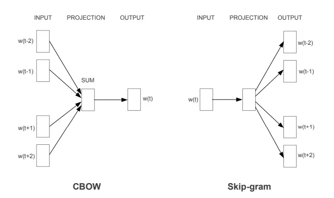
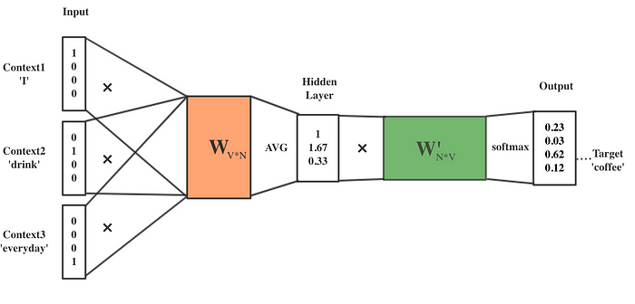
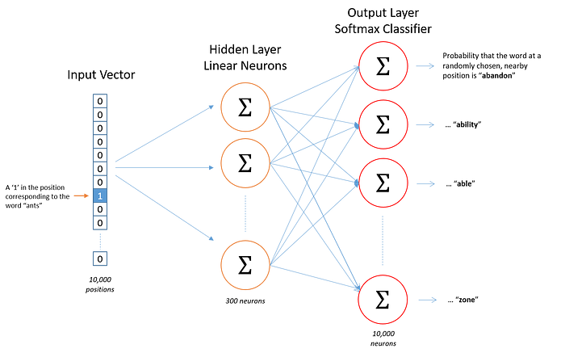

## 一、Word2Vec 简介

word2vec是由Google的研究团队成员Tomas Mikolov等人在2013年提出的，主要目的是通过一种高效的模型来训练词向量。这种模型的基本思想是，如果两个词在很多上下文中是相似的，那么它们的词向量也应该是相似的。例如，"香蕉"和"梨"这两个词可能在很多句子中出现在相似的上下文中，所以它们的词向量也会比较接近。

## 二、主要架构

word2vec模型有两种主要的架构：CBOW（Continuous Bag-of-Words）和Skip-gram。CBOW的目标是用上下文词汇来预测当前词，而Skip-gram则相反，用当前词来预测它的上下文词汇。

- **CBOW（Continuous Bag-of-Words）**：CBOW模型通过上下文词汇预测当前词，即用周围词汇去预测中心词。假设上下文窗口为3，这里的输入层由上下文词组成，通过投影层输出中心词。

- **Skip-Gram**：Skip-Gram模型通过当前词预测其上下文词汇，即用中心词去预测周围词汇。假设上下文窗口为3，这里的输入层由中心词组成，通过投影层输出上下文词。

## 三、CBOW 模型

### 1、模型概述

CBOW（Continuous Bag-of-Words）模型的核心思想是通过上下文词汇来预测当前词。具体来说，CBOW模型会根据一个词周围的词来预测这个词。在训练过程中，CBOW模型尝试最大化给定上下文词时中心词的概率。

### 2、数学公式

设输入词汇表为 $V$，上下文窗口大小为 $2c$，中心词为 $w_t$，上下文词为 $w_{t-c}, \dots, w_{t-1}, w_{t+1}, \dots, w_{t+c}$。CBOW模型的目标是最大化中心词 $w_t$ 的条件概率：

$$
P(w_t | w_{t-c}, \dots, w_{t-1}, w_{t+1}, \dots, w_{t+c}) 
$$
假设输入词的词向量为 $\mathbf{v}_{w_i}$，输出词的词向量为 $\mathbf{u}_{w_i}$，则该概率可以表示为：

$$
P(w_t | w_{t-c}, \dots, w_{t-1}, w_{t+1}, \dots, w_{t+c}) = \frac{\exp(\mathbf{u}_{w_t}^\top \mathbf{h})}{\sum_{w \in V} \exp(\mathbf{u}_w^\top \mathbf{h})} 
$$
其中，$\mathbf{h}$ 是上下文词向量的平均值：

$$
\mathbf{h} = \frac{1}{2c} \sum_{-c \leq j \leq c, j \neq 0} \mathbf{v}_{w_{t+j}}
$$

### 3、训练过程

CBOW模型的训练过程通常使用随机梯度下降法（SGD）或其他变种优化算法。在每一步训练过程中，模型通过以下步骤进行更新：

1. **输入层**：将上下文词映射到其对应的词向量，并计算其平均值 $\mathbf{h}$。
2. **隐藏层**：通过前向传播计算中心词的预测概率分布。
3. **输出层**：计算预测词与实际中心词之间的损失，通常使用交叉熵损失函数。
4. **反向传播**：通过反向传播算法更新输入词和输出词的词向量。

### 4、优缺点

**优点**：
- 在小数据集上训练速度较快，效果较好。
- 对高频词有较好的表现。

**缺点**：
- 由于只考虑上下文词的平均值，忽略了词序信息。
- 对低频词的表现可能较差。

## 四、Skip-gram 模型

### 1、模型概述

Skip-gram模型的核心思想是通过当前词来预测其上下文词汇。具体来说，Skip-gram模型会根据中心词来预测其周围的词。在训练过程中，Skip-gram模型尝试最大化给定中心词时上下文词的概率。

### 2、数学公式

设输入词汇表为 $V$，上下文窗口大小为 $2c$，中心词为 $w_t$，上下文词为 $w_{t-c}, \dots, w_{t-1}, w_{t+1}, \dots, w_{t+c}$。Skip-gram模型的目标是最大化上下文词 $w_{t+j}$ 的条件概率：

$$
P(w_{t+j} | w_t)
$$
对于每个上下文词 $w_{t+j}$，该概率可以表示为：

$$
 P(w_{t+j} | w_t) = \frac{\exp(\mathbf{u}_{w_{t+j}}^\top \mathbf{v}_{w_t})}{\sum_{w \in V} \exp(\mathbf{u}_w^\top \mathbf{v}_{w_t})}
$$

### 3、训练过程

Skip-gram模型的训练过程通常使用负采样（Negative Sampling）或层次Softmax（Hierarchical Softmax）来提高训练效率。在每一步训练过程中，模型通过以下步骤进行更新：

1. **输入层**：将中心词映射到其对应的词向量 $\mathbf{v}_{w_t}$。
2. **隐藏层**：通过前向传播计算上下文词的预测概率分布。
3. **输出层**：计算预测词与实际上下文词之间的损失，通常使用交叉熵损失函数。
4. **反向传播**：通过反向传播算法更新输入词和输出词的词向量。

### 4、优缺点

**优点**：
- 由于考虑了中心词与每个上下文词的关系，Skip-gram模型在稀疏数据上的表现更好。
- 对低频词有较好的表现。

**缺点**：
- 训练时间较长，尤其是在大数据集上。
- 对高频词的效果可能不如CBOW模型。

### 5、训练优化

在实际应用中，Skip-gram模型通常会使用以下两种优化技术来提高训练效率：

- **负采样（Negative Sampling）**：通过仅对少量负样本计算损失来近似原始的Softmax损失，从而加速训练。
- **层次Softmax（Hierarchical Softmax）**：通过构建Huffman树来表示词汇表，从而将计算复杂度从 $O(V)$ 降低到 $O(\log V)$。

## 五、总结

Word2Vec模型通过CBOW和Skip-gram两种不同的架构来学习词向量。CBOW模型通过上下文词预测中心词，而Skip-gram模型通过中心词预测上下文词。两种模型各有优缺点，在具体应用中可以根据数据集的特点和任务需求选择合适的模型。此外，通过使用负采样和层次Softmax等技术可以显著提高模型的训练效率。

## Reference

- [如何通俗理解Word2Vec](https://blog.csdn.net/v_JULY_v/article/details/102708459)
