到目前为止，模型的输入通常是一个向量，如下图所示。如果是回归问题，输出是一个标量；如果是分类问题，输出是一个类别。

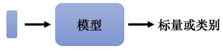

## 一、输入是向量序列的情况

在图像识别中，我们假设输入图像的大小是固定的。但在复杂问题中，如下图所示，输入可能是一组向量，且每次输入的序列长度都不一样。这种情况下如何处理呢？我们通过具体例子来讲解处理方法。

### 1、不同的输入例子

#### （1）文字处理

假设网络的输入是一个句子，每个句子的长度不一样（词汇数量不同）。将每个词汇描述成一个向量，这样模型的输入就是一个向量序列，且该序列的大小每次都不同。

最简单的词汇向量表示方法是独热编码，将每个词汇表示为一个长向量，该向量长度与词汇总数相等。例如，英文有十万个词汇，可以创建一个十万维的向量，每个维度对应一个词汇，如式（6.1）所示。但是这种方法有个严重问题，它假设所有词汇彼此间没有关系。比如，cat和dog都是动物，它们应该较为相似；而cat是动物，apple是植物，它们应较为不相似。但独热向量中无法体现这种关系，因为没有语义信息。
$$
\begin{align*}
\text{apple} & = [1, 0, 0, 0, 0, \ldots] \\
\text{bag} & = [0, 1, 0, 0, 0, \ldots] \\
\text{cat} & = [0, 0, 1, 0, 0, \ldots] \\
\text{dog} & = [0, 0, 0, 1, 0, \ldots] \\
\text{elephant} & = [0, 0, 0, 0, 1, \ldots] \\
\end{align*}
$$
除了独热编码，词嵌入（word embedding）也可以将词汇表示成向量。词嵌入通过一个向量来表示一个词汇，并包含语义信息。如下图所示，词嵌入后的向量可以在向量空间中显示出语义关系，例如动物词汇聚集在一起，植物词汇聚集在一起等。

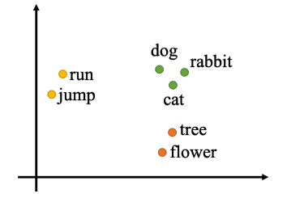

#### （2）声音信号处理

如下图所示，一段声音信号可以表示为一组向量。我们取一个范围（窗口）描述这段声音信号，窗口长度通常为25毫秒。每个窗口内的信息描述为一个向量，这个向量称为一帧（frame）。为了描述整段声音信号，我们将窗口向右移动，通常每次移动10毫秒。

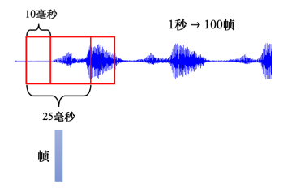

> [!NOTE]
>
> **Q: 为什么窗口长度是25毫秒，移动大小是10毫秒？A: 前人通过大量实验调试，发现这些参数值效果最理想。**
>
> 一段声音信号就是用一串向量来表示,而因为每一个窗口,他们往右移都是移动10 毫秒,所以一秒钟的声音信号有 100 个向量,所以一分钟的声音信号就有这个 100 乘以60,就有 6000 个向量。因此，语音信号非常复杂。

#### （3）图结构数据

一个图（graph）也可以表示为一组向量。社交网络是一个图，每个节点表示一个人，每个节点的信息（性别、年龄、工作等）可以用向量表示。因此，社交网络可以看作是一组向量组成的图。

在药物发现中，如下图所示，一个分子可以看作是一个图。每个分子是模型的输入，每个分子中的原子可以表示为独热向量，例如氢、碳、氧的独热向量如下公式所示。
$$
H = [1, 0, 0, 0, 0, \dots]\\

C = [0, 1, 0, 0, 0, \dots]\\

O = [0, 0, 1, 0, 0, \dots]\\
$$
这样，一个分子可以看作是由一组向量组成的图。

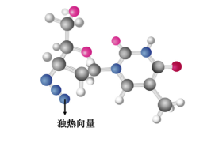

### 2、不同的输出例子

#### （1）输入与输出数量相同

模型的输入是一组向量，可能是文字、语音或图。输出有三种可能性，第一种是每个向量都有对应的标签。如下图所示，当模型输入是4个向量时，输出也是4个标签。如果是回归问题，每个标签是一个数值；如果是分类问题，每个标签是一个类别。在这种类型的问题中，输入和输出的长度相同，模型不需要担心输出多少标签。

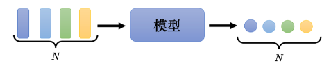

**输入和输出数量相同的示例：**

- **词性标注**（Part-Of-Speech tagging, POS tagging）：如下图所示，机器自动判定每个词汇的词性。例如句子"I saw a saw"中，第一个saw是动词，第二个saw是名词。这个任务的输入和输出长度相同，属于第一种类型的输出。

- **语音处理**：一段声音信号输入为一串向量，每个向量需要确定其对应的音标。这是语音识别的简化版。

- **社交网络分析**：给定一个社交网络，模型要决定每个节点的特性，例如某人是否会购买某商品，从而决定是否推荐商品。

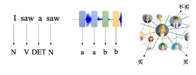

#### （2）输入是一个序列，输出是一个标签

第二种可能的输出，如下图所示，整个序列只需要输出一个标签。

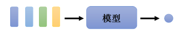

**输出是标签的示例：**

- **文字处理**：情感分析是一种典型的应用。情感分析是给机器一段话，模型判断这段话是积极（positive）还是消极（negative）。这一技术在实际中非常有用。例如，公司上线新产品后想了解网友的评价，但不可能逐条分析留言。使用情感分析，机器可以自动判断提到某产品的贴文是积极还是消极，从而了解产品在网友心中的评价。

- **语音处理**：给机器听一段声音，模型决定这段声音是谁讲的。这种任务的输入是一个序列（声音信号），输出是一个标签（讲话者的身份）。

- **图处理**：例如，给定一个分子，预测该分子的亲水性。输入是表示分子结构的一组向量，输出是一个标签（亲水性强或弱）。

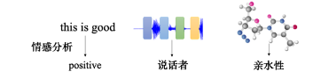

#### （3）序列到序列

第三种可能的输出是：我们不知道应该输出多少个标签，机器要自己决定输出多少个标签。如下图所示，输入是$N$个向量，输出可能是$N′$个标签，$N′$由机器决定。这种任务被称为序列到序列的任务。

**序列是序列的示例：**

- **翻译**：翻译是典型的序列到序列任务。输入和输出是不同语言，词汇数量不一定相同。例如，将一个句子从英文翻译成中文，输入和输出的词汇数量可能不同。

- **语音识别**：真正的语音识别任务也是序列到序列任务。输入是一句话的声音信号，输出是对应的文字。这类任务需要机器根据输入序列自行决定输出序列的长度。

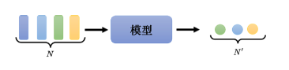

## 二、序列到序列模型

序列到序列模型的输入和输出都是一个序列。输入与输出序列长度之间的关系有两种情况：

1. 输入和输出的长度一样。
2. 机器决定输出的长度。

序列到序列模型有广泛的应用，通过这些应用可以更好地了解该模型。

## 三、常见应用

### 1、语音识别、机器翻译与语音翻译

序列到序列模型的常见应用包括：

- **语音识别**：输入是声音信号，输出是对应的文字。输入声音信号的长度是$T$，无法根据$T$确定输出的长度$N$。机器决定输出的长度。

- **机器翻译**：输入是一个语言的句子，输出是另一个语言的句子。输入句子的长度是$N$，输出句子的长度是$N'$。两者的关系由机器决定。

- **语音翻译**：直接将听到的声音信号翻译成另一种语言的文字。用于处理没有文字的语言。

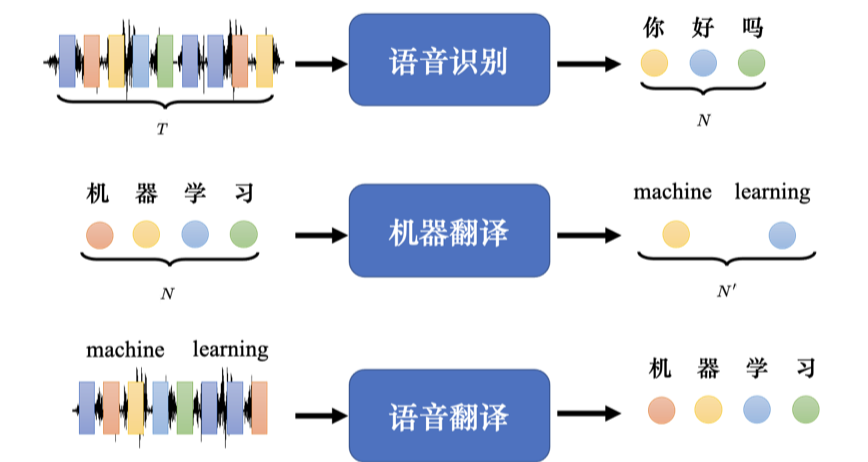

> [!TIP]
>
> **Q:** 既然把语音识别系统跟机器翻译系统接起来就能达到语音翻译的效果,那么为什么要做语音翻译? 
>
> **A:** 世界上很多语言是没有文字的,无法做语音识别。因此需要对这些语言做语音翻译, 直接把它翻译成文字。

例子：闽南语的语音识别，因为闽南语文字不普及，直接输出白话文。通过下载YouTube上乡土剧的闽南语语音和白话文字幕来训练模型，输入闽南语，输出白话文。

### 2、语音合成

语音合成（Text-To-Speech, TTS）是输入文字、输出声音信号。目前的模型通常分为两阶，如闽南语的语音合成，先将白话文的文字转成闽南语拼音，再将拼音转成声音信号。后者通过序列到序列模型实现。

### 3、聊天机器人

聊天机器人的输入输出都是文字，文字是一个向量序列，所以可以用序列到序列模型来训练。例如，收集大量对话数据（如电视剧、电影台词），教机器对“Hi”的输入输出“Hello! How are you today?”。

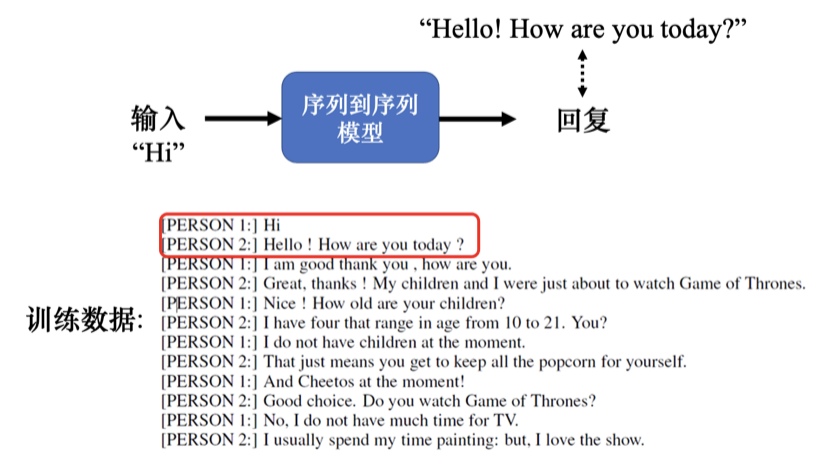

### 4、问答任务

序列到序列模型在自然语言处理中的应用广泛，许多任务可以看作问答（Question Answering, QA）任务：

- **翻译**：输入一个英语句子，问题是德文翻译是什么，输出答案是德文。
- **自动摘要**：输入一篇文章，问题是摘要是什么。
- **情感分析**：输入一个句子，判断是正面还是负面。

问答任务是给机器读一段文字，问问题，希望机器给出正确答案。输入一个序列，输出一个序列的任务都可以用序列到序列模型解决。然而，定制化模型往往能得到更好结果。例如，谷歌 Pixel 4 手机用于语音识别的模型是RNN-Transducer模型。

### 5、句法分析

句法分析（syntactic parsing）任务中，输入是一段文字，输出是一个句法树（syntactic tree）。句法树可以转成一个序列，用序列到序列模型做句法分析。参考论文“Grammar as a Foreign Language”。

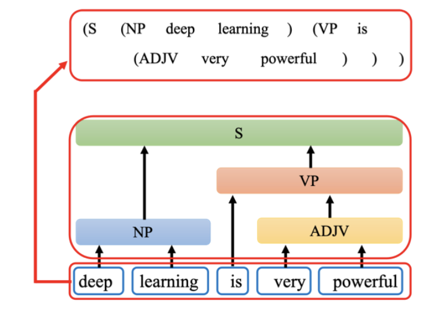

### 6、多标签分类

多标签分类（multi-label classification）任务也可以用序列到序列模型。例如文章分类，同一篇文章可能属于多个类。

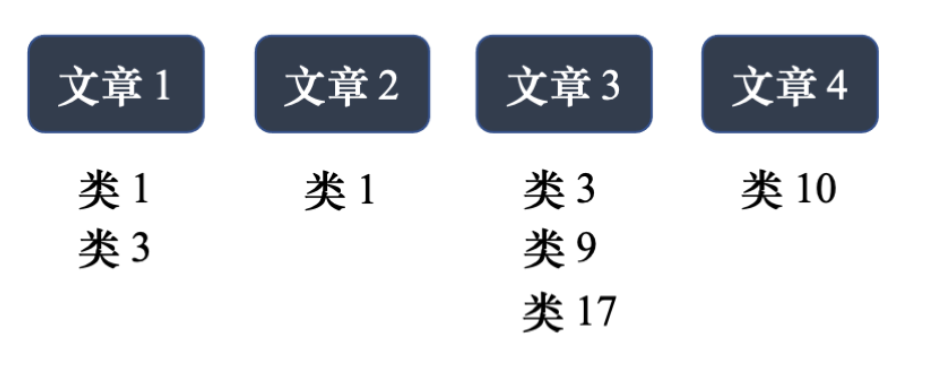

多标签分类问题不同于多分类问题，因为每篇文章对应的类别数量不同。需要用序列到序列模型解决，输入一篇文章，输出类别，机器决定输出类别的数量。例如，目标检测问题也可以用序列到序列模型解决，参考论文“End-to-End Object Detection with Transformers”。

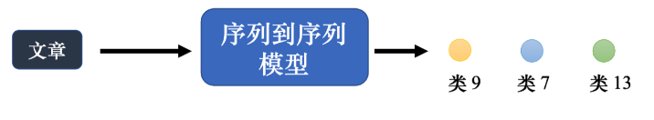

## 四、序列到序列模型训练常用技巧

接下来介绍下训练序列到序列模型的一些技巧。

### 1、复制机制

第一个技巧是复制机制（copy mechanism）。对很多任务而言，解码器没有必要自己创造输出，其可以从输入的东西里面复制一些东西。以聊天机器人为例，用户对机器说：“你好，我是库洛洛”。机器应该回答：“库洛洛你好，很高兴认识你”。机器其实没有必要创造“库洛洛”这个词汇，“库洛洛”对机器来说一定会是一个非常怪异的词汇，所以它可能很难在训练数据里面出现，可能一次也没有出现过，所以它不太可能正确地产生输出。但是假设机器在学的时候，学到的并不是它要产生“库洛洛”，它学到的是看到输入的时候说“我是某某某”，就直接把“某某某”复制出来，说“某某某你好”。这种机器的训练会比较容易，显然比较有可能得到正确的结果，所以复制对于对话任务可能是一个需要的技术。机器只要复述这一段它听不懂的话，它不需要从头去创造这一段文字，它要学的是从用户的输入去复制一些词汇当做输出。

在做摘要的时候，我们可能更需要复制的技巧。做摘要需要搜集大量的文章，每一篇文章都有人写的摘要，训练一个序列到序列的模型就结束了。要训练机器产生合理的句子，通常需要百万篇文章，这些文章都要有人标的摘要。在做摘要的时候，很多的词汇就是直接从原来的文章里面复制出来的，所以对摘要任务而言，从文章里面直接复制一些信息出来是一个很关键的能力。最早有从输入复制东西的能力的模型叫做指针网络（pointer network），后来还有一个变形叫做复制网络（copy network）。

### 2、引导注意力

序列到序列模型有时候训练出来会产生莫名其妙的结果。以语音合成为例，机器念4次的“发财”，重复4次没问题，但叫它只念一次“发财”，它把“发”省略掉只念“财”。也许在训练数据里面，这种非常短的句子很少，所以机器无法处理这种非常短的句子。这个例子并没有常出现，用序列到序列学习出来，语音合成没有这么差。类似于语音识别、语音合成这种任务最适合使用引导注意力。因为像语音识别，很难接受，我们讲一句话，识别出来居然有一段机器没听到。或者像语音合成这种任务，输入一段文字，语音合出来居然有一段没有念到。引导注意力要求机器在做注意力的时候有固定的方式。对语音合成或语音识别，我们想像中的注意力应该就是由左向右。如下图所示，红色的曲线来代表注意力的分数，越高就代表注意力的值越大。以语音合成为例，输入就是一串文字，合成声音的时候，显然是由左念到右。所以机器应该是先看最左边输入的词汇产生声音，再看中间的词汇产生声音，再看右边的词汇产生声音。如果做语音合成的时候，机器的注意力是颠三倒四的，它先看最后面，接下来再看前面，再胡乱看整个句子，显然这样的注意力是有问题的，没有办法合出好的结果。因此引导注意力会强迫注意力有一个固定的样貌，如果我们对这个问题本身就已经有理解，知道对于语音合成这样的问题，注意力的位置都应该由左向右，不如就直接把这个限制放进训练里面，要求机器学到注意力就应该要由左向右。

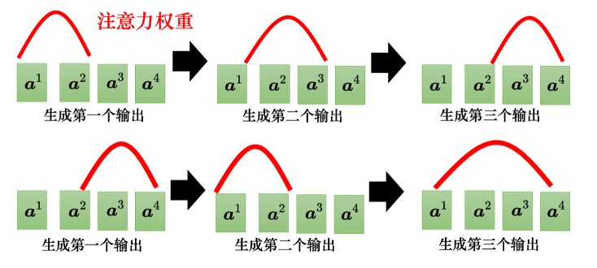

### 3、束搜索

如下图所示，假设解码器就只能产生两个字$$A$$和$$B$$，假如世界上只有两个字$$A$$跟$$B$$，即词表$$V = \{A, B\}$$。对解码器而言，每一次在第一个时间步（time step），它在$$A$$、$$B$$里面决定一个。比如解码器可能选$$B$$当作输入，再从$$A$$、$$B$$中选一个。在上文中，每一次解码器都是选分数最高的那一个。假设$$A$$的分数是0.6，$$B$$的分数是0.4，解码器的第一次就会输出$$A$$。

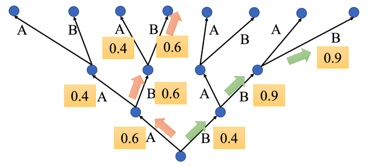

接下来假设$$B$$的分数为0.6，$$A$$的分数为0.4，解码器就会输出$$B$$。再假设把$$B$$当做输入，现在输入已经有$$A$$、$$B$$，接下来$$A$$的分数是0.4，$$B$$的分数是0.6，解码器就会选择输出$$B$$。因此输出就是$$A$$、$$B$$、$$B$$。这种每次找分数最高的词元来当做输出的方法称为贪心搜索（greedy search），其也被称为贪心解码（greedy decoding）。红色路径就是通过贪心解码得到的路径。

但贪心搜索不一定是最好的方法，第一步可以先稍微舍弃一点东西，第一步虽然$$B$$是0.4，但先选$$B$$。选了$$B$$，第二步时$$B$$的可能性就大增就变成0.9。到第三步时，$$B$$的可能性也是0.9。绿色路径虽然第一步选了一个较差的输出，但是接下来的结果是好的。比较下红色路径与绿色路径，红色路径第一步好，但全部乘起来是比较差的，绿色路径一开始比较差，但最终结果其实是比较好的。

如何找到最好的结果是一个值得考虑的问题。穷举搜索（exhaustive search）是最容易想到的方法，但实际上并没有办法穷举所有可能的路径，因为每一个转折点的选择太多了。对中文而言，中文有4000个字，所以树每一个地方的分叉都是4000个可能的路径，走两三步以后，就会无法穷举。

接下来介绍下束搜索（beam search），束搜索经常也称为集束搜索或柱搜索。束搜索是用比较有效的方法找一个近似解，在某些情况下效果不好。比如论文“The Curious Case Of Neural Text Degeneration”。这个任务要做的事情是完成句子（sentence completion），也就是机器先读一段句子，接下来它要把这个句子的后半段完成，如果用束搜索，会发现说机器不断讲重复的话。如果不用束搜索，加一些随机性，虽然结果不一定完全好，但是看起来至少是比较正常的句子。有时候对解码器来说，没有找出分数最高的路，反而结果是比较好的，这个就是要看任务本身的特性。假设任务的答案非常明确，比如语音识别，说一句话，识别的结果就只有一个可能。对这种任务而言，通常束搜索就会比较有帮助。但如果任务需要机器发挥一点创造力，束搜索比较没有帮助。

### 4、加入噪声

在做语音合成的时候，解码器加噪声，这是完全违背正常的机器学习的做法。在训练的时候会加噪声，让机器看过更多不同的可能性，这会让模型比较鲁棒，比较能够对抗它在测试的时候没有看过的状况。但在测试的时候居然还要加一些噪声，这不是把测试的状况弄得更困难，结果更差。但语音合成神奇的地方是，模型训练好以后。测试的时候要加入一些噪声，合出来的声音才会好。用正常的解码的方法产生出来的声音听不太出来是人声，产生出比较好的声音是需要一些随机性的。对于语音合成或句子完成任务，解码器找出最好的结果不一定是人类觉得最好的结果，反而是奇怪的结果，加入一些随机性的结果反而会是比较好的。

### 5、使用强化学习训练

接下来还有另外一个问题，我们评估的标准用的是 BLEU（BiLingual Evaluation Understudy）分数。虽然 BLEU 最先是用于评估机器翻译的结果，但现在它已经被广泛用于评价许多应用输出序列的质量。解码器先产生一个完整的句子，再去跟正确的答案一整句做比较，拿两个句子之间做比较算出 BLEU 分数。但训练的时候，每一个词汇是分开考虑的，最小化的是交叉熵，最小化交叉熵不一定可以最大化 BLEU 分数。但在做验证的时候，并不是挑交叉熵最低的模型，而是挑 BLEU 分数最高的模型

。一种可能的想法：训练的损失设置成 BLEU 分数乘一个负号，最小化损失等价于最大化 BLEU 分数。但 BLEU 分数很复杂，如果要计算两个句子之间的 BLEU 分数，损失根本无法做微分。我们之所以采用交叉熵，而且是每一个中文的字分开来算，就是因为这样才有办法处理。遇到优化无法解决的问题，可以用强化学习训练。具体来讲，遇到无法优化的损失函数，把损失函数当成强化学习的奖励，把解码器当成智能体，可参考论文“Sequence Level Training with Recurrent Neural Networks”。

### 6、计划采样

如下图所示，测试的时候，解码器看到的是自己的输出，因此它会看到一些错误的东西。但是在训练的时候，解码器看到的是完全正确的，这种不一致的现象叫做曝光偏差（exposure bias）。

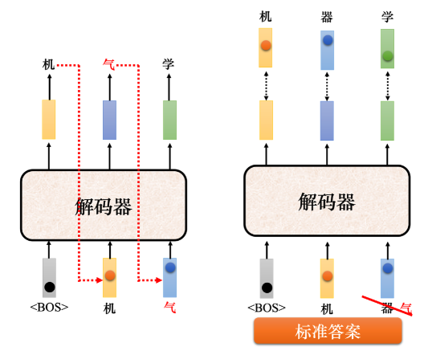

假设解码器在训练的时候永远只看过正确的东西，在测试的时候，只要有一个错，就会一步错步步错。因为解码器从来没有看过错的东西，它看到错的东西会非常的惊奇，接下来它产生的结果可能都会错掉。有一个可以的思考的方向是：给解码器的输入加一些错误的东西，不要给解码器都是正确的答案，偶尔给它一些错的东西，它反而会学得更好，这一技巧称为计划采样（scheduled sampling），它不是学习率调整（schedule learning rate）。很早就有计划采样，在还没有 Transformer、只有 LSTM 的时候，就已经有计划采样。但是计划采样会伤害到 Transformer 的平行化的能力，所以 Transformer 的计划采样另有招数，其跟原来最早提在这个 LSTM 上被提出来的招数也不太一样。读者可参考论文“Scheduled Sampling for Transformers”、“Parallel Scheduled Sampling”。

## 五、截断自注意力

自注意力的应用非常广泛，在自然语言处理（Natural Language Processing, NLP）领域，除了 Transformer，BERT 也使用了自注意力。因此，自注意力在自然语言处理中的应用是大家较为熟悉的。然而，自注意力不仅限于自然语言处理，它也可以应用于许多其他领域。例如，在语音处理任务中，也可以使用自注意力。但在将自注意力用于语音处理时，可以对其进行一些改动。

举个例子，如果要把一段声音信号表示成一组向量，这些向量可能会非常长。在进行语音识别时，把声音信号表示成一组向量，每一个向量只代表 10 毫秒的音频长度。所以，如果是 1 秒钟的声音信号，就有 100 个向量；5 秒钟的声音信号就有 500 个向量。随便说一句话，就可能产生上千个向量。因此，描述一段声音信号的向量序列长度通常是非常大的。

**非常大的长度会造成什么问题呢？**

在计算注意力矩阵时，其复杂度是向量序列长度的平方。假设该矩阵的长度为 $$L$$，计算注意力矩阵 $$A'$$ 需要进行 $$L \times L$$ 次内积运算。如果 $$L$$ 的值很大，计算量就非常庞大，并且需要很大的内存（memory）来存储该矩阵。比如，在语音识别中，处理一句话可能产生的注意力矩阵可能会太大，以至于不易处理和训练。

**截断自注意力（Truncated Self-Attention）** 可以处理向量序列长度过大的问题。具体而言，截断自注意力在计算时不考虑整个句子，而是只关注一个小的范围，这个范围是人工设定的。在进行语音识别时，如果要辨识某个位置的音标或内容，实际上并不需要考虑整句话的所有信息，只需要关注该位置及其前后一定范围内的信息即可。

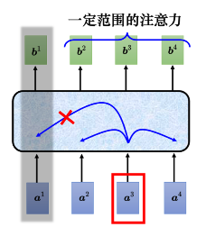

通过这种方式，截断自注意力能够加快运算速度，使得处理长序列时变得更加高效。这就是截断自注意力的主要思想和应用。

## 六、自注意力与卷积神经网络对比

自注意力不仅可以用于自然语言处理（NLP）任务，也可以应用于图像处理任务。下面我们将对自注意力和卷积神经网络（CNN）进行比较，重点介绍它们在图像处理中的应用以及各自的优缺点。

### 1、自注意力在图像上的应用

自注意力不仅适用于 NLP 领域，也可以用在图像上。如下图（a）所示，一张分辨率为 $$5 \times 10$$ 的图像（下图（b））可以表示为一个大小为 $$5 \times 10 \times 3$$ 的张量（下图（b）），其中 3 代表 RGB 三个通道（channel）。每一个位置的像素可以看作是一个三维向量，因此整张图像可以看作是 $$5 \times 10$$ 个向量的序列。因此，图像也可以被视为一个向量序列，完全可以使用自注意力机制来处理图像。

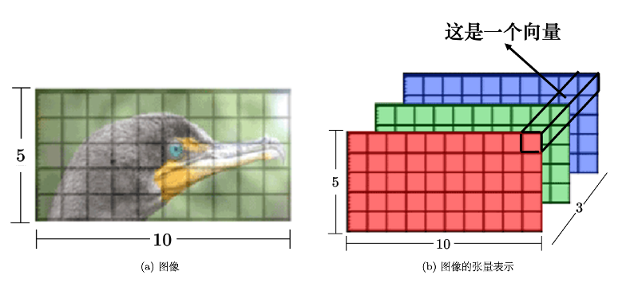

自注意力在图像处理中的应用可以参考以下论文：
- **“Self-Attention Generative Adversarial Networks”**
- **“End-to-End Object Detection with Transformers”**

### 2、自注意力与卷积神经网络的对比

自注意力与卷积神经网络之间有一些关键的差异和联系。

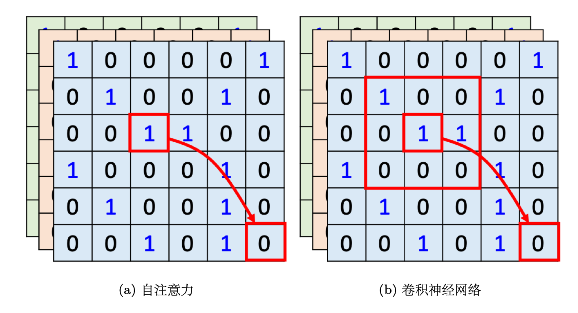

上图（a）展示了使用自注意力处理图像时的场景，假设红色框内的“1”是当前要处理的像素，这个像素会产生查询（query），其他像素产生键（key）。在进行内积运算时，考虑的是整张图像的信息。

上图（b）展示了卷积神经网络（CNN）处理图像的方式。在 CNN 中，每一个滤波器（filter）或神经元只考虑其感受野（receptive field）范围内的信息。

通过比较，我们可以看到：
- **卷积神经网络（CNN）**：可以看作是自注意力的一个简化版本，因为它只考虑感受野内的信息。感受野的大小是人为设定的。
- **自注意力**：考虑整个图像的信息，感受野的形状由网络自动决定。因此，自注意力具有更高的灵活性和表达能力。

在自注意力中，感受野的范围不是固定的，而是由网络学习得出的。这使得自注意力能够自动选择要关注的像素，而不是依赖于人工设定的感受野大小。

**关于自注意力与卷积神经网络的关系**，可以参考以下论文：
- **“On the Relationship between Self-attention and Convolutional Layers”**：这篇论文使用数学方法严谨地说明了卷积神经网络是自注意力的特例。

自注意力可以通过设计和限制变成卷积神经网络，因此自注意力可以被看作是比卷积神经网络更灵活的模型，而卷积神经网络则是受限制的自注意力。

### 3、自注意力与卷积神经网络的实际应用

**谷歌的论文 “An Image is Worth 16x16 Words: Transformers for Image Recognition at Scale”** 中，将自注意力应用于图像处理，将一张图像划分为 $$16 \times 16$$ 个图像块（patch），每个图像块被看作是一个“字”（word）。下图展示了训练数据量对自注意力和卷积神经网络效果的影响。

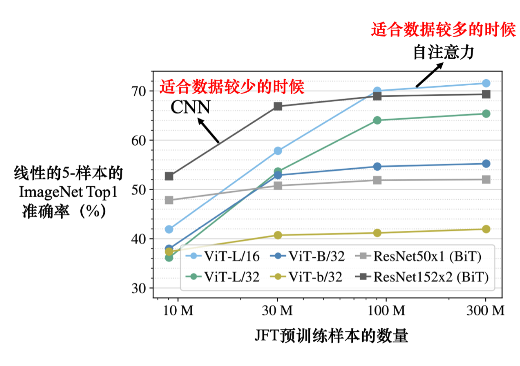

- **数据量少**时：卷积神经网络可能表现更好。
- **数据量多**时：自注意力的效果会逐渐超越卷积神经网络。

上图中展示了不同训练数据量下自注意力与卷积神经网络的表现：
- **浅蓝色线**：自注意力的效果
- **深灰色线**：卷积神经网络的效果

随着数据量的增加，自注意力的效果逐渐优于卷积神经网络，但在数据量少的情况下，卷积神经网络可能会有更好的效果。自注意力由于其更大的弹性，需要更多的训练数据来避免过拟合。

### 4、自注意力与卷积神经网络的选择

**Q: 自注意力与卷积神经网络应该选哪一个？**

**A:** 实际上可以同时使用自注意力和卷积神经网络。例如，在 **Conformer** 结构中，结合了自注意力和卷积神经网络的优点来完成任务。

## 七、自注意力与循环神经网络对比

我们来比较一下自注意力机制与循环神经网络（RNN）。当前，循环神经网络的很多应用都可以用自注意力机制来取代。自注意力机制和循环神经网络都用于处理输入是一个序列的状况。

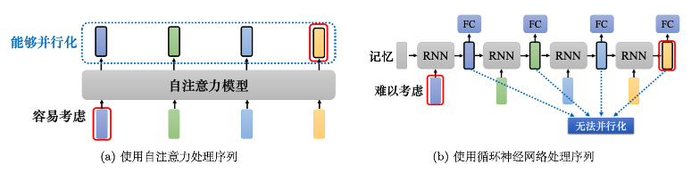

### 1、循环神经网络（RNN）

在循环神经网络中，输入序列经过一个隐状态的向量进行处理，然后通过一个RNN块来生成新的隐状态向量，最终这些隐状态向量被输入到全连接网络中进行预测。在RNN中，隐状态存储了历史信息，可以看作一种记忆。每当新的向量作为输入时，前一个时间点的输出也会作为输入参与到当前的计算中。具体来说，输入第二个向量时，前一个时间点的输出会与当前的输入一起被送入RNN进行处理；输入第三个向量时，当前的输入和前一个时间点的输出再次一起被处理，依此类推，直到处理完所有的输入向量。这样，RNN逐步处理整个序列，从而产生最终的输出。

### 2、自注意力机制

自注意力机制则不同于RNN。在自注意力机制中，输入的每一个向量都会考虑整个输入序列中的所有其他向量的信息。具体来说，自注意力机制计算查询（Query）、键（Key）和值（Value）之间的关系来生成每一个位置的新表示。每个位置的表示都包含了对整个序列的关注信息，然后这些信息被送入全连接网络进行处理。自注意力机制的显著特点是它能够同时处理整个序列的信息，从而高效地捕捉到序列中各个位置之间的关系。

### 3、自注意力与RNN的主要区别

自注意力机制和RNN在处理序列数据时有着显著的不同。首先，自注意力机制在生成每一个向量时考虑了整个输入序列的信息，而RNN中的每一个隐状态向量只考虑了之前输入的向量信息，没有直接考虑未来的信息。然而，RNN可以通过双向RNN（Bi-RNN）来考虑整个输入序列的信息，但即使是双向RNN，其信息传递仍然是逐步进行的，因此在处理长序列时可能会遇到信息遗忘的问题。

自注意力机制则没有这种问题。它通过计算全局的注意力分数，能够从整个输入序列中提取信息，理论上可以从很远的位置获取信息，这使得它在处理长距离依赖问题时表现得更为高效。

### 4、计算复杂度与并行处理

计算复杂度是自注意力机制与RNN之间的另一个重要区别。RNN的计算是逐步进行的，这意味着它在处理序列数据时无法进行并行计算，因此在长序列上计算速度较慢。自注意力机制则可以对整个序列进行并行处理，这使得它在运算速度上通常比RNN更为高效。

具体来说，RNN的计算复杂度为 $O(T)$，其中 $T$ 是序列的长度。而自注意力机制的计算复杂度为 $O(T²)$，因为它需要计算序列中所有位置对之间的关系。在空间复杂度方面，自注意力机制需要存储整个注意力矩阵，因此在处理大规模数据时可能会面临较高的内存需求。

### 5、自注意力在图中的应用

自注意力机制不仅可以应用于序列数据，也可以扩展到图数据中。在图中，每一个节点可以表示成一个向量，边则表示节点之间的关系。当把自注意力机制应用于图数据时，我们可以利用图的边来直接定义节点之间的关系，而不需要依靠网络自行学习这些关系。在计算注意力矩阵时，只需要考虑有边相连的节点之间的关系，而将没有边的节点之间的注意力分数设为0。这样的自注意力应用于图数据时，实际上就是一种图神经网络（GNN）。

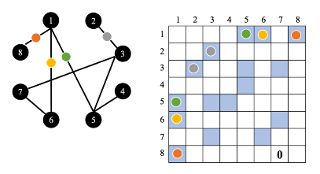

例如，在一个图中，节点1只与节点5、6、8相连，因此只需要计算节点1与节点5、节点6、节点8之间的注意力分数；节点2只与节点3相连，因此只需要计算节点2与节点3之间的注意力分数，以此类推。这种方法可以利用领域知识来简化自注意力计算过程，从而提高计算效率。

### 6、自注意力机制的变种与未来方向

自注意力机制有很多变种，旨在优化其计算效率和扩展能力。论文 **“Long Range Arena: A Benchmark for Efficient Transformers”** 比较了各种自注意力的变种，例如 **Linformer**、**Performer** 和 **Reformer**。这些变种通常在减少计算复杂度方面有所改进，但可能在性能上稍逊于原始的自注意力机制。

**Linformer** 通过低秩矩阵来逼近注意力矩阵，从而提高计算效率。**Performer** 采用近似计算方法来降低计算复杂度。**Reformer** 通过稀疏注意力和可逆层来减少计算资源需求。除此之外，还有各种新的 **xxformer** 变种，这些新型变种通常具有较高的计算速度，但可能在性能上有所妥协。了解这些变种的最新进展可以参考 **“Efficient Transformers: A Survey”** 这篇综述文章。

## 三、自回归(autoregressive)解码器

### 1、自回归解码器

以语音识别为例，输入一段声音，输出一串文字。如下图所示，把一段声音(“机器学习”) 输入给编码器，输出会变成一排向量。接下来解码器产生语音识别的结果，解码器把编码器的输出先“读”进去。要让解码器产生输出，首先要先给它一个代表开始的特殊符号 $<BOS>$，即 Begin Of Sequence，这是一个特殊的词元(token)。在词表(vocabulary)里面，在本来解码器可能产生的文字里面多加一个特殊的符号 $<BOS>$。在机器学习里面，假设要处理自然语言处理的问题，每一个词元都可以用一个独热的向量来表示。独热向量其中一维是 1，其他都是 0，所以 $<BOS>$ 也是用独热向量来表示，其中一维是 1，其他是 0。接下来解码器会“吐”出一个向量，该向量的长度跟词表的大小是一样的。在产生这个向量之前，跟做分类一样，通常会先进行一个 softmax 操作。这个向量里面的分数是一个分布，该向量里面的值全部加起来，总和是 1。这个向量会给每一个中文字一个分，分数最高的中文字就是最终的输出。“机”的分数最高，所以“机”就当做是解码器的第一个输出。

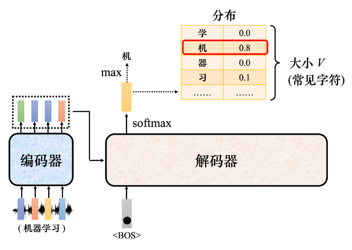

> [!TIP]
>
> Q: 解码器输出的单位是什么?
>
> A: 假设做的是中文的语音识别，解码器输出的是中文。词表的大小可能就是中文的方块字的数量。常用的中文的方块字大概两三千个，一般人可能认得的四、五千个，更多都是罕见字。比如我们觉得解码器能够输出常见的 3000 个方块字就好了，就把它列在词表中。不同的语言，输出的单位不见得会一样，这取决于对语言的理解。比如英语，选择输出英语的字母。但字母作为单位可能太小了，有人可能会选择输出英语的词汇，英语的词汇是用空白作为间隔的。但如果都用词汇当作输出又太多了，有一些方法可以把英语的字首、字根切出来，拿字首、字根当作单位。中文通常用中文的方块字来当作单位，这个向量的长度就跟机器可以输出的方块字的数量是一样多的。每一个中文的字都会对应到一个数值。

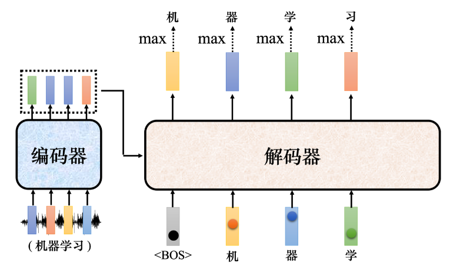

如上图所示，接下来把“机”当成解码器新的输入。根据两个输入：特殊符号 $<BOS>$ 和“机”，解码器输出一个蓝色的向量。蓝色的向量里面会给出每一个中文字的分数，假设“器”的分数最高，“器”就是输出。解码器接下来会拿“器”当作输入，其看到了 $<BOS>$、 “机”、 “器”，可能就输出“学”。解码器看到 $<BOS>$、 “机”、 “器”、 “学”，它会输出一个向量。这个向量里面“习”的分数最高，所以它就输出“习”。这个过程就反复地持续下去。

解码器的输入是它在前一个时间点的输出，其会把自己的输出当做接下来的输入，因此当解码器在产生一个句子的时候，它有可能看到错误的东西。如下图所示，如果解码器有语音识别的错误，它把机器的“器”识别错成天气的“气”，接下来解码器会根据错误的识别结果产生它想要产生的，期待是正确的输出，这会造成误差传播(error propagation)的问题，一步错导致步步错，接下来可能无法再产生正确的词汇。

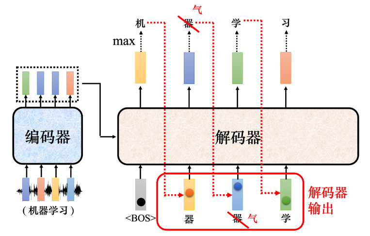

Transformer 的解码器内部结构如下图所示，类似于编码器，解码器也包括多头注意力、残差连接、层归一化和前馈神经网络。解码器最后再进行一个 softmax 操作，使其输出变成一个概率分布。此外，解码器使用掩蔽自注意力（masked self-attention），通过一个掩码（mask）来阻止每个位置选择其后面的输入信息。

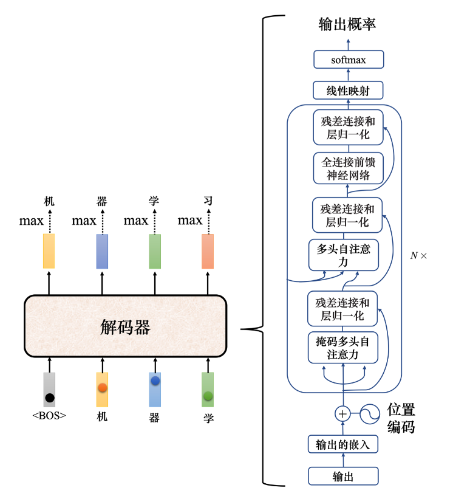

如下图所示，原来的自注意力输入一排向量，输出另一排向量，这一排中每个向量在看过完整输入后才做决定。例如，输出 $b1$ 的时候考虑 $a1$ 到 $a4$ 的所有信息。

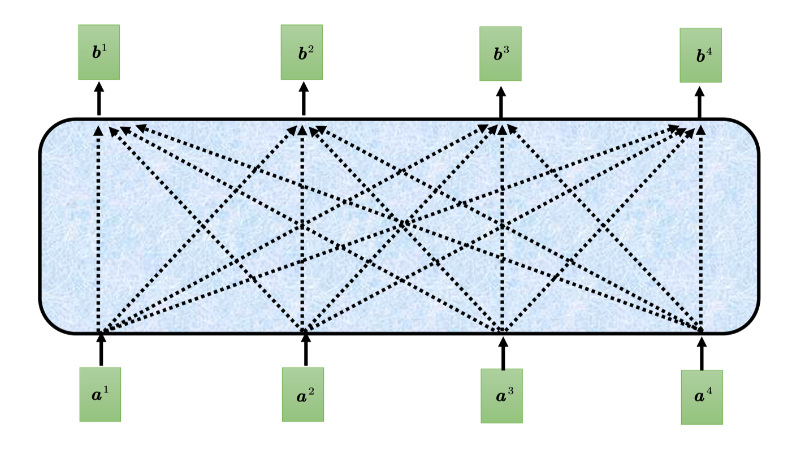

掩蔽自注意力的不同点在于，它不能看右边的部分。如下图所示，产生 $b1$ 时，只能考虑 $a1$ 的信息，不能考虑 $a2$、$a3$、$a4$；产生 $b2$ 时，只能考虑 $a1$、$a2$ 的信息，不能考虑 $a3$、$a4$；产生 $b3$ 时，不能考虑 $a4$ 的信息；产生 $b4$ 时，可以使用整个输入序列的信息。

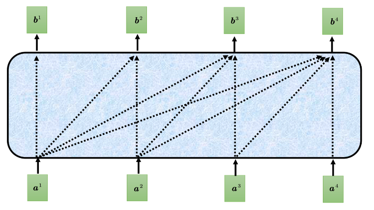

一般自注意力产生 $b2$ 的过程如下图所示。

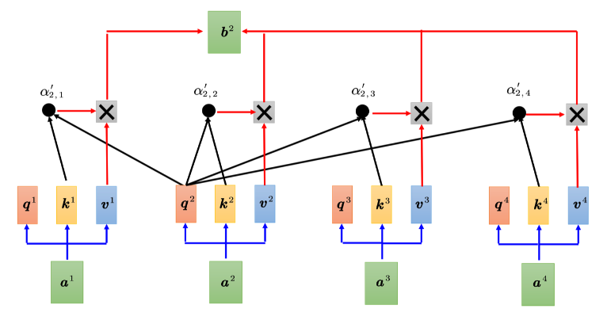

掩蔽自注意力的计算过程如下图所示，我们只计算 $q2$ 和 $k1$、$k2$ 的注意力，最后只计算 $v1$ 和 $v2$ 的加权和。输出 $b2$ 时，只考虑了 $a1$ 和 $a2$，没有考虑 $a3$ 和 $a4$。

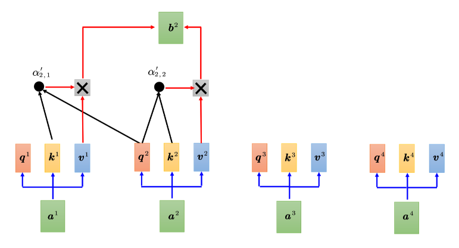

> [!TIP]
>
> Q: 为什么需要在注意力中加掩码?
>
> A: 一开始解码器的输出是一个一个产生的，所以是先有 a1，再有 a2，再有 a3，再有 a4。这与原来的自注意力不同，原来的自注意力是一次性将 a1 到 a4 全部输入模型。编码器一次性将 a1 到 a4 读入。但对于解码器而言，先有 a1 才有 a2，才有 a3，才有 a4。所以，当我们有 a2 时，要计算 b2 的时候，并没有 a3 和 a4，因此无法考虑 a3 和 a4。解码器的输出是一个一个产生的，只能考虑左边的部分，不能考虑右边的部分。

了解了解码器的运作方式后，仍有一个非常关键的问题：实际应用中输入和输出长度的关系非常复杂，无法从输入序列长度得知输出序列长度，因此解码器必须决定输出序列的长度。

给定一个输入序列，机器可以自己学到输出序列的长度。但在目前的解码器机制中，机器不知道什么时候应该停下来。如下图所示，机器产生完“习”以后，可能会继续重复，把“习”当做输入，解码器可能会输出“惯”，接下来就会一直持续下去，永远不会停下来。

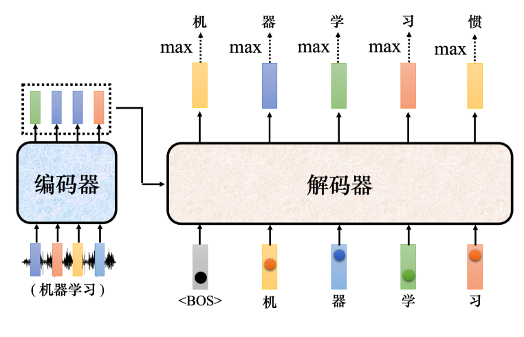

如下图所示，为让解码器停止运作，需要特别准备一个符号 `<EOS>`。在产生完“习”以后，再把“习”当作解码器输入，解码器应该能够输出 `<EOS>`。解码器看到编码器输出的嵌入、<BOS>、“机”、“器”、“学”、“习”以后，其产生的向量中 `<EOS>` 的概率必须是最大的，于是输出 `<EOS>`，整个解码器产生序列的过程就结束了。

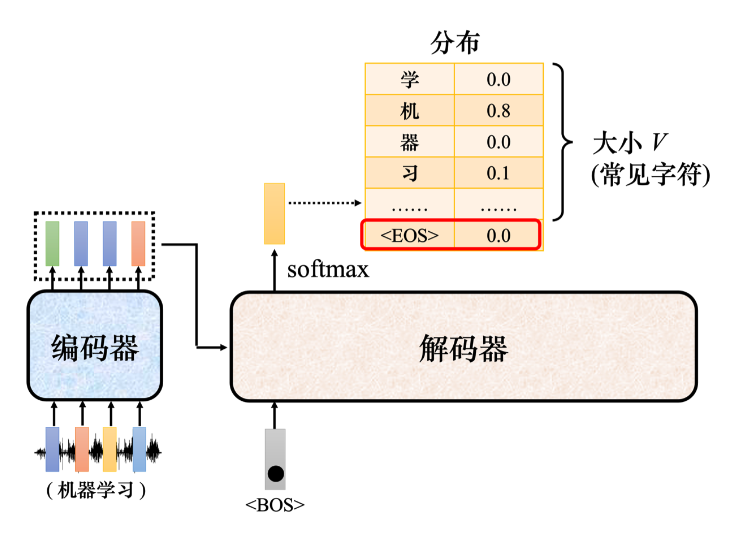

### 2、非自回归解码器

接下来讲下非自回归(non-autoregressive)的模型。如下图所示，自回归的模型是先输入 $<BOS>$，输出 $w_1$，再把 $w_1$ 当做输入，再输出 $w_2$，直到输出 $<EOS>$ 为止。假设产生的是中文的句子，非自回归不是一次产生一个字，而是一次把整个句子都产生出来。

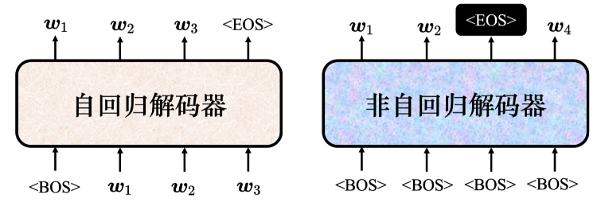

非自回归的解码器可能“吃”的是一整排的 $<BOS>$ 词元，一次产生一排词元。比如输入 4 个 $<BOS>$ 的词元到非自回归的解码器，它就产生 4 个中文的字。因为输出的长度是未知的，所以当做非自回归解码器输入的 $<BOS>$ 的数量也是未知的，因此有如下两个做法：

- 用分类器来解决这个问题。用分类器“吃”编码器的输入，输出是一个数字，该数字代表解码器应该要输出的长度。比如分类器输出 4，非自回归的解码器就会“吃”4 个 $<BOS>$ 的词元，产生 4 个中文的字。
- 给编码器一堆 $<BOS>$ 的词元。假设输出的句子的长度有上限，绝对不会超过 300 个字。给编码器 300 个 $<BOS>$，就会输出 300 个字，输出 $<EOS>$ 右边的输出就当它没有输出。

非自回归解码器有很多优点：

- **平行化**：自回归解码器输出句子时是一个字一个字地产生，假设要输出长度为 100 个字的句子，就需要进行 100 次解码。但非自回归解码器不管句子的长度如何，都是一个步骤就能产生出完整的句子，因此运行速度比自回归解码器要快。非自回归解码器的想法是在有 Transformer 以后，有这种自注意力的解码器以后才有的。以前如果用长短期记忆网络(Long Short-Term Memory Network, LSTM)或 RNN，给它一排 $<BOS>$，其无法同时产生全部的输出，其输出是一个一个产生的。
- **长度控制**：非自回归解码器可以更好地控制输出长度。在语音合成中，非自回归解码器非常常用。通过分类器可以决定非自回归解码器的输出长度。在语音合成时，如果希望系统讲得快一些，就把分类器的输出除以 2，系统讲话速度就会变快 2 倍；如果希望讲话速度变慢，则把分类器输出的长度乘以 2 倍，解码器说话的速度就会变慢 2 倍。

平行化是非自回归解码器最大的优势，但非自回归的解码器的性能(performance)往往都不如自回归的解码器。所以很多研究试图让非自回归的解码器的性能越来越好，去逼近自回归的解码器。要让非自回归的解码器跟自回归的解码器性能一样好，必须要使用非常多的技巧。

