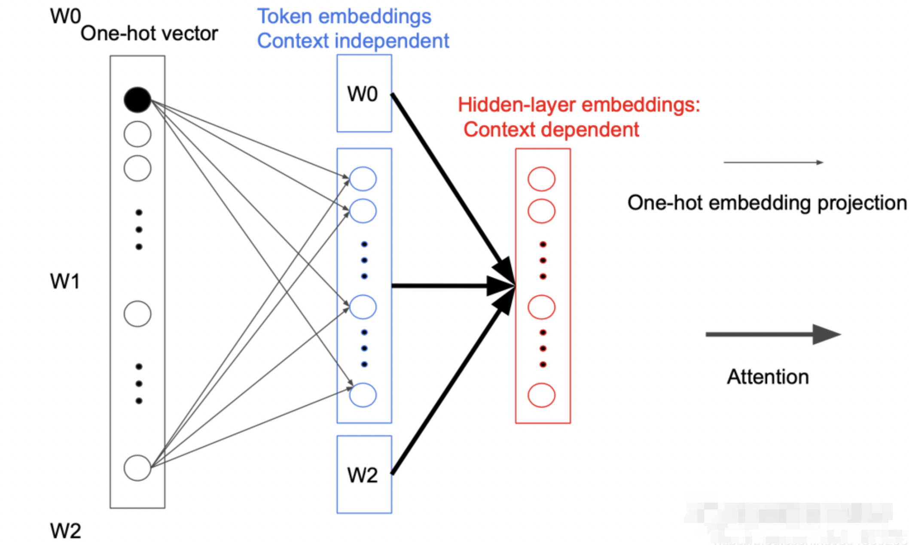
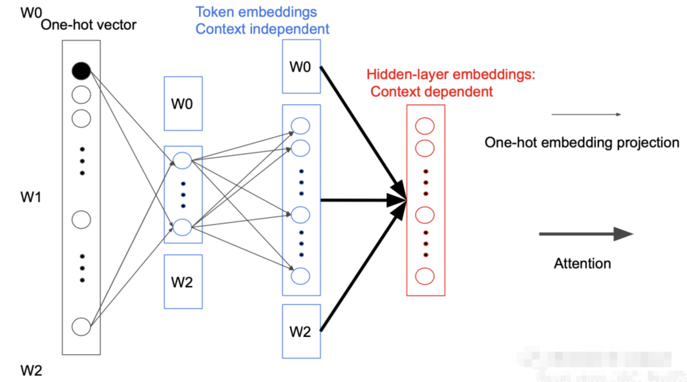
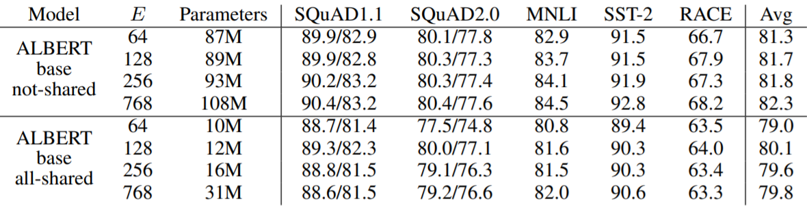
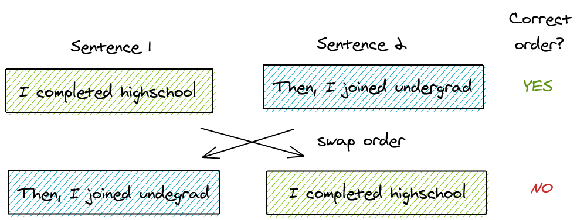

Albert (A Lite BERT) 是一个由 Google Research 提出的基于 BERT（Bidirectional Encoder Representations from Transformers）的改进模型。Albert 旨在解决 BERT 中的一些限制，主要通过参数共享和因子化嵌入矩阵来减少参数数量，并提升模型的效率和性能。

## 一、BERT 的局限性
BERT 在许多自然语言处理任务中表现优异，但其庞大的参数量导致训练和推理效率较低。主要的局限性包括：
- 模型参数量大：BERT-large 具有 340M 个参数，导致内存占用大，计算资源需求高。
- 嵌入矩阵大：词汇嵌入矩阵的大小和隐藏层的维度相同，进一步增加了模型参数。

## 二、Albert 的改进

Albert 通过以下两种方法改进了 BERT：

### 1. 参数共享
在 BERT 中，不同层之间的参数是不共享的，而在 Albert 中，所有层之间的参数是共享的。通过参数共享，模型显著减少了参数数量。共享参数的方式包括：
- 全连接层共享：所有层之间的全连接层权重共享。
- 注意力参数共享：所有层之间的多头注意力机制的参数共享。

这种参数共享方法使得模型不仅更轻量，还能保持较好的性能。

### 2. 因子化嵌入矩阵

在 BERT 中，Token Embedding 的参数矩阵大小为 $V \times H$，其中 $V$ 表示词汇表的大小，$H$ 为隐藏层的维度。即：

$$
\text{参数量} = V \times H
$$
原始的 BERT 模型以及各种基于 Transformer 的预训练语言模型都有一个共同特点，即 $E = H$，其中 $E$ 指的是嵌入维度（Embedding Dimension），$H$ 指的是隐藏层维度（Hidden Dimension）。这种设计会导致一个问题：当提升隐藏层维度 $H$ 时，嵌入维度 $E$ 也需要提升，最终导致参数量呈平方级增长。

ALBERT 的作者提出了解绑 $E$ 和 $H$ 的方法。具体操作是在嵌入层后面加入一个矩阵进行维度变换。嵌入维度 $E$ 保持不变，如果隐藏层维度 $H$ 增大，只需要在 $E$ 后面进行一个升维操作即可：

- $E \in \mathbb{R}^{V \times E}$：其中 $V$ 是词汇表的大小，$E$ 是嵌入维度。
- $P \in \mathbb{R}^{E \times H}$：其中 $H$ 是隐藏层的维度。

因此，ALBERT 不直接将原本的 one-hot 向量映射到隐藏层空间大小为 $H$ 的向量，而是分解成两个矩阵。原本参数数量为 $V \times H$（其中 $V$ 表示词汇表的大小），分解成两步后减少为 $V \times E + E \times H$。当 $H$ 的值很大时，这样的做法能够大幅降低参数数量。

通过这种因子化的方法，嵌入层的参数数量从 $O(V \times H)$ 降低为 $O(V \times E + E \times H)$，其中 $E \ll H$，显著减少了参数数量。

之所以可以这样做是因为每次反向传播时都只会更新一个 Token 相关参数，其他参数都不会变。而且在第一次投影的过程中，词与词之间是不会进行交互的，只有在后面的 Attention 过程中才会做交互，我们称为 Sparsely updated。如果词不做交互的话，完全没有必要用一个很高维度的向量去表示，所以就引入一个小的隐藏层。

举个例子，当 $V$ 为 30000，$H$ 为 768 时，参数量可以从 2300 万降低到 780 万：

$$
V \times H = 30000 \times 768 = 23,040,000
$$

$$
V \times E + E \times H = 30000 \times 256 + 256 \times 768 = 7,876,608
$$

下面是因子化嵌入的实验结果，对于参数不共享的版本，随着 $E$ 的增大，效果是不断提升的。但是参数共享的版本似乎不是这样，$E$ 最大并不是效果最好。同时也能发现参数共享对于效果可能带来 1-2 个点的下降。

## 三、Albert 的架构

Albert 的架构与 BERT 基本相同，包括：
- 输入嵌入：将输入的词汇映射到向量表示。
- 多头自注意力：捕获输入序列中的上下文关系。
- 前馈神经网络：对注意力机制后的表示进行非线性变换。
- 输出层：根据任务不同（如分类、回归等）进行相应的预测。

不同的是，Albert 在各层之间共享参数，并采用因子化嵌入矩阵来减少参数量。

## 四、预训练

### 1. Masked Language Modeling (MLM)

在 ALBERT（A Lite BERT）模型中，Masked Language Modeling (MLM) 是一个重要的预训练任务，用于让模型学习上下文信息。虽然 MLM 的基本思想与 BERT 类似，但 ALBERT 引入了一些优化和变化来提高训练效率和减少参数数量。以下是 ALBERT 中 MLM 的具体过程：

#### （1）随机遮盖词汇

- 在输入句子中随机选择 15% 的词汇进行遮盖处理。
- 其中 80% 的选择词汇被替换为特殊的 [MASK] 标记。例如，对于句子 "The quick brown fox jumps over the lazy dog"，可能会得到 "The quick brown [MASK] jumps over the lazy [MASK]"。
- 10% 的选择词汇保持不变，即使用原始词汇。例如，"The quick brown fox jumps over the lazy dog" 可能会保持为 "The quick brown fox jumps over the lazy dog"。
- 另外 10% 的选择词汇被替换为随机的词汇。例如，"The quick brown fox jumps over the lazy dog" 可能会变成 "The quick brown apple jumps over the lazy car"。

#### （2）模型预测遮盖词汇

- 模型接受包含 [MASK] 标记的输入，并通过双向 Transformer 编码器处理输入。
- ALBERT 采用了参数共享和因子化嵌入矩阵的方法，减小模型的参数量，提高训练效率。
- 模型的目标是预测被 [MASK] 标记遮盖的词汇。例如，模型需要从 "The quick brown [MASK] jumps over the lazy [MASK]" 预测出 "fox" 和 "dog"。

#### （3）计算损失并更新权重

- 通过比较模型预测的词汇和实际被遮盖的词汇，计算损失（如交叉熵损失）。
- 然后，通过反向传播算法更新模型的权重，使模型逐渐学习到词汇在不同上下文中的语义关系。

### 2. Sentence-Order Prediction (SOP)

BERT 引入了一个叫做“下一个句子预测”（Next Sentence Prediction, NSP）的二分类问题。这是专门为提高使用句子对（如“自然语言推理”）的下游任务的性能而创建的。然而，像 RoBERTa 和 XLNet 这样的研究已经表明 NSP 的无效性，发现它对下游任务的影响是不可靠的。

因此，ALBERT 提出了另一个任务 —— 句子顺序预测（Sentence-Order Prediction, SOP）。其关键思想是：

- 从同一个文档中取两个连续的句子作为一个正样本。
- 交换这两个句子的顺序，并使用它作为一个负样本。

这种方法更直接地捕捉了句子之间的顺序关系，有助于模型更好地理解上下文结构。

### 3. 增加数据和取消 Dropout

#### （1）增加训练数据

ALBERT 的初始版本使用了与 BERT 相同的训练数据。然而，增加训练数据通常可以提升模型的表现。因此，ALBERT 增加了 STORIES 数据集，总共训练了 157GB 的数据。这种扩展训练数据的方法旨在进一步提高模型的性能和泛化能力。

#### （2）取消 Dropout

RoBERTa 研究指出，BERT 及其系列模型存在“欠拟合”现象。因此，RoBERTa 建议直接关闭 Dropout 层。在 ALBERT 中，同样取消了 Dropout 层，这样做可以显著减少临时变量对内存的占用。

此外，研究发现，Dropout 会损害大型 Transformer-based 模型的性能。因此，在 ALBERT 中去掉 Dropout 层，有助于提高模型的整体表现和训练效率。

## 五、Albert 的优势

- **参数减少**：通过参数共享和因子化嵌入矩阵，Albert 显著减少了参数数量。例如，Albert-large 仅有 18M 个参数，而 BERT-large 有 340M 个参数。
- **效率提高**：参数减少后，Albert 的训练和推理速度更快，资源消耗更少。
- **性能保持**：尽管参数减少，Albert 在许多自然语言处理任务中的性能仍与 BERT 相当，甚至更优。

需要注意的是，ALBERT加速的是训练时间而不是Inference时间。Inference时间并未得到改善，因为即使是使用了共享参数机制，还是得跑完12层Encoder，故Inference时间跟BERT是差不多的