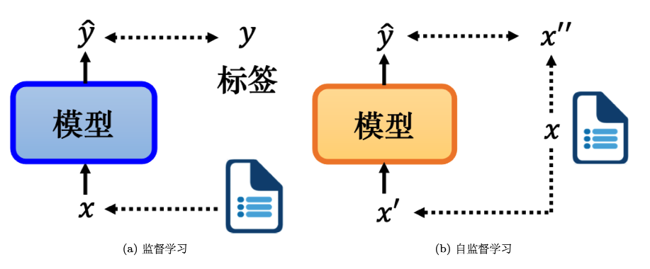
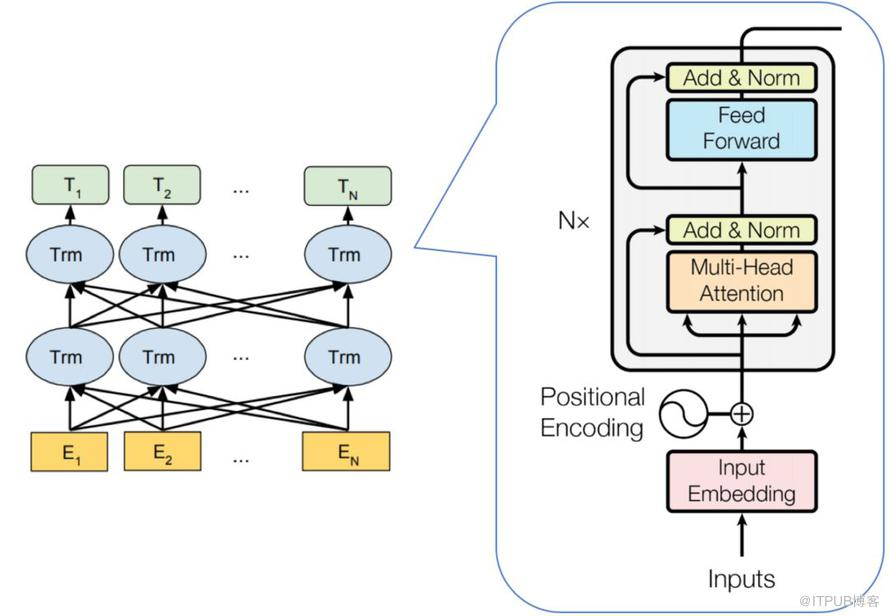
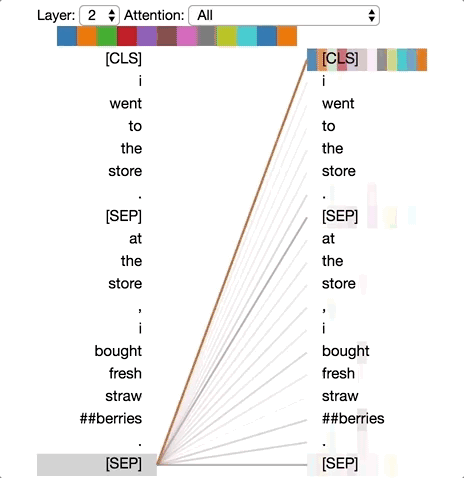
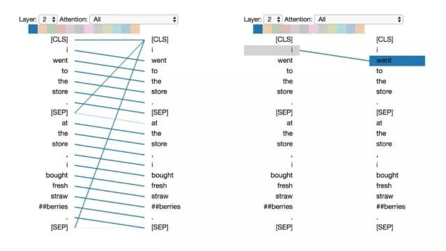
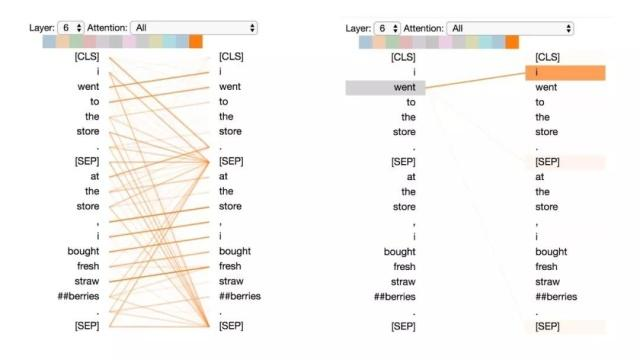
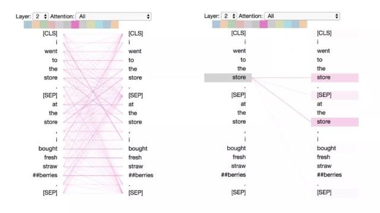
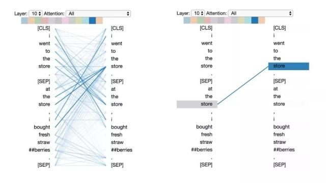
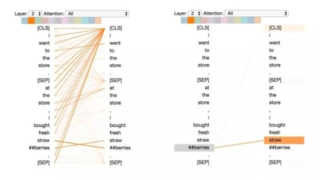
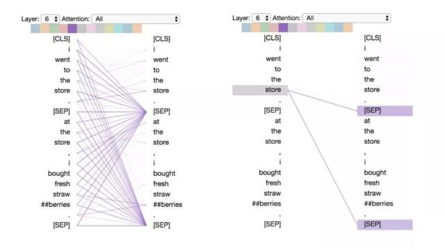
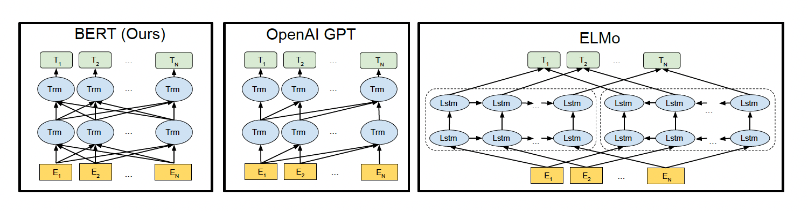

## 一、自监督学习

自监督学习 (Self-Supervised Learning, SSL) 是一种无需人工标注数据的学习方法。Yann LeCun 在 2019 年 4 月于 Facebook（现 Meta）上首次提出了“自监督学习”这一术语。自监督学习与传统的监督学习和无监督学习是三种主要的学习方式。

### 1. 监督学习与无监督学习

在监督学习中，模型在训练期间使用带有标签的数据进行训练。比如在情感分析任务中，模型的输入是文章的内容，输出是对文章情感的分类（正面或负面），这些标签是由人工预先标注的。具体而言，监督学习的过程包括以下几个步骤：

1. **数据收集**：收集大量的文章。
2. **数据标注**：对文章进行情感标注，将每篇文章标记为正面或负面。
3. **模型训练**：使用带标签的数据来训练模型，使其能够学习如何进行情感分类。

### 2. 自监督学习的定义与机制

自监督学习是一种不依赖人工标注数据的学习方法。在自监督学习中，模型从未标注的数据中自动生成标签，以进行自我学习。其基本机制包括以下步骤：

1. **数据准备**：从未标注的数据中生成输入数据 $x'$ 和目标数据 $x''$。
2. **模型训练**：将 $x'$ 输入模型，模型输出预测结果 $\hat{y}$，目标是使 $\hat{y}$ 尽可能接近 $x''$。

这种方法使模型能够从数据中自动提取有用的信息，而不需要外部标签的支持。

### 3. 自监督学习与无监督学习的区别

虽然自监督学习可以被视作无监督学习的一种形式，但它与传统的无监督学习方法存在差异：

- **无监督学习**：一个广泛的范畴，包括各种不依赖标签的数据分析方法，如聚类、降维等。
- **自监督学习**：作为无监督学习的一种具体方法，它利用数据本身生成监督信号，形成了一个更明确的学习目标。

## 二、BERT介绍

BERT（Bidirectional Encoder Representations from Transformers）是一种预训练语言表示模型，由Google AI研究院在2018年10月提出。该模型在SQuAD1.1机器阅读理解测试中取得了卓越成绩，超越了人类的表现，并在11种不同的NLP任务中创造了最佳性能（State of the Art, SOTA），包括将GLUE基准推高至80.4%（绝对改进7.6%），MultiNLI准确度达到86.7%（绝对改进5.6%）。BERT采用的网络架构是基于《Attention is All You Need》中的多层Transformer结构，其最大的特点是通过Attention机制将任意位置的两个单词的距离转换成1，有效解决了NLP中的长期依赖问题。

## 三、BERT模型结构
BERT的结构基于Transformer的编码器（Encoder）部分。它包括多个相互堆叠的Transformer Encoder层。模型有两种规模的配置：BERT-base采用12层Transformer Encoder，而BERT-large则使用24层，模型参数总数分别约为110M和340M。

### 1. Embedding层
BERT的输入Embedding是由三种不同的Embeddings组合而成：

#### （1）Token Embeddings

Token Embeddings的主要任务是将每个输入的Token（通常是单词或单词的一部分）转换成模型能够理解的固定维度的向量。在BERT模型中，特别是在处理英文文本时，使用了一种称为WordPiece的分词方法。这种方法可以有效地处理词汇外的单词，并减少词汇表的大小。

例如，单词 "playing" 可能被拆分为 "play" 和 "##ing"。这里，“##”标记用于表示“ing”是“play”这个词根的延续而不是一个独立的词。每个这样的Token都会在预训练过程中被映射到一个高维空间中的向量。对于BERT-base模型，这个维度通常是768，意味着每个Token都会被转换为一个768维的向量。

#### （2）Segment Embeddings

Segment Embeddings用于帮助模型区分两个不同的句子。这在处理需要比较或关联两个句子的NLP任务中特别有用，例如问答系统或自然语言推理。在这些任务中，输入通常包括两部分，如一个问题和一个答案，或者两个待比较的陈述。

在实际操作中，如果输入包括两个句子，BERT模型会在这两个句子之间插入一个特殊的[SEP]Token，并使用Segment Embeddings来标识哪些Token属于第一个句子，哪些属于第二个句子。具体来说，第一个句子中的所有Token都会赋予一个Embedding，而第二个句子的Token则赋予另一个不同的Embedding。通常，这些Embeddings只有两种类型，分别对应两个不同的句子。

#### （3）Position Embeddings

由于Transformer的结构不像传统的递归神经网络（RNN）那样能自然地处理序列数据中的时间或顺序依赖性，Position Embeddings就显得尤为重要。这种Embedding赋予每个Token一个与其位置相关的向量，使模型能够理解词语在句子中的顺序。在《Attention is All You Need》论文中，Position Embeddings是通过三角函数（正弦和余弦函数的不同频率）来实现的，这种方式允许模型处理任意长度的序列，同时还可以保持相对位置信息。与此不同，BERT采用了学习得到的Position Embeddings。这意味着模型在训练过程中学习每个位置的最优表示，而不是依靠固定的数学函数。每个位置的Embedding在模型训练过程中通过反向传播进行优化，以最好地支持模型的预测任务。

BERT设计之初考虑到实际应用中输入序列的长度可能有很大差异，因此设定了一个最大序列长度限制，即512个Token。这意味着任何超过512个Token的输入序列都将被截断，以符合模型处理的标准格式。这种设计是出于计算效率和模型性能的考虑，同时也基于大多数自然语言处理任务中句子的典型长度。

在BERT中，Position Embeddings被实现为一个查找表（lookup table），维度为512×768。这个表中的每一行对应输入序列中一个位置的Embedding，第一行对应序列中的第一个Token，第二行对应第二个Token，以此类推，直到第512个位置。每个位置的Embedding是在模型的预训练阶段通过学习得到的，而非固定的数学函数生成。

这种学习得到的Position Embeddings允许BERT更灵活地适应不同的语言和任务需求，因为它们是根据实际语料中的统计信息优化的，而不是预设的周期函数。

#### （4）最终输入的Embedding

$$
\text{Input Embeddings} = \text{Token Embeddings} + \text{Segment Embeddings} + \text{Position Embeddings}
$$

#### （5）[CLS]标志在BERT中的作用

在BERT模型中，[CLS]标志（Classification token）被置于输入序列的开始，并在模型的所有层中与其他Token一起处理和更新。在训练过程中，[CLS]符号没有初始语义，它通过自注意力机制学习整个输入序列的信息。这种机制使[CLS]向量能全面反映序列的语义，特别适用于分类任务如情感分析或意图识别。

自注意力层使得[CLS]及其他Token能够基于序列中所有Token重新计算其表示，从而让[CLS]向量动态地聚合整个文本的信息。每层的输出为输入提供更精细化的解释，逐步构建起对整个句子或段落的全局理解。

模型训练完成后，[CLS]的最终输出向量常用于执行分类任务，提供足够的信息进行情感分析、答案推断或逻辑关系判断等。

### 2. Transformer Encoder

BERT采用的Transformer的encoder结构是从论文《Attention is All You Need》中引入的。这一部分专注于如何将输入数据转化为有用的表示，并通过多头自注意力机制（Multi-head Self-Attention）进行处理。

在Transformer模型中，输入通常被转化为512维的向量。然而，在BERT中，这些维度被扩展到768维，并相应地调整了多头自注意力的配置。具体来说，BERT的自注意力结构包括12个头，每个头处理的子空间维度为64（$768 / 12 = 64$）。这种设计允许模型在不同的表示子空间上并行捕捉信息。

BERT模型的两个主要版本，即BERT-base和BERT-Large，分别使用12层和24层的Transformer Encoder。这种层的差异直接影响了模型的复杂性和性能，其中BERT-Large因为更多的层次能捕获更细致的语义细节。

### 3. BERT可视化和注意力模式
在BERT模型中，可视化注意力机制是理解模型如何处理和理解文本的关键。注意力机制通过不同的连线表示，其中每条线连接被更新的位置（左半边）与被注意的位置（右半边）。线条的不同颜色代表不同的注意力头，而颜色的深浅代表注意力的强度。下面将详细探讨BERT中的六种主要注意力模式，并通过实际例子进行说明。

考虑以下两个句子进行分析：
- 句子A：I went to the store.
- 句子B：At the store, I bought fresh strawberries.

使用WordPiece分词工具处理后，实际输入序列为（strawberries 草莓，因为WordPiece分开了）：
$$
[CLS] \, i \, went \, to \, the \, store \, . \, [SEP] \, at \, the \, store \, , \, i \, bought \, fresh \, straw \, \#\#berries \, . \, [SEP]
$$

#### （1）模式1：注意下一个词

每个位置主要关注序列中的下一个词。例如，"i" 主要关注 "went"。

这种模式类似于后向RNN的行为，通常出现在句子内部，不包括[SEP]符号，因为[SEP]的注意力多被引导至[CLS]。

#### （2）模式2：注意前一个词

主要关注前一个词，例如，"went" 主要关注 "i"。

这与前向RNN相似，注意力可能也散布到其他词上，如[SEP]。

#### （3）模式3：注意相同或相关的单词

关注与当前词语相同或语义上相关的其他词。例如，两次出现的"store"相互关注。

#### （4）模式4：注意其他句子中相同或相关的单词

关注不同句子中相同或相关的词。例如，句子B中的"store"关注句子A中的"store"。

#### （5）模式5：注意能预测该词的其他单词

主要关注可以帮助预测当前词的其他词。例如，“straw”主要关注“##berries”。

#### （6）模式6：注意分隔符

主要关注分隔符[CLS]或[SEP]。例如，多数词的注意力集中在[SEP]上。

## 四、BERT训练

BERT（Bidirectional Encoder Representations from Transformers）的训练分为两个主要阶段：预训练（Pre-training）和微调（Fine-tuning）。这两个阶段是BERT成功适用于多种NLP任务的关键。

### 1. BERT预训练
BERT的预训练阶段是在大量无标签的文本数据上进行的。这一阶段包括两个自监督的任务：掩码语言模型（MLM）和下一句预测（NSP）。

#### （1）MLM（Masked Language Model）
MLM任务的目的是使模型能通过上下文预测句子中随机屏蔽的单词，类似于完形填空。这个任务特别适合Transformer架构，因为它可以利用上下文中的所有词（左侧和右侧）来预测缺失的词。具体来说，输入语料中大约15%的WordPiece Token会被随机选择进行掩盖，然后模型尝试预测这些掩盖的词。对于这15%的Token：
- 80%的概率，Token被替换为特殊的`[MASK]`符号。
- 10%的概率，Token被替换为任意其他Token。
- 10%的概率，Token保持不变。

这种处理方式的目的是帮助模型更好地学习语境信息，而不仅仅记住特定的词汇。此外，这种策略也防止了模型在微调阶段遇到未见过的掩盖Token。

**优点：**

- 提供文本纠错能力，由于有时Token被随机替换，模型需要根据上下文纠正错误。
- 减少预训练与微调阶段的不匹配问题，因为模型已经习惯处理未被掩码的词。

**缺点：**

- 随机掩码可能割裂连续词组的内在联系，这对于学习某些语言的复杂结构不利。

为应对连续词组被随机分割的问题，后续研究中引入了BERT的变体，如BERT-WWM（Whole Word Masking），它在预训练中掩盖整个词而非词的一部分。

#### （2）NSP（Next Sentence Prediction）
在NSP任务中，模型需要判断句子B是否是句子A的逻辑下一句。这是通过将两个句子作为输入，并预测它们是否是连续的句子来完成的。训练样本是这样生成的：
- 50%的概率，句子B确实是句子A的下一句（标记为IsNext）。
- 50%的概率，句子B是从语料库中随机抽取的，与句子A无关（标记为NotNext）。

这两个任务的结果都被编码在输入序列的第一个Token，即[CLS]符号中。

> [!NOTE]
>
> 尽管NSP任务帮助BERT学习了句子间的关系，但后续研究指出去除NSP任务对某些下游任务的性能影响不大，甚至有所提升。这可能是由于BERT以单句子为单位输入，模型无法学习到词之间的远程依赖关系。针对这一点，后续的RoBERTa、ALBERT、spanBERT都移去了NSP任务。

### 2. BERT的微调
预训练完成后，BERT可以通过微调来适应特定的下游NLP任务。微调阶段通常在有标注的数据上进行，所有预训练阶段学习到的参数都会被细调以优化任务特定的输出。

#### （1）句子对的分类任务

- **MNLI**：多项自然语言推断任务，判断前提与假设之间的逻辑关系（蕴含、矛盾或中立）。
- **QQP**：判断Quora上的问题对是否具有相同的意义。
- **QNLI**：判断文本是否含有问题的答案。
- **STS-B**：评估两个句子的相似度。
- **MRPC**：判断两个句子是否在语义上相等。
- **RTE**：类似于MNLI，但是数据集更小，且只关注蕴含关系。
- **SWAG**：从四个选项中选择最可能的句子续写。

#### （2）基于单个句子的分类任务

- **SST-2**：电影评论的情感分析。
- **CoLA**：判断一个句子在语法上是否可接受。

#### （3）问答任务

- **SQuAD v1.1**：给定问题和相关文本，模型需要找到问题的答案。

#### （4）命名实体识别

- **CoNLL-2003 NER**：识别句子中的命名实体（人名、组织名、地名等）。

通过这两个阶段的训练，BERT能够有效地理解并处理语言数据，适应各种语言处理任务。这种训练策略使BERT在多个标准NLP任务上都取得了前所未有的性能。

## 五、BERT,GPT,ELMO的区别

在现代自然语言处理领域，BERT、GPT和ELMo是三个非常重要的模型，它们各自采用了不同的架构和策略来处理语言数据。以下是这三个模型的核心区别和各自的特点。

### 1. 比较

- **BERT (Bidirectional Encoder Representations from Transformers)**:
  - 使用双向的Transformer架构。
  - 考虑了所有层的左右上下文信息。
  - 采用微调（fine-tuning）方法适应特定的下游任务。

- **GPT (Generative Pre-trained Transformer)**:
  - 使用从左到右的Transformer架构。
  - 主要适用于生成任务，如文本生成。
  - 采用微调方法适应不同的下游任务。

- **ELMo (Embeddings from Language Models)**:
  - 基于双向长短期记忆网络（Bi-directional LSTM）。
  - 特征是从左到右和从右到左的LSTM的输出拼接而成。
  - 作为特征被添加到下游任务模型中，而非通过微调。

### 2. 为何BERT表现更佳
与ELMo相比，BERT展现出更优的性能，原因主要包括：
- **Transformer vs. LSTM**: Transformer的自注意力机制使其在捕捉长距离依赖关系时比LSTM更有效。
- **双向融合**: BERT的全双向结构比ELMo的拼接方式更能有效融合上下文信息。
- **数据和参数**: BERT使用的训练数据更多，模型参数也更多，这有助于模型学习更丰富的语言特征。

## 六、BERT的优缺点

### 1. 优点
- **并行能力**: 与传统的RNN和LSTM相比，BERT的Transformer结构可以并行处理，显著提高了训练效率。
- **上下文敏感性**: BERT能够根据上下文动态地理解词义，有效地解决一词多义的问题。
- **深层语义提取**: BERT通过多层结构能够在不同的层次上提取和利用语言特征，更全面地理解句子意义。

### 2. 缺点
- **模型大小**: BERT的模型非常庞大，拥有大量的参数，这使得模型在小数据集上容易过拟合。
- **NSP任务的限制**: BERT的NSP任务效果并不明显，且MLM可能与某些下游任务存在不匹配的问题。
- **生成任务和长序列处理**: BERT在处理生成任务和长序列时的表现不如专门的模型。

## Reference

- [NLP系列之预训练模型（四）：BERT](https://aistudio.baidu.com/projectdetail/2297740)