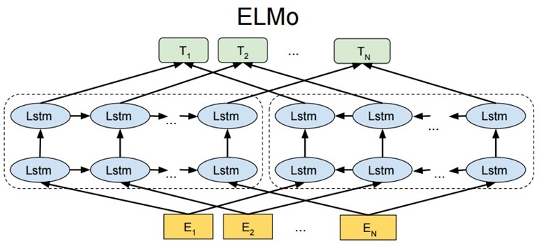
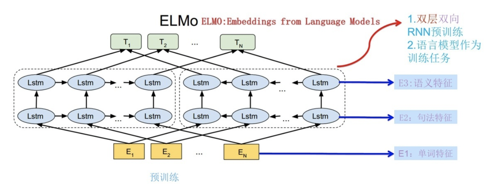

## 一、介绍
ELMo（Embeddings from Language Models）在NAACL 2018获得了outstanding paper award，其方法具有重要的启发意义。近年来，预训练的词表示在NLP任务中表现出色，成为不可或缺的一部分。论文作者认为，优秀的词表示需要建模以下两部分信息：

- **单词特征**：包括语义和语法。
- **单词在不同语境下的变化**：即一词多义现象。

基于此动机，作者提出了ELMo模型，它能够训练出每个词的上下文相关嵌入。其主要贡献包括：

- **字符级别的CNN表示**：避免数据稀疏和OOV问题。
- **双向语言模型**：从左到右和从右到左训练语言模型，输出结果作为词向量。
- **上下文相关**：双向LSTM捕捉左侧和右侧上下文信息。
- **深层次特征**：每个单词有三个嵌入层次，分别编码不同层次的句法和语义信息。

#### 从 Word Embedding 到 ELMo

传统的Word Embedding（如Word2Vec和GloVe）虽然可以生成每个单词的嵌入，但无法处理多义词问题。相同单词在不同上下文中表示不同意思，但传统嵌入对同一词生成相同向量，无法识别上下文差异。

例如：

- "I read the book yesterday."
- "Can you read the letter now?"

在这两个句子中，“read”分别是过去式和现在式。传统嵌入生成相同向量，而ELMo模型则根据整个句子计算词嵌入，生成不同的向量，解决了多义词问题。

## 二、ELMO原理

### 1. 静态 vs. 动态词嵌入

传统的Word Embedding（如Word2Vec、GloVe）是静态的，训练好后每个单词的表达固定，不随上下文变化。这种方式无法区分多义词的不同语义，如“bank”在“money”和“river”上下文中表示不同含义，但其嵌入向量不变。

### 2. 动态调整

ELMo 的核心思想是使用预训练语言模型生成初始的Word Embedding，实际应用时根据上下文动态调整这些嵌入，以反映当前语境中的具体含义，从而解决多义词问题。

### 3. 深层次表征

ELMo 表征是“深”的，即BiLM所有层的内部表征的函数。高层LSTM捕捉语义信息（如语义消歧），低层LSTM捕捉语法信息（如词性标注）。结合这些信息能在NLP任务中表现出优势。

## 三、模型结构

ELMo 基于 Bidirectional LSTM 结构，处理步骤如下：

1. **Word Embedding**：得到词嵌入 $ E $。
2. **双向LSTM**：将词嵌入输入双向LSTM模型。
3. **上下文调整**：LSTM输出 $ h_k $ 与上下文矩阵 $ W' $ 相乘，再通过Softmax归一化，得到每个单词的概率分布。

### 1. 双向语言模型
假设序列有 $ N $ 个 token，即 $ (t_1, t_2, ..., t_N) $。前向语言模型根据 $ (t_1, ..., t_{k-1}) $ 预测 $ t_k $，公式为：

$$
p(t_1, t_2, ..., t_N) = \prod_{k=1}^{N} p(t_k \mid t_1, t_2, ..., t_{k-1}) 
$$
后向语言模型根据 $ (t_{k+1}, ..., t_N) $ 预测 $ t_k $，公式为：

$$
p(t_1, t_2, ..., t_N) = \prod_{k=1}^{N} p(t_k \mid t_{k+1}, t_{k+2}, ..., t_N)
$$
双向语言模型结合前向和后向语言模型，训练目标是联合前向和后向的最大似然：

$$
\sum_{k=1}^{N} \left( \log p(t_k | t_1, \ldots, t_{k-1}; \Theta_x, \overrightarrow{\Theta_{LSTM}}, \Theta_s) + \log p(t_k | t_{k+1}, \ldots, t_N; \overleftarrow{\Theta_{LSTM}}, \Theta_s) \right)
$$
其中，$\Theta_x$ 表示映射层的共享参数，$\Theta_s$ 表示上下文矩阵的共享参数。

### 2. ELMo 表征
ELMo 对于每个 token $ t_k $，通过 L 层的 biLM 计算 2L+1 个表征：

$$
R_k = \{ x_k^{LM}, h_{k,j}^{\rightarrow LM}, h_{k,j}^{\leftarrow LM} \mid j=1, ..., L \} = \{ h_{k,j}^{LM} \mid j=0, ..., L \}
$$
其中 $ h_{k,0}^{LM} $ 是对 token 进行直接编码的结果（通过 CNN 编码字符），$ h_{k,j}^{LM} = [h_{k,j}^{\rightarrow LM}; h_{k,j}^{\leftarrow LM}] $ 是每层 biLSTM 的输出。

应用中将 ELMo 中所有层的输出 $ R $ 压缩为单个向量：

$$
ELMo_k = E(R_k; \Theta_\epsilon)
$$
最简单的压缩方法是取最上层结果：

$$
 E(R_k) = h_{k,L}^{LM}
$$
更通用的方法是通过参数联合所有层的信息：

$$
ELMo_k^{task} = E(R_k; \Theta_{task}) = \gamma_{task} \sum_{j=0}^{L} s_j^{task} h_{k,j}^{LM}
$$
其中 $ s_j $ 是 softmax 标准化权重，$\gamma$ 是缩放系数。

文章提到的预训练语言模型是两层 biLM，通过 CNN 对字符进行上下文无关的编码，将输出缩放到 1024 维，对每个 token 输出 3 个 1024 维向量。

## 四、ELMo 训练

### 1. 第一阶段：语言模型预训练

ELMo 采用典型的两阶段过程。第一阶段是使用语言模型进行预训练；第二阶段是在下游任务中提取预训练网络各层的词嵌入作为新特征补充到下游任务中。

在预训练过程中，网络结构采用双层双向LSTM。语言模型训练的目标是根据单词 $ W_i $ 的上下文来正确预测单词 $ W_i $。上文（Context-before）指的是 $ W_i $ 之前的单词序列，下文（Context-after）指的是 $ W_i $ 之后的单词序列。

- **前向双层LSTM**（左端）：输入从左到右的上文。
- **逆向双层LSTM**（右端）：输入从右到左的下文。

利用大量语料进行预训练后，输入新句子 $ S_{new} $ 时，句子中每个单词都会得到三个嵌入：
- 底层是词嵌入。
- 第一层双向LSTM嵌入，编码更多句法信息。
- 第二层双向LSTM嵌入，编码更多语义信息。

### 2. 第二阶段：接入下游NLP任务

在下游任务中，例如问答（QA）问题，对于问句 $ X $，先将句子 $ X $ 作为预训练好的ELMo网络的输入，获取每个单词的三个嵌入。给予每个嵌入一个可学习的权重 $ a $，根据权重累加求和，将三个嵌入整合成一个嵌入。然后，将整合后的嵌入作为 $ X $ 中对应单词的输入特征供下游任务使用。

对于回答句子 $ Y $ 的处理方式相同。ELMo 提供的是每个单词的特征形式，所以这一类预训练方法称为“基于特征的预训练”。

在ELMo模型中，增加一定数量的Dropout，并在损失函数中加入正则项 $ \lambda \|w\|_2^2 $，等于给模型加了一个归纳偏置，使得权重接近BiLM所有层的平均权重。

## 五、ELMo 使用步骤

ELMo 的使用主要分为三个步骤：

1. **预训练 biLM 模型**：在大型语料库上预训练双向语言模型（biLM），由两层biLSTM组成，并采用残差连接。低层biLSTM提取句法信息，高层biLSTM提取语义信息。

2. **微调模型**：在特定任务的训练语料（不带标签）上微调预训练好的biLM模型，实现领域转移。

3. **生成词嵌入**：利用ELMo生成的词嵌入作为任务输入，有时也在输出时使用。

## 六、优缺点

### 1. 优点

- **考虑上下文**：针对不同上下文生成不同的词向量，表达不同的语法和语义信息。例如，“活动”一词可以是名词或动词，ELMo能根据上下文生成不同词向量。

- **性能提升**：在6个NLP任务中性能都有不同程度的提升，最高提升可达25%，适用范围广，包括句子语义关系判断、分类任务、阅读理解等。

### 2. 缺点

- **特征提取能力**：使用LSTM提取特征，而LSTM的特征提取能力弱于Transformer。

- **上下文信息融合效果**：使用向量拼接方式融合上下文特征，效果不如预期。

- **训练时间长**：由于RNN的本质，训练时间较长。

## Reference

- [NLP系列之预训练模型（一）：ELMo](https://aistudio.baidu.com/projectdetail/2287335)