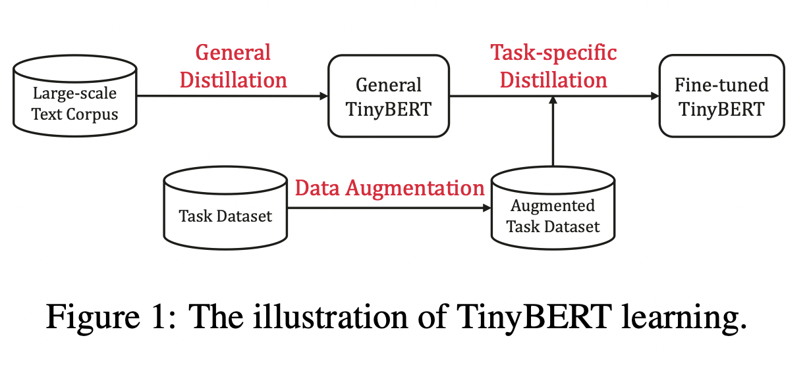
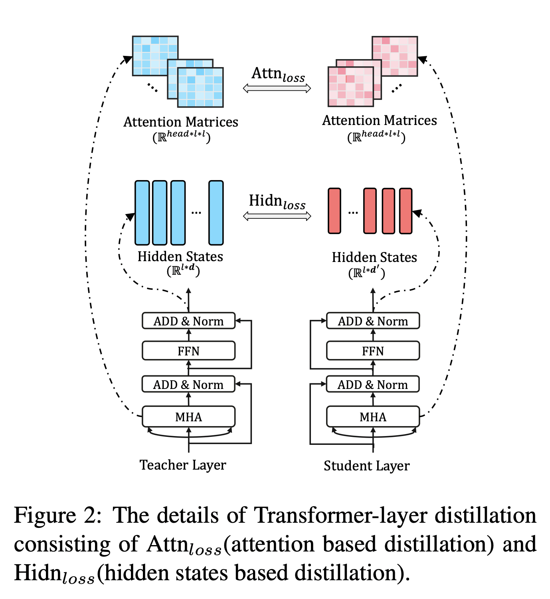

## 一、TinyBERT 简介

预训练模型，如BERT，在自然语言处理（NLP）任务上显著提高了性能。然而，这些模型通常存在参数过多、模型庞大、推理时间长、计算昂贵等问题，难以在实际应用中落地。TinyBERT提出了一种专门针对基于Transformer模型的知识蒸馏方法，旨在解决这些问题。

TinyBERT通过显著减小模型规模和提升推理速度，同时保持高性能表现。具体来说：
- 四层结构的TinyBERT在GLUE基准测试上可达到BERT_base 96.8%及以上的性能表现，模型缩小7.5倍，推理速度提升9.4倍。
- 六层结构的TinyBERT可以达到和BERT_base相同的性能表现。

TinyBERT的主要创新点包括：
- 提供了一种新的针对基于Transformer模型的蒸馏方法，使得BERT中具有的语言知识能够迁移到TinyBERT中。
- 提出一个两阶段学习框架，在预训练阶段和微调阶段都进行蒸馏，确保TinyBERT可以充分学习到BERT中一般领域和特定任务的知识。

## 二、模型实现

### 1. 知识蒸馏

知识蒸馏的目的是将大型教师网络 $ T $ 学到的知识迁移到小型学生网络 $ S $ 中。学生网络通过训练来模仿教师网络的行为。假设 $ f_S $ 和 $ f_T $ 分别代表学生网络和教师网络的行为函数，目标是最小化这两个函数之间的差异。

知识蒸馏的损失函数为：
$$
L_{KD} = \sum_{x \in X} L(f_S(x), f_T(x))
$$
其中 $ L(\cdot) $ 是一个评估教师网络和学生网络之间差异的损失函数，$ x $ 是输入文本，$ X $ 代表训练数据集。

### 2. Transformer 蒸馏

假设TinyBERT有 $ M $ 层transformer层，教师BERT有 $ N $ 层transformer层，则需要从教师BERT的 $ N $ 层中抽取 $ M $ 层用于transformer层的蒸馏。定义映射关系 $ n = g(m) $，表示学生网络第 $ m $ 层从教师网络的第 $ g(m) $ 层学习。

学生模型的目标函数为：
$$
 L_{model} = \sum_{x \in X} \sum_{m=0}^{M+1} \lambda_m L_{layer}(f_m^S(x), f_{g(m)}^T(x))
$$
其中 $ L_{layer} $ 是给定的模型层的损失函数，$ f_m $ 是第 $ m $ 层的行为函数，$ \lambda_m $ 表示第 $ m $ 层蒸馏的重要程度。

Transformer-layer的蒸馏由attention based蒸馏和hidden states based蒸馏两部分组成。

#### （1）基于注意力的蒸馏

受Clark等人2019年的论文启发，基于注意力的蒸馏旨在将BERT学习到的注意力权重知识迁移到TinyBERT。损失函数为：
$$
L_{attn} = \frac{1}{h} \sum_{i=1}^h MSE(A_i^S, A_i^T)
$$
其中 $ h $ 是注意力头的数量，$ A_i $ 是第 $ i $ 个头的注意力矩阵。

#### （2）基于隐藏状态的蒸馏

对transformer层的输出进行知识蒸馏，损失函数为：
$$
L_{hidn} = MSE(H_S W_h, H_T)
$$
其中 $ H_S $ 和 $ H_T $ 分别代表学生网络和教师网络的隐藏状态，$ W_h $ 是一个可训练的线性变换矩阵。

### 3. 嵌入层蒸馏

损失函数与隐藏状态蒸馏相同：
$$
L_{embd} = MSE(E_S W_e, E_T)
$$
其中 $ E_S $ 和 $ E_T $ 分别代表学生网络和教师网络的嵌入矩阵，$ W_e $ 是一个可训练的线性变换矩阵。

### 4. 预测层蒸馏

预测层的蒸馏损失函数为：
$$
L_{pred} = CE(z_T / t, z_S / t) 
$$
其中 $ z_S $ 和 $ z_T $ 分别是学生网络和教师网络的logits向量，$ CE $ 是交叉熵损失，$ t $ 是温度值。

整合上述各部分的损失函数，可以得到教师网络和学生网络之间对应层的蒸馏损失：
$$
L_{distillation} = L_{attn} + L_{hidn} + L_{embd} + L_{pred}
$$
这种综合方法确保TinyBERT能够有效地从BERT中学习，保持高性能的同时显著减小模型规模和推理时间。