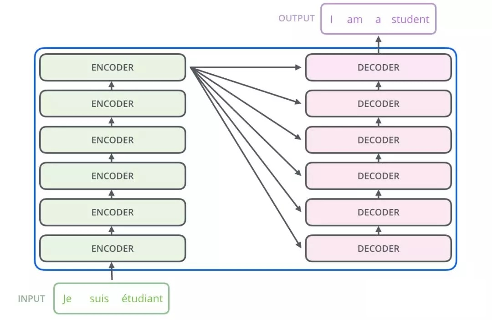
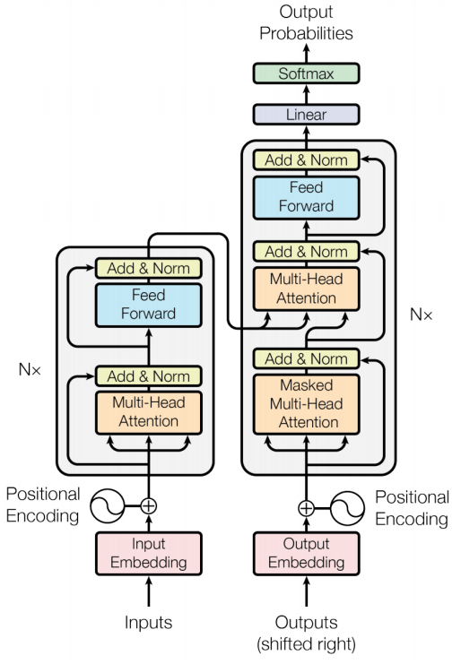
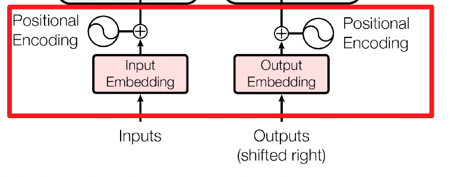
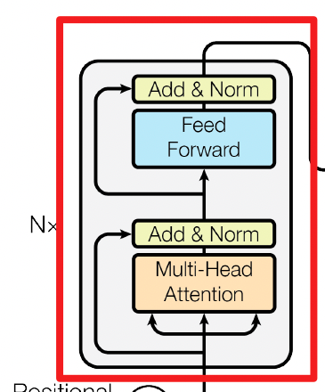
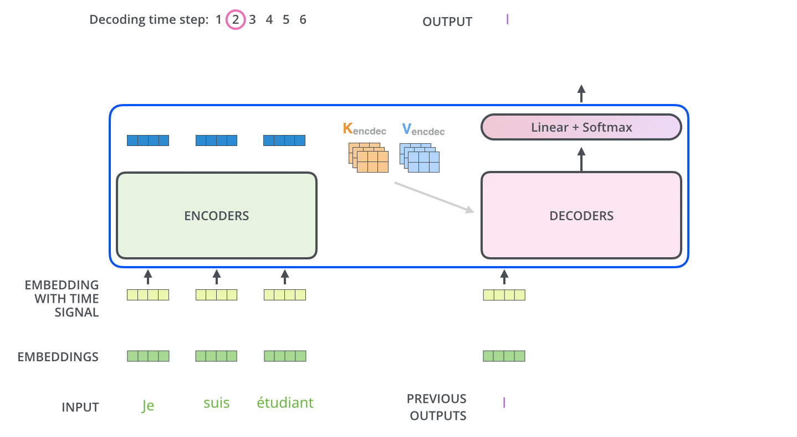
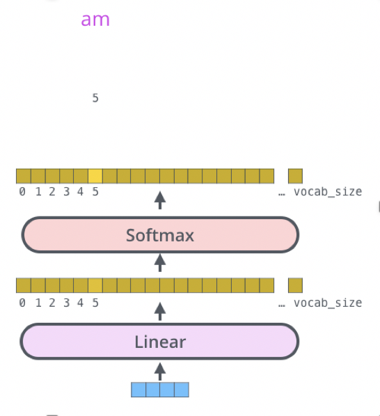

## 一、介绍

Transformer网络架构由Ashish Vaswani等人在《Attention Is All You Need》一文中提出，并最初用于机器翻译任务。与以往的网络架构不同，Transformer摒弃了RNN或CNN等传统架构，采用完全依赖于注意力机制的架构。这一创新显著提高了模型的并行处理能力和训练速度。

Transformer主要由编码器（encoder）和解码器（decoder）两部分组成。在论文中，编码器和解码器均由6个相同的层（layer）组成，我们通常称之为编码器块（encoder block）和解码器块（decoder block）。Transformer直观认识如下图所示：

## 二、Transformer的结构

Transformer的结构包括Input Embedding, Position Embedding, Encoder, Decoder。网络架构图如下所示：

## 三、Embedding

### 1. Input Embedding

Input Embedding 可以看作是一个查找表（lookup table）。对于每个单词，进行词嵌入（word embedding）就相当于一个查找操作，查找出对应的结果。具体来说，假设输入的词汇序列为 $ X $，通过查找表将每个词汇转换为固定维度的向量表示：

$$
X_{\text{embed}} = \text{EmbeddingLookup}(X)
$$
词嵌入层的作用是将离散的单词表示转化为连续的向量表示，为后续的处理打下基础。通常使用预训练的词嵌入模型，如 Word2Vec、GloVe 或者通过在大型语料库上训练得到的嵌入矩阵，这样可以使模型在训练初期就具备一定的语言理解能力。

词嵌入的过程涉及将每个单词映射到一个高维向量空间中，这些向量在语义上相似的单词会在空间中彼此靠近。这种表示方式保留了单词的语义信息，使得后续的神经网络层能够更有效地处理和理解输入数据。

### 2. Position Embedding

Transformer模型中，输入数据需要进行词嵌入（Input Embedding）操作，将离散的单词转化为连续的向量表示。然而，仅仅使用词嵌入还不足以让模型理解输入序列的顺序信息。这是因为Transformer完全依赖于注意力机制（Self-Attention），而不像RNN那样有天然的顺序处理能力。

#### （1）位置编码的必要性

在自然语言处理中，单词的顺序对句子的含义有重要影响。例如，在句子“猫在桌子上”和“桌子在猫上”中，单词的顺序直接决定了句子的意义。因此，需要一种方法将顺序信息编码到输入数据中，这就是位置编码（Positional Encoding）的作用。

#### （2）位置编码的实现方法

Transformer通过为每个位置添加一个位置编码向量，使得模型能够区分输入序列中不同位置的单词。位置编码的维度与词嵌入的维度相同，它们共同作用于输入序列。具体计算方法如下：
$$
X = \text{EmbeddingLookup}(X) + \text{PositionEncoding}
$$

最早的 Transformer 论文《**Attention Is All You Need**》中使用的 $$\mathbf{e}_i$$ 如上图所示。图上每一列代表一个 $$\mathbf{e}_i$$，第一个位置就是 $$\mathbf{e}_1$$，第二个位置就是 $$\mathbf{e}_2$$，第三个位置就是 $$\mathbf{e}_3$$，以此类推。每一个位置的 $$\mathbf{a}_i$$ 都有一个专属的 $$\mathbf{e}_i$$。模型在处理输入时，可以知道现在的输入位置的信息。其位置向量是通过正弦函数和余弦函数产生的，从而避免了人为设定向量固定长度的尴尬，位置编码的公式如下：

对于偶数位置 $ 2i $：

$$
\text{PE}(pos, 2i) = \sin\left(\frac{pos}{10000^{2i/d_{\text{model}}}}\right)
$$
对于奇数位置 $ 2i+1 $：

$$
\text{PE}(pos, 2i+1) = \cos\left(\frac{pos}{10000^{2i/d_{\text{model}}}}\right)
$$
其中：
- $ pos $ 表示当前单词在句子中的位置。
- $ i $ 表示向量中的维度索引。
- $ d_{\text{model}} $ 表示词嵌入和位置编码的维度。

通过这种正弦和余弦函数生成的位置编码，模型能够捕捉到序列中单词的位置信息。具体来说，正弦函数用于偶数维度，余弦函数用于奇数维度。这样生成的位置编码具有以下几个优点：

- **周期性**：正弦和余弦函数具有周期性，使得位置编码在不同位置之间形成独特的模式。这种模式有助于模型识别序列中的相对位置关系。
- **平移不变性**：由于正弦和余弦函数的平滑变化，位置编码在长序列中也能保持较好的位置信息，这对于处理长距离依赖关系非常重要。
- **不增加学习参数**：位置编码通过数学函数生成，不需要额外的学习参数，从而不会增加模型的复杂度。

#### （3）位置编码的作用

通过位置编码，Transformer能够在处理输入数据时同时考虑单词的语义和顺序信息。这使得模型在自然语言处理中能够更好地理解和生成句子。位置编码为Transformer提供了一种有效的方法来编码顺序信息，从而弥补了注意力机制缺乏序列信息的缺点。

#### （4）其他位置编码方法

虽然正弦和余弦函数是一种常用的方法，但并不是唯一的选择。其他方法也可以用于生成位置编码。例如，位置编码可以使用循环神经网络（RNN）生成，或者通过数据学习得到。位置编码仍然是一个开放的研究问题，不同的方法各有优劣。

如图所示，位置编码可以通过多种方法生成：

图（a）显示了通过正弦函数生成的位置编码，每一行代表一个位置向量。图（b）显示了通过循环神经网络生成的位置编码。总体而言，选择哪种位置编码方法最好仍是一个有待研究的问题。

## 四、自注意力机制

### 1. 生成Query、Key、Value向量

输入向量 $ X $ 通过与不同的权重矩阵相乘生成三个新的向量：Query ($Q$)、Key ($K$) 和 Value ($V$)。这些权重矩阵在模型训练过程中学习得到。

公式表示为：
$$
Q = XW^Q, \quad K = XW^K, \quad V = XW^V
$$
其中，$ W^Q $, $ W^K $, $ W^V $ 是参数矩阵，维度通常为 $ (d_{\text{model}}, d_k) $，$ d_{\text{model}} $ 是输入向量的维度，而 $ d_k $ 是输出向量的维度，通常为64。

### 2. 计算Attention分数

Self-Attention的分数是通过Query向量和所有Key向量之间的点积来计算的。例如，对于输入位置 "Thinking" 的Query $ q_1 $，与每个Key $ k_i $ 的点积分别计算：

$$
\text{scores} = QK^T
$$
这里 $ QK^T $ 表示所有Query和所有Key之间的点积操作。

### 3. 缩放点积并应用Softmax函数

点积结果需要除以 $ \sqrt{d_k} $ 来进行缩放，这里我们除以8，这个值一般是采用上文提到的矩阵的第一个维度的开方即64的开方8，当然也可以选择其他的值，。这有助于防止梯度消失或爆炸。接着，对缩放后的结果应用softmax函数来获取最终的注意力权重。

$$
\text{Attention weights} = \text{softmax}\left(\frac{QK^T}{\sqrt{d_k}}\right)
$$

> [!NOTE]
> 
> 在多头注意力机制中，每个头的维度 $d_k$ 通常由模型的总维度 $d_{\text{model}}$ 和头数 $h$ 决定，计算为 $d_k = \frac{d_{\text{model}}}{h}$。这种设置有助于保持每个头的参数数量相同，从而保证模型的参数总量与单头注意力相当。此外，将 $d_{\text{model}}$ 均等分配到每个头可以优化硬件加速的利用，提高计算效率。每个头在不同的子空间操作增加了模型捕获输入数据关系的多样性，并使得每个注意力头更易于管理和调试。在需要的情况下，$d_k$ 可以根据特定应用手动设置，以适应不同的性能需求。

Softmax操作确保了所有输出权重的和为1，表示概率分布。

### 4. 计算输出向量

最后，通过将得到的注意力权重与Value向量相乘并求和，得到自注意力层的输出结果。这一步骤是将计算得到的权重应用于相应的Value，从而获得加权的表示，它综合了整个输入序列的信息。

$$
\text{Output} = \text{Attention weights} \cdot V = \text{softmax}\left(\frac{QK^T}{\sqrt{d_k}}\right)\cdot V
$$
其中，点乘后的求和是隐含在矩阵乘法中的。这种通过查询向量（Query）和键向量（Key）的相似性程度来决定值向量（Value）的权重分布的方法被称为`缩放点积注意力`（Scaled Dot-Product Attention）。

### 5. 整个自注意力的运作过程总结

表达自注意力机制的公式可以整理如下：

**Step1：生成Query、Key和Value向量**:
$$
Q = XW^Q
$$
$$
K = XW^K
$$
$$
V = XW^V
$$
这里 $X$ 是输入的嵌入矩阵，$W^Q$、$W^K$、$W^V$ 是对应的权重矩阵，用于从输入数据中生成Query、Key和Value。

**Step2：计算注意力输出**:
$$
\text{Attention} = \text{selfAttention}(Q, K, V)
$$
这里的 `selfAttention` 函数是指实现缩放点积注意力的函数，通过计算 $Q$ 和 $K$ 的点积，应用缩放和softmax操作，最后利用得到的注意力权重与 $V$ 相乘，得到最终的输出。

自注意力的操作过程虽然较为复杂，但自注意力层里面唯一需要学习的参数就只有 $ W_q $、$ W_k $ 和 $ W_v $。只有 $ W_q $、$ W_k $、$ W_v $ 是未知的，需要通过训练数据来学习。其他的操作都没有未知的参数，都是人为设定好的，都不需要通过训练数据学习。

### 6. Self-Attention 复杂度

Self-Attention的时间复杂度为 $ O(n^2 \cdot d) $，其中 $ n $ 是序列的长度，$ d $ 是embedding的维度。这一复杂度涵盖了Self-Attention机制的三个主要计算步骤：

#### （1）相似度计算

相似度计算可以看作是大小为 $ (n, d) $ 和 $ (d, n) $ 的两个矩阵相乘，结果为：
$$
(n, d) \times (d, n) = (n^2 \cdot d)
$$
得到一个 $ (n, n) $ 的矩阵，这一步反映了序列中所有元素之间的相互影响。

#### （2）Softmax

应用Softmax函数的时间复杂度为：
$$
O(n^2)
$$
这一步涉及对每个元素进行指数运算和归一化处理，确保输出的是一个概率分布。

#### （3）加权平均

加权平均可以看作大小为 $ (n, n) $ 和 $ (n, d) $ 的两个矩阵相乘，计算过程为：
$$
(n, n) \times (n, d) = (n^2 \cdot d)
$$
得到一个 $ (n, d) $ 的矩阵，表示经过注意力权重调整后的输出。

因此，整体的时间复杂度是 $ O(n^2 \cdot d) $，其中相似度计算和加权平均是主要的时间开销来源。

## 五、Encoder

### 1. 多头注意力

自注意力机制的一个高级形式是多头注意力（Multi-Head Attention），它允许模型在不同的表示子空间中同时捕获信息。

#### （1）Multi-Head Attention

在多头注意力机制中，不是只初始化一组 $Q$（Query）、$K$（Key）、$V$（Value）矩阵，而是初始化多组。例如，在Transformer模型中，通常使用8组，每组都会对输入数据独立进行操作，最后将得到的结果合并。具体步骤如下：

**Step1：输入和嵌入**

输入句子例如 "Thinking Machines"，在嵌入模块中，将句子中的每个单词转换为一个向量 $X$。在编码器的每一层，第0层进行嵌入操作，其他层则直接使用上一层的输出。

**Step2：分头处理**

将向量 $X$ 分成8个头，每个头处理一部分数据，具体是通过对 $X$ 进行线性变换得到每个头的 $Q$、$K$、$V$。
$$
Q_i = XW_i^Q, \quad K_i = XW_i^K, \quad V_i = XW_i^V
$$
其中 $i$ 表示第 $i$ 个头，$W_i^Q$、$W_i^K$、$W_i^V$ 是对应的权重矩阵。

**Step3：并行处理**

每个头独立进行缩放点积注意力计算，然后将所有头的输出合并起来。
$$
\text{head}_i = \text{Attention}(Q_i, K_i, V_i)
$$

$$
\text{MultiHead}(Q, K, V) = \text{Concat}(\text{head}_1, \ldots, \text{head}_h)W^O
$$

其中 $W^O$ 是输出层的权重矩阵。

#### （2）Multi-Head Attention复杂度

尽管多头注意力涉及多组 $Q$、$K$、$V$ 的计算，但整体复杂度并没有增加。这是因为所有头的计算可以并行进行，并且通过矩阵运算的方式实现：

- **矩阵变换和计算**:

  在不考虑批次维度的情况下，$Q$ 和 $K$ 的维度被调整为 $(m, n, a)$，这里 $m$ 是注意力头数，$n$ 是序列长度，$a$ 是每个头的维度。点积计算相当于大小为 $(m, n, a)$ 和 $(m, a, n)$ 的两个张量相乘，结果是 $(m, n, n)$ 的矩阵。

- **复杂度**:

  由于每个头的点积操作独立执行，总的时间复杂度为：
  $$
  O(n^2 \cdot m \cdot a) = O(n^2 \cdot d)
  $$
  这里 $d$ 是隐藏层或嵌入层的总维度。

因此，虽然引入了多头注意力机制，但通过优化的矩阵操作，其计算复杂度与单头注意力相当，提高了计算的效率和模型的表现力。

残差连接是Transformer模型中的一种重要组件，它帮助模型在加深层数时防止信息丢失和梯度消失问题。以下是自注意力机制中残差连接的工作方式及其相关公式的说明。

### 2. 残差连接

#### （1）自注意力层中的残差连接

在自注意力层处理完后，输出通常会通过一个残差连接，然后进行层归一化（Layer Normalization）。残差连接的目的是将输入直接加到输出上，这可以帮助梯度在深层网络中更有效地流动，防止训练过程中的性能退化。

自注意力的输出与输入嵌入向量相加，形成残差连接：
$$
X_{\text{hidden}} = X_{\text{embedding}} + \text{Attention}(Q, K, V)
$$
这里，$X_{\text{hidden}}$ 表示加入残差连接后的输出向量，它将作为下一层的输入。

#### （2）前馈网络中的残差连接

在Transformer的每个编码器块中，除了自注意力层，还包括一个前馈网络（Feed Forward Network, FFN），该网络也采用了残差连接。前馈网络通常包括两个线性变换和一个激活函数，其输出同样通过残差连接加回到前馈网络的输入。

前馈网络处理的公式如下，其中 $X_{\text{hidden}}$ 是前一步的输出或另一残差连接的输入：
$$
\text{FFN}(X) = \max(0, X_{\text{hidden}}W_1 + b_1)W_2 + b_2
$$
然后通过残差连接将前馈网络的输出与输入相加：
$$
X_{\text{hidden}}^{\text{new}} = X_{\text{hidden}} + \text{FFN}(X_{\text{hidden}})
$$
这里，$X_{\text{hidden}}^{\text{new}}$ 是这一层的最终输出，它将被传递到下一个层或用于最终输出。

层归一化（Layer Normalization）是在深度学习模型中常用的一种技术，尤其在处理序列数据时如在Transformer模型中表现出极好的效果。它的主要作用是对每一层输出的隐藏层进行归一化处理，使得其输出分布尝试维持在标准正态分布，从而有助于加快训练速度并提高模型的收敛性。

### 3. Layer Normalization

#### （1）归一化过程

层归一化在单个层级上对所有隐藏单元的激活值进行归一化。不同于批归一化（Batch Normalization），层归一化是对单个样本内的所有激活值进行操作，因此它特别适用于处理批大小为1或变化的情况。

给定一个隐藏层的输出 $X_{\text{hidden}}$，其维度为 $[ \text{Batch size} \times \text{Sequence length} \times \text{Embedding dimension} ]$，层归一化的步骤可以表达为以下几个计算步骤：

1. **计算均值**:
   $$
   \mu_L = \frac{1}{m} \sum_{i=1}^m x_i
   $$
   这里的均值 $\mu_L$ 是对单个样本中所有激活值 $x_i$ 的平均，$m$ 是每个样本中激活值的总数（通常是序列长度乘以嵌入维度）。

2. **计算方差**:
   $$
   \sigma^2 = \frac{1}{m} \sum_{i=1}^m (x_i - \mu_L)^2
   $$
   方差 $\sigma^2$ 表示激活值的分布范围。

3. **归一化激活值**:
   $$
   \text{LN}(x_i) = \alpha \frac{x_i - \mu_L}{\sqrt{\sigma^2 + \epsilon}} + \beta
   $$
   在这里，$\epsilon$ 是一个很小的数，防止除以零。参数 $\alpha$ 和 $\beta$ 是可学习的参数，分别用于缩放和平移归一化后的值，初始化时 $\alpha$ 通常设为1，$\beta$ 设为0。

#### （2）作用

层归一化通过这种方式处理每个样本的所有激活值，可以有效地控制激活值在训练过程中的数值范围，减少内部协变量偏移（Internal Covariate Shift）。这有助于模型在使用激活函数如ReLU时不那么容易饱和，提高了模型的训练速度和稳定性。

#### （3）应用

在Transformer架构中，层归一化通常在每个子层（自注意力层和前馈网络层）的输出后进行，然后再通过残差连接传递给下一层。这种方法在自然语言处理和其他序列任务中显示出了优异的性能和效率。

在Transformer模型中，前馈网络（Feed Forward Network, FFN）是编码器和解码器的每个层中的关键组成部分。这个网络通过将输入向量映射到一个更高维的空间，并在这个空间中进行非线性变换，然后再映射回原始空间，增强了模型处理复杂关系的能力。

### 4. 前馈网络

前馈网络在Transformer模型中的角色和作用可以通过类比支持向量机（SVM）中的核技巧来理解。在SVM中，核技巧通过将数据映射到更高维的空间，将原本在低维空间中难以解决的非线性问题转变为高维空间中的线性问题，从而简化了问题的处理。类似地，Transformer的前馈网络部分通过将输入数据映射到一个更大的空间，使得模型能够更容易地捕捉和学习输入数据中的复杂依赖关系。

这种设计不仅让Transformer能够有效地处理序列中的时间依赖（通过自注意力机制实现），而且还能在一个扩展的特征空间内进行深入的特征提取和整合。通过在前馈网络中结合非线性激活函数，如ReLU，模型的学习能力得到增强，这使得Transformer能够在自然语言处理等任务中捕捉更复杂的数据模式，展现出卓越的性能。这种在模型中引入高维特征空间的方法显著提升了其对复杂模式的处理能力，从而使Transformer在各种应用场景下都能达到优异的表现。

具体来说，每个前馈网络包含两个线性变换和一个非线性激活函数，通常是ReLU函数。这可以表达为以下公式：
$$
\text{FFN}(x) = \text{ReLU}(W_1 x + b_1) W_2 + b_2
$$
这里，$W_1$ 和 $W_2$ 是线性变换的权重矩阵，$b_1$ 和 $b_2$ 是偏置项。在Transformer的实现中，$W_1$ 的输出维度通常是输入维度的4倍，这样的放大有助于网络在更高维空间中捕获更复杂的特征。

- **扩展到高维空间**：第一个线性变换 $W_1 x + b_1$ 将输入 $x$ 映射到一个更高的维度空间。

- **非线性变换**：应用ReLU激活函数，这一步增加了模型的非线性处理能力，使得模型能够学习更复杂的模式。

- **投影回原始维度**：第二个线性变换 $W_2$ 将激活后的高维表示投影回接近原始输入的维度，从而为下一层或输出准备。

## 六、Decoder

在Transformer架构中，解码器（Decoder）是处理输出序列的部分，它使用了与编码器（Encoder）类似的结构，但包括了额外的机制来确保输出序列的正确生成。解码器的核心特点是其能够处理序列中的依赖性，而不泄露未来的信息。

解码器的每个部分都包含残差连接和层归一化，与编码器非常相似。解码器的关键在于它需要特别处理输入以防止在生成当前输出时使用未来的信息。这主要通过两种类型的注意力机制实现：Masked Self-Attention和Encoder-Decoder Attention。

### 1. Masked Self-Attention

在传统的Seq2Seq模型中，解码器通常采用RNN来逐步生成输出序列。Transformer的解码器抛弃了RNN，转而使用Self-Attention机制。为了避免在生成当前词时看到未来的词，引入了Masked Self-Attention。

在Masked Self-Attention中，生成一个特殊的掩码矩阵（Mask），这个矩阵是下三角为0，上三角为负无穷（用于屏蔽未来信息）的矩阵。当这个掩码矩阵与Scaled Scores（缩放后的得分）相加时，上三角的负无穷会在应用softmax前将相应得分转换为0，从而确保解码器在生成每个词时只能依赖于之前的词。

$$
\text{Masked Attention}(Q, K, V) = \text{softmax}\left(\frac{QK^T}{\sqrt{d_k}} + \text{Mask}\right)V
$$

### 2. Masked Encoder-Decoder Attention

这一部分的注意力机制与Masked Self-Attention相似，但它专门用于连接编码器和解码器。在这种注意力机制中，查询（Q）来自于解码器的Masked Self-Attention的输出，而键（K）和值（V）来自于编码器的输出。这使得解码器可以利用编码器捕获的整个输入序列的信息。

$$
\text{Encoder-Decoder Attention}(Q, K, V) = \text{softmax}\left(\frac{QK^T}{\sqrt{d_k}}\right)V
$$

这里，与自注意力不同的是没有使用Mask，因为解码器需要从编码器接收整个输入序列的信息。

### 3. Decoder解码

下图展示了Decoder的解码过程，Decoder中的字符预测完之后，会当成输入预测下一个字符，知道遇见终止符号为止。

## 七、Transformer的最后一层和Softmax

在Transformer模型中，解码器的最后一层是关键的输出接口，它包括一个线性层（也叫全连接层）和一个softmax层。这两个组件共同作用，将解码器生成的内部表示转换成可以理解的输出，例如在机器翻译任务中的目标语言单词。

Transformer模型的最后一层通过线性层和softmax层的结合，有效地将解码器的高维表示转换成具体的词汇输出，使模型能够在各种基于语言的任务中生成人类可理解的语言。这种设计是Transformer能够在语言处理任务中取得优异表现的关键因素之一。

### 1. 线性层

线性层的主要作用是将解码器的输出向量映射到一个更大的向量空间，这个空间的维度通常等同于词汇表的大小。这样，每个维度或索引都对应于词汇表中的一个特定单词。

设解码器的输出向量为 $X_{\text{hidden}}$，词汇表大小为 $V$，线性变换可以表示为：
$$
\text{logits} = X_{\text{hidden}} W + b
$$
这里，$W$ 是权重矩阵，维度为 $[d_{\text{model}}, V]$，$b$ 是偏置项，维度为 $[V]$。输出的logits向量 $\text{logits}$ 每个成分的值代表了对应词汇的预分数。

### 2. Softmax层

Softmax层的任务是将线性层输出的logits向量转换为一个概率分布，每个元素的值表示相应单词是当前位置正确单词的概率。

$$
P(y_t | y_{<t}, X) = \text{softmax}(\text{logits})
$$
这里，$P(y_t | y_{<t}, X)$ 表示给定前面的单词 $y_{<t}$ 和输入 $X$ 的条件下，生成当前单词 $y_t$ 的概率。Softmax函数定义为：
$$
\text{softmax}(z_i) = \frac{e^{z_i}}{\sum_{j} e^{z_j}}
$$
其中，$z_i$ 是logits向量中的第$i$个元素。

### 3. 输出选择

最后，根据softmax层输出的概率分布，选择概率最高的单词作为这一时间步的输出。这个过程在实际应用中通常包括从概率分布中采样或直接选择最高概率的单词。

## 八、Transformer的权重共享

在Transformer模型中，权重共享是一种有效的策略，用于减少模型的参数数量、加速训练过程，并可能提高模型的泛化能力。Transformer在其结构中实施了两处关键的权重共享，这两种共享各有其逻辑和优势。

### 1. Encoder和Decoder间的Embedding层权重共享

在许多机器翻译任务中，源语言和目标语言可能共用相同的词汇，尤其是当它们属于同一语言族时（如英语和德语）。通过共享Encoder和Decoder的嵌入层权重，模型可以更有效地处理这些共通词汇。这种共享不仅帮助减少了模型的参数数量，还可能帮助模型为这些词汇学习更鲁棒的表示。

假设有一个共用的嵌入矩阵 $ E $，则对于Encoder和Decoder，输入向量 $ x $ 的嵌入表示为：
$$
\text{embedding} = Ex
$$
这里 $ E $ 是一个共享的嵌入矩阵，用于将输入词汇转换为对应的向量表示。

### 2. Decoder中的Embedding层和输出FC层权重共享

在Decoder的架构中，Embedding层用于将输入词向量转化为嵌入表示，而输出的全连接（FC）层则用于将这些嵌入表示转换回对应的词汇空间，预测下一个词的概率。通过共享这两层的权重，可以看作是在执行一个自编码任务，其中嵌入层和输出层互为逆过程。

如果 $ E $ 是嵌入矩阵，同样用于输出层的全连接层，则输出层的操作可以表示为：
$$
\text{logits} = E^T h + b
$$
其中，$ h $ 是Decoder的隐藏状态，$ b $ 是偏置项，$ E^T $ 表明使用了转置的嵌入矩阵作为全连接层的权重。

### 3. 总结

权重共享在Transformer中的应用提供了参数效率和计算效率的双重优势。对于语言处理任务尤其有益，因为它减轻了模型的过拟合风险，同时加快了训练速度。这种策略使得模型在处理具有大量共享词汇的语言对时更为有效，同时也提升了模型对这些词汇的学习能力。

## 四、Transformer 的训练过程

Transformer模型在自然语言处理任务中，如机器翻译，具体训练过程的目标是让模型能准确地将输入序列转换成目标序列。以中文翻译示例“机器学习”，Transformer的训练目标是从声音信号或文本输入中输出精确的中文文字。

### 1. 训练目标与损失计算

当输入如“机器学习”的声音信号时，Transformer通过编码器和解码器处理输入，并输出对应的中文字。如下图示，模型的训练过程包括以下几个关键步骤：

1. **输入处理：** 输入序列以特殊符号 `<BOS>`（开始符号）开始，编码器首次输出应尽可能接近目标序列的第一个字符“机”。

2. **解码器输出：** 解码器以概率分布的形式逐步输出每个字符。这些概率分布应尽可能接近每个目标字符的独热向量。例如，解码器第一次输出的分布应接近“机”的独热表示。

3. **交叉熵损失：** 每个输出字符的概率分布与对应目标字符的独热向量之间的交叉熵被计算出来。整个序列的目标是最小化这些交叉熵值的总和，从而确保每次输出都尽可能准确。

### 2. 训练细节

- **分类问题：** 每次解码器输出可以视为一个分类问题，其中类别数等于词汇表的大小（例如，四千个中文字）。
- **序列输出：** 在整个序列“机器学习”处理结束后，解码器还需要输出一个 `<EOS>`（结束符号），标志着输出序列的结束。这个 `<EOS>` 的输出同样需要通过交叉熵损失进行优化。
- **教师强制（Teacher Forcing）：** 在训练过程中，解码器输入不仅包括 `<BOS>` 和之前的预测输出，还包括真实的目标序列，即在预测“器”时，输入包含 `<BOS>` 和“机”；预测“学”时，输入包含 `<BOS>`，“机”和“器”，以此类推。这种策略有助于加快训练速度并提高模型稳定性。

### 3. 总结

Transformer的训练过程是通过逐步构建输出序列并不断优化预测准确性来完成的。通过交叉熵损失确保每个输出尽可能接近目标，通过教师强制策略指导解码器学习正确的输出序列。这一训练机制使得Transformer能够有效地处理复杂的序列到序列的转换任务，如机器翻译。

## Reference

- [NLP系列之预训练模型（二）：Transformer](https://aistudio.baidu.com/projectdetail/2287386)