在实际应用中，数据标注成本高且难以获得充足的训练数据，这时可以使用迁移学习。假设任务A和任务B是相关的，任务A有大量训练数据，可以将从任务A中学习到的知识迁移到任务B。迁移学习有多种分类，本章主要介绍领域自适应(domain adaptation)和领域泛化(domain generalization)。

## 一、领域偏移

在深度学习中，训练一个分类器通常比较简单。例如，要训练一个数字分类器，给定训练数据，训练好模型并应用于测试数据即可。对于像MNIST这样的基准数据集，数字识别的正确率可以高达99.91%。

然而，当测试数据和训练数据的分布不一致时，会出现问题。例如，假设训练数据是黑白数字，但测试数据是彩色数字。常见的误解是，尽管颜色不同，但模型应该能够识别相同形状的数字。实际上，如果用黑白数字图像训练模型，再直接应用到彩色数字上，正确率会很低。

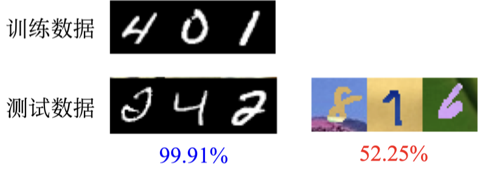

如上图所示，MNIST数据集中的数字是黑白的，而MNIST-M数据集中的数字是彩色的。如果在MNIST数据集上训练模型，然后在MNIST-M数据集上测试，正确率只有52.25%。这种训练数据与测试数据分布不同的问题称为领域偏移。

领域偏移有多种类型：
- **输入数据分布变化**：例如，训练数据是黑白图片，测试数据是彩色图片。
- **输出数据分布变化**：例如，训练数据中每个数字出现的概率相同，但测试数据中某个数字出现的概率特别大。
- **输入与输出关系变化**：例如，同一张图片在训练数据中的标签为“0”，在测试数据中的标签为“1”。

接下来我们专注于输入数据不同的领域偏移问题。如下图所示，测试数据称为目标领域(target domain)，训练数据称为源领域(source domain)。源领域是训练数据，目标领域是测试数据。

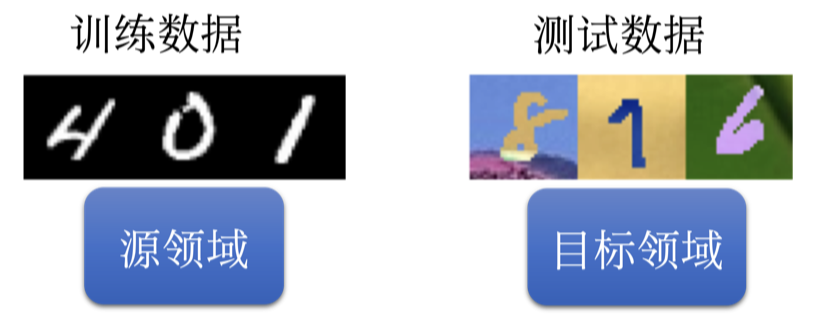

在基准数据集上训练模型时，通常假设训练数据和测试数据分布相同，因此可以达到很高的正确率。但在实际应用中，训练数据和测试数据往往存在差异，导致模型性能下降。这时需要领域自适应来提升模型性能。领域自适应的目标是解决特征空间与类别空间一致但特征分布不一致的问题。

### 1、领域自适应

领域自适应是一种迁移学习方法，旨在处理训练数据和测试数据分布不一致的情况。通过领域自适应，可以将一个领域中学到的信息应用到另一个领域，从而提高模型在目标领域的性能。

例如：假设我们有一个在MNIST数据集上训练的模型，但需要在MNIST-M数据集上测试。直接应用会导致性能下降，因为MNIST是黑白图像，而MNIST-M是彩色图像。通过领域自适应，可以在模型中加入一些适应机制，使其能够更好地处理彩色图像，从而提升测试性能。

### 2、理论基础

迁移学习的理论基础是，相关任务间共享某些特征或知识，通过学习这些共享部分，可以将其迁移到新的任务中。这种方法特别适用于数据稀缺的情况，通过利用已有的丰富数据，可以显著提高模型的泛化能力。

### 3、实践中的迁移学习

在实际应用中，迁移学习可以大大减少标注数据的需求，并提高模型的泛化性能。以下是一些实践中的迁移学习步骤：
1. **选择源任务和目标任务**：确定哪个任务有丰富的数据，哪个任务需要迁移学习。
2. **预训练模型**：在源任务的数据上预训练模型。
3. **迁移知识**：将预训练模型中的知识迁移到目标任务中。
4. **微调模型**：在目标任务的数据上微调模型，使其适应新的任务。

迁移学习不仅可以用于图像分类，还广泛应用于自然语言处理、语音识别等领域。

## 二、领域自适应

在手写数字识别的例子中，假设有标注的训练数据来自源领域。我们用这些数据训练一个模型，并应用到不同的目标领域。领域自适应方法取决于对目标领域的了解程度：

1. **有大量有标签的数据**：直接用目标领域的数据训练模型，不需要领域自适应。
2. **有少量有标签的数据**：使用这些数据微调在源领域上训练的模型，类似于BERT的微调。这时要注意避免过拟合，例如控制学习率和迭代次数。

对于大量未标注的数据，可以通过领域自适应提高模型在目标领域的性能。例如，实验室训练的模型在真实场景中表现差，可以收集大量未标注的数据用于领域自适应。

### 1、基本方法

如下图所示，训练一个特征提取器（feature extractor），它输入图像，输出特征向量。尽管源领域与目标领域的图像不同，特征提取器可以提取共同特征，过滤掉颜色等无关信息，使源领域和目标领域的特征分布相同。

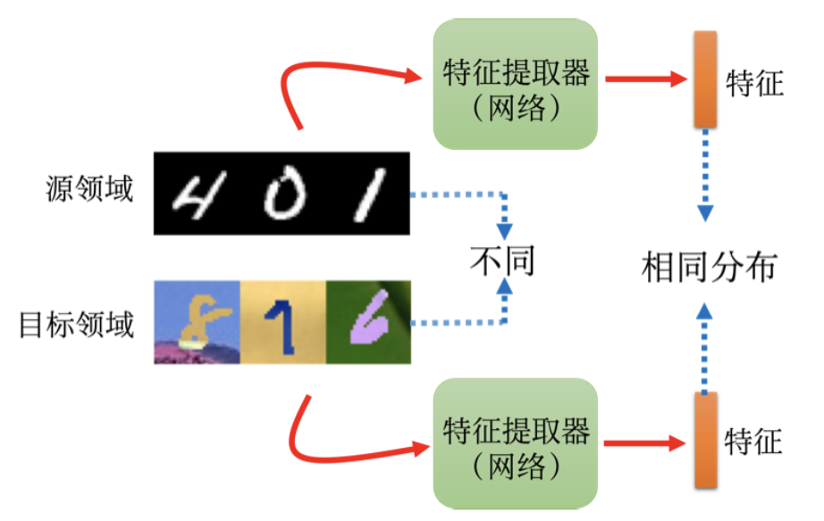

### 2、分类器结构

一般分类器分为特征提取器和标签预测器（label predictor）两部分。图像分类器输入图像，输出分类结果。假设分类器有10层，前5层为特征提取器，后5层为标签预测器。前5层将图像转为特征向量，后5层根据特征向量产生类别。

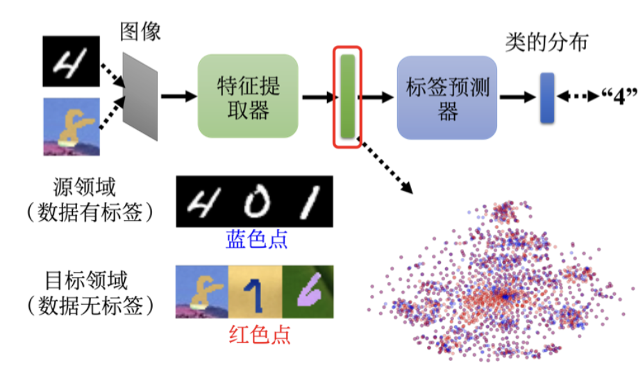

上图显示了特征提取器和标签预测器的训练过程。对于源领域标注的数据，训练方式与一般分类器相似，通过特征提取器和标签预测器可以产生正确的答案。然而，目标领域的数据没有标注，这些图片经过图像分类器处理后，我们期望特征提取器能输出与源领域相同的特征。上图中，蓝色点表示源领域图片的特征，红色点表示目标领域图片的特征。通过领域对抗训练，让蓝色点与红色点分不出差异。

### 3、领域对抗训练

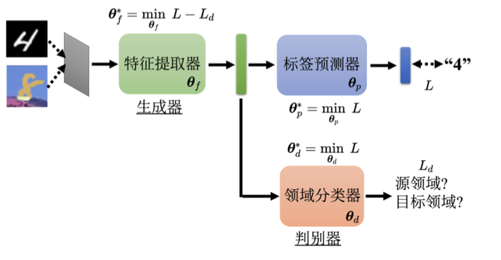

如上图所示，我们训练一个领域分类器。领域分类器是一个二元分类器，其输入是特征提取器输出的向量，目标是判断向量是来自源领域还是目标领域。特征提取器的目标是欺骗领域分类器。这类似于生成对抗网络，特征提取器类似生成器，领域分类器类似判别器。然而，在领域对抗训练中，特征提取器有较大优势，可以轻易欺骗领域分类器，例如输出零向量。然而，标签预测器需要特征来判断图片类别，因此特征提取器不能总输出零向量。

假设标签预测器的参数为 $\theta_p$，领域分类器的参数为 $\theta_d$，特征提取器的参数为 $\theta_f$。源领域的图像有标签，可以计算其交叉熵损失 $L$。领域分类器的损失为 $L_d$，特征提取器的损失为 $L - L_d$。优化目标如下：

1. **标签预测器**：$$\theta_p$$最小化$$L$$：$$\theta^*_p = \min_{\theta_p} L$$
2. **领域分类器**：$$\theta_d$$最小化$$L_d$$：$$\theta^*_d = \min_{\theta_d} L_d$$
3. **特征提取器**：$$\theta_f$$最小化$$L - L_d$$：$$\theta^*_f = \min_{\theta_f} (L - L_d)$$

特征提取器与领域分类器相反，特征提取器的损失为 $-L_d$，即其目的是增加领域分类器的损失，从而使源领域和目标领域的特征难以区分。

### 4、领域对抗训练的实际应用

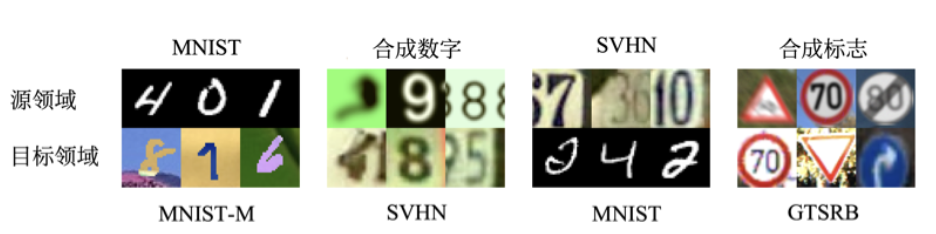

上图显示了四个从源领域到目标领域的任务。如果用目标领域的图片训练并测试，结果如下表所示，正确率都在90%以上。然而，用源领域训练、目标领域测试时，结果较差。使用领域对抗训练，正确率显著提升。

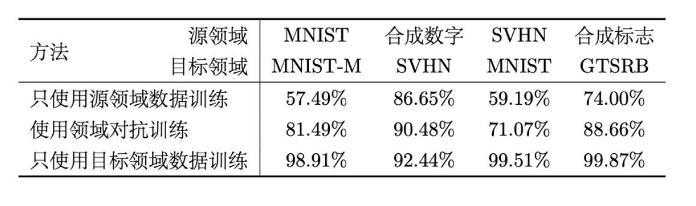

领域对抗训练的概念提出于2015年，稍晚于生成对抗网络。其目的是让目标领域的特征与源领域的特征对齐，如下图所示。图 (a)中，红色和蓝色点对齐，图 (b)中，红色和蓝色点分布接近，但更远离决策边界。我们更希望图 (b)的情况，以避免图(a)的情况。

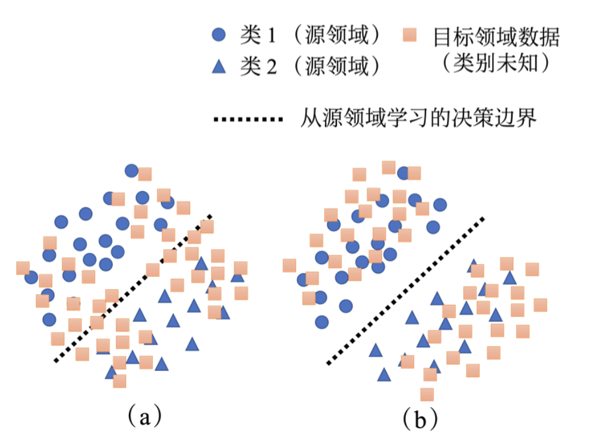

如下图所示，让特征远离边界的方法之一是通过标签预测器输出结果集中于某个类别。除了这种简单方法，还可以使用DIRT-T和最大分类器差异等方法。这些方法在领域自适应中是不可或缺的。

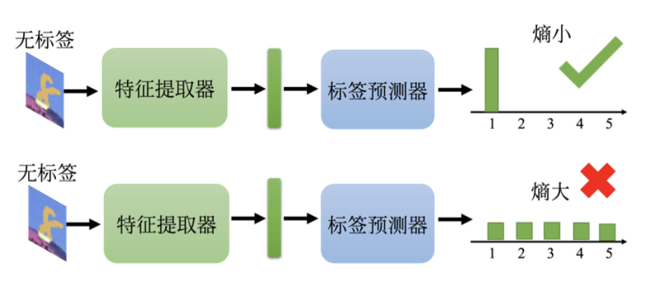

### 5、类别不完全一致的领域对齐

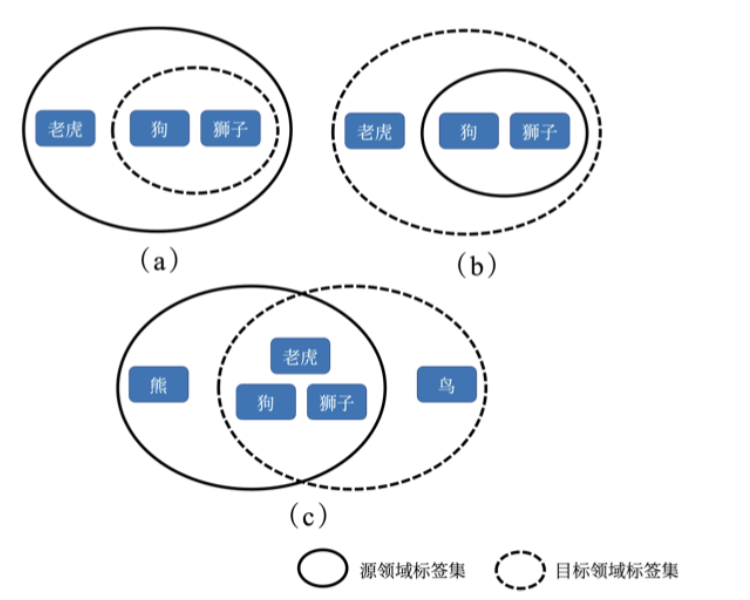

如上图所示，源领域与目标领域的类别不完全一致。例如，源领域有老虎、狮子和狗，而目标领域可能没有相同标签。强制对齐会导致类别混淆，例如让老虎像狗或狮子，导致无法区分。解决方法参考论文“Universal Domain Adaptation”。

### 6、领域自适应训练的挑战

特征提取器是卷积神经网络（CNN）而非线性层时，领域分类器输入的特征映射包含空间关系。对齐两个领域可能影响隐空间学习，使其无法学习期望特征。因此，领域自适应训练需要平衡欺骗领域分类器和正确分类的目标。隐表示空间仍需保持合理分布，以提高标签预测器性能。

当目标领域数据很少且无标签时，如仅有一张图片，无法对齐。这种情况下可以使用测试时训练（Testing Time Training, TTT）方法，详见论文“Test-Time Training with Self-Supervision for Generalization under Distribution Shifts”。

## 三、领域泛化

在某些任务中，我们对目标领域完全不了解，这时需要解决的是领域泛化问题。领域泛化可以分为两种情况：

- **训练数据包含多个领域，测试数据为单一领域**：如图(a)所示，假设我们要训练一个猫狗分类器，训练数据中包含了多种风格的猫狗图片，例如真实照片、素描、水彩画等。由于训练数据覆盖了多个领域，模型可以学习如何弥合这些领域之间的差异，从而在测试数据为卡通猫狗图片时仍能正确分类。具体方法可以参考论文“Domain Generalization with Adversarial Feature Learning” 。

- **训练数据为单一领域，测试数据包含多个领域**：如图(b)所示，假设训练数据只有一个领域，例如真实猫狗照片，但测试数据可能包含素描、水彩画等多种风格的猫狗图片。虽然只有一个领域的数据，但我们可以通过数据增强的方法来生成多个领域的数据，从而提高模型的泛化能力。具体方法可以参考论文“Learning to Learn Single Domain Generalization” 。

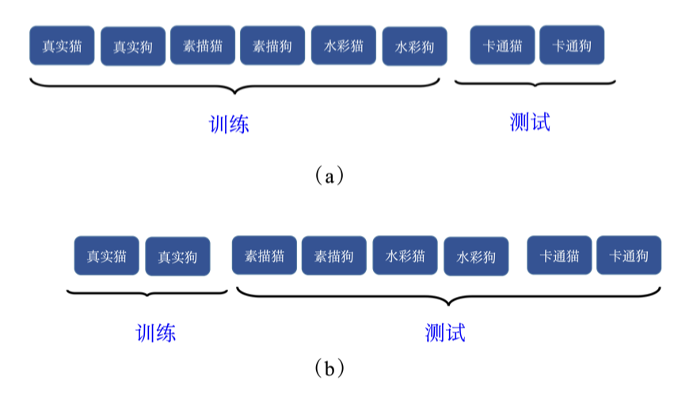

领域泛化的目标是使模型在训练时能够学习到跨领域的特征，使其在未知领域的数据上也能表现良好。通过上述两种情况的处理方法，我们可以有效地提升模型在不同领域的泛化能力。